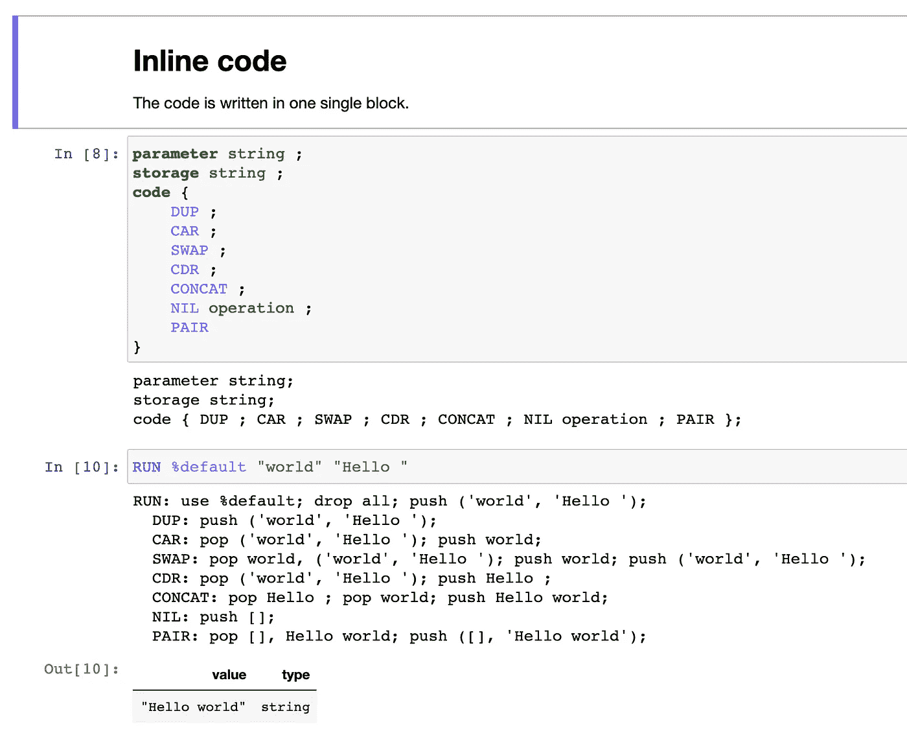
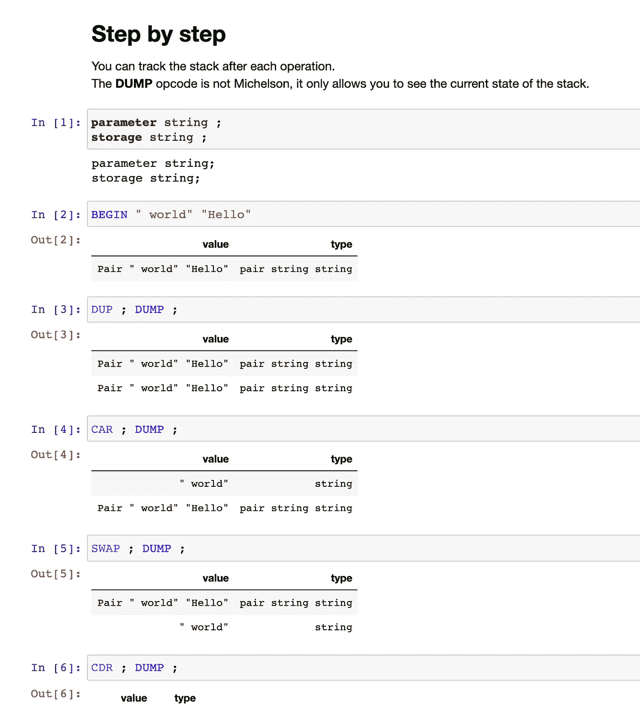
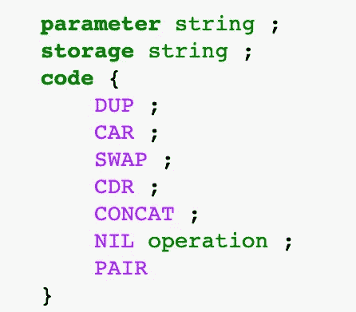
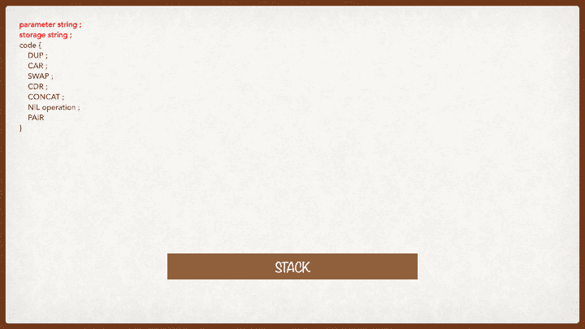
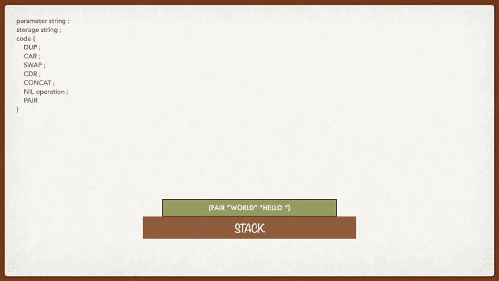
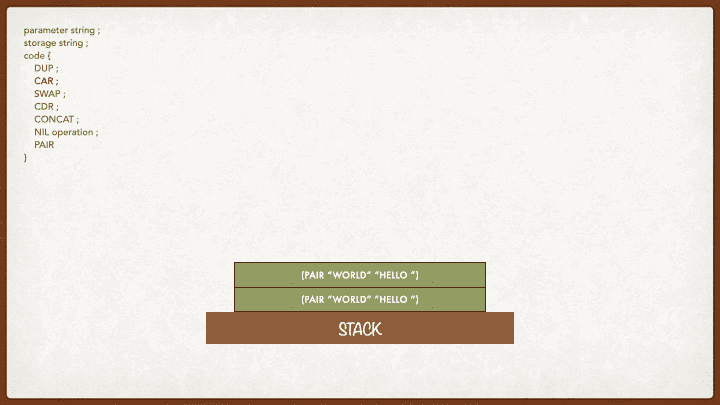
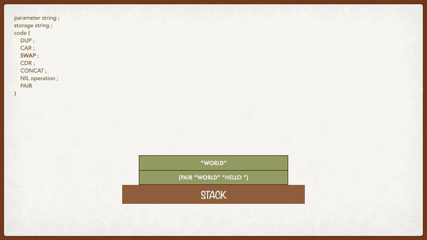
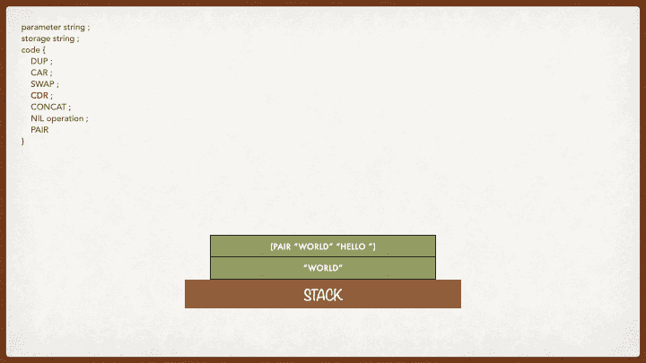
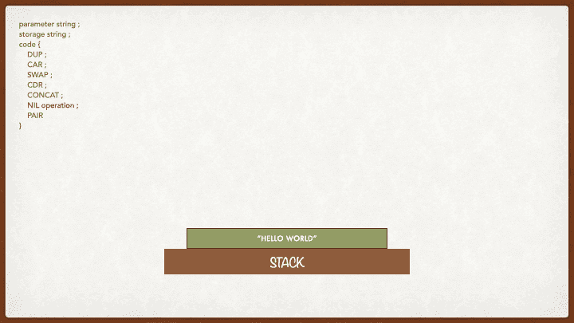
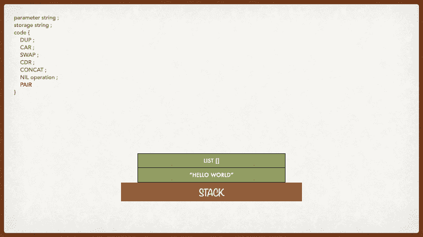

# 迈克尔逊介绍:Tezos 的脚本语言(第 2 部分)

> 原文：<https://betterprogramming.pub/an-introduction-to-michelson-the-scripting-language-of-tezos-part-2-4cc972c8237c>

## 了解如何使用 Michelson 编程语言并在 Tezos 上编写智能合同

图片由[com break](https://pixabay.com/de/users/comfreak-51581/)在 [Pixabay](https://pixabay.com/de/illustrations/matrix-code-daten-vernetzung-1735640/) 上提供

*(Part 1 可用* [*此处*](https://medium.com/better-programming/introduction-to-michelson-the-language-of-tezos-part-1-374c03394cc3) *)。)*

在前一篇文章中介绍了 Michelson 的基础知识之后，我们将继续探索这种编程语言。

在这一期中，我们将介绍一个惊人的工具，它将帮助我们编写、调试和检查我们的迈克尔逊代码:由 [Baking Bad 团队](https://baking-bad.org/docs)开发的带有迈克尔逊内核的 [Jupyter 笔记本。](https://github.com/baking-bad/michelson-kernel)

我们将在 Michelson 中编写一个新的智能合约，使用用户在参数中传递的字符串，我们；在将新字符串保存到存储器中之前，L1 连接到存储器中已经存在的字符串。

强烈建议先阅读第 1 部分，因为它介绍了我们将在这里使用的迈克尔逊智能合同的概念。

但是首先，让我们看看什么可能是最好的编码工具:迈克尔逊！

# 烘焙坏的 Jupyter 笔记本

Baking Bad 开发了一个在线迈克尔逊编译器，超越了编译你的迈克尔逊代码。

它提供了语法高亮显示、调试和栈的逐步可视化。在选择`MichelsonTutorial-Demo3.ipynb`文件之前，你可以使用[这个链接](https://mybinder.org/v2/gh/claudebarde/michelson-kernel/binder)打开我们这节课要用的笔记本(记住内核需要一两分钟来加载)。

该文件分为两部分:

## 内联代码

在第一部分中，整个智能合约被放入单个单元格中。您可以通过在下面的单元格中写入`**RUN** %default *parameter* *storage*`来编译并运行它。

运行智能合约后，有一个详细的描述，说明了每一步和每条指令修改堆栈的内容(在图片上的`In [10]`)。在运行结束时(在图中的`Out [10]`),您将获得新的存储。

## 循序渐进的代码

这个编译器的亮点在于，您可以输入指令来逐个修改堆栈，并在每一步之后检查它们的效果。

正如在每一个迈克尔逊智能合约中一样，首先要指定参数和存储。然后，键入`**BEGIN** *parameter* *storage*`开始执行。

在这个配置步骤之后，您可以逐个输入指令，并通过点击`CMD/CTRL + SHIFT`来运行它们，以查看它们如何修改堆栈。在`Out [...]`单元格中，当前值显示在栈顶。

**注意:**在步进代码中可以看到一条`DUMP`指令。这是*而不是*迈克尔逊——这只是 Jupyter 笔记本中用来打印堆栈当前状态的指令。

当您想要结束智能合约的执行时，您输入`COMMIT`，它将返回新的存储，前提是您的代码中没有错误。如果在执行的任何一步有一个错误，您将看到一条消息，并且能够立即修复它，而不必逐行检查您的代码。

# 处理迈克尔逊智能合约中的参数

在上一课中，我们介绍了一些指令，这些指令可以处理堆栈中已经存在的数据或我们自己推送的数据。但是如何处理用户的输入呢？这其实很简单！

我们将使用上面介绍的 Jupyter 笔记本中的合同。欢迎您跟随笔记本，一条一条地运行指令，以便更好地理解每条指令后堆栈的样子。这是完整的智能合同:

如果您还记得，当调用协定时，包含参数和存储的对被自动推到堆栈的顶部。然后，我们可以获得该对的左边部分(参数)并使用它。它是这样工作的。

首先，让我们初始化堆栈:

初态

在这一步中，我们得到一个新的堆栈，它包含一个类型为`string` ( `world`)的参数对和类型为`string`(`Hello`)的存储。我们的最终目标是连接这两个字符串并返回它们。

在下一步中，我们复制堆栈的顶部元素，因为我们需要堆栈的两个独立元素中的参数和存储，以便能够将它们放在一个字符串中。

复制堆栈的顶部元素

迈克尔逊没有变量，本质上是不可变的。堆栈的新元素可以用不同的方法创建——例如，通过推送(用`PUSH`指令)或复制(用`DUP`指令)。记住，在执行的每一步，你都在处理栈顶元素。这是你唯一可以合作的。

让我们从栈的第一个元素开始，让我们从这个对中取出参数。我们使用了`CAR`指令，它的目的是断开一个类型为`pair`的元素，并返回该对元素的左侧(在本例中，参数传递给了智能契约)。运行完`CAR`后，我们剩下栈顶的字符串`world`。

得到一对的左边部分

现在你可能想知道:如果迈克尔逊只处理第一个元素，我怎么能处理堆栈的第二个元素呢？非常简单！用`SWAP`指令将第二个元素带到顶部，并保留另一个元素以备后用。

交换两个元素

当使用`SWAP`指令时，你告诉迈克尔逊:“我现在不需要第一个元素，但是我想研究第二个。”迈克尔逊将使第一个元素下降到第二个位置，使第二个元素上升到第一个位置。

现在我们在开始复制的第二对在顶部，我们可以使用一个反向的`CAR`来得到带有`CDR`指令的对的正确部分。

得到一对中正确的部分

`CDR`指令的工作方式类似于`CAR`指令，但是您将保持所操作的对的右侧(一个对总是只包含两个元素，因此`CDR`和`CAR`是唯一可能的操作)。之后，你可以看到我们的堆栈由两个元素组成:第一个位置是字符串`Hello`，第二个位置是字符串`world`。

现在让我们把它们放在一起！

连接两个元素

在计算机编程中，把两个字符串放在一起的运算叫做 [*串联*](https://en.wikipedia.org/wiki/Concatenation) *。在迈克尔逊中把两个字符串放在一起的指令叫做`CONCAT`，这是唯一合乎逻辑的。该操作获取当前位于堆栈顶部的两个字符串，并返回单个字符串。要使操作成功，必须满足两个条件:*

*   在栈顶有两个元素(如果只剩下一个元素，就会产生错误)。如果存在更多的元素，它将只处理顶部的两个元素。
*   栈顶的两个元素是字符串(迈克尔逊是严格类型化的——它知道栈中有什么样的值，所以不要试图欺骗它)

如果你还记得我们在第一部分中讨论的内容，你就知道会发生什么。我们必须创建一个带有列表和新存储的对，以结束智能契约的执行(就像在迈克尔逊说再见一样)。

首先，让我们将一个空列表放在栈顶:

创建空列表

一旦有了空列表，我们就可以用空列表和字符串创建一个对:

将列表与存储配对

再次提醒，要注意元素的顺序和类型:迈克尔逊将第一个元素放在元素对的左边，第二个元素放在元素对的右边。返回类型为`(Pair string list (operation))`的一对将产生一个错误。

现在我们的堆栈是干净的，包含一对操作列表和一个字符串，智能契约的执行结束了。

您可以在下面的视频中看到堆栈的完整执行和转换:

# 结论

在迈克尔逊初学者教程的这个新部分中，我们看了一个带有迈克尔逊内核的 Jupyter 笔记本，我们将在本教程的后续部分中大量使用它来编写、调试和执行代码。

迈克尔逊中引入了新的操作码:`CAR`，提取一对的左边部分；`DUP`，复制栈顶元素；`CDR`、提取一对中的右半部分；`SWAP`，交换栈顶两个元素的位置；和`CONCAT`，它接受两个字符串并返回一个由前面两个字符串组合而成的字符串。

还添加了代表堆栈中操作的动画，以帮助您更好地可视化和跟踪每一步发生的事情。当堆栈中的操作变得更加复杂时，这将变得更加有用。

敬请期待！