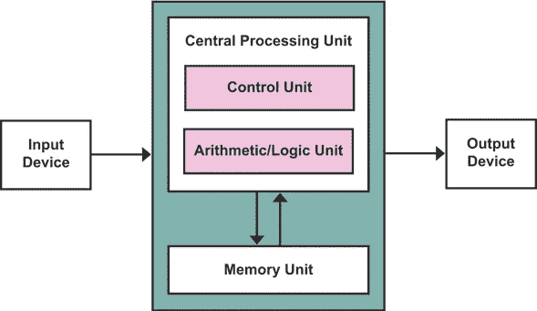
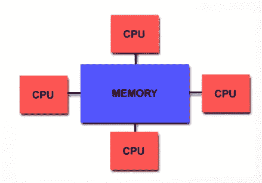
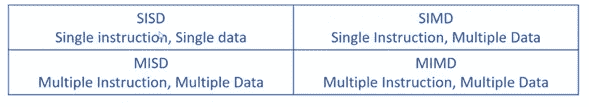
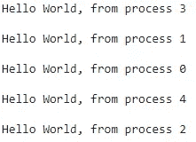

# 并行编程导论

> 原文：<https://betterprogramming.pub/an-introduction-to-parallel-programming-972eb16921ce>

## 解决计算问题的另一种方法


乔希·米尔斯在 [Unsplash](https://unsplash.com?utm_source=medium&utm_medium=referral) 上的照片

# 顺序程序设计

当你正在学习计算机科学，并且正在编写你的第一个程序时，最常见的方式是*顺序或结构化编程*。它是一个指令或动作按顺序跟随另一个指令或动作的过程。在这种类型的编程中，操作从开始到结束，变量初始化，赋值操作，计算，总结，等等。它还可以调用函数，并且可以在循环中停留一定的时间。一种算法将问题分成更小的指令。然后，这些指令在计算机的中央处理器(CPU)上逐一执行。一条指令完成后，下一条指令才开始。

## 冯·诺依曼模型

它是基于数学家和物理学家约翰·冯·诺依曼在 1945 年描述的计算机体系结构。它描述了一种顺序计算机的设计体系结构，其部件包括包含逻辑运算单元和处理器寄存器的处理单元、包含指令寄存器和程序计数器的控制单元、用于存储数据和指令的存储器、外部大容量存储器以及进入和退出机制。



冯·诺依曼建筑

# 并行和计算

并行计算是使用并行计算机来减少解决计算问题的时间。并行计算机是指具有多个支持*并行计算*的处理器的计算机。

> 并行性有时被视为计算的一个罕见而奇特的子领域，很有趣，但对普通程序员来说没什么意义。并行正变得无处不在，并行编程正成为编程企业的核心。—伊恩·福斯特

串行计算“浪费”了潜在的计算能力，因此并行计算使硬件更好地工作。并行编程是用一种编程语言进行编程，这种编程语言允许您显式地指示不同处理器如何执行进程的不同部分。



并行计算机的一个例子。各种处理器被连接到共享存储块

## 并行计算的目标

*   负载平衡
*   当我们在分配任务时，处理器之间的通信很少

## 弗林分类法

Flynn 分类法是对计算机体系结构的分类，由 Michael J. Flynn 于 1966 年提出。上面说电脑分为 4 类:



弗林分类法

1.  **SISD** :一条指令会在同一时间对一条数据执行。指遵循冯·诺依曼体系结构的顺序计算机。
2.  **SIMD** :我们有一个单一的指令，将应用于多个数据。这个想法是，所有的处理器(假设我们有多个处理器)都在工作和执行相同的指令，并且将对不同的数据执行。
3.  **MISD** :一台多处理器计算机，能够在不同的处理器上执行不同的指令，但它们都在同一数据集上工作。
4.  MIMD:能够在多个数据集上执行多条指令。它就像今天的大多数电脑一样，像笔记本电脑和一些电话。

## MPI 和并行计算软件

最常见的并行计算是 MPI 和 OpenMP。MPI 实现存在于 C/C++、Fortran 甚至 Python 中。

MPI(消息传递接口)是一个消息传递库接口规范。这个定义的所有部分都很重要。MPI 主要解决消息传递并行编程模型，在该模型中，数据通过每个进程中的协作操作从一个进程的地址空间移动到另一个进程的地址空间。

MPI 程序由自治进程组成，它们以 MIMD 方式执行自己的代码。每个进程执行的代码并不相同。这些进程通过调用 MPI 通信函数进行通信。

尽管支持共享内存，但每个进程都在自己的地址空间中运行。MPI 的思想是使用分布式计算(在进程间传递消息)。

## MPI 库示例

在初始化 MPI 环境之后，几乎所有的 MPI 函数都必须通过调用`MPI_Init ()`函数来调用，在使用`MPI_Finalize ()`结束该环境之后，几乎没有函数可以被调用。

当你创建一个 MPI 程序时，你需要定义一个通信器。`MPI_COMM_WORLD`是一个默认的通信器，它连接程序中的所有进程。要查看更多标准，请访问此[链接](https://www.mpi-forum.org/docs/)。

通常，变量 rank 代表进程标识符，而 size 代表将执行程序的进程的数量。

为了在 C 中运行 MPI 程序，编译*的指令是:*

```
**$ mpicc program_name.c -o object-program**
```

并且对*执行*是用指令:

```
**$ mpiexec -np {number-of-processes} ./object_program**
```

有 5 个进程的 *hello-mpi.c* 程序的输出如下:



如上图所示，所有进程都在争用 CPU 资源。所以每一个的到达时间有(很小的)差别。每次程序运行时，进程的顺序很可能会改变。

下一个例子是关于本地通信:

它使用`MPI_Send()`和`MPI_Recv()`功能。在这种情况下，进程 0 向进程 1 发送变量= 10。

# 结论

这只是您可以用并行计算做的事情的一点点尝试。有很多事情，比如发送和接收操作，将消息和数据从一个进程传递到另一个进程，等等。

想象一下数据排序。如果数据量增加，使用顺序算法可能需要很长时间。做数据并行，我们可以把数据集分成几个进程，在这些进程中执行同一个指令。如果有一个矩阵相乘的程序就更好了，结果，我们将节省执行时间。

有一些著名的问题，像*康威的生命游戏*，可以用顺序和并行编程来实现。在图论中，寻找两个节点间最短路径的*弗洛伊德算法*也可以实现为并行。

## 资源

有关更多信息，您可以查看以下资源:

*   [Open-MPI](https://www.open-mpi.org/doc/v3.1/)
*   [Rookiehpc](https://www.rookiehpc.com/mpi/docs/index.php)
*   [Python MPI](https://nyu-cds.github.io/python-mpi/)