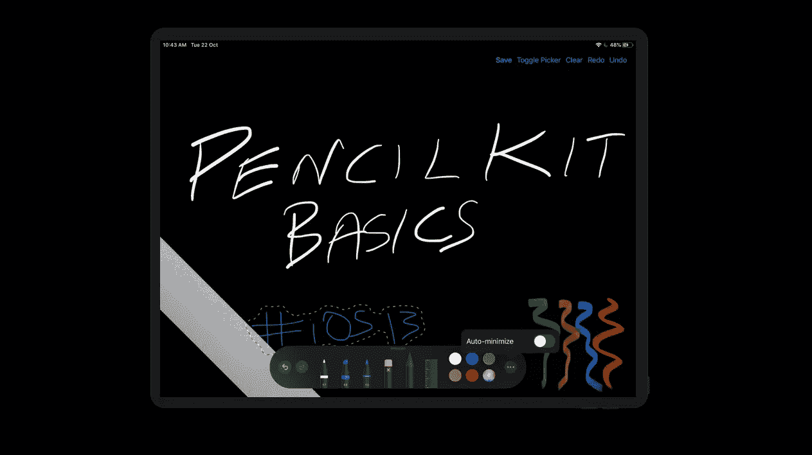
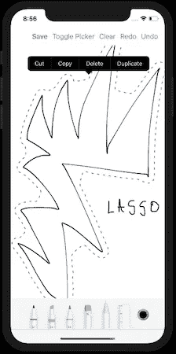
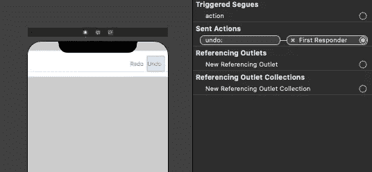
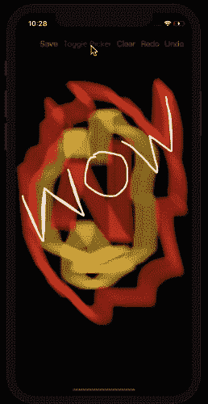

# iOS 中的 PencilKit 简介

> 原文：<https://betterprogramming.pub/an-introduction-to-pencilkit-in-ios-4d40aa62ba5b>

## iOS 13 中的绘制、撤销、重做和保存



一个你可以在本文结尾实现的结果。

WWDC 2019 推出了另一个有趣的框架 PencilKit。现在已经可以在 iOS 13 上使用了。

PencilKit 允许开发人员轻松地将绘图画布视图和工具包集成到他们的应用程序中。

本文的目标是通过一个简单的 iOS 应用程序向您介绍 PencilKit 体系结构及其实现。

**注意:** PencilKit 需要 Xcode 11 和 iOS 13。

# 铅笔工具包:在树林里

*   `PKCanvasView`是可以绘图的内部区域。用户可以在这里画出他们所有的艺术和涂鸦。`PKCanvasView`允许平移和缩放，因为它本质上是`UIScrollView`的一部分。
*   `PKDrawing`是负责存储所有图纸的数据模型。
    `PKCanvasView`有一个`drawing`属性，用于获取和设置数据模型。
*   `PKToolPicker`是一个浮动的用户界面，包括所有的画笔、调色板和绘图辅助工具。
*   `PKTools`包含不同种类的画笔，本质上是子类:

1.  `PKEraserTool`:这需要指定矢量或位图作为类型。因此，矢量对象或像素可以从屏幕上擦除。
2.  `PKInkingTool`:包括`pen`、`marker`、`pencil`用于不同种类的草图
3.  `PKLassoTool`是用于选择绘图区域的选择工具。它会弹出一个上下文菜单，允许复制/粘贴和复制选定的绘图。

下面来看看 iOS 设备上的套索工具。



它会自动检测图形的边界，并显示上下文菜单

ToolPicker 是普通大小的类(iPad 设备)上的浮动面板，但在紧凑大小的类中，它固定在屏幕的底部。

另外,“撤消/重做”和“最小化”按钮在精简版的 ToolPicker 中不可用。

ToolPicker 调色板具有基于响应者的可见性。这意味着当`PKCanvasView`是`firstResponder`时，它是可见的，并且可以通过从第一响应者处退出`PKCanvasView`来隐藏。

要使用 PencilKit 启用/禁用手指绘制，我们可以在 PKCanvasView 上切换布尔属性`allowsFingerDrawing`。

说够了。现在让我们使用 PencilKit 构建我们的 iOS 应用程序。

# 履行

我们将在 iOS 应用程序中实现以下内容。

*   为 iOS 设备添加撤销/重做绘制操作
*   将绘图草图保存到照片库中

为了保存图像，将`Info.plist`中的`Allowed`设置为“隐私-照片库附加使用说明”。

# 我们的故事板



撤销和重做按钮上设置了内置选择器

对于撤销和重做操作，我们使用了内置的选择器。

## 设置画布视图

以下代码为您设置画布视图:

```
let canvasView = PKCanvasView(frame: .zero) canvasView.translatesAutoresizingMaskIntoConstraints = falseview.addSubview(canvasView)NSLayoutConstraint.activate([ canvasView.topAnchor.constraint(equalTo: navigationBar.bottomAnchor), canvasView.bottomAnchor.constraint(equalTo: view.bottomAnchor), canvasView.leadingAnchor.constraint(equalTo: view.leadingAnchor), canvasView.trailingAnchor.constraint(equalTo: view.trailingAnchor), ])
```

## 设置工具选择器

*   初始化是通过请求窗口的共享工具选择器来完成的
*   画布视图需要作为观察者添加到 ToolPicker 中
*   `setVisible` true 表示每当画布视图成为第一个响应者时，调色板就会出现

```
guard let window = view.window, let toolPicker = PKToolPicker.shared(for: window) else { return }toolPicker.setVisible(true, forFirstResponder: canvasView) toolPicker.addObserver(canvasView) 
canvasView.becomeFirstResponder()
```

## 清除画布视图

为了清除`PKCanvasView`，只需重新初始化`PKDrawing`实例。

```
canvasView.drawing = PKDrawing()
```

## 将绘图保存到 UIImage

在 PKDrawing 实例上调用`func image(from rect: CGRect, scale: CGFloat)`。

它返回我们想要捕捉的绘图部分的一个`UIImage`。
标度通常设置为 1.0。为更详细的图像设置更高的值(对视网膜显示有用)。

```
let image = canvasView.drawing.image(from: canvasView.drawing.bounds, scale: 1.0)UIImageWriteToSavedPhotosAlbum(image, self, nil, nil)
```

以下是我们的 PencilKit iOS 13 应用程序的完整源代码:

下面是 PencilKit 应用程序在 iPhone 设备上的运行输出:



来自我的 iPhone 的屏幕截图

# 结论

以上总结了这篇关于 iOS 13 中 PencilKit 的介绍性文章。现在去画画，用它涂鸦。

你可以从我们的 Github 库下载完整的源代码。

# 下一部分

是的，我们有续集！在下一部分中，我们将通过使用著名的 MNIST 模型来实现 Core ML 和 PencilKit。

如果你已经喜欢上了这篇文章，这里还有一篇你可能会喜欢的:

[](https://medium.com/better-programming/ios-13-checklist-for-developers-ef47e413aad2) [## iOS 13 开发者清单

### 为 iOS 13 发布下一款应用时可参考的清单

medium.com](https://medium.com/better-programming/ios-13-checklist-for-developers-ef47e413aad2)