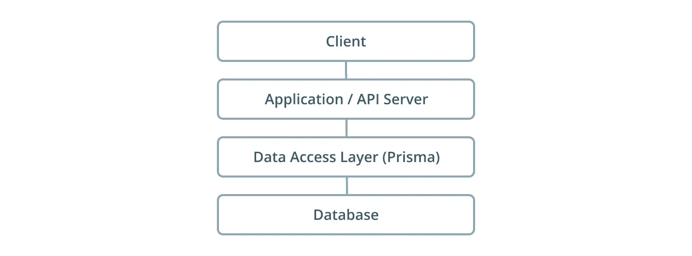
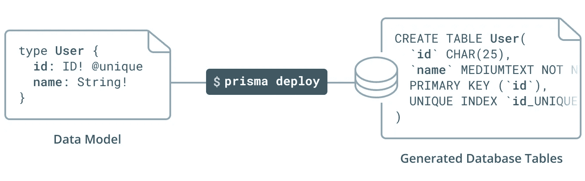
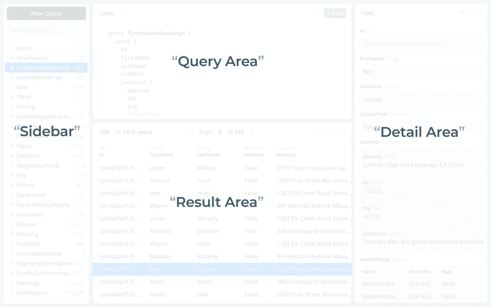
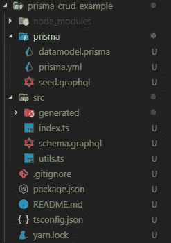

# Prisma 简介

> 原文：<https://betterprogramming.pub/an-introduction-to-prisma-5631e4eb0e38>

## Prisma 最重要的概念和构建示例应用程序


由[凯文·巴加](https://unsplash.com/@kevnbhagat?utm_source=medium&utm_medium=referral)在 [Unsplash](https://unsplash.com?utm_source=medium&utm_medium=referral) 上拍摄

Prisma 是一个现代的 ORM 替代品，它将数据库变成了一个全功能的 GraphQL、REST 或 gRPC API。它提供了强大的抽象和构建块来开发灵活和可伸缩的后端。

在这篇文章中，我们将看看 Prisma 最重要的概念，甚至构建一个示例应用程序来给你一些使用它的练习。每当我们看实际例子时，我们都将关注 GraphQL。

所以，不要再浪费时间了，让我们开始吧。

# 为什么关心 Prisma

现在，问题仍然是为什么你应该首先使用 Prisma。以下是开发人员应该考虑使用 Prisma 的一些原因，以及它可以有所帮助的地方。

## 类型安全

Prisma 提供了一个类型安全的 API，可以从前端和后端使用，包括过滤器、聚合和事务。这极大地增强了 ide 的智能自动完成或跳转到定义的特性，也使得代码生成更加容易。

## SDL(模式定义语言)

Prisma 允许您使用现代 SDL 定义您的模型，并自动迁移您的底层数据库。它提供了一种简洁而强大的方式来指定您的 GraphQL 模式。欲了解更多信息，请参考 Prisma 官方博客上的这篇文章。

## 简单的数据库工作流

Prisma 的总体目标是通过提供以下功能来消除数据库工作流程的复杂性并简化应用程序中的数据访问:

*   用于处理关系数据的简单而强大的 API
*   使用 Prisma Admin 进行可视化数据管理
*   自动数据库迁移
*   轻松导入和导出数据

## 清洁和分层架构

Prisma 提供了一个干净的架构，它尊重同步、查询优化/性能和安全性。它通过提供内置的 DAT(数据访问层)来实现这一点，DAT 用于抽象数据库访问的复杂性，以便开发人员可以专注于他们的数据，而不是担心如何从数据库中存储和检索数据。



棱镜建筑

# 数据模型

数据模型定义了底层数据库模式，因此是 Prisma 客户端所有自动生成的 CRUD 操作的基础。

数据模型是使用 GraphQL SDL 的子集编写的，并使用。prisma 文件扩展名。这些文件需要在您的`datamodel`属性下的`prisma.yml`文件中引用。

```
datamodel: datamodel.prisma
```

## 积木

现在，让我们来看看数据模型的构建模块:

*   类型—类型由多个具有类型的字段组成，通常代表应用程序域中的实体(例如，用户、任务)。每种类型都映射到一个数据库表，并具有自动生成的 CRUD 操作。
*   指令——指令用于为我们的数据模型中的类型提供额外的信息或添加特定的行为。
*   关系—关系描述两种类型之间的关系。

## 示例:

一个简单的`database.prisma`文件的例子:

该示例包含数据模型的几个重要概念:

*   用户和帖子之间的一对多关系
*   按照`!`操作符的指示，所有字段都是必需的
*   这些字段使用诸如`@id`的注释，使它们在公开的 Prisma API 中是只读的
*   `@unique`指令确保永远不会有两个值相同的记录
*   这两种类型被映射到它们自己的数据库表

以下是如何将类型映射到数据库表的直观表示:



src:[https://www . prisma . io/docs/data model-and-migrations/data model-MYSQL-knul/# object-types](https://www.prisma.io/docs/datamodel-and-migrations/datamodel-MYSQL-knul/#object-types)

关于 Prisma 数据模型的更多信息，我建议访问官方文档。

# Prisma 客户端

Prisma client 是一个自动生成的库，它取代了 API 中的典型 ORM。它提供了客户机和位于数据库之上的 Prisma 服务器之间的连接。


它提供了一个无缝的 API，允许您处理关系数据、连接和事务。

它可以使用 Prisma API 提供的`prisma generate`命令生成。我们也可以通过编辑`prisma.yml`文件来更改配置。

```
generate:
 - generator: typescript-client
   output: ../src/generated/prisma-client
```

在这个例子中，我们定义了我们的客户机应该在 TypeScript 中生成，以及输出应该保存在哪个文件夹中。

现在我们已经了解了客户端的基础知识，让我们看看如何使用它进行基本的数据访问和操作。

## 定义数据

Prisma 客户端从`datamodel.prisma`文件自动生成，并向其所有模型公开 CRUD 功能。

对于以下部分，让我们假设我们有这个数据模型:

## 读取数据

每当您从 Prisma 客户端查询数据库记录时，您会自动获得记录的所有标量字段。这意味着默认情况下，您只获得不被视为关系的字段(例如，当我们查询用户记录时，我们只获得 id、姓名和电子邮件)

**提取所有记录**

```
const users: User[] = await prisma.users()
```

这里，我们从数据库中获取所有用户，并将它们保存到一个数组中。

**提取单个记录**

获取单个记录也很简单。我们只需要包含带有唯一字段的`where`参数，就像我们示例中的`id` 一样。

```
const post: Post = await prisma.post({ id: 'cjli6tknz005s0a23uf0lmlve' })
```

**选择字段**

默认情况下，我们获取记录的所有标量字段。如果我们只想获取特定的字段，我们需要编写自己的查询片段，如下所示:

```
const fragment = `
fragment UserWithPosts on User {
  id
  email
  posts {
    id
    title
  }
}const user = await prisma.users().$fragment(fragment)
```

这里我们使用`$fragment` API 来指定我们想要查询的字段。之后，我们使用 Prisma 服务获取字段。

## 写入数据

现在我们知道了如何使用 Prisma 客户端从数据库中读取数据，让我们继续将数据写入数据库。

**创建记录**

当在数据库中创建新记录时，我们使用`create()`方法，该方法使用一个输入对象和记录的所有标量字段。

每个方法调用返回一个对象的承诺，该对象包含所创建模型的所有标量字段。

```
const post: Post = prisma.createPost({
  title: 'An Introduction into Prisma',
  author: {
    connect: { email: 'test@test.com' },
  },
})
```

这里我们创建一个新帖子，作者是*test@test.com*。

**更新记录**

当更新现有记录时，我们需要使用`update()`方法，该方法采用一个带有两个字段的输入对象:

*   其中—此字段用于标识将要更新的记录。您可以使用任何唯一的字段来标识记录。
*   数据-包含将被更新的标量字段的对象

```
const updatedUser: User = await prisma.updateUser({
  data: {
    name: 'Test',
  },
  where: {
    email: 'test@test.com',
  },
})
```

**删除记录:**

当从数据库中删除一条记录时，我们使用`delete()`方法，该方法将一个`where` 对象作为输入。

```
const deletedUser: User = await prisma.deleteUser({
  email: 'test@test.com',
})
```

## 实时订阅

现在我们知道了如何定义和操作数据，让我们看看如何使用`$subscribe`属性订阅数据库事件和接收实时更新。

`$subscribe`属性基于 WebSockets，并且是为数据模型中的每个模型类型自动生成的。

**基础订阅**

为我们的`User`模块订阅的`create`和`update`事件。

```
const createdAndUpdatedUserIterator: UserAsyncIterator = await db.$subscribe
  .user({
    mutation_in: ['UPDATED', 'CREATED'],
  })
  .node()
```

**订阅与查询**

使用节点属性订阅特定用户的事件。

```
const createdUserIterator = await db.$subscribe
  .user({
    mutation_in: ['CREATED', "UPDATED"],
    node: {
      email_contains: `test@test.com`,
    },
  })
  .node()
```

如果您想了解更多关于 Prisma 客户端的信息，您可以访问[官方文档](https://www.prisma.io/docs/prisma-client/)。

# Prisma 服务器

Prisma 服务器是连接到数据库的基础结构组件。在部署之前，需要使用数据库连接和您的用户凭证对其进行配置。


Prisma 服务器的主要职责是将 Prisma 客户机发出的请求翻译成实际的数据库查询。

## 本地设置

目前推荐的设置 Prisma 服务器的方法是通过 Docker。这可以通过编写一个简单的`docker-compose.yml`文件来完成，该文件包含 Prisma 服务器的配置和我们数据库的配置。之后，您只需要使用`docker-compose up`命令启动它。

这可以使用不同的数据库来完成，如 MySQL、PostgresSQL 或 MongoDB。这里我展示了一个使用 MySQL 作为数据库的示例配置。

下面是一个简单的 docker-compose 文件，它将创建两个容器:

*   `prisma` —包含我们的 Prisma 服务器
*   `mysql-db` —运行 MySQL 数据库本地实例的容器

Prisma 容器使用 MySQL 作为它的数据库，它可以用它的容器名来引用它。

## 演示服务器(Prisma cloud)

另一种选择是使用 Prisma 的云服务，而不是在本地托管数据库和服务器。这些演示服务器完全免费，但你需要一个 [Prisma Cloud](https://www.prisma.io/cloud/) 账户。

这些服务器的速率限制为每十秒钟十个请求(平均)，因此不能用于任何生产环境。下面是一些使用演示服务器有意义的用例。

**用例**

这些服务器的潜在使用案例包括:

*   样机研究
*   没有显著用户基础的个人项目
*   学问

我们将在下面的 CRUD 应用程序示例中看到如何使用演示服务器。

# Prisma 管理

Prisma admin 是一种与您的数据和数据库进行可视化交互的方式。它还可以让你使用一个现代而简单的图形用户界面来修改现有的数据和向数据库中添加新的数据。

## 结构

Prisma 管理界面包括四个主要区域:

*   中心-查询和结果区域
*   右侧—详细信息区域
*   左侧—侧栏



src:[https://www . prisma . io/docs/prisma-admin/overview-el3e/# areas](https://www.prisma.io/docs/prisma-admin/overview-el3e/#areas)

## 访问 Prisma admin

Prisma 管理页面可在您的 Prisma 服务的`*/_admin*`端点获得。

例如:

*   `[https://eu1.prisma.sh/myuser/project/dev/_admin](https://eu1.prisma.sh/myuser/project/dev/_admin)`
*   `[http://localhost:4466/_admin](http://localhost:4466/_admin)`

您可以在您的`prisma.yml`文件中找到 Prisma 服务的端点。Prisma admin 也可以使用控制台中的 Prisma `admin command`打开。

如果你想试试，你可以打开 Prisma 自己提供的[演示服务](https://eu1.prisma.sh/public-demo-services/potential-blackbird-528536/demo/_admin)。

## 写入数据

Prisma admin 提供了一个 GUI，可以让您轻松地创建、更新和删除数据库中的数据。

每个数据库操作都是一个两步过程:

1.  在 Prisma 用户界面中进行更改
2.  完成后，点击右下角的“保存到数据库”按钮

# 创建基本服务器

现在我们对 Prisma 有了理论上的了解，并且知道了它的用途，让我们用它来构建一个简单的 GraphQL 服务器，以便更好地理解我们上面谈到的概念和结构。

## 设置

让我们从使用 npm(节点包管理器)下载 GraphQL CLI 并设置我们的项目开始:

```
npm install -g prisma graphql-cli
```

之后，我们可以通过键入以下命令来创建我们的项目:

```
graphql create primsa-crud
```

然后，您将会看到一系列类似这样的项目模板。


创建 Prisma 项目

我们将选择 typescript-basics 并按 enter 键继续。这将创建一个样例项目，它具有一个名为 post 的 GraphQL 类型和完整的 CRUD 功能。

文件夹结构应该如下所示。



## 项目结构

现在我们已经设置了项目，让我们研究一下生成的文件及其在项目中的角色:

**/prisma:**

*   `prisma.yml`—Prisma 数据库 API 的根配置文件
*   `seed.graphql` —包含用数据播种数据库的突变
*   `datamodel.graphql` —包含在 SDL 编写的数据模型

**/src:**

*   `index.ts` —启动 GraphQL 服务器并设置配置的服务器入口点
*   `schema.graphql` —定义应用程序模式并包含客户端的 GraphQL API
*   `generated/prisma.graphql` —定义 Prisma 模式和所有由 Prisma 自动生成且不应手动编辑的 CRUD 功能

## 数据模型和模式:

每个 Prisma 应用程序最重要的文件是`datamodel.prisma`和`schema.graphql`，因为它们定义了我们的数据模型，因此是 API 的基础。

下面是基本数据模型的样子:

```
type Post {
  id: ID! @unique
  isPublished: Boolean! @default(value: "false")
  title: String!
  content: String!
}
```

现在让我们添加第二种类型来获得使用 SDL 的良好感觉。

```
type User {
  id: ID! @id
  email: String! @unique
  password: String!
}
```

这里我们只是添加了另一个具有三个字段的类型。我们还使用@unique 声明符来确保每个值在数据库中只使用一次。

既然我们已经更新了`datamodel.prisma`文件，让我们继续添加`User`类型和突变到我们的`schema.graphql`文件中。

让我们浏览一下代码:

*   我们使用标准的 GraphQL 语法定义了`user`类型
*   将`createUser()`函数添加到我们的突变中
*   添加一个用户查询，该查询将获取所有以前保存的用户

## 查询和变异实现

现在只剩下解析器函数的实现了。所以让我们在我们的`index.ts`文件中实现它们。

这里我们创建两个解析器方法，这两个方法都调用由 Prisma 客户端实例生成的一个方法，这个方法被称为`prisma`并附加到`context` 对象。

## 部署和测试

现在我们已经完成了我们的应用程序，我们只需要将它部署到一个演示服务器上，并使用 GraphQL Playground 测试它。我们可以使用下面的命令来做到这一点。

```
prisma deploy
```

如果出现一个对话框，您需要选择演示服务器和 ping 效果最好的位置。然后需要在 Prisma cloud 上注册一个账号并连接。

完成后，您可以使用以下命令运行应用程序:

```
yarn start
or
npm run start
```

您的应用程序现在应该正在运行，您应该能够访问位于 [http://localhost:4000 上的 GraphQL playground。](http://localhost:4000.)

现在我们可以测试我们的查询和突变:

**创建帖子**

```
mutation {
  createDraft(
    title: "Prisma is a great and easy tool",
    content: "It really is."
  ) {
    id
    title
    content
  }
}
```

**创建用户**

```
mutation {
  createUser(
    email: "[test123@test.com](mailto:test123@test.com)",
    password: "test123"
  ) {
    id
    email
    password
  }
}
```

**获取所有用户**

```
query{
  users{
    id
    email
    password
  }
}
```

如果你有任何问题，请在下面的评论中留下。完整的代码也可以在我的 Github 上找到。

[](https://github.com/TannerGabriel/Blog/tree/master/prisma-crud) [## TannerGabriel/博客

### 🚀在几秒钟内引导您的 GraphQL 服务器基本入门套件，用于灵活的基于类型脚本的 GraphQL 服务器…

github.com](https://github.com/TannerGabriel/Blog/tree/master/prisma-crud) 

## 推荐阅读:

[](https://medium.com/dailyjs/an-introduction-into-stencil-js-a08e41e2102) [## Stencil.js 简介

### Stencil 是一个编译器，可以生成 Ionic 团队开发的 Web 组件。模板结合了…的最佳概念

medium.com](https://medium.com/dailyjs/an-introduction-into-stencil-js-a08e41e2102) 

# 结论

你一直坚持到最后！希望这篇文章能帮助你理解 Prisma 的基础知识，以及为什么它对我们后端开发人员如此有用。

如果您发现这很有用，请考虑推荐并与其他开发人员分享。如果你有任何问题或反馈，请在下面的评论中告诉我。

*原载于 https://gabrieltanner.org*[](https://gabrieltanner.org/blog/prisma-introduction)**。**