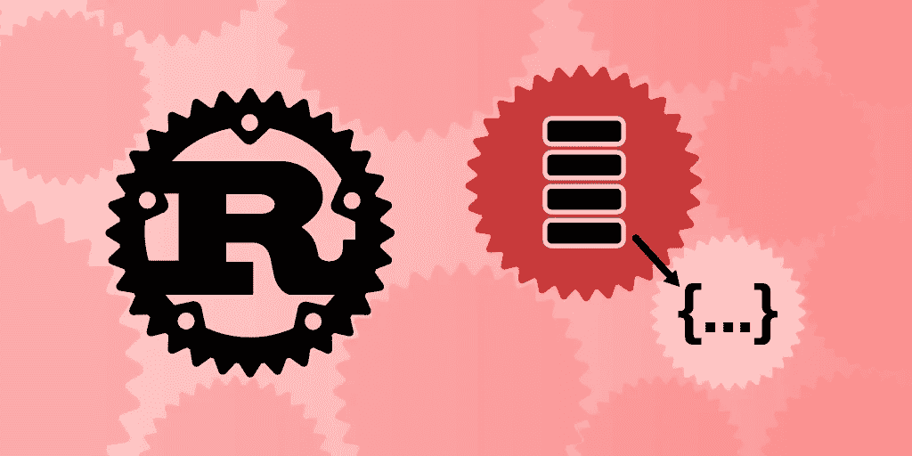
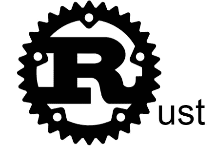

# Rust 编程入门

> 原文：<https://betterprogramming.pub/an-introduction-to-programming-in-rust-76181db9665c>

## 从零开始学铁锈



图片来源:作者

Rust 是一种新兴的编程语言，在操作系统和编译器等低级系统中获得了空前的普及。

事实上，在 2020 年，Rust 连续第五年在 Stack Overflow 开发者调查中被选为最受欢迎的编程语言。许多开发人员坚持认为，Rust 将很快超过 C 和 C++，因为 Rust 的借用检查器和对内存管理和隐式与显式类型等长期问题的解决方案。

今天，无论您的经验水平如何，我们都将帮助您开始使用 Rust。我们将探索 Rust 与其他语言的不同之处，了解它的主要组件，并帮助您编写您的第一个 Rust 程序！

**以下是我们今天要讲的内容:**

*   什么是铁锈？
*   铁锈世界你好
*   Rust 语法基础
*   中间锈:所有权和结构
*   铁锈生成系统:货物
*   接下来要学习的高级概念



# 什么是铁锈？

Rust 是一种多范例、静态类型的开源编程语言，用于构建操作系统、编译器和其他硬件到软件工具。它是由 Mozilla Research 的 Graydon Hoare 在 2010 年开发的。

Rust 针对性能和安全性进行了优化，尤其是优先考虑安全并发。这种语言与 C 或 C++非常相似，但是使用借用检查器来验证引用的安全性。

Rust 是嵌入式和裸机开发的理想系统编程语言。Rust 最常见的一些应用是低级系统，如操作内核或微控制器应用。Rust 拥有强大的并发编程支持，能够防止数据竞争，这让它有别于其他低级语言。

## 为什么要学 Rust？

Rust 编程语言是低级系统编程的理想选择，因为它拥有独特的内存分配系统，致力于优化和安全的并发性。虽然它在大公司中还不常见，但它仍然是评价最高的语言之一。

Rust 在不断改进，对低级系统的需求也在不断增加，所以 Rust 很有可能成为未来操作系统的语言。在这个早期阶段成为一名 Rust 开发人员将有助于你获得这些受欢迎的角色，这些角色将提供无与伦比的工作保障和高薪。

# 铁锈世界你好

了解 Rust 的最好方法是进行一些实践。我们将介绍如何用 Rust 编写你的第一个`hello-world`程序。

```
fn main() { println!("Hello World!");}
```

让我们来分解这段代码。

`**fn**`

`fn`是*功能*的简称。在 Rust(和大多数其他编程语言)中，函数的意思是“告诉我一些信息，我会做一些事情，然后给你一个答案。”

`**main**`

主函数是程序开始的地方。

`**()**`

这些括号是该函数的参数列表。它现在是空的，意味着没有参数。先别担心这个。稍后我们会看到很多有参数的函数。

`**{ }**`

这些被称为花括号或括号。它们定义了我们代码体的开始和结束。身体会说主要功能做什么。

`**println!**`

这是一个宏，和函数很像。意思是“打印并添加新的一行”现在，你可以把`println`看作一个函数。不同的是以感叹号(`!`)结尾。

`**("Hello, world!")**`

这是宏调用的参数列表。我们说“用这些参数调用这个叫做`println`的宏。”这就像 main 函数有一个参数表一样，只是`println`宏有一个参数。稍后我们会看到更多关于函数和参数的内容。

`**"Hello, world!"**`

这是一根绳子。字符串是放在一起的一串字母(或字符)。我们将它们放在双引号(`"`)内，将它们标记为字符串。然后我们可以将它们传递给像`println!`这样的宏和其他我们稍后会用到的函数。

`**;**`

这是分号。它标志着英语中一个像句号一样的单个语句的结束。你可以把语句想象成计算机采取特定行动的指令。大多数情况下，一条语句只是一行代码。在这种情况下，它调用宏。还有其他类型的陈述，我们很快就会看到。

# Rust 语法基础

现在让我们来看看 Rust 程序的一些基本部分以及如何实现它们。

## 变量和可变性

变量是被保存和标记以备后用的数据点。变量声明的格式是:

```
let [variable_name] = [value];
```

变量名应该是描述该值含义的描述性内容，例如:

```
let my_name = "Ryan";
```

这里我们创建了一个名为`my_name`的变量，并将其值设置为`"Ryan"`。

**提示**:在命名变量时，总是以小写字母开头，以大写字母标记新单词的开始。

在 Rust 中，变量在默认情况下是不可变的，这意味着一旦变量的值被设置，就不能被改变。

例如，此代码将在编译期间给出一个错误:

```
fn main() { let x = 5; println!("The value of x is: {}", x); x = 6; println!("The value of x is: {}", x);}
```

错误来自第 4 行，我们试图在那里设置`x = 6`。因为我们已经在第 2 行设置了`x`的值，所以我们不能更改该值。

起初，这似乎是一个令人沮丧的品质；但是，它有助于实施最小化可变数据的最佳实践。如果两个或多个函数引用同一个变量，可变数据通常会导致错误。

想象一下，我们有依赖于一个值为 T3 的变量的 T2 和改变这个变量的 T4。`functionA`必破！

一旦你开始添加几十个变量和函数，很容易看到你是如何意外地改变一个值的。众所周知，这类问题很难调试，所以 Rust 选择完全避免它们。

要覆盖这个缺省值并创建一个*可变*(可变)变量，将变量声明为:

```
let mut x = 5;
```

可变变量最常用作迭代器变量或`while`循环结构中的变量。

## 数据类型

到目前为止，我们已经看到可以用短语(称为*字符串*)和整数来设置变量值。这些变量是不同的*数据类型*，一个描述它持有什么形式的值以及它能做什么样的操作的标签。

Rust 有一个类型推断特性，允许编译器“推断”你的变量应该是什么数据类型，即使你没有明确地声明它。这使得你可以节省时间来为显而易见的类型编写变量声明，比如`my_name`字符串。

您可以选择使用变量名和值之间的`: &[type]`来显式键入变量。

例如，我们可以将我们的`my_name`声明重写为:

```
let my_name = "Ryan"; //implicitly typedlet my_name: &str = "Ryan"; //explicitly typed
```

显式类型化允许您确保以某种方式对变量进行类型化，并在变量类型可能不明确时避免错误。Rust 将尽可能做出最好的猜测，但这可能会导致一些意想不到的行为。

假设我们有一个变量`answer`记录用户在表单上的回答。

```
let answer = "true";
```

Rust 会隐式地将这个变量输入为字符串，因为它在引号内。然而，我们可能希望这个变量是一个布尔值，它是一个介于`true`和`false`之间的二元选项。

为了避免其他开发人员的困惑，并确保发现语法错误，我们应该将声明改为:

```
let answer: bool = true;
```

铁锈的基本类型有:

*   **整数**:整数
*   **浮点数**:带小数位的数字
*   **布尔**:二进制`true`或`false`
*   **字符串**:用引号括起来的字符集合
*   **Char** :表示特定字符的 Unicode 标量值
*   **Never** :没有值的类型，用`!`标记

## 功能

函数是捆绑在一个简写名称下的相关 Rust 代码的集合，并从程序的其他地方调用。

到目前为止，我们只使用了基本的`main()`函数。Rust 还允许我们创建自己的附加功能，这是大多数程序必不可少的功能。功能通常代表一个可重复的任务，如`addUser`或`changeUsername`。然后，只要您想执行相同的行为，就可以重用这些函数。

`main`之外的函数都必须有唯一的名称和返回输出。他们还可以选择传递参数*和*，这些参数是在函数中使用的一个或多个输入。

下面是声明函数的格式:

```
fn [functionName]([parameterIdentifier]: [parameterType]) { [functionBody]}
```

`**fn**`

这告诉 Rust 下面的代码是一个函数声明

`**[functionName]**`

这是我们放置函数标识符的地方。每当我们想调用函数时，我们都会用到这个标识符。

`**()**`

我们会在这些括号中填入我们希望函数访问的任何参数。在这种情况下，我们不需要传递任何参数，因此可以将此留空。

`**[parameterIdentifier]**`

在这里，我们将为传递的值指定一个名称。这个名称作为变量名引用函数体中任何地方的参数。

`**[parameterType]**`

您必须在参数后提供显式类型。Rust 禁止参数的隐式类型化，以避免混淆。

`**{}**`

这些大括号标记了代码块的开始和结束。每当调用函数标识符时，就会执行之间的代码。

`**[functionBody]**`

这是函数代码的占位符。最佳实践是避免包含任何与完成函数任务不直接相关的代码。

现在我们将添加一些代码。让我们把我们的`hello-world`改造成一个叫做`say_hello()`的函数。

```
fn say_hello() { println!("Hello, world!");}
```

**提示**:您总能通过`()`识别出一个函数调用。即使没有参数，您仍然必须包含空白的参数字段，以表明它是一个函数。

一旦函数完成，我们就可以从程序的其他部分调用它。因为节目在`main()`开始，我们从那里给`say_hello()`打电话。

下面是整个程序的样子:

```
fn say_hello() { println!("Hello, world!");}fn main() { say_hello();}
```

## 评论

注释是你添加信息的一种方式，让其他程序员一眼就能明白你的程序是如何布局的。这些对于描述代码段的目的也很有帮助，这样你就可以很快地记住你以后要完成的任务。写好的评论对你和他人都有帮助。

在 Rust 中写评论有两种方式。首先是用两个正斜杠`//`。那么直到行尾的所有内容都会被编译器忽略。例如:

```
fn main() { // This line is entirely ignored println!("Hello, world!"); // This printed a message // All done, bye!}
```

另一种方法是使用一对`/*`和`*/`。这种注释的优点是，它允许您将注释放在一行代码的中间，并且便于编写多行注释。不利的一面是，对于许多常见的情况，你必须键入更多的字符，而不仅仅是`//`。

```
fn main(/* hey, I can do this! */) { /* first comment  */ println!("Hello, world!" /* second comment */); /* All done, bye! third comment */}
```

**提示**:你也可以使用注释来“注释掉”那些你不想执行但以后可能会添加进去的代码段。

## 条件语句

条件语句是一种创建仅当一组条件为真时才发生的行为的方法。这是一个很好的方法，可以让适应性函数处理不同的程序情况，而不需要第二个函数。

所有条件语句都有一个检查变量、一个目标值和一个条件操作符，如`==`、`<`或`>`，它们定义了两者之间的关系。变量相对于目标值的状态返回一个布尔语句:如果变量满足目标值，则返回`true`，否则返回`false`。

例如，假设我们想要创建一个函数，为任何还没有帐户的用户创建一个帐户。然后他们会登录。

这是一个`if`条件语句的例子。我们实际上是在说“如果`hasAccount`为假，我们将创建一个帐户。不管他们是否有现有帐户，我们都会让用户登录他们的帐户。”

`if`语句的格式是:

```
if [variable] [conditionOperator] [targetValue] { [code body] }
```

三大条件语句是`if`、`if else`和`while`:

*   `if`:“如果条件为真，则执行，否则跳过。”
*   `if else`:“如果条件为真，执行代码体 A，否则执行代码体 b。”

```
fn main() { let is_hot = false; if is_hot { println!("It's hot!"); } else { println!("It's not hot!"); }}
```

*   `while`:“条件为真时重复执行代码体，条件为假时继续执行。”

```
while is_raining() { println!("Hey, it's raining!");}
```

**提示** : `while`循环要求被检查的变量是可变的。如果变量永远不变，循环将无限继续。

# 中间锈:所有权和结构

## 所有权

所有权是 Rust 的核心特征，也是它如此受欢迎的部分原因。

所有编程语言都必须有一个释放未使用内存的系统。一些语言，如 Java、JavaScript 或 Python，有自动垃圾收集器，可以自动移除未使用的引用。像 C 或 C++这样的低级语言要求开发人员在需要的时候手动分配和释放内存。

手动分配有很多问题，很难使用。任何分配时间过长的内存都会浪费内存，过早释放内存会导致错误，分配相同的内存两次会导致错误。

Rust 使用一个所有权系统，通过编译器在编译时强制执行的一组规则来管理内存，从而将自己与所有这些语言区分开来。

**所有权的规则是:**

*   Rust 中的每个值都有一个变量，称为它的所有者。
*   一次只能有一个所有者。
*   当所有者超出范围时，该值将被丢弃。

现在，让我们探索所有权如何与功能一起工作。声明的变量在使用时被分配。如果将它们作为参数传递给另一个函数，分配将被移动或复制到另一个所有者那里使用。

```
fn main() { let x = 5; //x has ownership of 5 function(x);} fn function (number : i32)   { //number gains ownership of 5 let s = "memory";  //scope of s begins, s is valid starting here // do stuff with s }                                  // this scope is now over, and s is no // longer valid
```

这里的关键要点是如何区别对待`s`和`x`。`x`最初拥有值`5`的所有权，但是一旦它离开`main()`函数的范围，就必须将所有权传递给参数`number`。将其用作参数允许内存分配`5`的范围超出原始函数。

另一方面，`s`不用作参数，因此仅在程序在`function()`内时保持分配。一旦`function()`结束，就不再需要`s`的值，可以将其释放以释放内存。

## 结构

Rust 的另一个高级工具是结构，叫做*结构*。这些是您可以创建来表示对象类型的自定义数据类型。创建结构时，您定义了一组字段，此类型的所有结构都必须为这些字段提供值。

您可以将这些看作类似于 Java 和 Python 等语言中的类。

结构声明的语法是:

```
struct [identifier] { [fieldName]: [fieldType], [secondFieldName]: [secondFieldType],}
```

*   `struct`告诉 Rust 下面的声明将定义一个 struct 数据类型。
*   `[identifier]`是传递参数时使用的数据类型的名称，比如分别将`string`或`i32`传递给字符串和整数类型。
*   `{}`这些花括号标记了该结构所需变量的开始和结束。
*   `[fieldName]`是命名该结构的所有实例必须具有的第一个变量的地方。结构中的变量被称为*字段*。
*   `[fieldType]`是明确定义变量的数据类型以避免混淆的地方。

例如，您可以创建包含字符串变量`brand`和整数变量`year`的`struct Car`。

```
struct Car{ brand: String, year: u16,};
```

每个`Car`类型的实例在创建时都必须为这些字段提供一个值。我们将创建一个`Car`的实例，用`brand`和`year`的值来表示一辆汽车。

```
let my_car = Car { brand: String:: from ("BMW"), //explicit type to String year: 2009,};
```

就像我们用原始类型定义变量一样，我们用一个标识符定义一个`Car`变量，以便以后引用。

```
let [variableIdentifier] = [dataType] {//fields}
```

从那里，我们可以用语法`[variableIdentifier].[field]`使用这些字段的值。Rust 将这种说法解释为“变量[标识符]的[字段]值是多少？”。

```
println!( "My car is a {} from {}", my_car.brand, my_car.year );}
```

下面是我们的结构看起来的样子:

```
fn main () {struct Car{ brand: String, year: u16,};let my_car = Car { brand: String:: from ("BMW"), year: 2009,};println!( "My car is a {} from {}", my_car.brand, my_car.year );}
```

总的来说，结构是一种很好的方式，可以将所有与对象类型相关的信息存储在一起，以便在程序中实现和引用。

# 铁锈生成系统:货物

[Cargo](https://doc.rust-lang.org/cargo/) 是 Rust 的构建系统和包管理器。通过列出项目需要的库(称为*依赖*)来组织 Rust 项目是一个必不可少的工具。它会自动下载任何缺少的依赖项，并从源代码中构建 Rust 程序。

到目前为止，我们处理的程序足够简单，不需要依赖关系。一旦你开始制作更复杂的程序，你将需要 Cargo 来访问标准库之外的工具的功能。Cargo 也有助于将项目上传到 GitHub 文件夹，因为它们将所有的部分和依赖项保存在一起。

如果你从官方网站下载了 Rust，Cargo 会自动与编译器(`rustc`)和文档生成器(`rustdoc`)一起安装，作为 Rust 工具链的一部分。您可以通过在命令行中输入以下命令来验证是否安装了 Cargo:

```
$ cargo --version
```

要创建 Cargo 项目，请在您的操作系统 CLI 中运行以下命令:

```
$ cargo new hello_cargo$ cd hello_cargo
```

第一个命令创建一个名为`hello_cargo`的新目录。第二个选项选择新目录。

这会生成一个名为`Cargo.toml`的清单，其中包含 Cargo 编译您的包所需的所有元数据，以及一个负责编译您的项目的`main.rs`文件。

要查看这些内容，请输入:

```
$ tree
```

您也可以导航到您的目录位置来打开`Cargo.toml`文件。在中，您会发现一组关于该项目的信息，如下所示:

```
[package]name = "hello_cargo"version = "1.43.0"authors = ["Your Name <you@example.com>"]edition = "2020"[dependencies]
```

任何依赖关系都将列在`dependencies`类别下。

一旦您的项目完成，您就可以输入命令`$ cargo run`来编译和运行项目。

# 接下来要学习的高级概念

虽然这些组件中有许多看起来很小，但每一个都让你离成为防锈大师更近了一步！Rust 每年都变得越来越流行，这意味着现在是获取技能来创建未来的低级系统的时候了。

*快乐学习！*