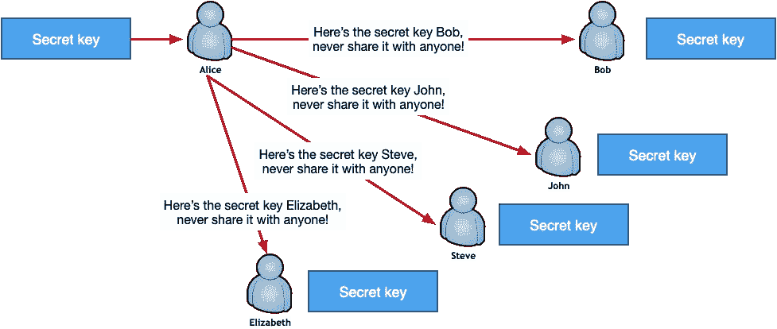
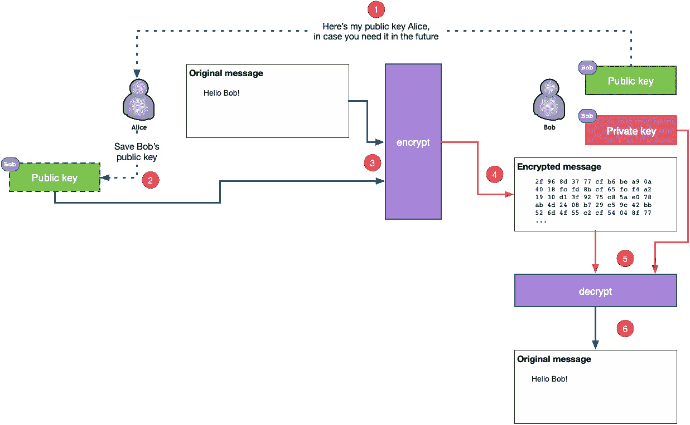
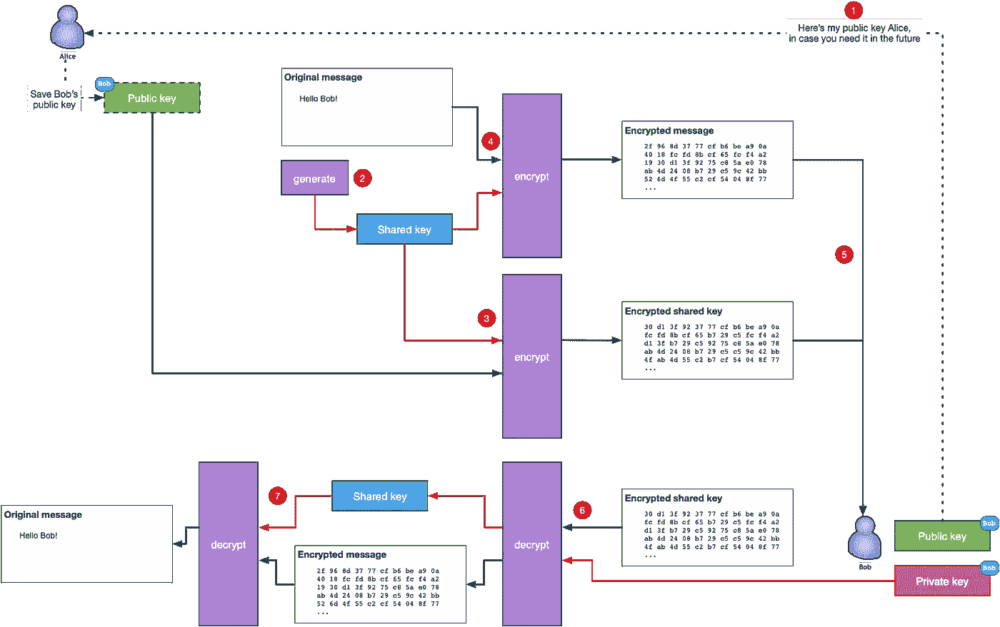
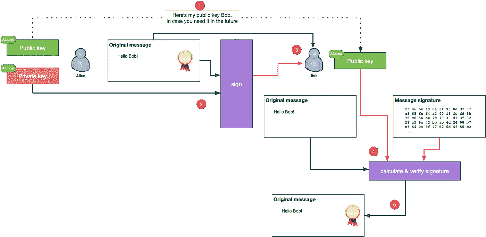
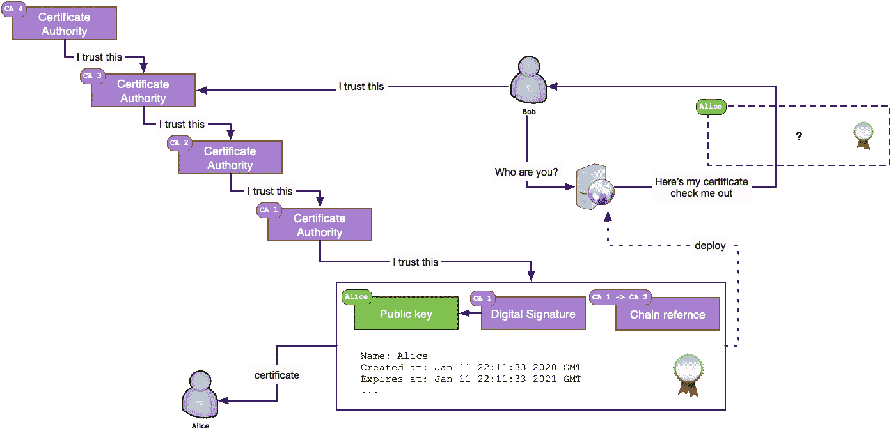
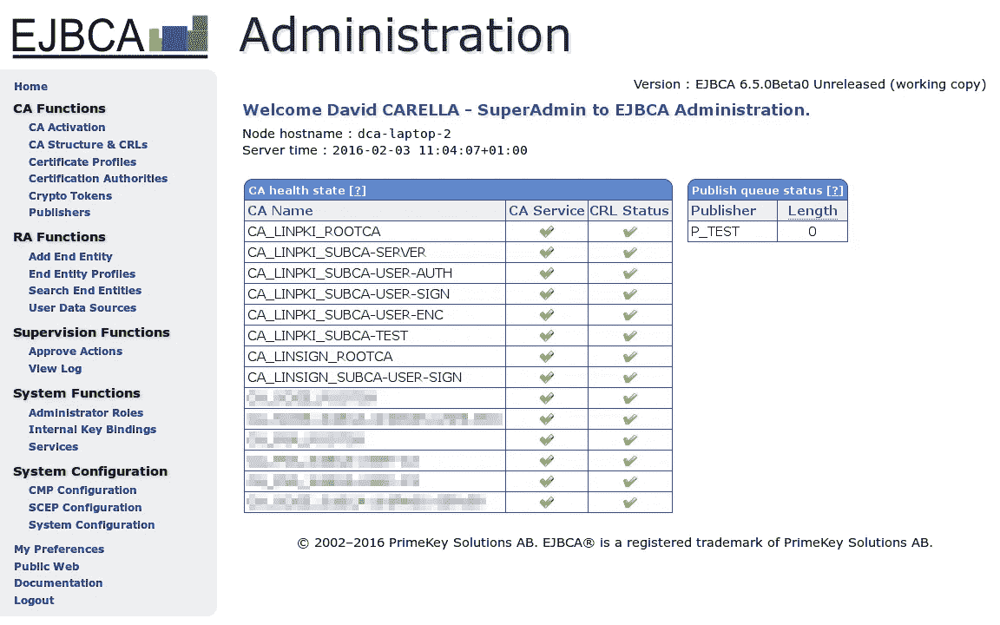

# 公钥密码学导论

> 原文：<https://betterprogramming.pub/an-introduction-to-public-key-cryptography-3ea0cf7bf4ba>

## 作为一名工程师，你应该学习的非对称加密概念


英格玛机由[数学学院——曼切斯特大学](https://www.flickr.com/photos/manunimaths/)在 [flickr](https://www.flickr.com/photos/manunimaths/44960892745) ( [CC BY 2.0](https://creativecommons.org/licenses/by/2.0/) )

如果你从事软件开发，你可能已经以这样或那样的方式接触过密码学。签署消息、加密有效负载、验证签名和使用证书；这些都是我们每天都在使用的功能，即使我们没有意识到。

公钥密码学，或称非对称密码学，是从 70 年代中期开始的广泛科学研究的主题，也是至今许多书籍和研究论文的目标。

这篇文章绝不是试图在任何水平的科学或学术细节中呈现密码学。

相反，我将尝试展示非对称加密背后的关键功能概念，并提供如何使用它的示例(同时尽可能避免行话)。

在以下部分中，我们将讨论:

*   对称与非对称加密。
*   密钥生成。
*   不对称加密，或如何发送加密的消息。
*   签名有效负载。
*   证书。

# 对称与非对称加密

对称加密与非对称加密的区别在于使用密钥来传递底层加密功能的方式:



对于对称加密，一个密钥由一方或多方共享(图片由作者提供)

在对称加密中，加密和解密使用相同的密钥。密钥成为共享的秘密，在参与者之间共享。

显然，随着参与者数量的增加，密钥泄露的风险也在增加。

在上图中，例如，如果 Steve 的 PC 遭到破坏，任何获得密钥的人也可以解密发送给 Alice、John 和 Elizabeth 的所有消息。

因此，一旦共享秘密在任何一个位置被泄露，整个系统的安全性就会受到威胁。这种使用单一共享密钥的要求，以及找到一种安全的方法来传播它，是对称加密的主要缺点。

对称加密一直是主要的加密机制，直到 70 年代中期，研究人员开始提出一种不同的方法来创建(更重要的是传播)密钥。

这就是不对称加密的诞生:


使用非对称加密，各方维护密钥对并交换公钥(图片由作者提供)

在非对称加密中，每一方都拥有一对密钥，一个公钥和一个私钥。

主要的突破是公开密钥不是应该由两方或多方小心隐藏的共享秘密。相反，参与者可以通过不可信的网络交换公钥，甚至与任何人共享自己的公钥。

对称加密彻底改变了密码学领域，它是当今大多数大规模加密方案的基础；比如互联网。

# 密钥生成

非对称加密中公钥和私钥的创建取决于数学问题，尤其是单向函数。

单向函数具有易于以一种方式求解(即，生成密钥)但是逆向计算(即，当具有加密的有效载荷时找到密钥)在计算上非常昂贵的特性。

正如我在本文开头所承诺的，我不会不必要地使用与密码学相关的技术术语。然而，让我们记住这一点:不是所有的键都是相同的。

密钥的质量和强度取决于用来生成它的算法以及它所包含的位数。

对于使用 Diffie-Hellman 算法生成的密钥，当前推荐的密钥大小是 2048 位或更大，大约是使用椭圆曲线算法生成的密钥的 1/10。

所以，是时候使用加密工具的瑞士军刀来创建我们的第一个非对称加密密钥对了，[libres sl](https://www.libressl.org)(v 2 . 8 . 3——如果您使用的是 [OpenSSL](https://www.openssl.org/) ，下面的大多数命令应该也可以工作)。

## 创建加密的私钥

```
openssl genrsa -des3 -out alice-privatekey.pem 2048openssl genrsa -des3 -out bob-privatekey.pem 2048
```

现在，您已经成功地为 Alice 和 Bob 生成了私钥。LibreSSL 和 OpenSSL 中都有额外的选项来指定密钥的属性，包括在生成过程中使用椭圆曲线算法。

私钥应该保存好...保密，不与任何人分享。

## 从私钥中提取公钥

```
openssl rsa -in alice-privatekey.pem -outform PEM -pubout -out alice-publickey.pemopenssl rsa -in bob-privatekey.pem -outform PEM -pubout -out bob-publickey.pem
```

Alice 和 Bob 的公钥现在被提取出来，并且可以发送给任何感兴趣的一方，因为其中没有嵌入敏感信息。

# 不对称加密，或如何发送加密消息

不对称加密使用公钥和私钥。要发送加密的邮件，在加密过程中使用收件人的公钥，在解密过程中使用收件人的私钥，如下所示:



公钥加密/解密(图片由作者提供)

以下是上述场景中涉及的步骤，其中 Alice 想要向 Bob 发送一条加密的消息:

1.  爱丽丝获得了鲍勃的公钥。
2.  Alice 存储 Bob 的公钥以备将来使用。
3.  Alice 使用 Bob 的公钥和要加密的有效载荷，并通过她的加密软件传递它们。
4.  加密的有效载荷被发送给 Bob。
5.  Bob 将他的私钥和 Alice 发送的加密消息传递给他的解密软件。
6.  Bob 收到 Alice 发送的原始有效载荷。

那么，让我们转到实用部分，使用 Bob 的公钥给他发送一个加密文件。哦，等等…我们不能！

## 混合加密

上面介绍的理论部分没有任何问题，因为它完全按照广告宣传的那样工作。然而，不对称加密有一个“问题”:要加密的有效载荷的大小必须(几乎)与用于加密的公钥的大小相匹配。

所以，为了给 Bob 发送一张大约 1MB 的照片，你需要 Bob 有一个至少 800 万比特的公钥。那是八百万个 1 和 0，一个接一个。生成这样一个密钥可能不太实际——即使可以实现。

虽然您可以创建一个结构，其中在块模式下使用非对称加密来加密大型有效负载，通过以接近可用公钥大小的较小位来加密有效负载，但在实践中，没有人使用这种方法。从空间使用的角度来看效率很低，而且会非常慢。

为了缓解非对称加密的密钥大小限制，当前的做法是使用混合加密:



混合加密(作者图片)

在混合加密中，创建随机对称密钥来加密有效负载，公钥用于加密随机对称密钥。让我们看看这是如何工作的:

1.  鲍勃把他的公钥发送给爱丽丝。
2.  Alice 生成一个共享对称密钥。
3.  Alice 用 Bob 的公钥加密对称密钥。
4.  Alice 用(2)中创建的共享密钥加密消息。
5.  Alice 向 Bob 发送加密的消息和加密的共享密钥。
6.  Bob 使用他的私钥解密共享密钥。
7.  Bob 使用共享密钥解密加密的消息。

如果手动执行的话，上面的场景是冗长而乏味的。然而，已经有成熟的工具和标准来自动化安全交换消息和文件的过程，例如 [OpenPGP](https://www.openpgp.org) 及其在 [PGP](https://en.wikipedia.org/wiki/Pretty_Good_Privacy) 和 [GPG](https://gnupg.org) 的化身。

## 用 GPG 加密(GNU 隐私卫士)

[GnuPG](https://gnupg.org/) 是由 [RFC4880](https://tools.ietf.org/html/rfc4880) (也称为 PGP)定义的 OpenPGP 标准的完整免费实现。

GnuPG 允许你对你的数据和通信进行加密和签名，它有一个通用的密钥管理系统，以及各种公共密钥目录的访问模块。

现在让我们尝试使用 GPG 将加密文件从 Alice 发送给 Bob:

1.  爱丽丝和鲍勃都需要创建 GPG 密钥对:
    `gpg --gen-key`
2.  Bob 应该导出他的公钥并将其发送给 Alice:
    `gpg --output bob.gpg --export bob@bob.com`
3.  一旦爱丽丝收到鲍勃的公钥，她应该将它导入到她的本地密钥数据库:
    `gpg --import bob.gpg`
4.  爱丽丝创建了一条未加密的消息:
    `echo "Hello Bob" > bob.msg`
5.  爱丽丝对消息进行加密，并将加密的消息连同加密的共享密钥一起发送给鲍勃:
    `gpg --output bob.msg.gpg --encrypt --recipient bob@bob.com bob.msg`
6.  Bob 接收加密的消息，并通过解密共享密钥对其进行解密，并利用它对加密的消息进行解密:
    `gpg --output bob.msg --decrypt bob.msg.pgp`

GPG 和 PGP 都被广泛使用，并且已经集成到我们日常使用的许多产品中，例如电子邮件客户端，因此您很少需要手动执行上述序列。

# 签名有效负载

有时，可能没有必要对消息的内容进行加密，但是，我们可能仍然希望确定发送者的身份。其他时候，内容需要加密，发送者的身份也需要验证。在这两种情况下，这就是我们使用数字签名的地方。

在我们了解数字签名是如何生成的以及它如何有助于验证内容以及发送者的身份之前，让我们在这里做一个重要的区分——这是我经常看到人们互换使用的:数字签名*不是*电子签名。

## 数字签名

数字签名只是验证数字信息真实性的数学证明。

它使信息的接收者能够非常确定地相信某一特定信息是由一个已知的发送者创建的，并且该信息在传输过程中没有被更改。

## 电子签名

电子签名带有物理签名的意图，通常使用数字签名来实现。

在许多国家，只要电子签名符合创建时所依据的具体条例的要求，它就具有与手写签名相同的法律地位。

数字签名由发送方使用私钥生成，并由接收方使用发送方的公钥验证:



用数字签名验证邮件(图片由作者提供)

1.  爱丽丝将她的公钥发送给鲍勃。
2.  Alice 创建了一条消息，并使用她的私钥生成了一个数字签名。数字签名通常是在计算出的消息散列上产生的，例如，在产生的 [SHA-256](https://en.wikipedia.org/wiki/Secure_Hash_Algorithms) 上产生的。
3.  Bob 收到原始的未加密邮件和 Alice 对该邮件的数字签名。
4.  Bob 使用 Alice 的公钥重新计算原始未加密邮件的数字签名，并将其与 Alice 发送的签名进行比较。
5.  如果两个签名都匹配，Bob 知道是 Alice 发送了原始消息，并且消息的内容没有被更改。

接下来让我们看看如何创建数字签名，以及收件人如何验证收到的消息没有被篡改。

## 签发签名

```
openssl dgst -sha256 -sign alice-privatekey.pem -out bob.msg.sign bob.msg
```

上面的命令使用 Alice 的私钥来计算文件`bob.msg`的 SHA-256 输出上的数字签名。然后爱丽丝将`bob.msg`和`bob.msg.sign`文件发送给鲍勃。

## 验证签名

```
openssl dgst -sha256 -verify alice-publickey.pem -signature bob.msg.sign bob.msg
```

Bob 从 Alice 那里收到了这两个文件，并继续使用 Alice 的公钥验证签名。上述命令根据数字签名验证结果返回`Verified OK`或`Verification Failure`。

# 证书

证书，也称为数字证书、身份证书或公钥证书，是证明公钥所有权的电子文档。

最常见的证书格式由 [X.509](https://en.wikipedia.org/wiki/X.509) 定义，它基本上包含一个公钥、该公钥的数字签名以及公钥所有者的身份信息。

证书可用于各种目的，因此存在不同的证书配置文件。

公钥对应于证书的所有者。然而，对于能够验证所有者身份的任何其他人来说，需要一个可信的第三方实体。

这就是证书颁发机构的用武之地。证书颁发机构是负责签署证书的一方，通常是受信任的知名公司或组织。

为了有效地履行这一职责，证书颁发机构需要拥有尽可能多的用户信任的自己的根证书。但是，证书颁发机构也可以提供交叉签名，从而签署其他证书颁发机构的根证书。

这可能一开始听起来很混乱，所以让我们试着用一个例子来解释一下:



信任的证书验证链(图片由作者提供)

*   在上面的例子中，Bob 连接到 Alice 的网站，并希望验证是否真的是 Alice 在操作它。
*   Bob 在访问 Alice 的网站时获得了一个证书。该证书包含 Alice 的公钥以及来自认证机构 CA1 的数字签名。
*   因为 Bob 不知道也不信任 CA1，所以他检查了嵌入到证书中的证书链。
*   通过回溯可用的交叉签名，Bob 到达他信任的认证机构 CA3。他现在知道爱丽丝的网站可以信任由爱丽丝操作。

当然，所有这些过程都是在 HTTPS 协议的传输层安全性( [TLS](https://en.wikipedia.org/wiki/Transport_Layer_Security) )下，通过您的互联网浏览器在幕后进行的。

证书身份的验证是基于一个普遍信任的父证书颁发机构，这也是对证书的主要批评之一。

如果父证书颁发机构受到威胁或失控，该怎么办？

尽管证书主要用于网站隐私、身份识别和内容可靠性，但它们也可用于客户身份识别。

如果您有兴趣运营自己的认证中心，您可以尝试各种可用的开源实现，如 [OpenCA](https://www.openca.org/) 、 [EJBCA](https://www.ejbca.org/) 或 [OpenXKPI](https://github.com/openxpki/openxpki) 。



EJBCA 的 web 管理控制台截图( [David CARELLA](https://commons.wikimedia.org/wiki/User:David_CARELLA) 、 [Wikipedia](https://en.wikipedia.org/wiki/EJBCA#/media/File:EJBCA_6.5.0_en_-_Administration_-_Home.png) 、 [CC BY-SA 4.0](https://creativecommons.org/licenses/by-sa/4.0) )

当然，要考虑到，由于您自己的证书颁发机构的根证书不被您的互联网浏览器或任何其他人信任，您需要按照操作系统的说明手动将其插入到可信证书存储中。

使用您自己的证书颁发机构颁发的证书的所有用户的机器也是如此。

不，它不是一个选择，让一个大的，已知的根证书权威交叉签署你自己的证书权威的根证书。

# 结论

公钥加密或不对称加密是一种基于成对密钥(公钥和私钥)的加密系统。不对称加密的主要用例是加密通信、提供消息验证和真实性。

在本文中，我试图展示非对称加密背后的基本概念，尽管只是触及了如此复杂主题的皮毛。密码学是一个迷人的领域，至今仍有活跃的研究，为好奇的人们提供了大量的信息。

在您离开之前，如果您的项目需要加密，请记住加密黄金法则:*不要使用您自己的密码*。

有大量的库和已经实现的强大、安全、经过实战检验的算法。做你的研究，选择那些已经满足你的项目需求的。

感谢您阅读这篇文章。希望下一部能见到你。