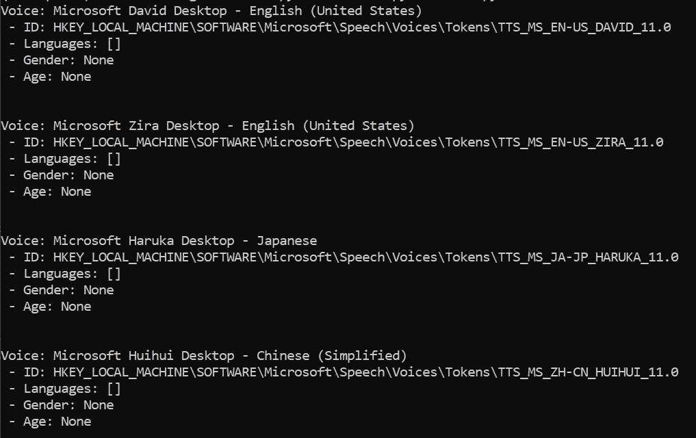

# pyttsx3 简介:Python 的文本到语音转换器

> 原文：<https://betterprogramming.pub/an-introduction-to-pyttsx3-a-text-to-speech-converter-for-python-4a7e1ce825c3>

## 一个基于 Python 的文本到语音转换的替代方案，可以脱机工作


照片由[帕诺斯·萨卡拉基斯](https://unsplash.com/@meymigrou?utm_source=unsplash&utm_medium=referral&utm_content=creditCopyText)在 [Unsplash](https://unsplash.com/?utm_source=unsplash&utm_medium=referral&utm_content=creditCopyText) 上拍摄

这篇文章是一个傻瓜学习 Python 中文本到语音转换的指南。通过阅读本文，您将了解设置它的正确步骤，并了解该模块中可用的一些基本功能。根据[官方网站为 pyttsx3](https://github.com/nateshmbhat/pyttsx3) :

> “…是 Python 中的文本到语音转换库。与其他库不同，它可以离线工作，并且与 Python 2 和 3 兼容。”

此外，该模块已经过测试，已知可在以下系统上运行:

*   Windows XP、Windows Vista 和 Windows 8、8.1、10 上的 SAPI5
*   Mac OS X 10.5 (Leopard)和 10.6 (Snow Leopard)上的 NSSpeechSynthesizer
*   eSpeak on Ubuntu 桌面版 8.10(无畏)、9.04(活泼)和 9.10(业力)

我将使用以下语言演示本模块的功能:

*   英语(男，女)
*   中国人(女性)
*   日本人(女性)

本教程有四个部分:

1.  设置
2.  基本 API
3.  结果
4.  结论

让我们进入下一部分，了解更多信息。

# 1.设置

安装该模块的正确方法是克隆存储库并通过安装 Python 文件进行安装。

这主要是因为在撰写本文时，PyPI 中发布的版本不是最新版本。如果开发人员在 PyPi 上发布了最新版本，您可以在将来进行 pip 安装。**编辑**:包已经更新到 2020 年 7 月。您可以通过以下命令轻松安装它。

```
pip install pyttsx3
```

## Python 模块

首先，从官方 GitHub 站点克隆[库](https://github.com/nateshmbhat/pyttsx3)，并将其解压缩到您选择的目录中。

然后，打开命令行，激活您喜欢的虚拟环境。完成后，将目录改为主文件夹的根目录。它应该有一个名为`setup.py`的文件。运行以下命令:

```
python setup.py install
```

安装完成后，请检查您是否有以下模块:

```
pip show pyttsx3
```

如果您使用的是 Windows，您还需要验证`pypiwin32`模块。

```
pip show  pypiwin32
```

如果该模块不存在，请使用以下命令安装它:

```
pip install  pypiwin32
```

## 文本到语音

本模块的文本到语音转换功能基于您的操作系统中安装的语言。

默认情况下，它应该在操作系统安装期间与语言包一起提供。如果您打算使用其他语言，您需要手动安装语言包。

对于 Windows 用户，请转到语言设置。您应该能够看到下面的用户界面。


作者图片

除了默认的语言包(英语)，我还安装了其他语言(如中文和日语)。单击“添加”按钮添加首选语言。您应该会看到以下弹出窗口。


作者图片

确保语言包具有文本到语音转换图标。

在上面给出的例子中，我们可以看到语言包中的法语(法国)支持文本到语音转换。您可以选择它，然后单击“下一步”安装语言包。

让我们进入下一节，开始测试可用的 API。

# 2.基本 API

在这一部分，我们将探索模块中提供的一些有用的功能。如果您通过 pip 方法安装此模块，某些功能将不可用。在继续之前，请参考上一节进行正确的安装。

## 导入

让我们从一个简单的导入语句开始

```
import pyttsx3
```

## 初始化

初始化非常简单，您只需键入以下代码:

```
engine = pyttsx3.init()
```

如果遇到与缺少驱动程序相关的错误，可以尝试传入驱动程序的名称。有四种可用的内置驱动程序:

*   `[dummy.py](https://github.com/nateshmbhat/pyttsx3/blob/master/pyttsx3/drivers/dummy.py)` —测试无所作为的驱动程序。您可以使用该结构作为参考来实现自己的驱动程序。
*   `[espeak.py](https://github.com/nateshmbhat/pyttsx3/blob/master/pyttsx3/drivers/espeak.py)` —其他平台的驱动程序，如 Ubuntu
*   `[nsss.py](https://github.com/nateshmbhat/pyttsx3/blob/master/pyttsx3/drivers/nsss.py)`—MAC OS 的驱动程序
*   `[sapi5.py](https://github.com/nateshmbhat/pyttsx3/blob/master/pyttsx3/drivers/sapi5.py)`—Windows 操作系统的驱动程序

使用驱动程序名称进行初始化的示例如下:

```
engine = pyttsx3.init("sapi5")
```

## 文本到语音

让我们试着用下面的代码来说一些简单的事情。将它保存在 Python 文件中，然后运行它。

```
import pyttsx3
engine = pyttsx3.init()engine.say('Welcome to Medium')
engine.runAndWait()
```

你应该能听到那个声音在说，“欢迎来到灵媒。”

## 财产

引擎对象具有以下可以微调的变量:

*   `rate` —以每分钟字数为单位的整数语速。基本值是 200。
*   `voice` —活动语音的字符串标识符
*   `volume`—0.0 到 1.0 范围内的浮点量
*   `voices`—`[pyttsx3.voice.Voice](https://pyttsx3.readthedocs.io/en/latest/engine.html#pyttsx3.voice.Voice)`描述符对象列表

您可以通过`setProperty`功能进行设置。

```
engine.setProperty('rate', 150)
```

您可以使用`getProperty`函数获取属性的值。

```
engine.getProperty('volume')
```

## 语音属性

voice 属性具有以下变量:

*   `age` —以年为单位的声音的整数年龄。如果未知，默认为`None`。
*   `gender` —声音的字符串性别:男性、女性或中性。如果未知，默认为`None`。
*   `id` —声音的字符串标识符。用于通过`pyttsx3.engine.Engine.setPropertyValue()`设置活动声音。该属性始终是定义的。
*   `languages` —该语音支持的字符串语言列表。默认为未知的空列表。
*   `name` —声音的人类可读名称。如果未知，默认为`None`。

您可以使用下面的代码来识别系统中所有可用的声音。在`init`函数后添加以下代码。

```
voices = engine.getProperty('voices')
for voice in voices:
    print("Voice: %s" % voice.name)
    print(" - ID: %s" % voice.id)
    print(" - Languages: %s" % voice.languages)
    print(" - Gender: %s" % voice.gender)
    print(" - Age: %s" % voice.age)
    print("\n")
```

运行它时，您应该会看到以下输出(取决于您安装的语言包)



作者图片

我们试试把声音改成 Zira(女版)。您需要使用 ID 作为参数，订单将与我们刚才打印的完全一样。我将根据以下顺序传递 1 作为 Zira 的索引:

*   大卫(英国男性)
*   齐拉(英国男性)
*   相户爱(日语)
*   惠惠(中文)

让我们在 for 循环之后和`say`函数之前添加以下代码。

```
engine.setProperty("voice", voices[1].id)
```

重新运行文件，你应该会听到一个女声说“欢迎来到媒体”随意输入你自己的文本并测试文本到语音的转换。

## 保存到文件

开发人员增加了一个新功能，可以将音频流保存到 MacOS 和 Windows 的文件中。您可以通过`save_to_file`函数轻松调用它。确保将其置于`engine.runAndWait()`功能之前。我们来试试吧！

```
engine.save_to_file("How do you do?", "output.mp3")
```

该函数接受两个参数:

*   `text` —文本到语音转换的文本
*   `filename` —文件的名称。您可以使用 mp3 或 wav 扩展名。

# 3.结果

我刚刚用各种语言对以下数据进行了测试:

*   简单的问候
*   随机文本
*   短篇故事或通俗小说中的一段
*   新闻文章中的一段

我将结果链接到我的 GitHub [库](https://github.com/wfng92/medium-repo/tree/master/pyttsx3)。请随意查看。

## 英语(男性)

*   [欢迎来到媒体](https://github.com/wfng92/medium-repo/blob/master/pyttsx3/0-greetings.mp3)
*   [与其他库不同，它可以离线工作，并且兼容 Python 2 和 3](https://github.com/wfng92/medium-repo/blob/master/pyttsx3/0-random.mp3)
*   兔子对和乌龟赛跑的想法很感兴趣，但为了好玩，他同意了。于是，同意充当裁判的狐狸标出了距离，开始赛跑。
*   人类基因组计划始于 1988 年，旨在绘制 23 条染色体，为人类提供蓝图。

## 英语(女性)

*   [欢迎来到媒体](https://github.com/wfng92/medium-repo/blob/master/pyttsx3/1-greetings.mp3)
*   [与其他库不同，它可以离线工作，并且兼容 Python 2 和 3](https://github.com/wfng92/medium-repo/blob/master/pyttsx3/1-random.mp3)
*   兔子对和乌龟赛跑的想法很感兴趣，但为了好玩，他同意了。于是，同意充当裁判的狐狸标出了距离，开始赛跑。
*   人类基因组计划始于 1988 年，旨在绘制 23 条染色体，为人类提供蓝图。

## 日本人

*   [こんにちは！今日はいい天気ですね。](https://github.com/wfng92/medium-repo/blob/master/pyttsx3/2-greetings.mp3)
*   [その店は若い人たちで混んでいた。](https://github.com/wfng92/medium-repo/blob/master/pyttsx3/2-random.mp3)
*   [２７日付の、南ア紙タイムズによると、２人は、貴重な野生動物の所持などを、禁じた同国の法律に、違反した疑いがあるとして、９月に逮捕されていた。](https://github.com/wfng92/medium-repo/blob/master/pyttsx3/2-story.mp3)
*   [そのデタラメな思考をもとに、不自然なほど進は、半ばウキウキで、草原を歩く。それも、この旅先に、来る前は、仕事仕事でプライベートも、まともに充実していなかった。](https://github.com/wfng92/medium-repo/blob/master/pyttsx3/2-news.mp3)

## 中国人

*   [您好，欢迎光临](https://github.com/wfng92/medium-repo/blob/master/pyttsx3/3-greetings.mp3)
*   [老娘叫安娜斯塔西亚尼古拉耶维奇切尔亚尼克伊凡诺夫娜亚历山大彼得罗夫斯基康斯坦丁萨维里奥诺维奇波波莎奥尔良基伊万诺耶夫娜](https://github.com/wfng92/medium-repo/blob/master/pyttsx3/3-random.mp3)
*   [走了一段路，该穿越森林了。林子里空气新鲜，味道甜美。还没走到一百码远，公主见到四棵大树之间，极粗的银链上吊着一座美丽的银制城堡。吊得非常稳当，如有一阵微风吹过，就会轻微摆动，催人入眠。](https://github.com/wfng92/medium-repo/blob/master/pyttsx3/3-story.mp3)
*   [12 月 4 日消息，当地时间 12 月 3 日，在巴黎世界教育论坛上，马云呼吁改变教育前先改革考试。他表示文凭只是学费的收据，真正的文凭是生活中奋斗来的。](https://github.com/wfng92/medium-repo/blob/master/pyttsx3/3-news.mp3)

根据结果，这个模块非常适合新闻和专业文章。情感相当缺乏，节奏也不是很好——尤其是对日本人来说。我特意在句子之间放了很多逗号，以便进一步分隔句子。请自行测试。

# 4.结论

让我们回顾一下今天所学的内容。首先，我们开始安装 Python 模块和我们想要的语言的语言包。

我们继续学习该模块提供的一些可用功能。我们学习了设置和获取对象的属性以及文本到语音转换功能。此外，我们还尝试输出操作系统中的可用语音。

除此之外，我还链接了一些我在三种语言的四个不同领域中测试过的例子。

祝您在自己的测试中获得乐趣，并希望您喜欢这篇文章。下一篇文章再见。

# 参考

1.  [https://pyttsx3.readthedocs.io/en/latest/index.html](https://pyttsx3.readthedocs.io/en/latest/index.html)
2.  https://github.com/nateshmbhat/pyttsx3