# 反应表简介

> 原文：<https://betterprogramming.pub/an-introduction-to-react-table-6ebd34d8059e>

## 用于轻量级、快速和可扩展数据网格的实用工具


照片由 [sergio souza](https://unsplash.com/@serjosoza?utm_source=unsplash&utm_medium=referral&utm_content=creditCopyText) 在 [Unsplash](https://unsplash.com/s/photos/grid?utm_source=unsplash&utm_medium=referral&utm_content=creditCopyText) 上拍摄

表格也称为数据网格，是数据在行和列中的排列，或者可能是更复杂的结构。它是用户界面的重要组成部分。我已经使用 Java Swing、ExtJs、Angular 和 React 构建了表格。我还使用了许多第三方的表格。作为一名 UI 开发人员，表格组件是不可避免的。

构建还是购买？它总是在成本和控制之间做出选择。当有一个有着良好记录的开源软件时，选择就变得显而易见了。

我推荐使用 [React Table](https://github.com/tannerlinsley/react-table) ，它为轻量级、快速和可扩展的数据网格提供了一个实用工具。这个项目从 2016 年 10 月开始，有几百个投稿人，上万个明星。它提供了一个定制的钩子`useTable`，它实现了行排序、过滤、搜索、分页、行选择、无限滚动以及更多的功能。

# **基本表**

和往常一样，我们使用 [Create React App](https://medium.com/better-programming/10-fun-facts-about-create-react-app-eb7124aa3785) 作为起点。首先，用命令`npm i react-table`安装 React Table。然后这个包成为`package.json`中`[dependencies](https://medium.com/better-programming/package-jsons-dependencies-in-depth-a1f0637a3129)`的一部分。

```
"dependencies": {
  "react-table": "^7.1.0"
}
```

将`src/index.css`改为最小表格样式:

下面是一个基本表格，有五列十行。

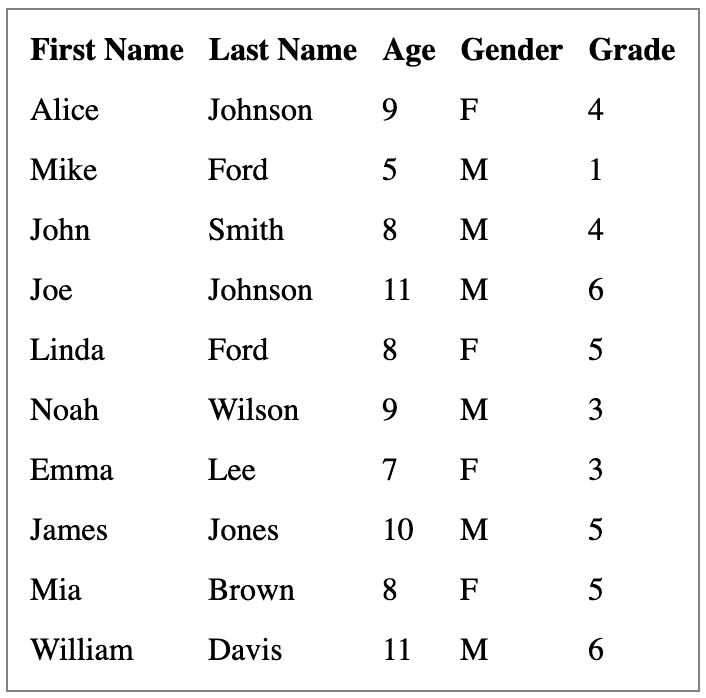

与任何表格类似，React 表格由[列和](https://react-table.tanstack.com/docs/api/useTable)数据组成:

*   `columns`是列的数组。列可以嵌套，充当标题组。此外，可以根据需要对列进行递归嵌套。
*   `data`是要在表格上显示的行的数组。

我们为`columns`和`data`设置了`src/dataSource.js`。在下面的代码中，`accessor`作为列键，用于定义行数据中的每一列。列 ID 由字符串访问器生成或由列定义提供。`Header`是显示字符串或 JSX 的列。`accessor`和`Header`都可以是函数。

用我们的表格代码替换`src/App.js`。

第 12 到 15 行是`useTable`钩。构建一个表实例需要选项和插件。基本选项是列和数据。插件是可选的。

在第 7 到 11 行，我们使用了来自`useTable`实例的许多道具:

*   `getTableProps`是一个解析表包装器所需的任何道具的函数。内置的桌子道具是`{role: “table”}`，可以定制。
*   `getTableBodyProps`是一个解析表体包装器需要的任何道具的函数。内置的桌子道具是`{role: “rowgroup”}`，可以定制。
*   `prepareRow`是必须在要显示的任何行上调用的函数。它负责延迟准备一行进行呈现。
*   `headerGroups`和`rows`是从列和数据派生的内部数据结构。

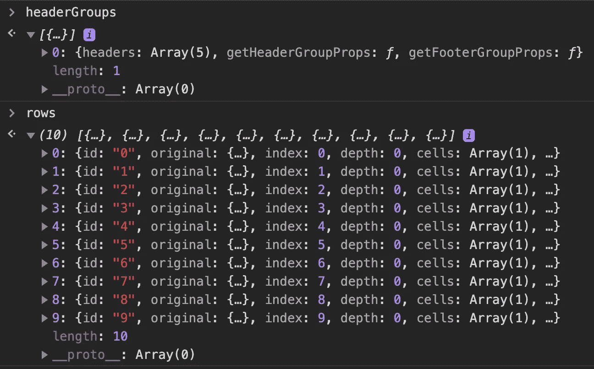

有了来自`useTable`实例的道具，我们获得了在第 18 到 40 行组成`Table`的构件。`headerGroups`、`rows`、`columns`是复杂的数据结构，包含了额外的使用功能，如`getHeaderGroupProps`、`getHeaderProps`、`getRowProps`、`getCellProps`。也可以叫`column.render(‘Header’)`和`cell.render(‘Cell’)`。

下面是该表的翻译后的 HTML 定义。

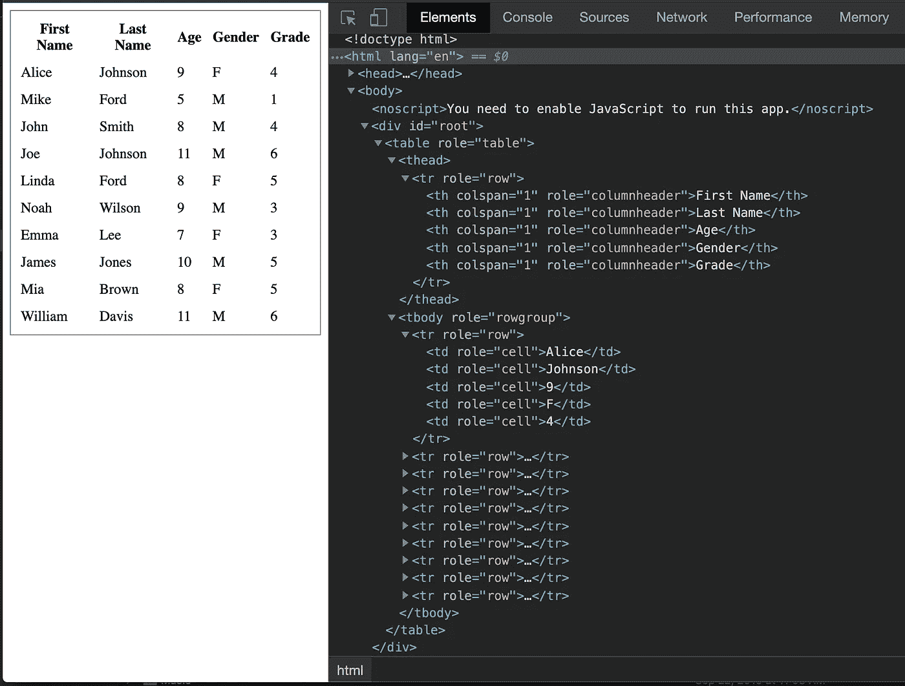

# **具有分组页眉和页脚的表格**

表头可以分组，表尾也可以分组。


我们通过定义列来实现上表。

我们使用嵌套列将`firstName`和`lastName`放入一个组`Name`，将另外三列放入另一个组`Information`。

列组`Name`有一个页脚呈现来计算总行数(第 4 行到第 11 行)。

列`firstName`使用分隔符作为页脚(第 15 行)。

列`grade`有一个标题呈现，根据行值生成显示文本(第 36 到 54 行)。

下面是调整后的`src/App.js`使用的页眉和页脚:

第 10 行检索第 41 到 49 行中用于显示表尾的`footerGroups`。

# 具有行排序的表格

行排序是基本的表功能。通常通过单击列标题对表格进行排序来实现。React Table 的插件`[useSortBy](https://react-table.tanstack.com/docs/api/useSortBy)`，支持单列行排序，也支持多列行排序。

下表按`First Name`排序:

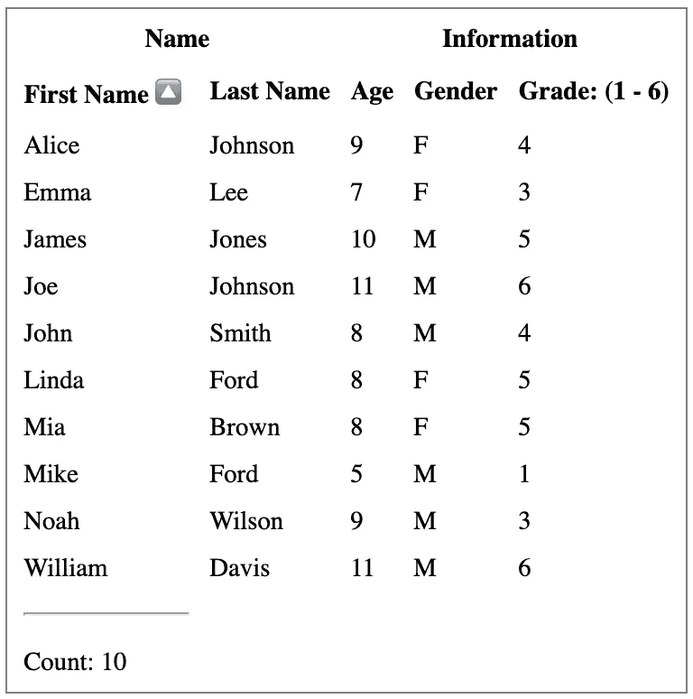

这是修改后的`src/App.js`执行行排序:

在第 18 行提供插件`useSortBy`。

第 27 行使用了`getSortByToggleProps()`，这是一个在切换排序方向时解析任何所需属性的函数。

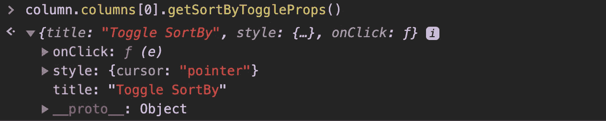

第 29 到 31 行显示了排序列的降序或升序箭头。

可排序的列`firstName`具有以下属性:

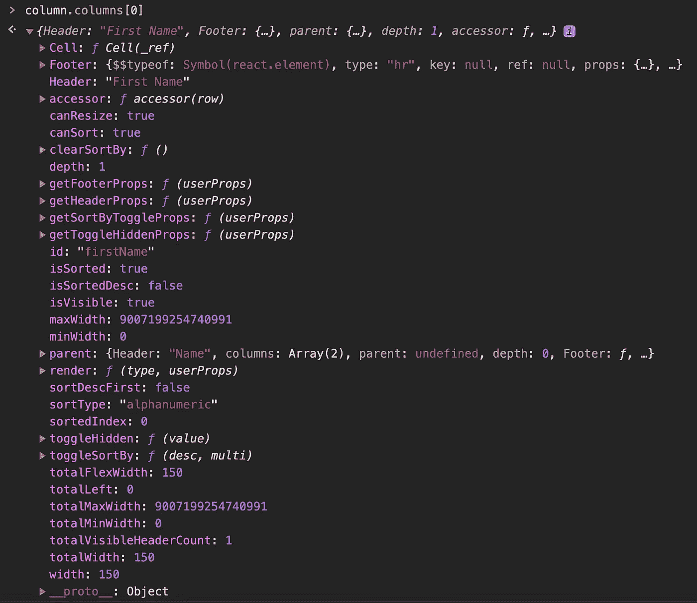

单击列标题将在升序、降序和不排序之间切换。如果您按住 shift 键并单击列标题，其他列的排序状态将被保留，新列将随后被排序。这导致了多重排序。

# 带过滤器的桌子

行过滤也是基本的表功能。它根据单个列或多个列的筛选条件来筛选表行。React Table 的插件`[useFilters](https://react-table.tanstack.com/docs/api/useFilters)`，支持行排序，

这是我们已经使用过的同一个表，除了它被过滤为只保留从`firstName`开始的行。当前计数是 1。

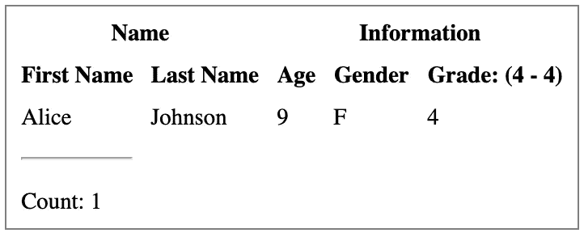

对于要由相关列过滤器过滤的行，需要提供过滤功能。下面是修改后的`src/dataSource.js`中`firstName`的列定义。它在第五行定义了一个过滤器来执行过滤任务。

下面是修改后的`src/App.js`:

在第 26 行，插件`useFilters`被提供。

第 17 到 24 行设置初始过滤器状态。

# 具有全局过滤的表格

`[useGlobalFilter](https://react-table.tanstack.com/docs/api/useGlobalFilter)`是实现全局行过滤的钩子。它根据表格中的任何单元格值过滤表格行。也叫搜索。

这与我们使用的表格相同，只是它被过滤以保留任何单元格中带有文本“A”或“A”的行。目前的计数是 7。

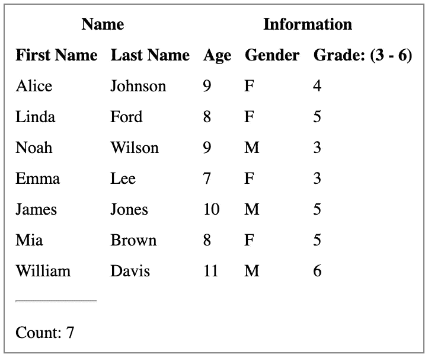

下面是修改后的`src/App.js`:

在第 21 行，插件`useGlobalFilter`被提供。

第 17 到 19 行设置了初始的`globalFilter`。它是一个字符串或一个函数。

`useGlobalFilter`可与`useFilters`配合使用。这两个挂钩的顺序取决于性能特征。

# 分页表

`[usePagination](https://react-table.tanstack.com/docs/api/usePagination)`是实现行分页的钩子，将大量数据拆分成页面，一次显示一页。

对于我们的十行表格，如果我们将页面大小设为三行，下面的用户界面将显示第二页。这里，总数仍然是十。我们可以添加按钮来显示上一页和下一页。

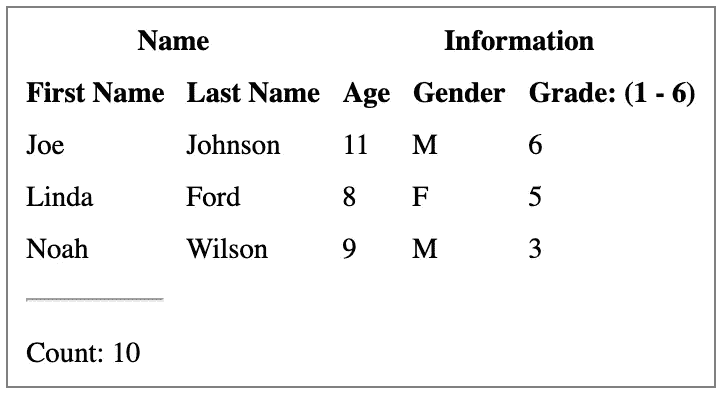

下面是修改后的`src/App.js`:

在第 22 行，插件`usePagination`被提供。

第 17 到 20 行设置了初始分页参数。页面索引是从 0 开始的，因此第二页索引是 1。

此处`page`是从第 11 行检索的。它用于通过第 39 行显示可见的行。

# 用服务器数据分页

对于我们已经展示的所有特性——行排序、过滤、搜索和分页——可以设置一个手动标志。这意味着实际数据是从表外获取的。从用户界面上看，似乎 table 正在操作行排序、过滤、搜索、分页和各种操作，但实际上操作是在服务器端执行的。

我们以分页为例，展示如何从外部源获取第二页数据。


我们需要修改`src/dataSource.js`中的`Name`列。第四行从外部`pageCount`获得总计数。

下面是修改后的`src/App.js`:

第 23 行将`manualPagination`设置为真，第 24 行基于外部源提供`pageCount`。

第 29 到 31 行是获取外部数据的模拟。

# 具有行选择的表格

`[useRowSelect](https://react-table.tanstack.com/docs/api/useRowSelect)`是实现行选择的钩子，切换行选择。通常，空框表示未选择行，复选标记表示选择了行。表格通常在标题处有一个指示，显示是否所有行都被选中，如果是，标题会显示一个复选标记。如果未选择每一行，标题将显示一个空复选框。如果选择了一些行，则标题会显示一个表示不确定状态的破折号。因此，我们需要一个复选框来表示三种状态:未选中、选中和不确定。

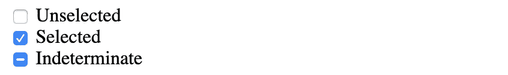

在 HTML 中，`<input type=”checkbox”>`只能设置为选中和未选中状态。但是不确定属性可以用 JavaScript: `checkbox.indeterminate = true`来设置。

我们为 React `IndeterminateCheckbox`组件创建`src/IndeterminateCheckbox.js`。它通过两个道具支持三种状态:`checked`和`indeterminate`。`indeterminate`是通过一个`[forwardRef](https://medium.com/better-programming/most-things-you-want-to-know-about-react-refs-29901ebf28c6)`设置的:

现在，我们准备为我们的表实现行选择:

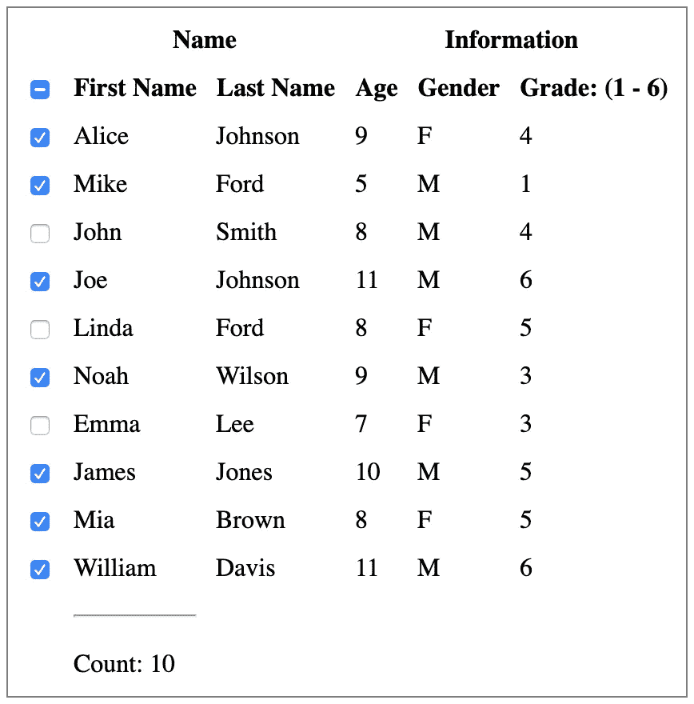

这是`src/dataSource.js`:

这是`src/App.js`:

第 19 行提供了插件`usePagination`。

第 20 到 33 行为表格标题和行设置了`IndeterminateCheckbox`。因为 React 表允许子行，所以行也使用`IndeterminateCheckbox`。

你运行代码，发现它不工作。发生了什么事？

目前，`[useRowSelect](https://github.com/tannerlinsley/react-table/issues/2120)` [不支持](https://github.com/tannerlinsley/react-table/issues/2120) `[React.StrictMode](https://github.com/tannerlinsley/react-table/issues/2120)`。您需要从`src/index.js`中删除严格模式:

# 无限滚动的表格

无限滚动显示滚动条，而不是分页表。用户可以向下滚动，直到到达末尾。这不完全是无限滚动，但`[useBlockLayout](https://react-table.tanstack.com/docs/api/useBlockLayout)`可以用来实现类似的东西。它将标题和单元格显示为`inline-block` `div`秒。列宽是固定的，默认值为 150 像素。

虽然只有十行，但是一个固定高度的表格可以上下滚动。

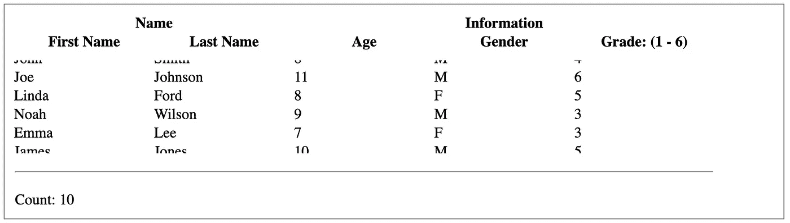

`src/dataSource.js`没有变化。

以下是修改后的`src/App.js`:

在第 14 行，检索`totalColumnsWidth`以通过第 63 行设置主体宽度。

在第 20 行，插件`useBlockLayout`被提供。

第 23 到 45 行是行的呈现函数。

从下面的 Inspect 窗口中，我们可以看到每一行和每一个单元格的样式。每个行定义都是 HTML 格式的，不管它是否可见。只呈现部分行的无限滚动并不真实。

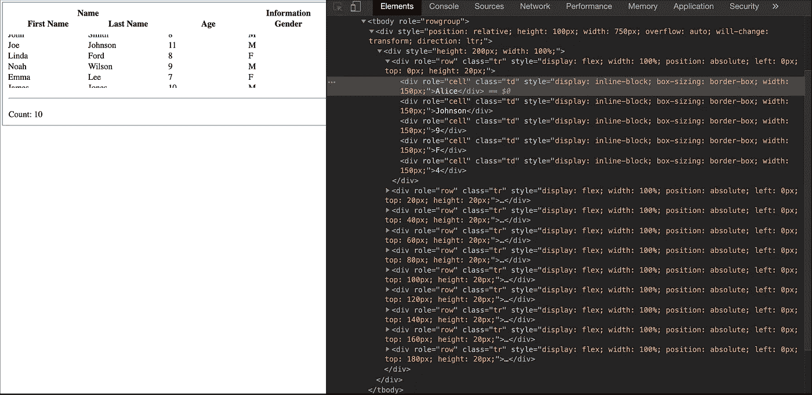

第 59 到 66 行显示了在`[react-window](https://github.com/bvaughn/react-window)`中定义的`FixedSizedList`。它将高度设置为 100 像素，每行的高度设置为 20 像素。因此，有五个可见的行。

# 结论

React Table 提供了很多插件，可以组合使用。为了简单起见，我们的每个例子只使用一个插件。这些例子比 React Table 提供的例子简单，因为我们的目的是演示每个插件是如何工作的。

为了让事情变得更有趣，你还可以在[蚂蚁设计系统](/understanding-the-ant-design-system-a-ui-design-for-enterprises-39afdb188b06)中查看[蚂蚁表](/an-introduction-to-ant-tables-for-javascript-developers-c420754c9fe7)。

感谢阅读。我希望这有所帮助。你可以在这里看到我的其他媒体出版物。