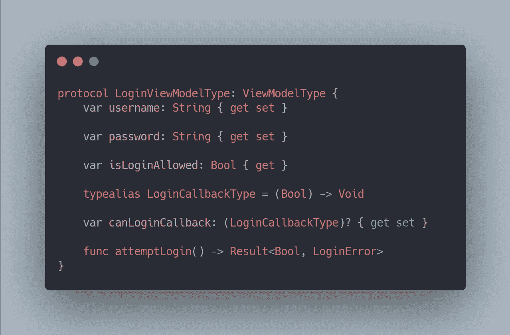
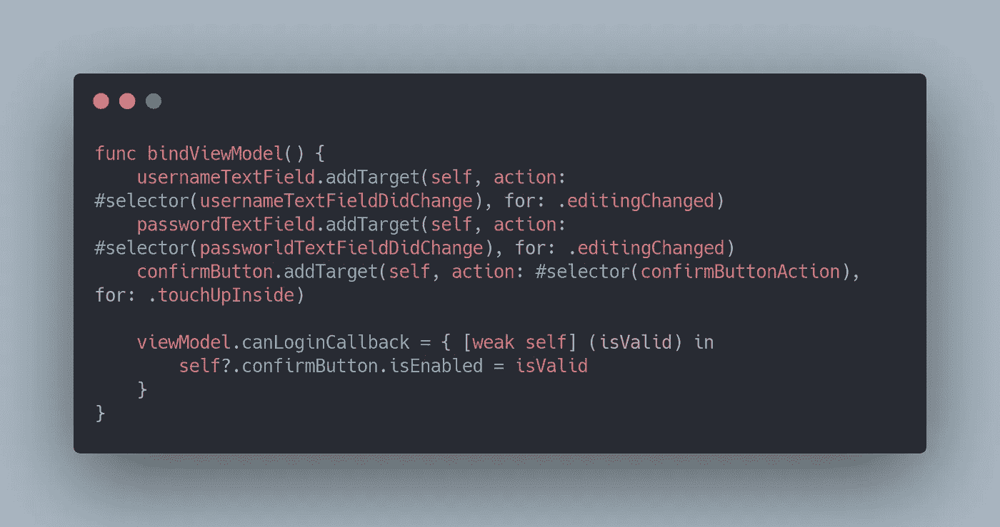
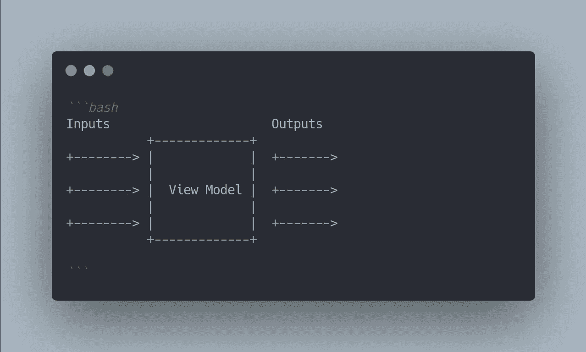
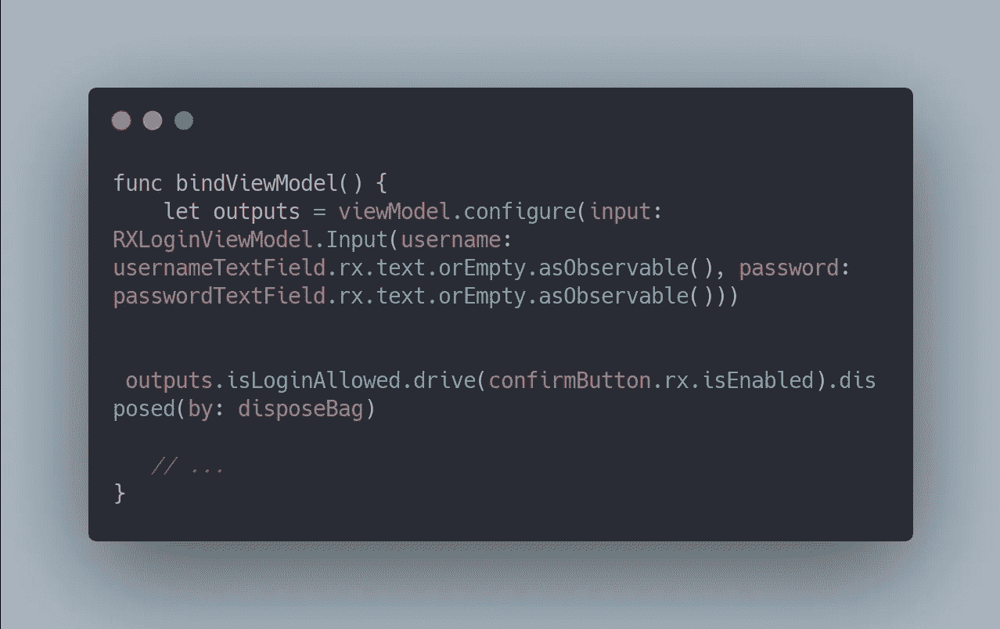

# RxSwift + MVVM 简介

> 原文：<https://betterprogramming.pub/an-introduction-to-rxswift-mvvm-3a2868d3b2c5>

## 在你的 iOS 应用中应用 *RxSwift-* 增强版 *MVVM*

由[乔尔·罗兰](https://unsplash.com/@joel_rohland)在 [Unsplash](https://unsplash.com/s/photos/practical?utm_source=unsplash&utm_medium=referral&utm_content=creditCopyText) 上拍摄的照片。

作为对反应式编程感兴趣的人，本文的目的是向您介绍 [RxSwift 框架](https://github.com/ReactiveX/RxSwift)，并让您以最快的方式应用它。

我在互联网上发现了许多关于 RxSwift 的不同而精彩的文章。然而，我发现有几本书要么太理论化，要么方法太先进，甚至有点过时。与命令式编程风格相比，反应式编程有一个相对陡峭的学习曲线。这就是为什么我将省去任何大理石图和深奥的理论，并尽快开始应用 RxSwift 框架。

我希望这篇文章能为你提供一些指导，让你选择自己想进一步探索的道路。

我们将涉及的主题:

*   *MVVM*版本
*   RxSwift 增强版 MVVM 版和 RxSwift 基础版
*   RxSwift 最佳实践
*   直流

# 概观

作为本文的一部分，我们将为我们的公司创建两个不同的登录。不要太花哨。有两个输入字段和一个登录密码。在我们有一些输入之后，登录按钮被激活。

第一种方法将遵循“经典的”MVVM 方法。第二个登录屏幕将建立在第一种方法的基础上，并使用被动方法。

GitHub 上提供了完整的项目代码:

 [## kmpnz/PracticalRxSwift

### 实用 RxSwift 简介。通过在 GitHub 上创建帐户，为 kmpnz/PracticalRxSwift 开发做出贡献。

github.com](https://github.com/kmpnz/PracticalRxSwift) 

# MVVM 版本

MVVM 是模型-视图-视图模型软件架构模式的缩写。它促进了 UI 和业务/后端逻辑的分离。MVVM 版本的代码严重依赖回调闭包。该协议给出了一个很好的概述:

[LoginViewModel 协议](https://carbon.now.sh/?bg=rgba%28171%2C+184%2C+195%2C+1%29&t=one-dark&wt=none&l=auto&ds=true&dsyoff=20px&dsblur=68px&wc=true&wa=true&pv=56px&ph=56px&ln=false&fl=1&fm=Hack&fs=14px&lh=133%25&si=false&es=2x&wm=false&code=protocol%2520LoginViewModelType%253A%2520ViewModelType%2520%257B%250A%2520%2520%2520%2520var%2520username%253A%2520String%2520%257B%2520get%2520set%2520%257D%250A%250A%2520%2520%2520%2520var%2520password%253A%2520String%2520%257B%2520get%2520set%2520%257D%250A%250A%2520%2520%2520%2520var%2520isLoginAllowed%253A%2520Bool%2520%257B%2520get%2520%257D%250A%250A%2520%2520%2520%2520typealias%2520LoginCallbackType%2520%253D%2520%28Bool%29%2520-%253E%2520Void%250A%250A%2520%2520%2520%2520var%2520canLoginCallback%253A%2520%28LoginCallbackType%29%253F%2520%257B%2520get%2520set%2520%257D%250A%250A%2520%2520%2520%2520func%2520attemptLogin%28%29%2520-%253E%2520Result%253CBool%252C%2520LoginError%253E%250A%257D)

在纯 MVVM 方法中，我们覆盖用户名和密码属性的' T0 '方法。这些属性的每次更新都会更新内部登录的允许状态，并且这个状态会被传递到`canLoginCallback`回调中。`LoginViewController`声明自己是回调的处理程序，并更新登录按钮的状态。

[在 LoginViewController 中查看绑定方法](https://carbon.now.sh/?bg=rgba%28171%2C+184%2C+195%2C+1%29&t=one-dark&wt=none&l=auto&ds=true&dsyoff=20px&dsblur=68px&wc=true&wa=true&pv=56px&ph=56px&ln=false&fl=1&fm=Hack&fs=14px&lh=133%25&si=false&es=2x&wm=false&code=func%2520bindViewModel%28%29%2520%257B%250A%2520%2520%2520%2520usernameTextField.addTarget%28self%252C%2520action%253A%2520%2523selector%28usernameTextFieldDidChange%29%252C%2520for%253A%2520.editingChanged%29%250A%2520%2520%2520%2520passwordTextField.addTarget%28self%252C%2520action%253A%2520%2523selector%28passworldTextFieldDidChange%29%252C%2520for%253A%2520.editingChanged%29%250A%2520%2520%2520%2520confirmButton.addTarget%28self%252C%2520action%253A%2520%2523selector%28confirmButtonAction%29%252C%2520for%253A%2520.touchUpInside%29%250A%250A%2520%2520%2520%2520viewModel.canLoginCallback%2520%253D%2520%257B%2520%255Bweak%2520self%255D%2520%28isValid%29%2520in%250A%2520%2520%2520%2520%2520%2520%2520%2520self%253F.confirmButton.isEnabled%2520%253D%2520isValid%250A%2520%2520%2520%2520%257D%250A%257D)

让我们看看 RxSwift 版本将如何处理这个问题。但首先，让我们快速进入 RxSwift 理论。我们会尽量简短。

# (非常)简短的 RxSwift 介绍

## 可观察量

`Observable`是反应式编程的核心。`Observable`代表一个序列——一系列事件。

## 观察者

一个`Observer`可以订阅`Observable`序列，以便在新事件到来时接收任何更新。每个序列要么正常完成，要么被某个错误事件终止。最重要的一点是它可以异步接收数据。

## 特征

Rx trait 是一个带有附加功能的包装`Observable`，帮助我们更快地做事。它们种类繁多，你可以在[官方特征文档](https://github.com/ReactiveX/RxSwift/blob/main/Documentation/Traits.md)中找到大量关于它们的作用和区别的文档。

对于本文，我们将只使用`Driver`特征。`Driver`是`RxCocoa`模块的一部分，正如文档所述:

> "它的目的是提供一种直观的方式在 UI 层编写反应式代码."

主要优点是它不会出错，并且观察发生在主调度程序上。

RxSwift 是一个引人注目、势不可挡的框架。当你手里拿着锤子的时候，所有的东西看起来都像钉子。我的建议是从小处着手。对于大多数情况来说,`Driver`特质和`Observable`已经足够了，尤其是如果你刚刚开始。这是我从伊恩·基恩的文章中借用的一个想法。它首先定义了一套好的规则。

# rx-增强型 MVVM 版本

纯 MVVM 和 Rx 增强版的主要区别在于绑定处理。我们移除了闭包，用 RxSwift 绑定替换了它们。如前所述，可观测量和观察序列是反应式编程的主要思想。这就是框架的闪光点。例如，与闭包方法相比，反应式`RXLoginViewModel`可以减少到以前的一半大小(大约 20 行 vs . Swift 代码的大约 40 行)。

`Driver`和`Observable`足以涵盖我们需要的功能。

您可能想知道这些`Input`和`Output`结构是什么。这是我从这个 [Kickstarter 项目](https://github.com/kickstarter/ios-oss)借鉴来的一个想法。在 GitHub 上有更详细的解释[。作为结构状态的名称，这两个结构定义了该视图模型的预期输入和预期输出。传入的内容由`Input`结构决定，并用`Observable`类型表示。`Output`结构定义了输出的内容。注意`Output`只使用`Driver`类型。特性让我们在主线程上安全地观察它。](https://github.com/kickstarter/native-docs/blob/master/vm-structure.md)

[单向输入输出流](https://carbon.now.sh/?bg=rgba%28171%2C+184%2C+195%2C+1%29&t=one-dark&wt=none&l=markdown&ds=true&dsyoff=20px&dsblur=68px&wc=true&wa=false&pv=56px&ph=56px&ln=false&fl=1&fm=Hack&fs=14px&lh=133%25&si=false&es=2x&wm=false&code=%2560%2560%2560bash%250AInputs%2520%2520%2520%2520%2520%2520%2520%2520%2520%2520%2520%2520%2520%2520%2520%2520%2520%2520%2520%2520%2520%2520Outputs%250A%2520%2520%2520%2520%2520%2520%2520%2520%2520%2520%2520%252B-------------%252B%250A%252B--------%253E%2520%257C%2520%2520%2520%2520%2520%2520%2520%2520%2520%2520%2520%2520%2520%257C%2520%2520%252B-------%253E%250A%2520%2520%2520%2520%2520%2520%2520%2520%2520%2520%2520%257C%2520%2520%2520%2520%2520%2520%2520%2520%2520%2520%2520%2520%2520%257C%250A%252B--------%253E%2520%257C%2520%2520View%2520Model%2520%257C%2520%2520%252B-------%253E%250A%2520%2520%2520%2520%2520%2520%2520%2520%2520%2520%2520%257C%2520%2520%2520%2520%2520%2520%2520%2520%2520%2520%2520%2520%2520%257C%250A%252B--------%253E%2520%257C%2520%2520%2520%2520%2520%2520%2520%2520%2520%2520%2520%2520%2520%257C%2520%2520%252B-------%253E%250A%2520%2520%2520%2520%2520%2520%2520%2520%2520%2520%2520%252B-------------%252B%250A%250A%2560%2560%2560)

清晰的单向流提供了更多的清晰度，建立了更好的结构，并使命名更容易。在我们的示例中，我们有两个文本字段作为输入，一个布尔标志(启用或禁用登录按钮)作为输出。`configure`函数处理这里的逻辑，并返回具有所有`Driver`特征的输出结构。视图控制器驱动按钮启用状态。

[Rx-增强型 bindViewModel](https://carbon.now.sh/?bg=rgba%28171%2C+184%2C+195%2C+1%29&t=one-dark&wt=none&l=swift&ds=true&dsyoff=20px&dsblur=68px&wc=true&wa=false&pv=56px&ph=56px&ln=false&fl=1&fm=Hack&fs=14px&lh=133%25&si=false&es=2x&wm=false&code=func%2520bindViewModel%28%29%2520%257B%250A%2520%2520%2520%2520let%2520outputs%2520%253D%2520viewModel.configure%28input%253A%2520RXLoginViewModel.Input%28username%253A%2520usernameTextField.rx.text.orEmpty.asObservable%28%29%252C%2520password%253A%2520passwordTextField.rx.text.orEmpty.asObservable%28%29%29%29%250A%250A%2520%2520%2520%2520outputs.isLoginAllowed.drive%28confirmButton.rx.isEnabled%29.disposed%28by%253A%2520disposeBag%29%250A%2520%2520%250A%2520%2520%2520%252F%252F%2520...%250A%257D)

请注意，`RXLoginViewModel`没有从视图控制器中初始化。视图控制器在初始化阶段接收视图模型。我读过许多文章，它们举例说明了相反的方法，让视图控制器初始化视图模型。在我看来，这种方法增加了测试视图模型的难度。

相反，我们反转控件并向控制器提供视图模型。这种模式通常被称为依赖注入。它简化了测试并松散地耦合了对象。

# 资源

*   本文代码:[https://github.com/kmpnz/PracticalRxSwift](https://github.com/kmpnz/PracticalRxSwift)
*   [幸存的 RxSwift](https://medium.com/better-programming/surviving-rxswift-d6bfe562fb22) 文章作者[伊恩·基恩](https://medium.com/u/5dd26134f1db?source=post_page-----3a2868d3b2c5--------------------------------)
*   Dimitris Kalaitzidis 对 [RxSwift 主题](https://medium.com/@dimitriskalaitzidis/rxswift-subjects-a2c9ff32a185)的深入探究
*   Kickstarter 的[视图模型结构指南](https://github.com/kickstarter/native-docs/blob/master/vm-structure.md)