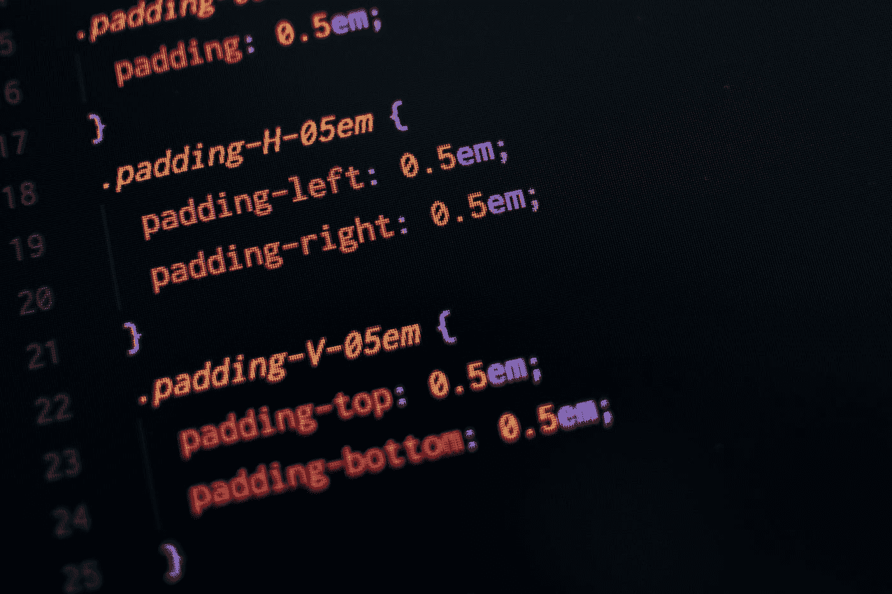
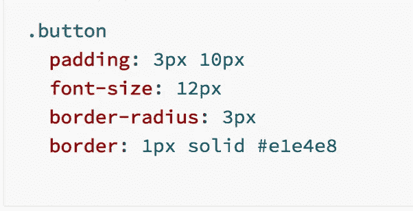
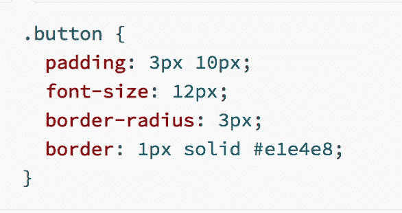
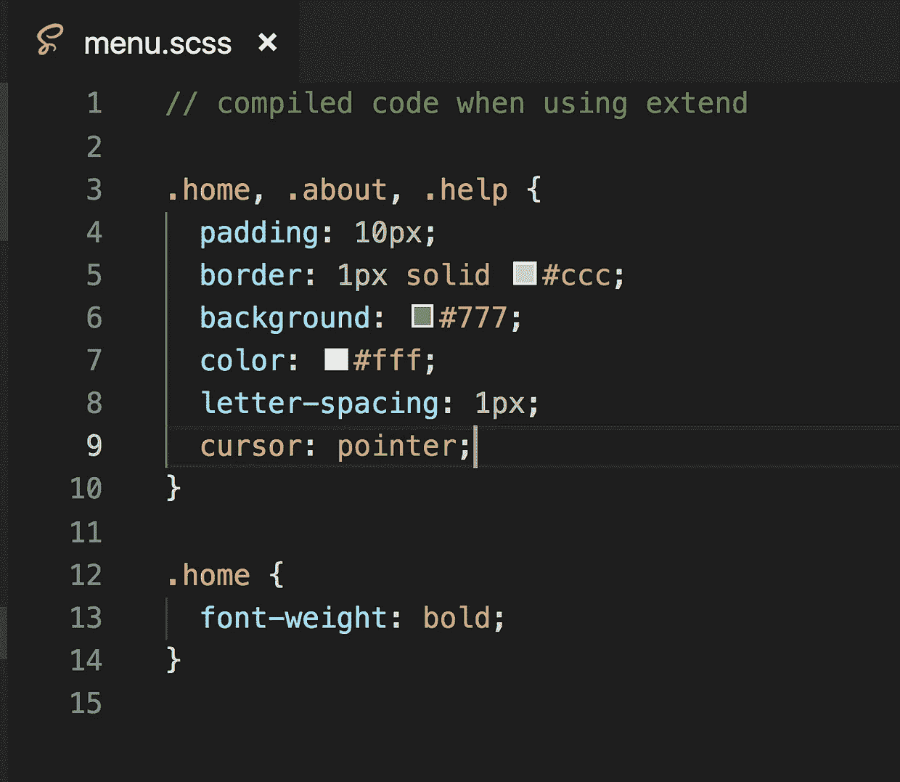
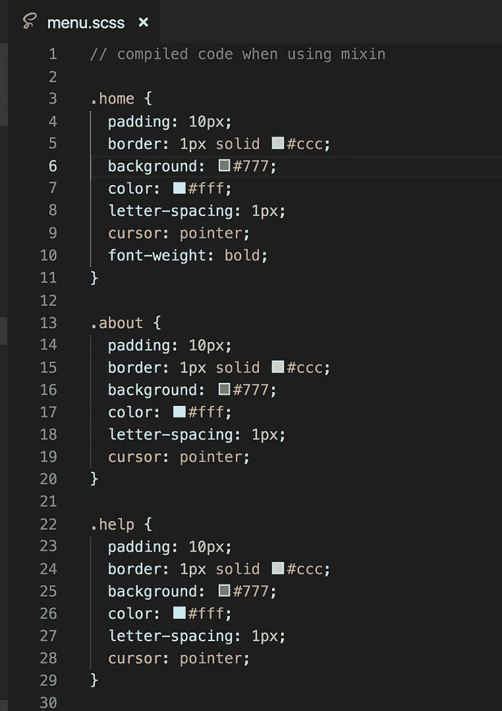
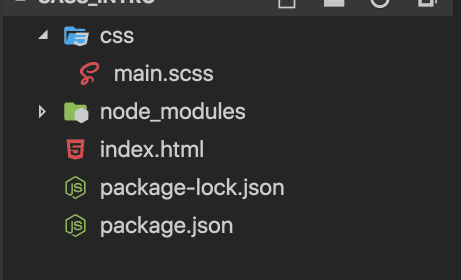
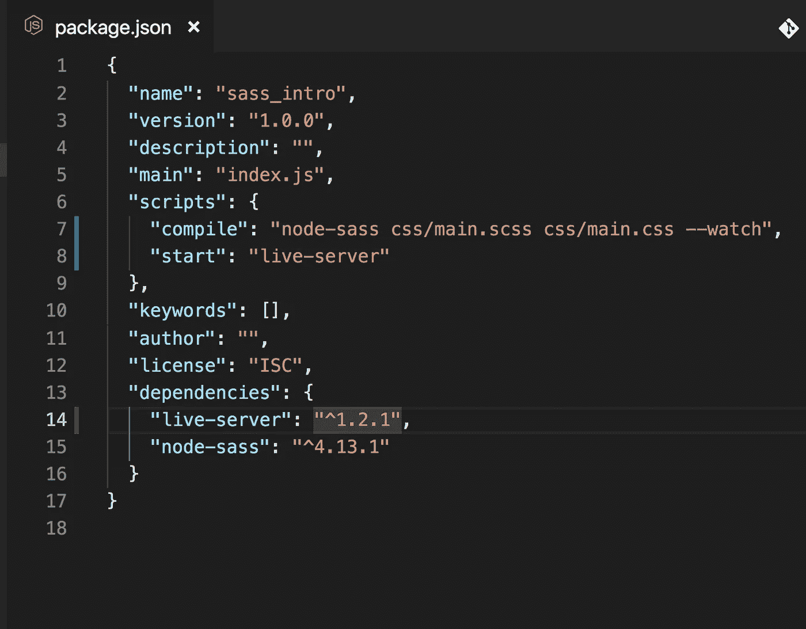

# 萨斯和 SCSS 简介

> 原文：<https://betterprogramming.pub/an-introduction-to-sass-scss-fdbda159b40>

## 只需几分钟就能学会 Sass 的基本知识



照片由[潘卡杰·帕特尔](https://unsplash.com/@pankajpatel?utm_source=medium&utm_medium=referral)在 [Unsplash](https://unsplash.com?utm_source=medium&utm_medium=referral) 上拍摄

在当今快速发展的世界中，知道 [Sass](https://sass-lang.com/) 是 web 开发的一个重要部分。如今，几乎所有大型项目都使用某种预处理器，如 Sass、 [Less、](http://lesscss.org/)、 [Stylus](https://stylus-lang.com/) 等。

Sass 是最流行和最容易使用的。如果你学会了 Sass，那么学习其他预处理程序就非常容易了。

# 什么是萨斯？

它代表*语法上令人敬畏的样式表。*是一个 CSS 预处理器。

它允许我们创建变量、嵌套规则、混合、函数和进行数学计算，允许我们今天编写下一代 CSS。它允许我们轻松地管理大型 CSS 文件，并将它们拆分到不同的文件中。

每个 CSS 文件都是一个 Sass 文件。所以你可以把你的。css 文件内容，并把它放在一个 Sass 文件，它会工作得很好。

在 Sass 中编写 CSS 时有两种类型的语法。

1.  SASS:扩展名为`.sass`的文件允许我们编写没有分号的 CSS，也没有为 CSS 属性添加缩进的花括号。



sass 语法

2.SCSS:扩展名为`.scss`的文件是我们通常编写的 CSS，其中每个 CSS 声明都以分号结束，每个选择器都写在花括号中。



scss 语法

至于使用哪种语法，由您自己决定。我们将使用 SCSS 语法。

Sass 的伟大之处在于，我们在一个`.scss`文件中编写代码，然后使用一个工具将它转换成 CSS 文件，我们将在本文后面探讨这个工具。所以，最终，浏览器将只呈现 CSS 文件。

让我们了解一下 Sass 提供了什么。

## **变量**

Sass 允许我们声明变量。这是 Sass 大放异彩的领域之一，因为我们可以为不同的颜色或字体大小创建变量，并在任何文件中使用该变量。

所以，如果我们以后想改变页面任何部分的颜色，我们不需要在所有使用颜色的地方都做改变。我们只需改变变量中的颜色，这种改变将会反映在所有使用该颜色的地方。

为了在 Sass 中声明一个变量，我们以美元符号开始变量名。

```
$background-color: #ff0000;
$sm-font-size: 16px;
$lg-font-size: 20px;
```

## **评论**

Sass 提供了两种编写注释的方式。

1.  单行评论:双斜线`//`。
2.  多行评论:`/* */`。

注意:单行注释不会被添加到最终编译的 CSS 文件中。只有多行注释会被添加到最终的 CSS 中。因此，如果您需要查看 CSS 文件中的注释，您需要使用`/* */`语法编写它

## **套料**

如果你有如下的 CSS:

我们可以像这样使用嵌套来编写它:

因此，如上面的 CSS 所示，嵌套允许我们将相关的代码组合在一起，这很容易修改和维护，也使我们不必键入额外的字符。

## **父选择器**

父选择器是一种特殊的选择器，在嵌套选择器中用来引用外部选择器。

如果我们有以下 CSS:

然后，使用父选择器，我们可以像这样重写它:

所以，`&`会引用父节点，也就是`a` (锚标签)，在这种情况下。

使用父选择器可以节省一些额外的输入。

## **延长**

如果我们有一些已经定义的 CSS，我们需要应用另一个 div 或元素，我们可以使用`@extend`选择器来包含先前定义的 CSS，而无需再次重写相同的 CSS。

## **占位符**

一个`placeholder`是一种特殊类型的语法，只有当它被扩展时才打印出来，它可以帮助你保持编译后的 CSS 整洁。

在上面关于 extend 的演示中，如果你点击 CSS 部分的向下箭头并选择`“View Compiled CSS”`选项，你将能够看到最终编译的 CSS。


编译后的 CSS 将如下所示:

正如你在编译的 CSS 中看到的，有一个`.menu-button`选择器，但是我们没有在任何 HTML 代码中使用过这个选择器，我们只是在一个 SCSS 文件中使用了它，所以我们可以扩展它的属性。

实际上没有必要在最终的 CSS 中添加`.menu-button`类，因为它是多余的。因此，使用由百分号`%`表示的`placeholder`语法，我们可以从最终的 CSS 中删除多余的代码。

正如您在这个演示中看到的，我们已经使用`%menu-button`声明了`menu-button`选择器。因此，最终的 CSS 将没有多余的 CSS 选择器，您可以通过查看编译后的 CSS 来确认。

编译后的 CSS 将如下所示:

## **米辛**

除了`@mixin`选择器可以接受参数外，`@mixin`选择器与`@extend`相似。

CSS 中的一些东西写起来有点乏味，尤其是对于 CSS3 和存在的许多供应商前缀。

mixin 允许您创建 CSS 声明组，以便在整个站点中重用。您甚至可以传入值，使您的 mixin 更加灵活。mixin 的一个很好的用途是作为供应商前缀。

我们使用`@mixin`声明一个 mixin，并使用`@include`使用它。

正如您在本演示中看到的，我们有两个 div。对于第一个 div，我们在使用 include 时没有向`bradius` mixin 传递任何值，所以它被设置为默认的 5px border-radius。

然而，第二个 div 有我们显式传递的 10px 边界半径。

**关于`extend`和`mixin`之间的区别，需要注意的一个关键点**是我们可以声明一个 mixin 而不接受任何参数，但是使用 mixin 生成的最终 CSS 代码会使文件比 extend 更大。

让我们通过一个例子来看看这一点。

我们将编写上述占位符的演示，从[这个代码笔](https://codepen.io/myogeshchavan97/pen/ExjdMmy?editors=1100)使用一个 mixin。

如果您通过点击下拉菜单中的“查看编译的 CSS”来查看编译的 CSS，您将会看到不同之处。与 *mixin* 相比，使用 *extend* 时的最终 CSS 代码更少。



因此，如果我们使用 mixin，相同的 CSS 会在每个类中重复，这会使 CSS 文件变得更大。

因此，只有当 mixin 采用不同的参数值，并且要在很多地方包含该 mixin 时，才需要使用它。

如果 mixin 只在 SCSS 文件中的一个地方使用，并且没有使用任何参数，那么最好使用 extend，这会减小最终 CSS 文件的大小。

## **分音**

偏音在 Sass 中起着重要的作用。Partials 允许我们创建单独的`.scss`文件并导入到另一个文件中，这使得维护相关的 CSS 代码变得容易。

要将一个文件声明为部分文件，我们需要以符号`underscore`开始文件名，并使用`@import`语法将它添加到另一个文件中，而不提及下划线和文件扩展名。

例如，我们可以创建`_buttons.scss`、`_base.scss`、`_variables.scss`，并将它们全部包含在主 SCSS 文件中。

为了从 buttons 文件夹中导入`_buttons.scss`，我们使用`@import 'buttons/buttons';`。

为了导入`_base.scss`，我们使用`@import 'base';`。

通常的做法是创建一个 SCSS 文件来导入所有其他部分文件。

```
// main.scss@import 'variables';
@import 'base';
@import 'buttons';
```

这里进口的顺序很重要。如果`_buttons.scss`正在使用`_variables.scss`中声明的一些变量，那么需要在`_buttons.scss`之前导入，如上图`main.scss`所示。

Sass' `@import`和普通`css import`语句的区别在于，Sass' `@import`不会为每个导入的 SCSS 文件发出额外的 HTTP 请求。相反，它会将部分文件的内容添加到单个文件中。

## **操作符和功能**

Sass 提供了对数学运算符的支持，比如`+`、`-`、`*`、`/`和`%`，我们可以在我们的 SCSS 代码中使用这些运算符。它还提供了一个`calc`函数，我们可以用它来计算任何值。

```
button { 
  width: calc(200px / 2) 
}
```

这将使按钮宽度为 100px。

还有一个由 Sass 提供的广泛使用的`lighten`函数，它允许我们按一定的百分比制作任何颜色的光。例如，当鼠标悬停在任何按钮或链接上时。

Sass 还有一个`darken`功能，让颜色变暗而不是变亮。

函数使 Sass 更加强大。如果我们想构建一个菜单，我们可以使用 Sass 变量和函数轻松构建。

因此，如果将来我们需要添加任何其他菜单，我们只需增加`$tabs-count`值，每个菜单的宽度就会自动调整。

# 为地方发展建立 Sass

创建一个名为`sass_intro`的新文件夹，依次执行以下命令:

```
1\. npm init -y
2\. npm install node-sass@4.13.1 live-server@1.2.1
```

第一个命令将创建一个`package.json`文件，其中将添加`node-sass`和`live-server`依赖项。

安装完成后，创建一个包含`main.scss`的`index.html`和 CSS 文件夹。您的文件夹结构现在将如下所示:



在`package.json`的`scripts`部分添加新脚本。

```
"scripts": {
 "compile": "node-sass css/main.scss css/main.css --watch",
 "start": "live-server"
}
```

该命令将使用`css/main.scss`文件，并将其转换为`main.css`文件，然后保存到`css`文件夹。

现在，您的`package.json`文件将如下所示:



打开`index.html`文件，添加以下内容:

这里我们在`head`标签中包含了`css/main.css`文件。一旦我们运行从`package.json`创建的`compile`脚本，就会创建这个文件。

在 CSS 文件夹中，创建`_base.scss`、`_variables.scss`、`_buttons.scss`和`_content.scss`文件。

打开`_base.scss`并添加以下 CSS:

打开`_buttons.scss`并添加以下 CSS:

打开`_content.scss`并添加以下 CSS:

打开`_variables.scss`并添加以下内容:

```
$main-background-color: #f0c77a;
$content-background-color: #777;
```

打开`main.scss`并添加以下内容:

```
@import 'variables';
@import 'base';
@import 'buttons';
@import 'content';
```

现在从终端或命令提示符运行`compile`和`start`命令。

```
npm run compile
npm run start
```

`compile`命令将在`css`文件夹中创建一个新的`main.css`文件，并持续关注`.scss`文件中的更改，以将其转换为 CSS 文件。

`start`命令会将你的`index.html`加载到浏览器中，如果 HTML 或 CSS 文件中有任何改变，它会自动刷新页面。

*   完成[源代码](https://github.com/myogeshchavan97/sass_intro)。

今天到此为止。我希望你学到了新东西。

> 要将 SASS 集成到 React 应用程序中，请查看我的这篇文章。

不要忘记订阅我的每周简讯，里面有惊人的技巧、窍门和文章，直接在这里的收件箱里。