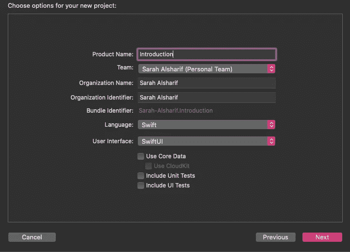
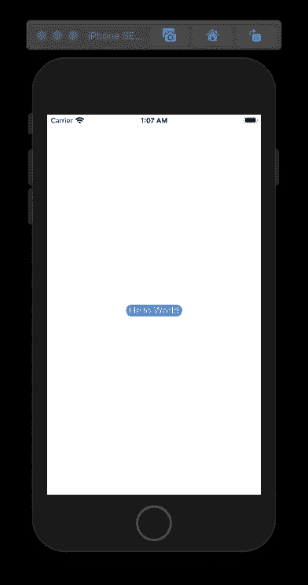
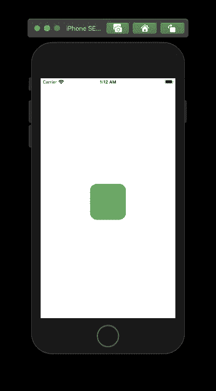
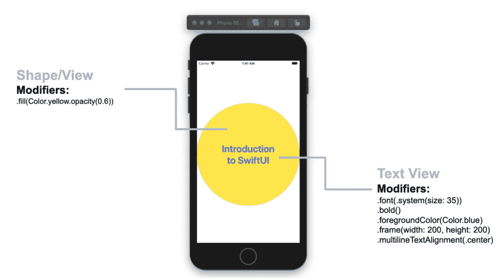

# SwiftUI 简介

> 原文：<https://betterprogramming.pub/an-introduction-to-swiftui-a536589902c7>

## 函数式编程和对象修饰符

[玛丽娜·维塔莱](https://unsplash.com/@marina_mv08?utm_source=medium&utm_medium=referral)在 [Unsplash](https://unsplash.com?utm_source=medium&utm_medium=referral) 上拍摄的照片。

# 函数式编程

SwiftUI 是一种函数式编程语言，它使用 View 协议来创建可重用的 UI 组件。视图是值类型，这意味着不需要为它们定义类。结构是只读的。你不能继承他们。视图是屏幕上的矩形区域，用于绘图和多点触摸。

# 创建 SwiftUI 项目

创建一个新项目，并将您的用户界面更改为 SwiftUI:

当您创建一个使用 SwiftUI 而不是 Storyboard 的新 Xcode 项目时，您会发现创建了一个名为`ContentView.swift`的文件。这个文件包含一个名为`ContentView`的视图:

*   `ContentView`:功能类似视图(行为类似视图)，因为它是一种视图类型。
*   `body`:所有的结构视图都需要`body`变量。
*   `some View`:这意味着任何行为类似于视图的结构。例如，形状和颜色可以表现为视图。
*   `Text`:显示一行或多行只读文本的视图类型。

*   `Color.red`:这是一种颜色类型，其行为类似于视图。

# 修饰语

SwiftUI 有一系列内置的修改器，比如`frame()`、`background()`和`font()`。修改器是可以用来修改视图的功能。您可以创建自己的修改器，但是现在，让我们看看一些内置的修改器:

*   `RoundedRectangle`:具有`cornerRadius`参数的形状。
*   `fill`:用颜色或渐变填充形状的形状修改器。

# 命令

在 SwiftUI 中，修饰符的顺序很重要。例如，如果你想让你的文本有一个圆形的背景，那么你需要在`cornerRadius`修饰符之前使用`background`修饰符:

对于非视图类型的结构，如 Shape，您需要在常规内置视图修饰符之前使用该类型的修饰符。在`fill()`之前不能有`frame()`修饰语。修改器`frame()`将使视图表现得像一个视图。你不能在`frame()`后面加上`fill()`，因为它表现得像一个视图，而不是一个形状:

# 修订本

SwiftUI 简介改版(作者供图)。