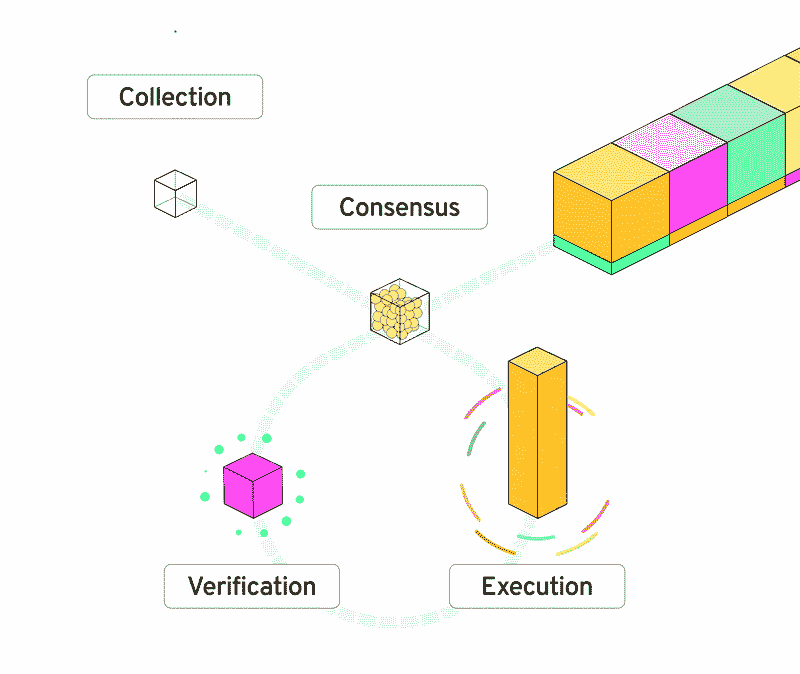

# 流量区块链简介

> 原文：<https://betterprogramming.pub/an-introduction-to-the-flow-blockchain-60ccc7a35598>

## 从以太坊到心流

照片由 [Unsplash](https://unsplash.com?utm_source=medium&utm_medium=referral) 上的 GuerrillaBuzz Crypto PR 拍摄

在 Web3 的快节奏世界中，不缺乏创新的新技术来探索。如果你是一个 Solidity 开发者，希望在比以太坊更快、更安全、更可伸缩的区块链上构建，那么 Flow 是一个你不能忽视的选择。

Flow 是作为速度较慢、不太用户友好的第 1 层区块链的替代方案而从头开始构建的，它拥有自己定制的智能合约语言，是一种针对创建和管理数字资产而优化的语言。

本文将更详细地介绍流区块链，解开它的智能契约语言 Cadence，并研究为什么以太坊开发者应该考虑建立在流之上。

# 什么是流量？

2017 年，加拿大公司 [Dapper Labs](https://www.dapperlabs.com/) 开发的新以太坊收藏品游戏 CryptoKitties 在只有 1 万名用户的情况下导致以太坊网络大规模拥堵，成为头条新闻。Dapper Labs 的开发人员很快意识到以太坊网络并没有被优化来运行和扩展一个成功的游戏，所以他们开始研究替代方案。

Dapper Lab 努力的最终结果是 Flow block chain——一种去中心化的、对开发者友好的区块链，旨在无需[分片](https://ethereum.org/en/upgrades/sharding/)的情况下进行扩展。Flow 针对数字资产(如 NFTs)的创建和管理进行了高度优化。

# 流程的四个主要支柱

流量区块链的基础有四个关键支柱:

*   *多角色架构*
*   *面向资源的编程*
*   *开发人员人体工程学*
*   *消费者入职*

这四大支柱使 Flow 与众不同，并有助于解决其他区块链通常面临的共同挑战。让我们详细看一下这些项目。

## 多角色架构

Flow 的独特设计使用多角色架构，允许网络扩展。这是通过一个 validator 节点来实现的，该节点分为四个不同的角色:收集、一致、执行和验证。简单来说，收集节点批处理，共识节点安全，执行节点完成，验证节点检查工作。每个节点仍然参与验证事务，但是它们各自专注于流程的不同阶段，有效地增加了事务吞吐量。

## 面向资源的编程

Flow 的第二个支柱是面向资源的编程。Cadence 是一种面向资源的编程语言，用于在区块链上开发智能合同。这种优化的智能合同语言使用强大的静态类型系统，有助于最大限度地减少错误。它还允许使用前置和后置条件，因此开发人员可以强制执行预期的行为。我们将在下一节详细介绍 Cadence。

## 开发人员工效学

开发人员工效学是流程的第三个支柱。从一开始，流创建者就专注于支持开发者，让他们的生活更轻松。

*   Cadence 智能合同语言是从头开始构建的，旨在提高创建和管理资产的效率，减少出错的可能性。
*   开源工具——例如 [Flow JavaScript SDK](https://github.com/onflow/flow-js-sdk) 、 [Flow Go SDK](https://github.com/onflow/flow-go-sdk) 和[Flow Playground GUI](https://github.com/onflow/flow-playground)——使得开始使用 Flow 成为一个平稳的过程。
*   可升级的智能合约有助于最大限度地减少代码中的错误，总体上创建一个更安全的生态系统(下文将详细介绍合约不变性)。
*   内置的日志支持为开发人员提供了一种跟踪程序行为的方法。这是许多区块链生态系统无法提供的广受欢迎的功能。

## 消费者入职

为新用户创造消费者友好的入职体验是 Flow 的第四个支柱。人类可读的安全性确保用户在运行交易时做出明智的决策。例如，Flow 的人类可读交易确保了一定程度的透明度，清楚地说明了用户可能授权的权限，而不是签署散列或混淆数字和字母的交易。

心流的账户模型也把用户放在心上。[Flow wallet](https://developers.flow.com/nodes/flow-port)具有内置、可选和模块化的智能合约功能，支持更复杂的授权控制或自动化流程。这些功能通过确保用户不会丢失资产，同时在丢失钥匙的情况下提供帐户恢复选项，从而创造了更好的体验。此外，多签名支持允许用户定期循环使用旧密钥，从而为钱包增加了安全性。

# 什么是 Cadence？

除了更快、更具可扩展性的区块链，Flow 的开发团队还创造了一种新的智能合约语言 Cadence。数字资产是区块链发展的最重要的方面之一，现在终于有了一种优化其创建和管理的语言。

Cadence 的语法从其他现代编程语言如 Swift、Kotlin 和 Rust 中获得灵感。它是第一种高级的、面向资源的编程语言，利用了强大的静态类型系统。这有效地帮助减少运行时错误，并确保预期的行为。

面向资源是什么意思？在 Cadence 中，称为资源的特殊数据类型是基于线性数据类型的，表示流动资产的数字所有权。这些资源，比如 NFTs，直接*存储*在用户的账户上，而不是反映为公共数字账本上的记录，一次只能存在于一个地方。这意味着 Flow 上的数字资产的所有权直接在语言本身中定义，有效地消除了将余额存储在集中的数字账本上所涉及的风险。

此外，Cadence 还通过执行管理可能运营的严格规则来改善资产管理。在显式地移动、存储或销毁资源类型之前，开发人员必须用“@”符号定义资源类型。这种对资产的强制管理消除了由于代码中的错误而丢失或意外删除资产的可能性，并减少了人为错误。

与 Flow 类似，Cadence 也是建立在支柱之上的，这次有五个支柱:

*   安全性— Cadence 使用强大的静态类型系统、基于线性类型的内置所有权原语以及对资产管理的基本关注，来确保代码的预期行为并最大限度地减少黑客的攻击媒介。
*   清晰性 Cadence 的声明性质确保开发人员明确表达他们的意图，使代码更容易阅读、编写和审计。
*   平易近人——Cadence 的语法和语义受到 Swift 和 Rust 等语言的启发，这使它变得熟悉，而全面的文档和高效的工具为开发人员创造了一个平易近人的环境，以便[快速上手](https://github.com/emerald-dao/beginner-cadence-course)。
*   开发者体验——流程生态系统提供了[资源](https://developers.flow.com/),在整个开发生命周期中提供支持。
*   用资源直觉化所有权——资产所有权的概念是通过使用资源而不是中央分类帐内置到 Cadence 语言本身中的。资产直接与账户存储绑定，无需智能合约即可自由转移。

# 为什么开发者要建立在流量之上？

随着 Flow 引入的所有协议改进，它们显然正在开创一个专注于开发人员获取和用户体验的区块链技术的新时代。可用的[工具套件](https://developers.flow.com/tools)支持高效的开发生命周期，同时它们广泛的[架构指南](https://developers.flow.com/flow/dapp-development/DappArchitectures)确保来自以太坊的开发人员，或者一般来说是 Web3 的新手，对 Flow 优化的解决方案类型有一个透彻的理解。

像[流客户端库(FCL) JS](https://developers.flow.com/tools/fcl-js) 和 [Flowser](https://docs.flowser.dev/) 这样的工具使得入门比以前更容易。FCL JS 包使钱包集成变得极其容易，而其强大的 SDK 提供了快速安全地创建 dapps 所需的所有工具。Flowser(流浏览器)是最具创新性的新区块链开发工具之一，它不仅允许您检查流 mainnet、测试网或仿真器的状态，还允许您通过其 GUI 管理定制的仿真器和钱包。

此外，区块链流程[对环境影响](https://flow.com/sustainability)的重视程度不亚于协议的其他方面。正因如此，它可以说是地球上最环保的区块链之一。他们不仅比区块链的每一个工作证明消耗的能源都少，而且比区块链的大多数工作证明消耗的能源都少。这要归功于本文前面提到的共识机制和独特的多角色架构。从能源使用的角度来看，对于执行一次 Google 搜索的能源成本，您可以创建 12 个 Flow NFTs。

因此，让我们通过与 Web3 的最大贡献者以太坊进行比较，来更深入地了解为什么开发人员应该建立在 Flow 之上。

# 流动与以太坊:近距离观察

为了更好地理解心流与以太坊的区别，让我们仔细看看几个重要的方面和区别。

## 交易费用和速度

以太坊是出了名的在网络需求高的时候交易成本极其昂贵。高额费用是网络用来将交易量保持在可管理水平的一种机制。当块空间需求很高时，费用会上升，从而阻碍人们部署。此外，以太坊上的方块每 12 到 14 秒确认一次，在 6 个方块内完成，也就是一分多钟。这导致每秒大约 15 个事务的最大事务吞吐量。为了满足数百万用户的需求，必须做出重大改进。

另一方面,“心流”是在考虑到这些挑战的情况下创建的。上面提到的多角色体系结构使得块终结大约每 2.5 秒发生一次，这导致大约每秒 100 个事务。在 mainnet 上部署和交易的费用也只是以太坊 mainnet 上的一小部分。

## 合同不变性

取决于你如何看待它，以太坊智能合约一旦部署，它的不变性可能是一件好事，也可能是一件坏事。一方面，智能合约部署后无法编辑可以确保一定程度的信任。它确认了你正在交互的代码一旦被激活就不能被更改或改变用途。另一方面，代码很少以完美的形式部署，即使有非常熟练的程序员团队。任何微小的缺陷都可能导致大规模违规，导致重大损失。为了修复有缺陷的智能合约，开发人员必须部署一个全新的合约，并确保他们的用户群使用该合约。

Flow 在他们的智能契约不变性方法中考虑了上述场景。当契约被部署到流区块链时，默认情况下它们是可变的。这意味着，开发人员可以很容易地做出改变，如果任何复杂的活动合同出现。当然，这并不意味着智能合约可以完全跳过测试阶段。在最终部署到 mainnet 之前，开发合同的团队通常会使用软件开发最佳实践来测试和迭代 testnet 中的合同。

在 mainnet 上经过一段时间后，智能合约已经通过了任何最终测试或安全检查，开发人员可以选择撤销持有智能合约的帐户的密钥。这个过程消除了进行任何进一步更改的能力，有效地使智能契约不可变。与以太坊和其他区块链网络相比，智能合约开发人员能够在任何时间对任何合约实施不变性，这是 Flow 的一个明显优势。

# 成长中的生态系统

除了技术优势，Flow 的社区正在快速发展。强大的开发者生态系统、便捷的网络参与和内容合作伙伴都有助于提高知名度，并导致流量交易的稳步增长。2022 年 6 月是 Flow 破纪录的一个月，接近 3400 万笔交易。

大多数人一听到 Flow 区块链就想到 NBA TopShot 然而,《心流》在 DeFi 和游戏领域迅速扩张。根据流量区块链聚合器 [Flowverse](https://www.flowverse.co/) 的数据， [Chainmonsters](https://chainmonsters.com/) 和 [Zeedz](https://www.zeedz.io/) 在游戏领域领先，销量最高。DeFi 项目包括 Blocto 建造的分散交易所 [BloctoSwap](https://swap.blocto.app/) 和 [IncrementFi](https://increment.fi/) 。你可以在这里看看其他一些基于 Flow [构建的项目。](https://www.flowverse.co/projects)

Flow 生态系统还获得了来自 [Flow 生态系统基金](https://flow.com/ecosystemsupport)的 7.25 亿美元，以帮助正在建立 Flow 的开发者。有了额外的构建动机，决定基于 Flow 构建的项目数量将会继续增长。

随着技术优势，越来越受欢迎，以及 Flow 上资金的可用性，对 Flow/Cadence 开发人员的需求从未如此之高。

# 结论

在 CryptoKitties 取得成功之后，Dapper Labs 团队很快意识到以太坊没有能力支持一款大获成功的区块链游戏。他们与以太坊的斗争导致了流区块链和 Cadence 智能合同语言的创建，这两种语言都针对数字资产的创建和管理进行了优化。

以太坊和 Solidity devs 开始构建更快、更安全、更可扩展的区块链，这是前所未有的好时机。如果您有兴趣了解更多关于 Flow 开发或如何使用 Cadence 的信息，您可以访问新的[开发者门户](https://developers.flow.com/)。在那里，您可以找到更多关于如何开始的信息。

祝你今天过得愉快！