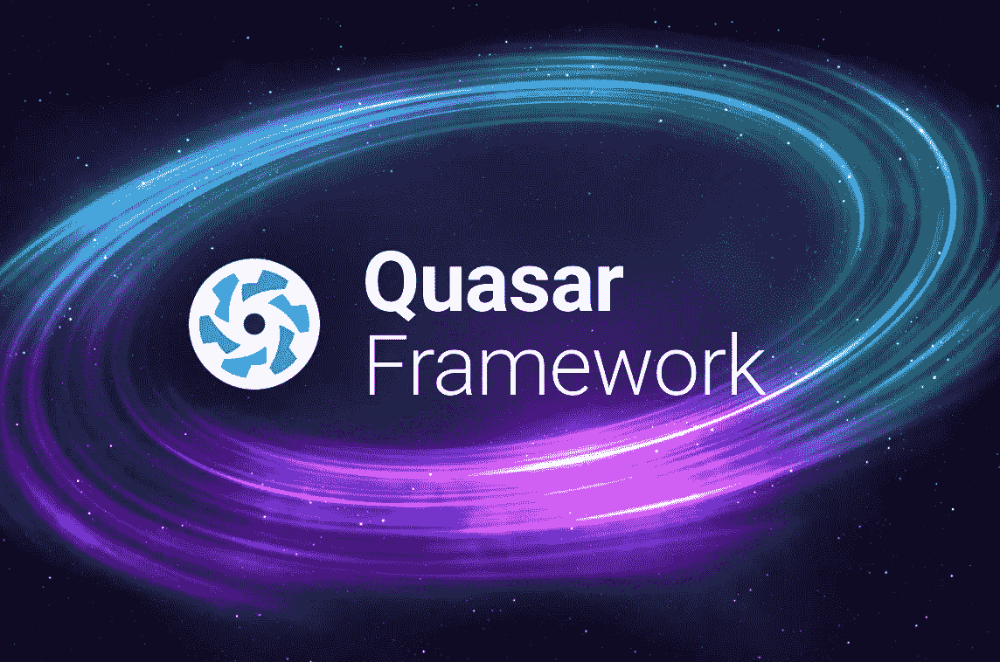
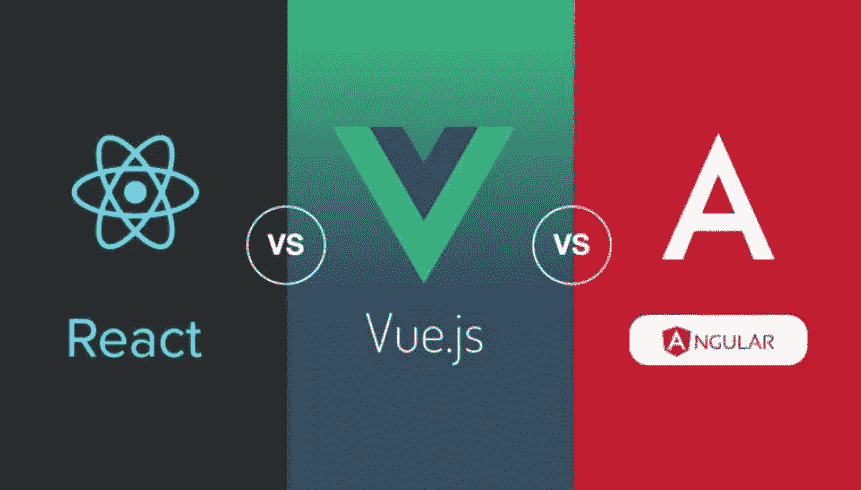
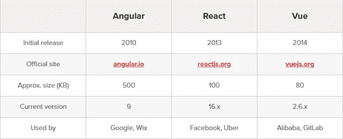
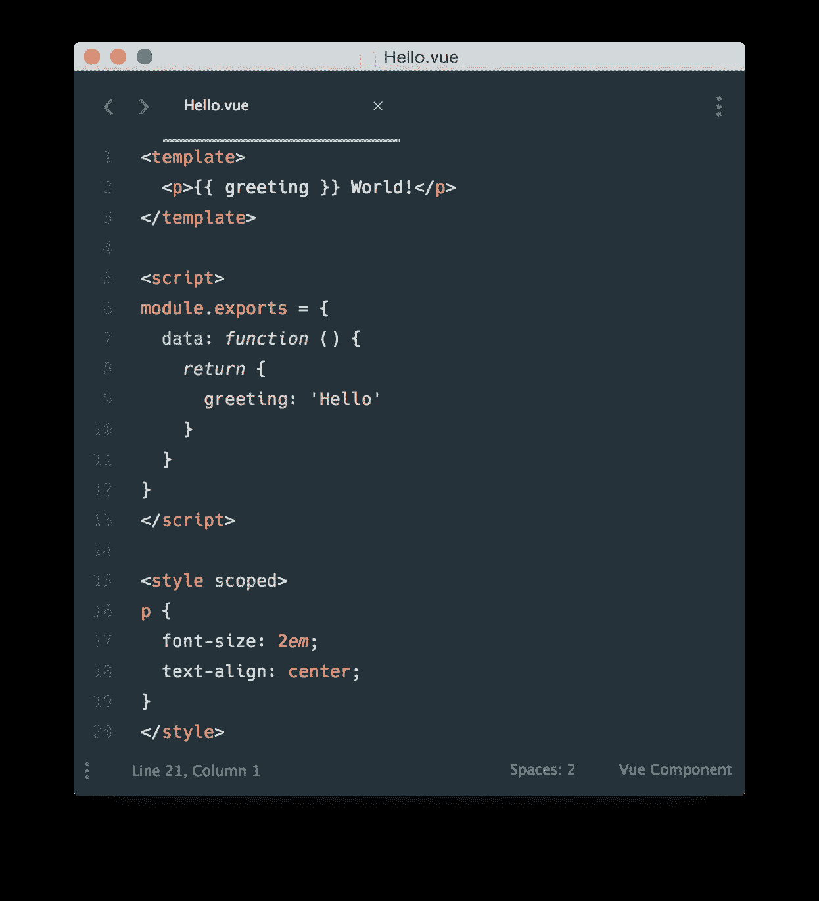
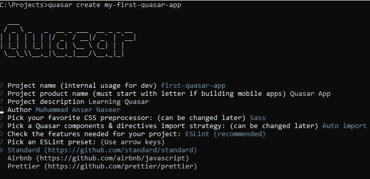
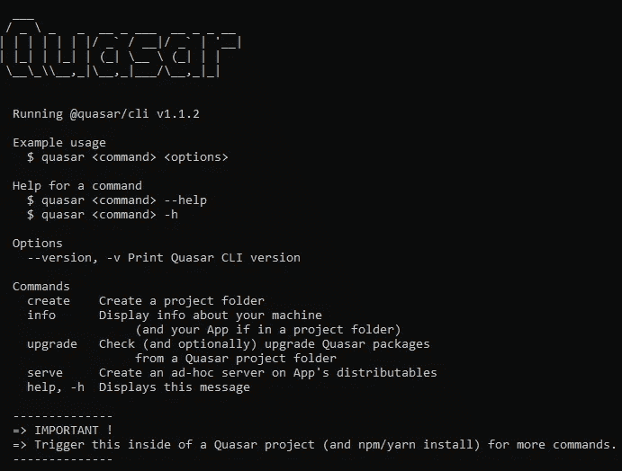
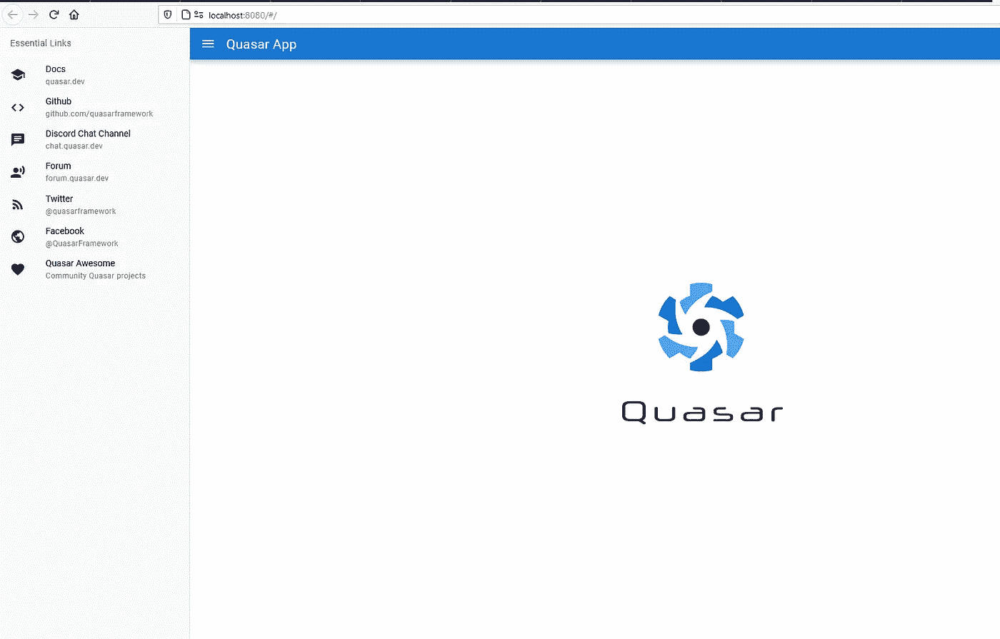
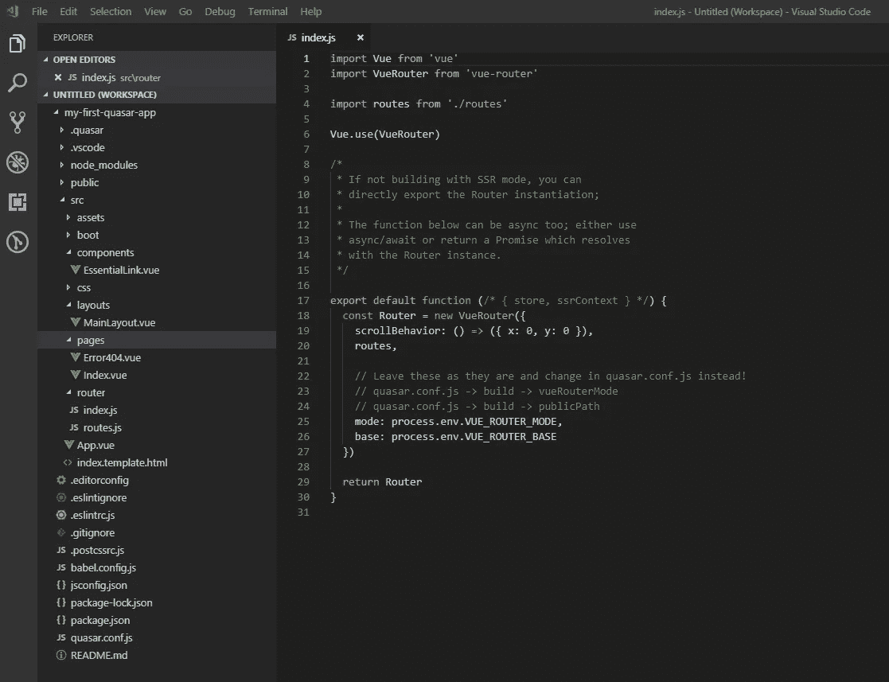
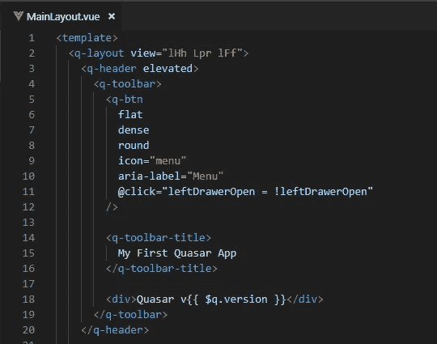
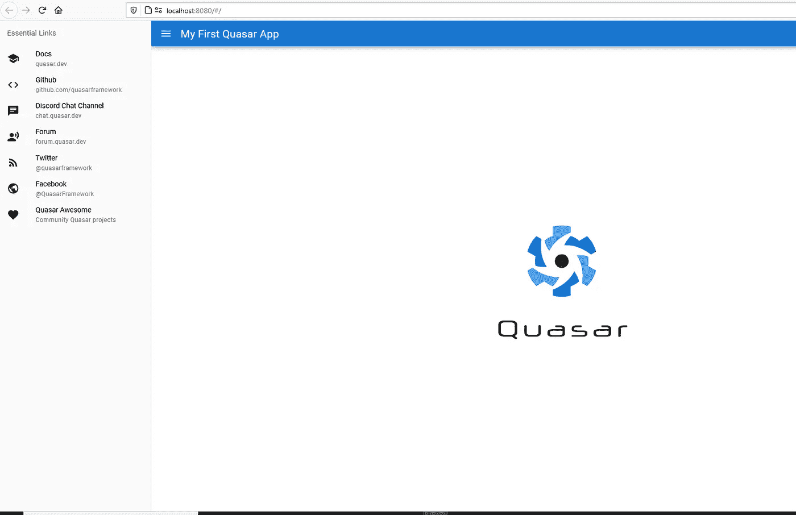

# 类星体框架介绍

> 原文：<https://betterprogramming.pub/an-introduction-to-the-quasar-framework-3fed8bc92f6d>

## 快速构建高性能 Vue.js 接口



如果你是 React 开发者，想从 Vue 开始，那么在继续之前，请先阅读我的[上一篇文章](https://medium.com/better-programming/a-journey-from-react-to-vue-js-cec3ba44c377)。

在本文中，我将尝试向读者介绍一个名为 Quasar 的基于 Vue 的新框架。

Quasar 的[官方文件](https://quasar.dev/)是这样说的:

> “以创纪录的速度构建高性能 VueJS 用户界面。这是可能的，因为你只需要为所有平台编写一个权威的代码来源:响应式桌面/移动网站(SPA，SSR)，PWAs(渐进式网络应用)，移动应用(看起来像原生的)和多平台桌面应用(通过电子)以及浏览器扩展。”

# 类星体框架到底是什么？

*   这是一个基于 Vue 的开源框架。
*   它是所有平台的一个源代码，包括 SPAs(单页应用)、PWAs(渐进式 web 应用)、BEXs(浏览器扩展)、SSRs(服务器端渲染应用)、混合移动应用和多平台桌面应用。
*   Quasar 支持应用程序扩展、RTL、您自己的响应式材料设计组件、多语言支持和 Quasar CLI。
*   在 Quasar 中，几乎每个 web 开发需求都有一个组件。
*   在使用 Quasar 时，您不需要额外的沉重的库，如 [Hammer.js](https://hammerjs.github.io/) 、 [Moment.js](https://momentjs.com/) 或 [Bootstrap](https://getbootstrap.com/) 。它在内部满足了这些需求，而且占用空间很小。

Quasar 的座右铭是“编写一次代码，同时将其部署为网站、移动应用程序和/或电子应用程序。”

# 比较 Vue、Angular 和 React



让我们从他们的历史和地位的快速比较图表开始。



角度对比反应对比 Vue 的历史

*   Vue 是三者中最新的 JavaScript 技术。
*   Vue 和 React 使用虚拟 DOM，Angular 使用真实 DOM。
*   Vue 和 Angular 是 JavaScript 框架，React 是库。
*   Vue 使用单个文件组件(sfc)，不像 React 和 Angular，它们包含模板、脚本和样式。

# 为什么是类星体？

*   它支持多种平台。
*   它有一个响应式的 UI 框架，有许多现成的预建组件。
*   Quasar 的设计考虑了性能和响应能力。
*   它为桌面和移动浏览器(包括 iOS Safari)提供了开箱即用的最佳支持。
*   Quasar 开发人员被鼓励遵循 web 开发最佳实践，Quasar 在这方面提供了许多现成的嵌入式特性:HTML/CSS/JS 缩小、缓存破坏、树抖动、源映射、代码分割和延迟加载。
*   Quasar 对 Quasar 组件和开发者自己的代码都有 RTL(从右到左)支持。如果使用 RTL 语言包，开发人员编写的网站/应用程序 CSS 代码会自动转换为 RTL。
*   开箱即用的 Quasar 语言包有 40 多个。
*   它的文件是详细和全面的。
*   Quasar CLI 处理开发 SPA、PWA、SSR、移动应用程序或电子应用程序中涉及的所有问题。
*   你的全部注意力都在你的应用程序的内容上，而不是围绕它的所有其他样板文件。

# 什么是单文件组件(SFC)结构？



Vue 组件分为三个部分。

## 超文本标记语言

```
<template>
   <div>{{ text }}</div>
</template>
```

## 脚本(JS)

```
<script>
  export default {
    name: 'ComponentName',
    data: (){
      return {
       text: 'Some content...'
      }    
    }
  }
</script>
```

## 样式(CSS)

```
<style lang='css'>
</style>
```

# 建立类星体环境

*   从[官方下载链接](https://nodejs.org/en/download/)下载后安装节点。
*   通过运行以下命令安装 Quasar CLI:

```
npm install -g @quasar/cli
```

该命令将为您进行必要的引导。它会问几个问题，你可以根据项目的需求来设置你自己的优先级。



在终端上运行`Quasar` 可以看到所有可用命令的列表。



成功创建项目后，进入根文件夹并运行:

```
quasar dev
```

您将被重定向到 [http://localhost:8080](http://localhost:8000) ，并看到以下内容:



查看一下文件夹结构，您会看到类似这样的内容:



现在打开`MainLayout.vue`文件，将应用标题重命名为“我的第一个 Quasar 应用”查看更改是否反映在 UI 上。



如果一切顺利，您现在应该可以在 UI 上看到名称的更改:



厉害！这意味着你的第一个 Quasar 应用程序已经启动并运行。浏览官方的[文档](https://quasar.dev/start/pick-quasar-flavour)，用这个令人敬畏的框架来弄脏你的手。

学到了新东西？评论和反馈总能让作者开心。编码快乐！