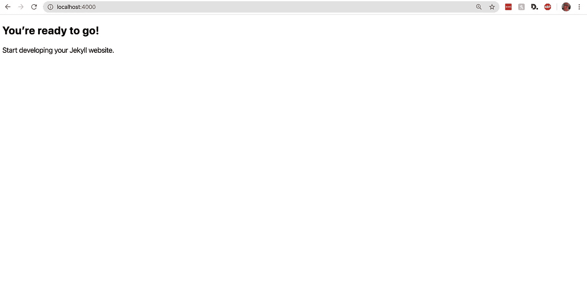
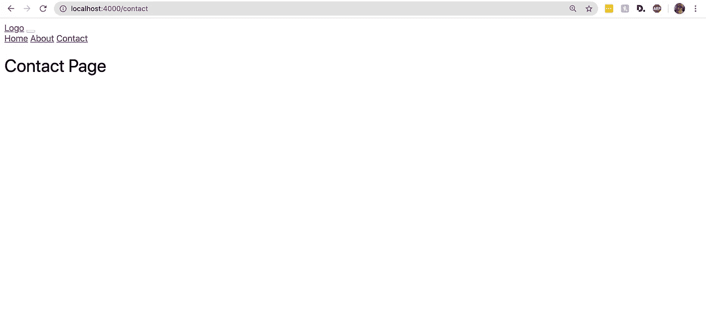
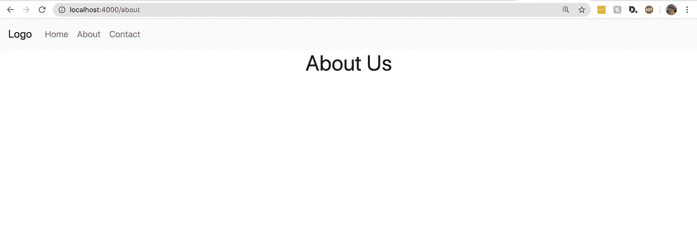
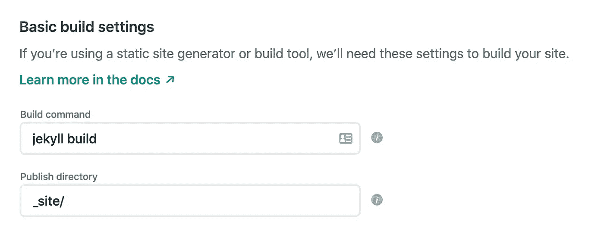

# 在 Bootstrap 4 中使用 Jekyll 的介绍

> 原文：<https://betterprogramming.pub/an-introduction-to-using-jekyll-with-bootstrap-4-6f2433afeda9>

## 了解框架并在几分钟内部署您的站点


由 [Freshh 连线](https://unsplash.com/@freshhconnection?utm_source=medium&utm_medium=referral)在 [Unsplash](https://unsplash.com?utm_source=medium&utm_medium=referral) 上拍照

# 构建一个静态站点看似很难

理论上，它只是将 HTML、CSS 和 JavaScript 放在一个页面上。然而，在实践中，它很快就变得复杂了——在每一页上都有不必要的从`head`复制代码，手动将 SCSS 编译成 CSS，整理成千上万行重复的代码。

然后，如果你或你的客户最终需要一个博客，你可以放弃你的手，仅仅建立一个笨重的 WordPress 站点。

Jekyll 是一个静态站点框架，它简化了所有这些步骤，并允许开发人员专注于开发中最重要的部分——编写有意义的代码。

此外，现在是 2020 年，如果你的新年决心是停止使用 WordPress，现在实现它还不算太晚。

# 为什么用 Jekyll

正如官方文件所说，Jekyll 网站是:

> **“简单、静态、支持博客的**”

你可以在不到一个小时的时间内构建一个站点的基本结构，并在下午部署好站点。

Jekyll 站点非常快——在构建过程结束时，框架输出一个包含静态站点的文件夹，可以通过 shell 访问、FTP 或 cPanel 添加到任何托管提供商。

最重要的是，Jekyll 网站易于更新和维护。构建框架是为了分离设计和数据(类似于现代 JavaScript 框架，但更简单)。因此，更改菜单、更新列表或添加新帖子毫不费力。

# 入门指南

在使用 Jekyll 之前，第一步也是唯一的一步是下载 Ruby。你不需要学习或真正了解语言本身，但框架是使用 Ruby 语言构建的，Jekyll 本身就是一个 [Ruby 宝石。](https://rubygems.org/gems/jekyll)

虽然每台 Mac 都已经安装了 Ruby，但我建议通过 [rbenv](https://github.com/rbenv/rbenv) 获得最新的稳定版本。设置完成后，只需安装 Jekyll 和 [Bundler](https://bundler.io/) gems，您就可以开始创建您的第一个站点了:

```
gem install bundler jekyll
```

# 第一步。创建应用程序

如果您曾经使用过 Ruby on Rails，那么 Jekyll 项目的开始方式非常相似。

`bundle init`命令帮助创建一个 Ruby `Gemfile`来管理不同的 Jekyll 依赖项。(把 Ruby gems 想象成 Wordpress 插件或者 npm 包)。

我们将在最后添加一些宝石来帮助像 SEO 或生成网站地图这样的事情。

```
jekyll new PROJECT_NAME --blank
cd PROJECT_NAMEbundle init
```

设置的最后一步是将 Jekyll gem 添加到 Gemfile 中第一行下面的任何位置。然后，运行`bundle`命令将宝石添加到站点。

```
#Gemfile 
gem "jekyll"#terminal 
bundle 
```

启动服务器，你的网站就上线了！

```
jekyll serve --livereload
```



要检查站点，请在浏览器中转到 localhost:4000

# 第二步。构建您的第一页

让我们创建第一页—index.html。移除站点根目录中的所有降价页面，并使用`touch index.html`创建第一个页面。

如果我在构建一个静态网站，创建一个`about.html`或`contact.html`页面，我会重复这些步骤，并在每个页面上添加我的 HTML 代码。有了 Jekyll，这个过程就简单多了。

# 第三步。使用 Jekyll 添加布局


照片由[哈尔·盖特伍德](https://unsplash.com/@halgatewood?utm_source=medium&utm_medium=referral)在 [Unsplash](https://unsplash.com?utm_source=medium&utm_medium=referral) 上拍摄

这就是哲基尔魔法的用武之地。

通常，每个 HTML 页面都有一个`head`，而`head`中的内容在所有页面中几乎都是相同的。这意味着每个页面都有大量重复的代码和一些不同的元素，比如元标题和描述。

Jekyll 布局是一个内置的模板，用于包装页面内容。它们位于 layouts 目录中，默认情况下包含在安装中:

布局文件中是站点的`head`和`body`。Jekyll 模板语言中也有一些变量— [Liquid](https://jekyllrb.com/docs/liquid/) 。

`{{ content }}`标签包含个人页面的所有代码，而`{{page.title}}`和`{{ site.title}}`是在站点和个人页面的*前台*中设置的变量。

## 什么是前沿问题？

Front matter 是一个配置块，您可以将其添加到页面上的 HTML 或 Markdown 代码的前面，以帮助设置布局或元数据等内容。这是三条虚线，您可以在它们之间添加变量:

```
---
title: "About"
description: "Some awesome description"
---
```

要检索页面上的变量，请将它们作为由 Liquid 设置的`page`变量的属性进行访问:

```
<h1>{{ page.title }}</h1>
<h2>{{ page.description }}</h2>
```

## 将布局添加到页面

使用布局和前置内容，现在每个 HTML 页面都可以简化成这样:

```
---
layout: default
title: Home
---<h1>Hello World</h1>
```

您可以将布局添加到站点的任何页面。例如，只需两步就可以制作一个“关于”页面:

```
touch about.html
```

然后，将内容添加到新页面:

```
---
layout: default
title: About
---<h1>About us</h1>
```

# 第四步。添加导航栏

该网站现在有两个页面，让我们创建一个导航栏来链接它们。

像`head`一样，导航条是一个会在每个页面上重复出现的元素。这段代码可以直接添加到布局中，或者遵循[关注点分离](https://en.wikipedia.org/wiki/Separation_of_concerns)的原则，Jekyll 有一个`_includes`文件夹用于重复元素。

## 什么是包括

`_includes`文件夹包含可以在整个站点重用的代码片段——可以把它想象成 Rails 中的片段，或者 React 中的组件。每个代码片段可以在页面上单独调用，也可以在布局内部调用。

让我们通过创建文件来构建导航栏:

```
touch _includes/navbar.html
```

然后，我将在生成的文件中添加一个简单的[引导导航栏](https://getbootstrap.com/docs/4.4/components/navbar/):

要将 navbar 文件添加到任何页面，请使用另一个 Liquid 代码片段，引用名称:``。这里，我将导航条直接添加到我的布局文件中，在内容标签之上:

# 第五步。添加数据

Jekyll 很棒，因为它非常容易维护。假设我们想要添加一个新页面，并将其包含在导航栏中。目前，唯一的方法是手动编辑`_includes`文件夹中的文件。

然而，Jekyll 提供了一种更简单的方法，通过从 YAML、CSV 或 JSON 文件加载数据。让我们将导航条的结构添加到一个`_data/navbar.yml`文件中:

`name`对应于导航栏中的页面链接，而`link`是 HREF 属性。通过`site.data.navigation`访问液体中的变量，并使用`for`循环将其添加到导航条:

```

  <a href="{{ item.link }}"> {{ item.name }}</a>

```

在 Bootstrap navbar 中格式化后，它可能看起来像这样:

导航条仍然需要被格式化，但是这个网站最终会整合起来:



# 第六步。添加资产和引导

最后，站点准备好导入资产。通常，CSS、JS 和图像驻留在`assets`文件夹中。将它们添加到布局中，以便将资产自动编译到站点中。

但是，要使最新版本的 Bootstrap 与站点兼容，还需要几个步骤。

## 从源代码下载 Bootstrap 4

访问[引导网站](https://getbootstrap.com/docs/4.0/getting-started/download/)，下载未编译的源文件。在 assets 目录下创建一个名为 *bootstrap* 的文件夹，并将`scss`文件夹的内容移动到下载的文件中:

```
#shell 
mkdir assets/css/bootstrap mv ~/path/to/bootstrap/scss/* ~/path/to/project/assets/css/bootstrap
```

## 将引导程序导入到项目中

接下来，将引导文件导入主 CSS 文件。文件开头的空白内容允许 Jekyll 自动将 SCSS 预编译成 CSS。

```
#assets/css/main.scss
---
---[@import](http://twitter.com/import) "main";
[@import](http://twitter.com/import) 'bootstrap/bootstrap';
```

最后，告诉应用程序从 assets 文件夹编译 CSS。将以下行添加到`_config.yml`文件中。确保重新启动服务器以合并更改。

```
_config.ymlsass:
  sass_dir: assets/css
```



如果您在查看引导更改时遇到问题，请清除浏览器缓存。

## 添加 JavaScript

为了获得更好的性能，JavaScript 应该总是在 body 标签结束之前加载。

因为代码需要在每个页面上重用，所以在 Jekyll 中添加它的最好方法是在`_includes`文件夹中创建一个文件，并直接将其导入布局:


由[万花筒](https://unsplash.com/@kaleidico?utm_source=medium&utm_medium=referral)在 [Unsplash](https://unsplash.com?utm_source=medium&utm_medium=referral) 上拍摄的照片

# 第七步。最后的步骤:添加搜索引擎优化和元数据

成功添加资产后，站点就差不多准备好了。在本文中，我并不关注 Jekyll 的博客方面，但是如果你将来想要一个基于此的博客，请告诉我！

我在最后一步简单地提到了`_config.yml`文件。该文件包含所有站点范围的配置以及元数据。

首先，添加 Ruby gems 来创建一个站点地图，并将 SEO 标签添加到 Gemfile 中:

通过启用插件，然后重启 Jekyll 服务器，将它们合并到配置中。

最后，在配置文件中设置 SEO。该插件将自动包含任何已定义的值，并忽略空白值:

有关高级用法，请参考 [GitHub](https://github.com/jekyll/jekyll-seo-tag/blob/master/docs/usage.md) 文档。

# 第八步。部署站点并将其推送至现场！

部署 Jekyll 站点主要有两种方式。第一种是简单地将文件复制到 cPanel 或 FTP 服务器。第二种是使用托管提供商，如 [Netlify](https://www.netlify.com/) 进行持续集成。我将演示这两种方法。

## 通过 cPanel/FTP 添加站点

一旦站点准备好部署，运行`build`命令来生成站点。然后，将`_site`文件夹的内容复制到您的主机提供商的`public_html`文件夹中:

```
#shell
jekyll build
```

## 使用与 Netlify 的持续集成

发布 Jekyll 网站的最佳方式是与像 [Netlify](https://www.netlify.com/blog/2015/10/28/a-step-by-step-guide-jekyll-3.0-on-netlify/) 这样的主机提供商建立 CI。Netlify 是一个静态站点生成器，Wes Bos 和我这样的书呆子很喜欢它。

选择“从 Git 新建站点”选项并添加`jekyll build`命令。然后，每次你的站点被推送到 GitHub，它都会在 Netlify 上运行一个新版本的构建，并发布一个新版本。



你直播了！

*   这是站点的[演示。](https://jekyll-bootstrap-starter.netlify.com/)
*   下面是[源代码](https://github.com/maltyeva/jekyll-bootstrap-starter)。

感谢您的阅读，如果您想要更多关于杰基尔的文章，请告诉我！