# 用 Selenium 和 C#编写自动化 UI 测试的介绍

> 原文：<https://betterprogramming.pub/an-introduction-to-writing-automated-ui-tests-with-selenium-and-c-a58227000a8d>

## 一套精心制作的 UI 测试可以为您的应用程序提供额外的信任，所以我们将看看如何让您启动并运行


在 [Unsplash](https://unsplash.com/s/photos/robot?utm_source=unsplash&utm_medium=referral&utm_content=creditCopyText) 上拍摄的 [ThisisEngineering RAEng](https://unsplash.com/@thisisengineering?utm_source=unsplash&utm_medium=referral&utm_content=creditCopyText)

测试你的软件是任何开发过程中至关重要的一部分，有无数种方法可以检查你的应用程序是否完全按照它们应该的那样运行。这些测试包括从小单元测试到长期运行的集成测试。

自动化用户界面(UI)测试只是一个例子，只要使用得当，它可以在特定的情况下帮助你。给定一套编写良好且经过深思熟虑的 UI 测试，您可以极大地增加开发生命周期中的信心，以确保一切按预期运行。

## 什么是自动化 UI 测试？

自动化 UI 测试是用代码编写的，这些代码使用您的用户会使用的相同界面来执行几个步骤。它使用实际的浏览器，行为方式与用户非常相似。想象一下，有一个机器人坐在浏览器前，你告诉它应该采取什么步骤，并报告它看到的任何不期望的事情。但是这个机器人超级快，100%专心，从来不会觉得无聊。

引入自动化 UI 测试的一个常见需求是减轻手动测试的负担。您可能有一个专门的测试团队，或者测试可能是开发人员职责的一部分——无论哪种方式，在某些时候，执行您想要(或需要)做的所有手动测试可能会变得太耗时。

或者您可能想要加快发布新版本代码的速度，并且您发现您的手动测试时间是最大的瓶颈。在这种情况下，经常会听到“我们能自动化这些基本测试吗？”。通过这篇文章，我们将帮助您回答这个问题，并希望让您开始运行一些测试。

可以编写这些自动化的 UI 测试来做你想做的任何事情。如果你可以在浏览器中手动操作，你就可以自动操作并在测试中运行它。点击按钮并输入数据？没错。下载和检查文件？没错。与地图等复杂控件进行交互？没错。通过验证码？嗯……没有。但是你明白了。

然而，从更基本的测试开始你的自动化 UI 测试套件通常是一个好主意，这样你就可以对它们有所了解，并找到适合你、你的团队和你的应用程序的合适的覆盖率。

自动化 UI 测试有多种风格，可以用不同的语言和技术编写。我们将重点关注用 C#和 Selenium WebDriver 编写的基于 web 的应用程序的测试，但是我们将讨论的很多内容将适用于不同的框架。

# 测试用例和自动化 UI 测试

在陷入一些代码之前，测试用例是值得一提的。测试用例本质上是测试的定义。如果你有一个测试团队，你很可能会看到用于手工测试的测试用例。编写它们是为了定义需要测试的东西，并解释运行测试需要采取的步骤以及预期的结果。这些测试用例可以用来跟踪测试工作。任何失败的测试用例都将被标记出来，并且通常会提示开发人员创建一个 bug，然后开发人员将对其进行处理。

出于同样的原因，为你的自动化 UI 测试编写测试用例是非常有帮助的。虽然根据测试用例代码本身应该清楚测试的是什么，但如果不是每个人都能看到(并理解)代码，这是没有帮助的。随着自动化 UI 测试套件的数量和复杂性的增加，正确记录测试变得至关重要。因此，虽然在编写最初的几个测试时，您肯定不需要使用测试用例，但是当您想要将它们提升到下一个级别时，这是需要记住的。

理想情况下，您应该编写一个测试用例，然后编写自动化 UI 测试，并将两者联系在一起。在大多数情况下，您希望每个测试用例都有一个单独的测试，这样您就可以从这个测试用例中获得一个清晰的通过/失败结果。

# 设置自动化 UI 测试项目

好了，我们开始吧。

我们将使用 C#和 Selenium WedDriver，因此打开 Visual Studio(或您的 IDE)。

自动化 UI 测试是用与单元测试相同的技术编写的，所以如果你熟悉编写它们，很多看起来会非常相似。

因此，创建一个新的单元测试项目。我用 xUnit，你也可以用 MSTest 或者 NUnit。

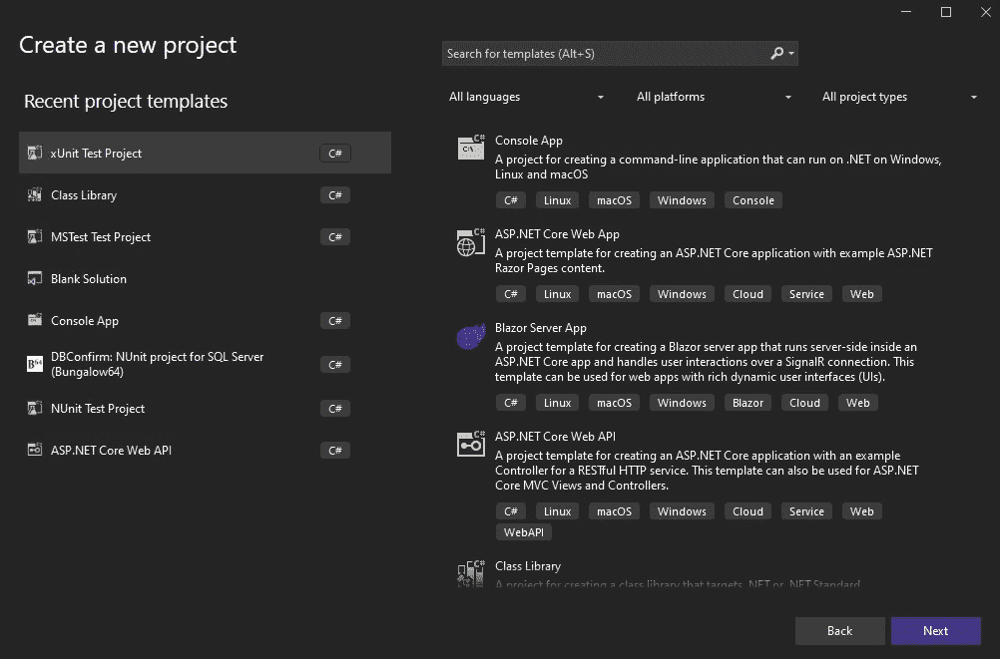

在 Visual Studio 中创建新的 xUnit 项目

然后，您需要添加几个 NuGet 包来获得 Selenium WebDriver，包括以下内容:

`[Selenium.Support](https://www.nuget.org/packages/Selenium.Support)`

`[Selenium.WebDriver.ChromeDriver](https://www.nuget.org/packages/Selenium.WebDriver.ChromeDriver/)`

安装这些软件时，要注意你使用的是什么版本。ChromeDriver 包尤其重要，因为它与运行测试的 Chrome 版本相关。幸运的是，你从 Selenium 得到的错误消息在这一点上非常清楚——如果你试图运行一个你的代码不是为之编写的 Chrome 版本，它会告诉你，通常你必须将 NuGet 包更新到最新版本。

希望到现在为止，您已经有了一个空的单元测试。它可能如下所示:

```
namespace AutoTestDemo;

public class UnitTest1
{
    [Fact]
    public void Test1()
    {
    }
}
```

太好了。现在，回到测试本身。

# 规划自动化 UI 测试

在开始编写代码之前，仔细考虑测试要做什么总是很有帮助的。

在这个例子中，我们将通过检查注册过程在 medium.com 上运行一个测试。

如果我们使用测试用例，我们应该现在就写一个，并把测试需要的所有细节放在里面(足够让一个手工测试人员执行相同的测试)。然而，我们现在将列出我们需要采取的步骤，并指出我们需要做出什么样的断言。

> 测试用例名称:假设一个用户试图注册 medium.com，当一个无效的电子邮件地址被使用时，会显示一条警告消息

**步骤:**

*   打开 medium.com
*   点击“开始”按钮
*   点击“用电子邮件注册”按钮
*   输入无效的电子邮件地址(如“123456”)
*   点击“继续”按钮
*   验证是否显示警告(如“请输入有效的电子邮件地址。”)

这就是我们的测试。我们希望得到这个警告信息，以确保用户不能用无效的电子邮件地址注册。

我有时发现将这些步骤复制到测试中很有帮助，这样我就可以用代码来填补空白。对于更复杂的测试，将这些注释留在代码中可能是个好主意，这样其他人就可以确切地看到发生了什么。

```
namespace AutoTestDemo;

public class UnitTest1
{
    [Fact]
    public void Test1()
    {
        //Open medium.com

        //Click the 'Get started' button

        //Click the 'Sign up with email' button

        //Enter an invalid email address(such as '123456')

        //Click the 'Continue' button

        //Verify that a warning is shown(such as 'Please enter a valid email address.')
    }
}
```

# 打开浏览器窗口

我们的第一步需要打开浏览器本身。

由于我们只使用 Chrome，我们可以直接使用`ChromeDriver`。如果你支持其他浏览器，你可能想把它抽象出来，这样你的测试就可以在多种浏览器上运行，但是现在，我们还是坚持使用 Chrome。

打开新窗口最简单快捷的方法是实例化一个新的`ChromeDriver`对象(来自`OpenQA.Selenium.Chrome`，设置`Url`属性并调用`Navigate()`方法:

```
using var driver = new ChromeDriver();
driver.Url = "https://medium.com";
driver.Navigate();
```

注意我们是如何得到一个`using`关键字的。这只是为了在测试结束时正确处理`ChromeDriver`对象。如果您没有这样做，您会注意到在测试期间打开的浏览器窗口在测试结束时没有关闭，并且当您运行多个测试时，您肯定希望测试结束后整理好！

这就是我们目前所得到的:

```
using OpenQA.Selenium.Chrome;

namespace AutoTestDemo;

public class UnitTest1
{
    [Fact]
    public void Test1()
    {
        //Open medium.com
        using var driver = new ChromeDriver();
        driver.Url = "https://medium.com";
        driver.Navigate();

        //Click the 'Get started' button

        //Click the 'Sign up with email' button

        //Enter an invalid email address(such as '123456')

        //Click the 'Continue' button

        //Verify that a warning is shown(such as 'Please enter a valid email address.')
    }
}
```

试一试，Chrome 在 medium.com 打开，然后马上关闭。到目前为止，这就是我们在测试中所做的一切，你会很高兴看到测试通过！

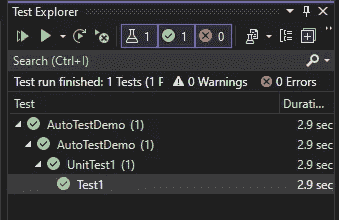

测试通过！

# 与页面上的元素交互

既然我们可以打开页面开始测试，我们需要与它进行交互。我们的下一步是单击“开始”按钮。那么，让我们深入探讨一下我们将如何做到这一点。

Selenium WebDriver 直接与浏览器进行交互，因此我们可以告诉它要查找什么，以及一旦找到它要做什么。

有不同的方法来识别页面上的元素:

*   按 id
*   名叫
*   按类别
*   按标签名称
*   按链接文本
*   通过 XPath
*   和其他方式

你会发现你写自动化 UI 测试的 80%的时间都在研究如何识别页面上的元素，所以现在找出什么是好的，什么不是很重要。

Selenium 测试名声不好的一个主要原因是它们可能非常脆弱，甚至应用程序中的小变化都可能导致测试失败。这通常取决于你如何识别你的元素。然而，通过确保您的测试不受无关变更的影响，这是可能的。

我倾向于使用两种不同的方法来识别元素。第一个也是最可靠的是使用 id。

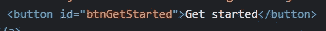

DOM 中的按钮

如果您有一个具有惟一 id 的元素，那么 99%的情况下，我会选择通过 id 来标识该元素。id 不可能改变；它在页面上是独一无二的，不会受到任何其他改变的影响。

然而，很多时候，你不会有一个好的 id 来像这样工作。在这种情况下，我通常使用 XPath，这是一种定义元素选择规则的强大方法。在 XPath 中，我们可以查看 id、类名、标记名、列表中的位置、其他元素的位置、父元素、子元素等。因此，虽然有这么多的选择，但有时要想出应该如何做可能有点困难。

我喜欢思考如何向能看到我的屏幕但不能触摸鼠标的人描述这个元素。

以 medium.com 主页上的“开始”按钮为例，我们需要点击它:

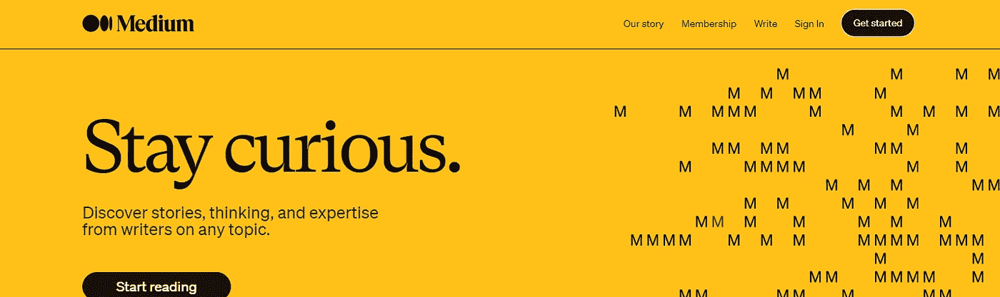

medium.com 主页

看到顶部了吗？

在 Chrome dev tools 中查看这个按钮(按下`F12`，或者右键单击元素并选择‘Inspect’)，我们可以看到没有 id 可以使用:

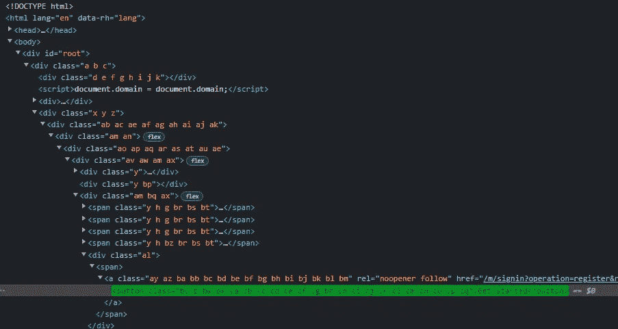

DOM 中的按钮

现在，如果右键单击此处的按钮，您可能会想使用“复制→复制 XPath”选项:

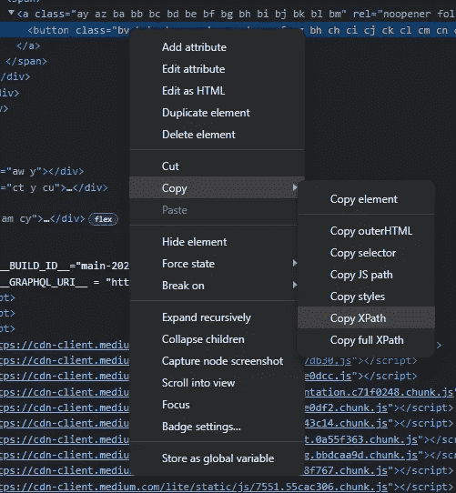

直接从 Chrome 开发工具复制 XPath

现在，这很少会产生对自动化 UI 测试有用的东西。如果我们复制这个值，我们会得到:

```
//*[@id="root"]/div/div[3]/div[1]/div/div/div/div[3]/div/span/a/button
```

呃。这不是一个好的 XPath 的样子。它从根元素开始，然后经过一系列 div，最后到达按钮。因此，虽然这在今天可能行得通，但是如果页面的结构稍微改变一下会怎么样呢？

例如，如果在某个地方插入一个额外的 div，会发生什么？您的测试现在将无法找到该按钮，测试将失败，您需要更新您的测试，以便可以再次找到该按钮。这并不好，如果您发现您使用 XPaths 和一系列这样的 div，您将花费相当多的时间来维护您的测试，这不是对您时间的最好利用。

相反，让我们考虑如何向其他人描述如何找到这个按钮。我们可能会说，在页面顶部找一个写着“开始”的按钮。“我很确定任何人都可以用这种逻辑点击正确的按钮。我们可以把它转换成 XPath，然后用它来代替，这样会更可靠一点。在我们的例子中，我们可以使用按钮的文本来查找元素，所以我们将使用:

```
//button[text()='Get started']
```

让我们把这个放到我们的代码中:

```
// Click the 'Get started' button
IWebElement getStartedButton = driver
    .FindElement(By.XPath("//button[text()='Get started']"));
```

因此，我们使用我们的`driver`变量来查找带有 XPath 的元素。请注意，如果我们想通过 id 查找某个东西，我们将使用`By.Id`而不是`By.XPath`。

一旦我们得到了我们想要的`IWebElement`。我们可以用它做一些事情。例如，单击它:

```
getStartedButton.Click();
```

仅此而已；该按钮被单击。我们可以使用接下来出现的“用电子邮件注册”按钮进行同样的操作:

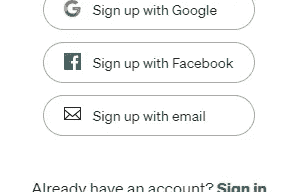

注册页面

尽管这一次，DOM 有点棘手:

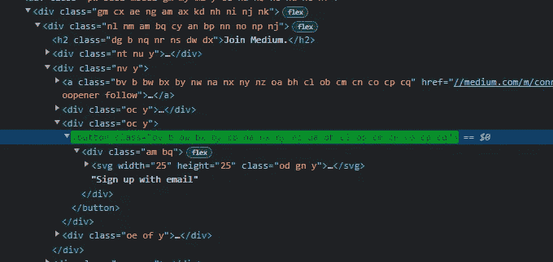

按钮的 DOM

您将看到按钮的文本并不直接在按钮本身内部，而是在一个嵌套的 div 中。这里还有一个 SVG。为此，您可以使用一个`normalize-space`功能，它允许您检查您正在查看的元素下的所有元素的文本。所以我们的 XPath 可以是:

```
//button[normalize-space() = 'Sign up with email']
```

接下来，我们需要找到输入的电子邮件地址。

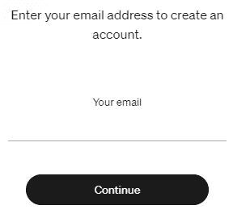

注册屏幕允许您输入您的电子邮件地址

同样，我们没有 id，所以你如何向其他人描述这个元素的位置呢？我们可以说，‘找到显示在‘你的电子邮件’标签后的输入。’这很清楚，所以这就是我们将使用的 XPath 值，使用`following-sibling`查找下一个输入元素:

```
//*[normalize-space() = 'Your email']//following-sibling::*//input
```

现在我们已经有了 input 元素，我们可以向它发送键:

```
// Enter an invalid email address(such as '123456')
IWebElement input = driver
    .FindElement(By.XPath("//*[normalize-space() = 'Your email']//following-sibling::*//input"));

input.SendKeys("123456");
```

太好了。接下来，我们需要单击“继续”按钮。这是另一个简单的例子，我们可以通过文本找到:

```
// Click the 'Continue' button
IWebElement continueButton = driver
    .FindElement(By.XPath("//button[text()='Continue']"));

continueButton.Click();
```

如果我们手动输入无效的电子邮件地址，我们可以看到警告出现的位置:

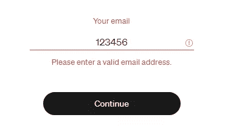

显示的警告

检查这个元素表明我们有一个很好的“error”id 可以使用:

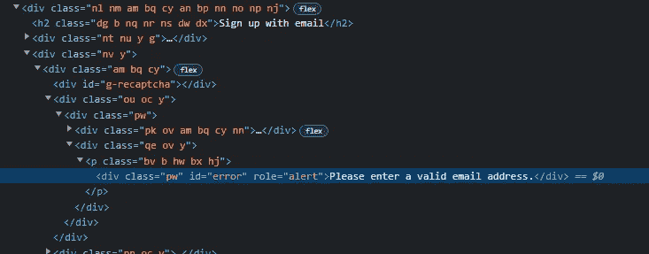

警告的 DOM

因此，我们将使用它来获取警告文本，并验证它是否符合我们的预期:

```
// Verify that a warning is shown(such as 'Please enter a valid email address.')
IWebElement error = driver.FindElement(By.Id("error"));

Assert.Equal("Please enter a valid email address.", error.Text);
```

这就是我们的考验！将所有这些放在一起，我们得到以下结果:

```
[Fact]
public void Test1()
{
    // Open medium.com
    using var driver = new ChromeDriver();
    driver.Url = "https://medium.com";
    driver.Navigate();

    // Click the 'Get started' button
    IWebElement getStartedButton = driver
        .FindElement(By.XPath("//button[text()='Get started']"));

    getStartedButton.Click();

    // Click the 'Sign up with email' button
    IWebElement signUpButton = driver
        .FindElement(By.XPath("//button[contains(normalize-space(), 'Sign up with email')]"));

    signUpButton.Click();

    // Enter an invalid email address(such as '123456')
    IWebElement input = driver
        .FindElement(By.XPath("//*[normalize-space() = 'Your email']//following-sibling::*//input"));

    input.SendKeys("123456");

    // Click the 'Continue' button
    IWebElement continueButton = driver
        .FindElement(By.XPath("//button[text()='Continue']"));

    continueButton.Click();

    // Verify that a warning is shown(such as 'Please enter a valid email address.')
    IWebElement error = driver.FindElement(By.Id("error"));

    Assert.Equal("Please enter a valid email address.", error.Text);
}
```

试一试，它就通过了:

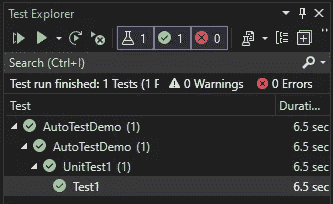

我们的测试通过了！

这是我们写的第一个测试。干得好。

如果你打算结束编写更多的测试，你会希望注意到这个测试有很大的改进空间。

我们现在来看看一些改进。

# 将 IWebDriver 移出测试

将`ChromeDriver`的实例化和处理移动到一个在每个测试之前和之后运行的公共区域将会很有帮助，所以你不需要为每个测试都这样做。

对于 xUnit，我们可以使用一个构造函数并实现`IDispose`来做到这一点，但是我们可以更进一步，创建一个抽象基类来处理它，这样我们就可以有多个测试类使用同一个基类。

我们的基类可能是这样的:

```
using OpenQA.Selenium;
using OpenQA.Selenium.Chrome;

namespace AutoTestDemo;

public abstract class BaseTest : IDisposable
{
    protected readonly IWebDriver Driver;

    protected BaseTest()
    {
        Driver = new ChromeDriver
        {
            Url = "https://medium.com"
        };
        Driver.Navigate();
    }

    public void Dispose()
    {
        Driver.Dispose();
    }
}
```

我们会以通常的方式继承它:

```
public class SignUpTests : BaseTest
```

所以，现在我们可以在测试中直接使用`Driver`属性，而不需要创建或记住释放它。

# 创建页面对象模型

页面对象模型是一种模式，在这种模式下，我们将所有可以与“页面”进行的交互放入它自己的类中，这样它就包含在同一个地方，可以被不同的测试重用。

我们可以为这个“主页”创建一个，如下所示:

```
using OpenQA.Selenium;

namespace AutoTestDemo;

public class Homepage
{
    private readonly IWebDriver _driver;

    private static By GetStartedButtonPath => 
      By.XPath("//button[text()='Get started']");
    private static By SignUpButtonPath => 
      By.XPath("//button[contains(normalize-space(), 'Sign up with email')]");
    private static By ContinueButtonPath => 
      By.XPath("//button[text()='Continue']");
    private static By EmailPath => 
      By.XPath("//*[normalize-space() = 'Your email']//following-sibling::*//input");
    private static By ErrorPath => 
      By.Id("error");

    public Homepage(IWebDriver driver)
    {
        _driver = driver;
    }

    public void ClickGetStartedButton()
    {
        _driver.FindElement(GetStartedButtonPath).Click();
    }

    public void ClickSignUpButton()
    {
        _driver.FindElement(SignUpButtonPath).Click();
    }

    public void EnterEmail(string text)
    {
        _driver.FindElement(EmailPath).SendKeys(text);
    }

    public void ClickContinueButton()
    {
        _driver.FindElement(ContinueButtonPath).Click();
    }

    public void VerifyErrorMessage(string expectedMessage)
    {
        Assert.Equal(expectedMessage, _driver.FindElement(ErrorPath).Text);
    }
}
```

看看我们如何传递我们的`IWebDriver`对象，这样我们就可以在页面对象模型中查找元素。这意味着我们可以实例化这个模型，并像这样调用它:

```
namespace AutoTestDemo;

public class SignUpTests : BaseTest
{
    [Fact]
    public void VerifyInvalidEmailMessage()
    {
        Driver.Navigate();

        var homepage = new Homepage(Driver);

        homepage.ClickGetStartedButton();

        homepage.ClickSignUpButton();

        homepage.EnterEmail("123456");

        homepage.ClickContinueButton();

        homepage.VerifyErrorMessage("Please enter a valid email address.");
    }
}
```

希望你现在能看到这个测试可读性更好了，我们不需要原始的注释，因为每一步都很清楚。

另外，由于所有关于“主页”的逻辑现在都在一个类中，如果我们需要更新我们的测试来反映应用程序的变化，我们只需要更新一个地方，而不是更新每个测试。

# 添加等待

能够智能地等待测试中事件的发生也是测试具有弹性和可靠性的关键。您可能编写了一个可以在您的机器上完美运行的测试，但是一旦您在一个不同的(可能更慢的)测试环境中运行该测试，您可能会遇到错误，因为您的测试在完全加载之前就期望发生一些事情。

例如，您可以编写一个提交表单的测试，并期望显示一个错误。在本地，API 调用可能几乎立即返回，因此您的测试可以立即看到错误。在不同的环境中运行它可能会增加 API 调用的延迟，这意味着当试图找到错误时测试会失败。然而，这不是一个合理的错误，因为如果测试再等一会儿，就会出现错误。

对此的下意识反应是添加一个硬编码等待(称为*隐式*等待)，类似于`Thread.Sleep`。虽然这可能会使失败的测试重新启动并运行，但这很少是理想的解决方案。问题是等待时间是固定的，测试将一直等待这个时间长度。

如果它所等待的事件在等待结束之前就准备好了，那么测试仍然会等待整个时间，这不必要地延长了您的测试执行时间。还有一种可能是，一个三秒钟的 API 调用偶尔会变成一个四秒钟的 API 调用，在这种情况下，等待会过早结束，您的测试仍然会失败。

更好的解决方案是使用显式等待。这些等待依赖于一个条件，一旦满足该条件就会结束。您仍然需要设置一个总超时值(等待条件的最长时间)，但是只有在条件不满足时才会达到这个值。采用我们的方法来验证显示的错误消息。让我们假设这个错误来自一个 API 调用的结果，这个调用有时需要几秒钟才能返回。

我们将使用一个显式的`wait`来代替几秒钟的隐式`wait`:

```
public void VerifyErrorMessage(string expectedMessage)
{
    WebDriverWait wait = new WebDriverWait(_driver, TimeSpan.FromSeconds(10));

    IWebElement errorElement = wait.Until(d => d.FindElement(ErrorPath));

    Assert.Equal(expectedMessage, errorElement.Text);
}
```

看看我们如何首先创建一个最大长度为 10 秒的`WebDriverWait`对象，然后使用这个等待来定义一个`Until`条件，检查是否可以找到`ErrorPath`元素。并且您可以在那个`Until`条件中做各种事情(包括检查一个元素是否存在，这是一个相当常见的需求)。接下来，您可能希望存储那个`WebDriverWait`对象，并在测试的剩余部分重用它。

这些等待允许您增加测试的灵活性，这样即使应用程序变得有点慢，它们仍然可以正确运行。

# 摘要

希望您已经看到了自动化 UI 测试有多好，以及它们能给您带来的价值。

以正确的方式编写，它们可以是对您现有测试工作的一个非常有用的补充，并且让您对您所做的更改是正确的有更高的信心。

我们已经深入研究了如何启动和运行单个测试，研究了您可能希望如何构建代码以使其尽可能可维护，并了解了我们如何使用智能等待来允许您的测试通过，即使应用程序中存在不可预测的延迟。