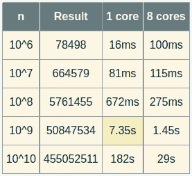

# JavaScript 线程类的发明

> 原文：<https://betterprogramming.pub/an-invention-of-js-threadable-class-8e8e82e1615>

## 让我们实现 promisified，一个可线程化的 JavaScript 函数


由[阿米拉里·米尔哈西米安](https://unsplash.com/@amir_v_ali?utm_source=medium&utm_medium=referral)在 [Unsplash](https://unsplash.com?utm_source=medium&utm_medium=referral) 上拍摄的照片

JavaScript 通过其本地事件驱动的异步处理对并发性进行了合理的抽象，通过 Web Workers 对并行性进行了抽象。但是，我总觉得缺少了一个环节。

虽然对于 IO 来说已经足够了，但事件驱动的并发性只是一种模拟，仍然在单线程上运行。这实际上是因为 JavaScript 背后的原始想法是巧妙地在浏览器窗口上显示元素。

不过，试着聪明一点，一些繁重的计算可能需要一些时间来完成，明智的做法是将这些繁重的任务分成一些子任务，并以并行方式在单独的线程上同时处理它们。因此我们有了网络工作者。请注意名称中的“Web”部分。它还在瞄准显示器。

简而言之，Web Workers 提供了一个基于回调的有限 API。更糟糕的是，您必须提前将并行任务设置为单独的任务。js 文件。

它的设计模式是基于更新网页内容。然而，我认为 JavaScript 是一种完全成熟的语言，应该有更好的抽象来处理通用并行处理需求。JavaScript 拥有完美完成这项任务所需的所有工具。所以让我们勇敢一点，尝试去做。

## 我们的设计标准应该是什么？

1.  使用 workers 需要一个异步接口。于是我们有了 JS 里最美的一个，也就是承诺。
2.  这个想法是将任何标准函数变成异步线程函数。这意味着我们必须为标准功能增加额外的功能。可扩展的`Class`抽象用于通过扩展函数构造函数来提高函数的容量。
3.  我们可能更喜欢这样的升级函数来保持它们的正常行为，这样它们也可以被同步调用。

所以没错，我们会在这个题目下实现 promisified threadable 函数。

我们应该知道，只有当任务繁重到足以抵消大量工作线程的成本时，线程才有价值。仅仅因为你有八个内核，并不意味着任何线程功能的执行速度会快八倍。没有这个功能。正如您将在下面的示例中看到的，有时不使用任何低于阈值的线程会更有效。所以首先，我们必须决定是否值得努力。`Threadable`类是理想的，甚至可以测试它是否值得。

为了使这篇文章更加有趣和有益，让我们不要使用像加法这样愚蠢的函数，而是将一个更有用的函数变成 threadable，一举两得。假设我们想要实现`*π*`函数，并使其可线程化。

`*π(n)*`函数给出了最高达`*n*`的素数。正如你可能很容易猜到的，随着`*n*`的增长，它有可能成为一项繁重的任务。虽然这与 Riemann Zeta 函数无关，但我将向您展示一个用 JavaScript 实现的 Sundaram 改良筛的最佳实现。所以让我们继续无耻地从[堆栈溢出](https://stackoverflow.com/a/41434702/4543207)中复制它。

我们不要太担心它是如何工作的。它只是一个修改过的`*π(n)*`函数，计算两个极限之间的素数。比如 500K 到 1M 之间有多少素数- > 36960 种。我们需要这样做，因为我们适当的可线程化的`*π(n)*`函数将把`0 *— n*`范围分成类似于`0 — *n*/8, *n*/8–*n*/4, …, 7*n*/8 — *n*` 的子范围，以便在单独的线程中处理。

现在是引入 Threadable 类的时候了。

因此，任何函数`f(a)`都变成可线程化的，如下所示:

```
var g = new Threadable(f); // g is now threadable version of f
```

现在你有两个选择。如果你像`g.spawn(a)`一样调用它，那么它在一个单独的线程上运行，并返回一个承诺，一旦工人发送回一个包含数据的消息，这个承诺将被解决。

你也可以像`g(a)`一样以单线程方式同步运行`g`。

现在回到我们的测试，代码如下:

因此，我在这里向您展示一些基准测试，它们都来自我的垃圾 AMD FX 8370 八核台式机:



正如您所猜测的，生成八个线程的开销大约是 95 毫秒。因此，对于这个函数，切换到线程操作的阈值大约在`n = 20M`左右，这意味着在`n = 20,000,000`以下，我们最好保持单线程。

*感谢阅读！敬请关注更多内容。*