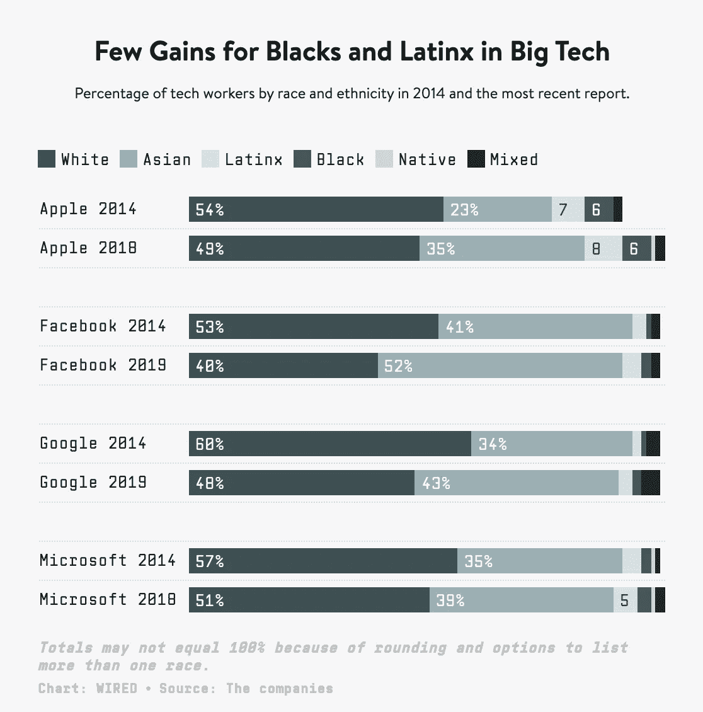

# 致硅谷的公开信

> 原文：<https://betterprogramming.pub/an-open-letter-to-silicon-valley-posting-statements-about-how-you-stand-with-black-america-is-not-267b86d7b593>

## 仅仅发布你如何支持美国黑人的声明是不够的

克里斯蒂娜@ wocintechchat.com 在 [Unsplash](/s/photos/black-tech?utm_source=unsplash&utm_medium=referral&utm_content=creditCopyText) 上的照片

随着黑人的命也是命抗议活动在美国各地持续，很明显，我们的政府和机构未能妥善解决种族分歧，并为种族不平等提供系统的解决方案。

与此同时，许多科技公司发表声明支持黑人社区和黑人的命也是命运动。然而，在种族不平等的情况下，这些一次性的团结声明*是不够的*。很有可能在抗议的媒体周期结束后，对解决系统性种族主义的广泛兴趣也将停止。

种族主义是系统性的，需要一种系统变革的方法。美国的结构性种族差异很大程度上是经济上的，黑人工人在农业、家政和服务行业的低薪工作中占大多数。此外，在[正常经济条件下](https://www.americanbar.org/groups/crsj/publications/human_rights_magazine_home/the-state-of-healthcare-in-the-united-states/minority-womens-health/)，黑人工人更有可能失业，尤其是在[新冠肺炎](https://www.epi.org/publication/black-workers-covid/)期间。斯坦福大学的一项研究发现，只有 1%的黑人拥有的企业在第一年获得小企业贷款。这比白人企业的比例低七倍。另一方面，像脸书、苹果、谷歌和微软这样的大型科技公司代表了劳动力的很大一部分，但在过去几年里，它们的多元化水平低得令人难以置信，而且收效甚微:

上图:苹果、脸书、谷歌、微软发布他们的多元化报告(2014 年)已经有六年了，他们承诺数百万美元来增加他们员工的多元化，但是收效甚微。

事实上，TP Insights 发现许多大型科技公司不进行多元化审计或发布多元化报告。这些公司集中的硅谷怎么能声称支持黑人社区，而他们的劳动力主要是白人和亚裔男性？大型科技公司必须带头增加多元化举措，取得可衡量的结果，并投资于黑人所有的企业，以打击美国经济中的结构性种族差异。

为了系统地解决黑人企业投资不足的问题，硅谷可以做以下事情，正如科技危机的威尔·沃克所建议的:

*   改变围绕“[算法偏见](https://www.vox.com/recode/2020/2/18/21121286/algorithms-bias-discrimination-facial-recognition-transparency)”(防止脸书或谷歌等网站的算法隐含基于种族的歧视)的提议，要求“算法平等”，科技公司*积极*提升黑人企业、黑人投资者和黑人的声音，而不仅仅是试图消除他们系统中根深蒂固的偏见。
*   像亚马逊这样的消费科技公司应该在推荐列表和亚马逊 Prime 功能上积极推广黑产产品。
*   拥有搜索引擎优化的公司，如谷歌，可以调整语言识别软件，以更好地适应用户之间的种族和地区差异，从而促进黑产内容的学习和消费。
*   至于像 GrubHub 和 Seamless 这样的食品配送公司，黑人拥有的餐馆的类似提升将有助于对抗由于疫情而关闭的 40%的少数族裔拥有的企业。

大型科技公司必须超越支持黑人的命也是命运动的声明，对其招聘实践和商业目标做出透明的改变。这是他们确保为系统变革做出贡献的唯一途径。通过提升黑人企业，科技公司可以创造一种团结的模式，在不久的将来，当#blacklivesmatter 不再成为潮流时，这将有助于弥合种族鸿沟。

# 额外的学习资源和机会

*   6 月 30 日，参加 Vantage Point 的 DE&I 网络研讨会，主题为“[在我们世界的新背景下创造包容性工作场所](https://meeting.zoho.com/meeting/register?sessionId=1042182308)”。林恩·洛克(Lynn Loacker)是 W 项目的创始人，她联合并联系了 1500 家由女性领导的顶级公司，达纳·阚泽是“我们要求男性获胜，女性不要失败”的研究员
*   订阅 [TP Insights 时事通讯](http://bit.ly/ThePlugBrief)，报道黑人创始人和创新者的头条新闻。
*   观看少数族裔女性 Vantage Point 创始人摩根·默瑟(Morgan Mercer)与 TP Insights 的谢瑞尔·多尔西(Sherrell Dorsey)讨论黑色经济的现场对话。