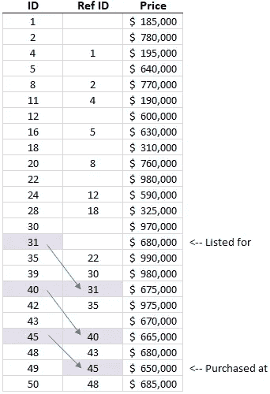

# 一种搜索最相关 id 的优化算法

> 原文：<https://betterprogramming.pub/an-optimization-algorithm-for-searching-most-relevant-ids-aba320cfa0b>

## 当数据集包含更新以前记录的记录，并且您需要最新记录时，请使用此算法

对于具有挑战性的任务，优化算法可能需要几天才能完成。即使您认为已经构建了合适的解决方案，您可能还需要进一步调整。数据科学家面临着一系列任务，他们应该在这些任务中应用一个，但他们可能不知道这些类型的算法。

在本文中，我试图通过展示一个例子来帮助弥合这个差距:相关的 ID 算法。

照片由[андрейсизов](https://unsplash.com/@alpridephoto?utm_source=medium&utm_medium=referral)在 [Unsplash](https://unsplash.com?utm_source=medium&utm_medium=referral) 上拍摄

# 优化算法

这些算法是降低某些编程问题中固有的时间复杂性的函数或代码类。此外，它们减少了收敛到准确解决方案所花费的时间，因为它们能够“组织”数据和/或问题，以减少计算负载或任务数量。

# 相关 ID 算法(RIDA)

RIDA 搜索数据集中最新、最相关和最准确的数据记录。一种简单的方法是搜索所有记录并过滤掉旧记录。在天真的情况下，在对所有数据进行多次迭代之后，所有保留的记录将是最新和最相关的。RIDA 利用适当的数据结构和自调用来搜索尽可能少的记录。最后，你会更快地得到与原始情况相同的结果。

## 例子

下表显示了一系列(假设的)房屋价格和实例，其中房屋价格在购买之前一直在调整。

📸由[我](https://www.linkedin.com/in/dylancunningham/)

第一条记录以紫色突出显示，显示 ID 为`31`，房价为`$680K`。后来首页价格调整为`$675K`，ID 为`40`，参考 ID 为`31`。再次调整价格，这次调整到`$665K`，ID 为`45`，参考 ID 为`40`。第三，也是最后一点，home 价格下调到`$650K`，ID 为`49`，参考 ID 为`45`。

按顺序，引用 ID 是指更新前的记录，而不是指原始 ID。无论哪种方式，问题都是一样的:为了找到更新结束的位置，您必须遍历这一系列事件。在这种情况下，最后一个将覆盖第一个，以显示最新、最相关和最准确的信息。(其他情况下，可能需要一路更新到最后；这只是取决于数据是如何组织的。)

> 在不多次迭代整个数据集的情况下，如何迭代这一系列更新才能知道哪条记录是最终记录？

# 介绍 RIDA

RIDAlgorithm 类(如下所示)是实现这种优化技术的一种方式。有两种方法。第一个是 _search，这是一个递归搜索给定 ID 的最新记录的方法。第二，run 是一种方法，它接收传入的数据，稍微向后组织数据(将 ref ids 作为键，将 id 作为字典中的值)，根据相关 id 对原始数据进行子集化，并使相关数据可检索(代码进一步向下)。

# 应用程序

该算法可用于许多类似的任务，如上所示:房屋价格更新、汽车/铁路/船只位置跟踪、交易位置更新等。这样的例子不胜枚举。

# 结论

总之，优化算法可能需要很长时间来编写，一些人甚至不知道他们需要为一个给定的任务编写一个。早些时候，我介绍了 RIDA，这是一种用于在数据集中搜索最相关记录的优化算法，我展示了这种算法唯一能够处理的问题。

我的目的是让你了解这个算法是如何工作的，以及你将来可以在哪里应用它。

# 示例代码和数据

 [## 中物品编码/一种在主…

### 在 GitHub 上创建一个帐户，为 Dylan-Cunningham/Medium-Article-Code 开发做贡献。

github.com](https://github.com/Dylan-Cunningham/Medium-Article-Code/tree/main/An%20Optimization%20Algorithm%20for%20Searching%20Most%20Relevant%C2%A0IDs)