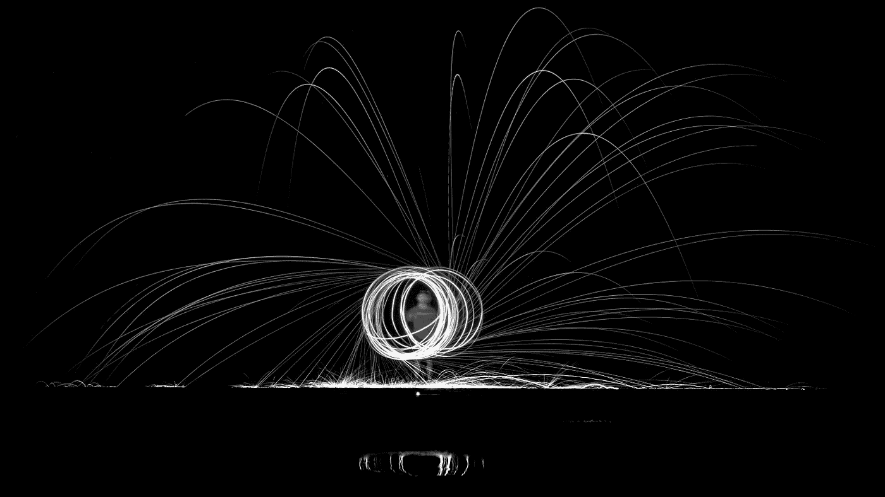

# 一个被忽视的语法糖:Python 中的 For/Else

> 原文：<https://betterprogramming.pub/an-overlooked-syntactic-sugar-for-else-in-python-d5c186647e99>

## 理解 Python 中的条件循环语句



Denis Gaík 在 [Unsplash](https://unsplash.com/photos/f8-NomI83MM) 上拍摄的照片。

循环肯定是一些最常用的语句。Python 附带了一个很少使用的语法糖，允许将`else`子句与循环语句一起使用。

> "循环语句可能有一个`else`子句."— [Python 文档](https://docs.python.org/3/tutorial/controlflow.html#break-and-continue-statements-and-else-clauses-on-loops)

在本文中，我们将讨论循环语句拥有`else`子句的能力。此外，我们将探索如何在通用编程结构中使用这种特殊的语法糖，并使我们的代码更具可读性，甚至更 Pythonic 化。

# for/else 是做什么的？

在`for:else`语句中，`else`子句在 iterable 用尽时执行(即迭代循环终止时)。如果在任何迭代中遇到`break`语句，那么`else`语句将被忽略。这意味着如果你的`for`循环没有任何`break`子句，那么`else`子句将总是被执行。

`for/else`的符号如下:

```
for i in range(0, 2):
    # ...
else: 
    # ...
```

现在，为了理解`for/else`是如何工作的，让我们考虑下面的例子:

在上面的代码片段中，我们试图找出`2`和`14`之间的哪些数字是质数。回想一下，一个质数只能被它自己和一整除。

外部循环将简单地遍历从`2`到`14`的每个数字。现在，内部循环将从`2`开始迭代，直到数字本身，并检查`n`是否能被任何余数为`0`的数字整除。如果是这种情况，那么代码将执行一个`print`语句，然后是`break`，这意味着`else`子句不会被执行。

如果数字确实是质数，则`if`条件将永远不会满足，因此不会执行`break`。在这种情况下，一旦内部 for 循环的迭代结束，就会执行`else`子句。上面代码片段的输出如下所示:

```
2 is a prime
3 is a prime
4 is not a prime
5 is a prime
6 is not a prime
7 is a prime
8 is not a prime
9 is not a prime
10 is not a prime
11 is a prime
12 is not a prime
13 is a prime
14 is not a prime
```

在下一节中，我们将讨论一些适合使用`for/else`子句的结构。

# 何时在循环语句中使用 e `lse`子句

既然我们展示了如何在 Python 中使用`for/else`,那么是时候讨论一些可以适当使用这种语法糖的可能场景了。

编程中最常见的构造之一是迭代一个集合，以便搜索一个项，并根据是否找到该项来执行特定的操作。

在这种情况下，`for/else`语句可能是一个很好的选择。我们在上一节中探索的代码是一个很好的例子，说明了这个子句是如何有用的，并导致更干净和更可读的代码。

但是请记住，拥有一个包含`if`语句的`for`循环可以很好地表明`for/else`可能是一个选项，这取决于您到底想要实现什么。

一般来说，大多数开发人员将`else`与`if`子句联系起来，这是绝对正常的，因为大多数现代编程语言一般不支持循环语句甚至其他语句中的`else`子句。然而，与`if/else`子句相比，与`for`循环一起使用的`else`子句更类似于`try/else`语句。在`try`语句中，只有在没有异常发生的情况下，才会执行`else`子句。同样，在`for/else`语句中，`else`子句只有在没有`break`发生时才会被执行。

# 最后一句话

在本文中，我们探讨了`for/else`，这是 Python 中最不常用的语句之一。这种语法糖无疑是最有趣的之一，因为大多数现代编程语言不支持循环语句和`else`子句的这种组合。

子句可以用在编程结构中，我们希望迭代集合并搜索特定的项目。只有在`for`循环中没有`break`出现时，才会执行`else`子句，这相当于`try/else`也是这样工作的。

最后，请注意，尽管我们讨论了在`for`语句中使用`else`子句，但是也可以在 Python 中的任何循环语句中使用这种符号，包括`while`。