# 内置 SwiftUI 视图概述

> 原文：<https://betterprogramming.pub/an-overview-of-built-in-swiftui-views-374ea7549bf9>

## 通过选择正确的视图，更快地构建 SwiftUI 应用


查尔斯·德鲁维奥在 [Unsplash](https://unsplash.com?utm_source=medium&utm_medium=referral) 上拍摄的[照片。](https://unsplash.com/@charlesdeluvio?utm_source=medium&utm_medium=referral)

SwiftUI 很好玩。

就我个人而言，我真的很喜欢用苹果新的声明式 UI 框架构建复杂而漂亮的视图。

但是在您开始构建自己的定制视图之前，最好先习惯 SwiftUI 已经为您提供的东西。这些工具和视图的知识将加速您的开发，并在创建复杂的用户界面时对您有极大的帮助。

本文将涵盖苹果已经发布的内置 SwiftUI 视图。遗憾的是，我将要展示的视图列表并不详尽，但是我将为您提供最重要的 SwiftUI 视图的清晰概述。

# 设置项目

如果你想跟着编码，打开 Xcode。在“欢迎使用 Xcode”屏幕上，选择“创建新的 Xcode 项目”


作者创作的截图

在以下屏幕中，选择“iOS”选项卡下的空白“App”模板:


作者创作的截图

最后，给项目取一个合理的名字。我要用`SwiftUIBuiltInViews`。确保选择“SwiftUI”作为“界面”类型，选择“SwiftUI App”作为“生命周期”选项:

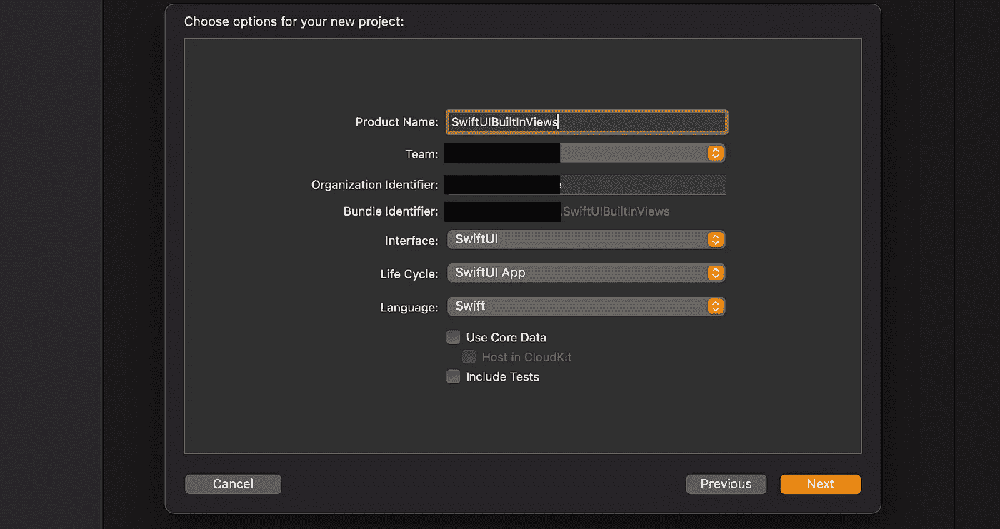

作者创作的截图

点击“下一步”，然后选择一个合适的文件目的地。点击“创建”按钮，你就可以开始了。

打开我们将在整个教程中使用的`ContentView.swift`文件。您应该在左边看到代码，在右边看到预览画布。如果您没有看到画布，请使用以下快捷方式打开它:

```
Option + Command + return (⌥ + ⌘ + ↩)
```

显示画布后，使用这个重要的快捷键开始预览:

```
Option + Command + P (⌥ + ⌘ + P)
```

[](https://medium.com/better-programming/xcode-8-swiftui-keyboard-shortcuts-that-will-make-you-even-faster-bc3967b75224) [## Xcode: 8 SwiftUI 键盘快捷键，让你更快

### 掌握 Xcode 并更快地构建应用程序

medium.com](https://medium.com/better-programming/xcode-8-swiftui-keyboard-shortcuts-that-will-make-you-even-faster-bc3967b75224) 

最终结果应该类似于下图:

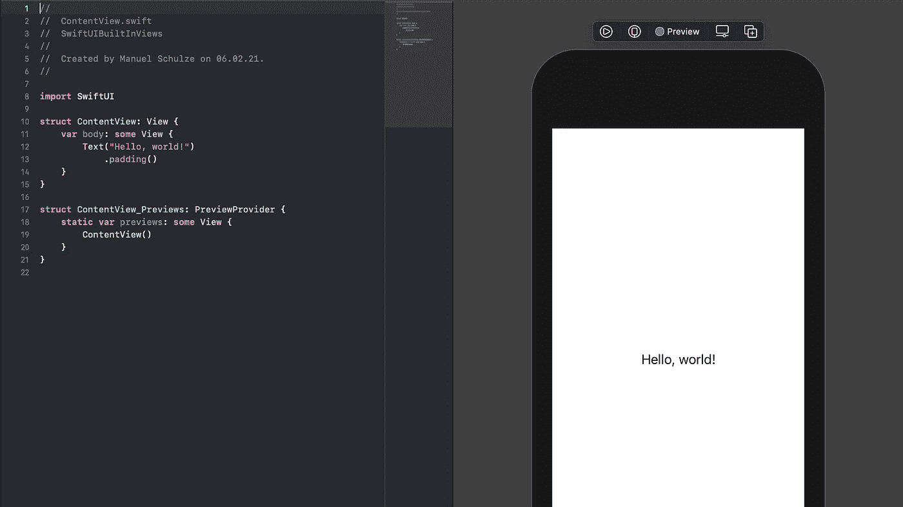

作者创作的截图

现在让我们深入了解我们的第一个内置 SwiftUI 视图。

# SwiftUI 中的颜色视图

我们要看的第一个视图可能已经有点令人惊讶了。SwiftUI 主要由视图和修改器组成。

`Color`是一个视图，它只是用你提供的颜色显示一个矩形。它也可以通过修改器作为前景色或背景色应用于其他视图。

首先，只需删除 Xcode 为我们创建的`Text`视图和填充，并用下面的`Color`视图替换它:

创建您的第一个 SwiftUI 视图就是这么简单。结果应该如下所示:

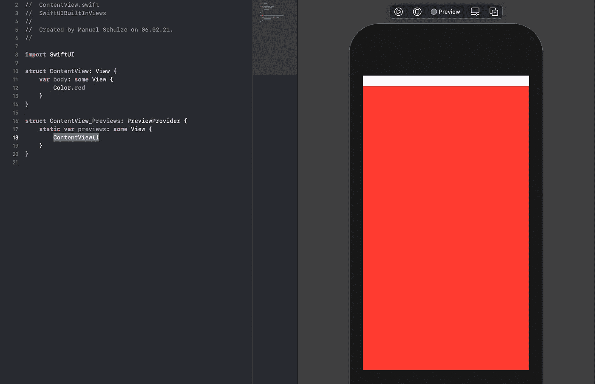

作者创作的截图

如您所见，`Color`视图默认占据了所有可用空间(除了我们例子中的状态栏)。您可以通过简单地访问`Color`的小写静态属性来创建几种基本颜色的彩色视图。以下颜色可通过此获得(从 Swift 5.2 开始):

*   清楚的
*   黑色
*   怀特（姓氏）
*   灰色的
*   红色
*   格林（姓氏）；绿色的
*   蓝色
*   柑橘
*   黄色
*   粉红色
*   紫色
*   主要的
*   副手

如果你想知道什么是主要和次要，来自 Hacking With Swift 的 Paul Hudson 提供了一个很好的答案:

> “例如，Color.primary 是 SwiftUI 中文本的默认颜色，根据用户的设备是在亮模式还是暗模式下运行，它将是黑色或白色。还有 Color.secondary，根据设备的不同，它也是黑色或白色的，但现在有轻微的透明度，以便背后的一点颜色可以透过。”

`Color`视图有许多初始化器，但是我想向您展示我使用最多的一个。它接受颜色名称(例如，您在资源中创建的颜色)。

为此，进入`Assets.xcassets`文件，通过底部的加号按钮创建一个新的“颜色集”。

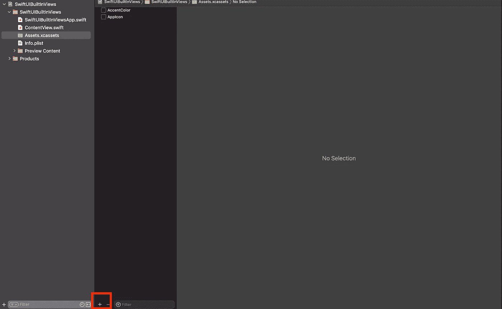

作者创作的截图

将这种颜色命名为“我的颜色”，并在“属性检查器”(`Option + Command + 4 (⌥ + ⌘ + 4)`)中将外观更改为“无”。

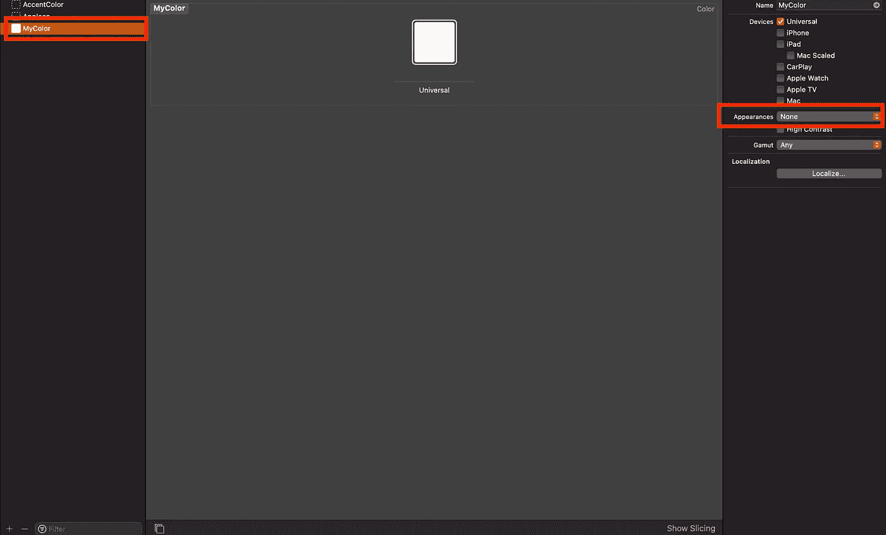

作者创作的截图

最后，点击颜色本身并替换它。我使用了一个值为`#FFBBAA`的八位十六进制颜色。

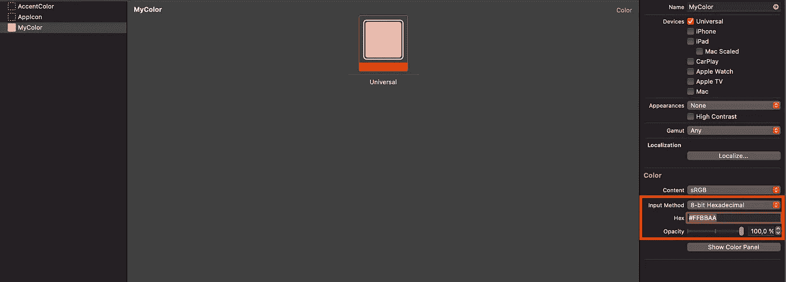

作者创作的截图

返回到`ContentView.swift`文件，将`body`属性更改如下:

如果已经停止工作，请恢复预览，结果应该如下所示:

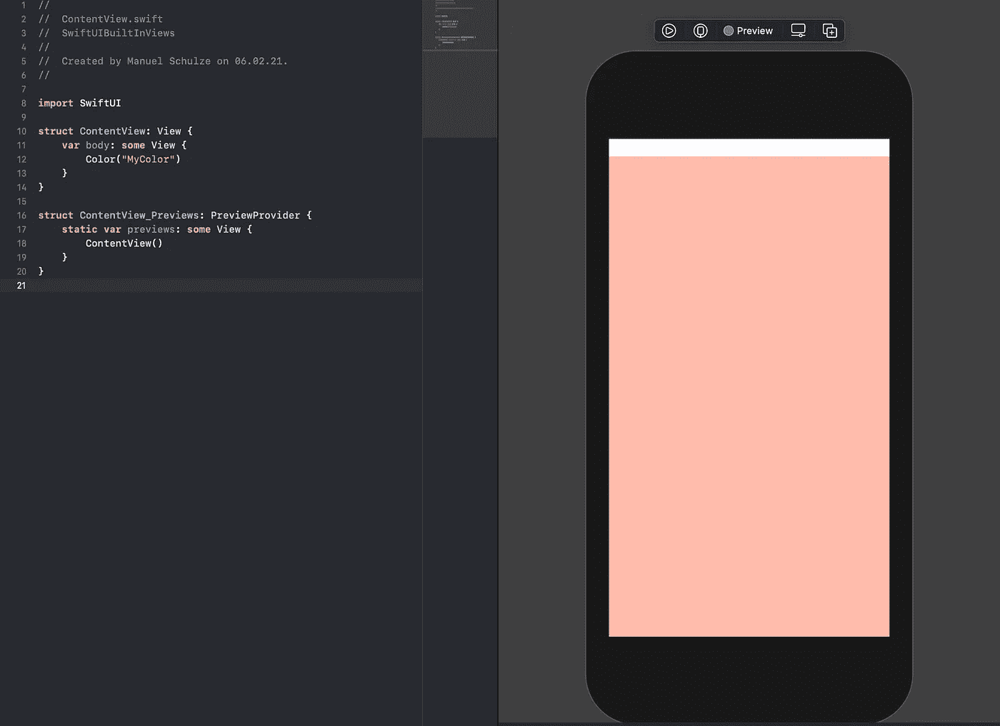

作者创作的截图

*何时使用:我认为这很有价值，但主要是在可以应用于其他视图的修饰符中。例如，您可以使用* `*fill*` *修改器并向其传递一个* `*Color*` *视图。这将使另一个视图(例如一个* `*Rectangle*` *)以你提供的颜色出现。*

# 在 SwiftUI 的文本视图中显示文本

这是 UIKit 的`Label`的 SwiftUI 等价物。它用来显示文本。当我们创建我们的项目时，除了一个“Hello World！”之外，我们什么都没有带有`padding`修饰符的文本。

让我们用下面的代码重新添加一个`Text`视图:

这将导致以下预览:

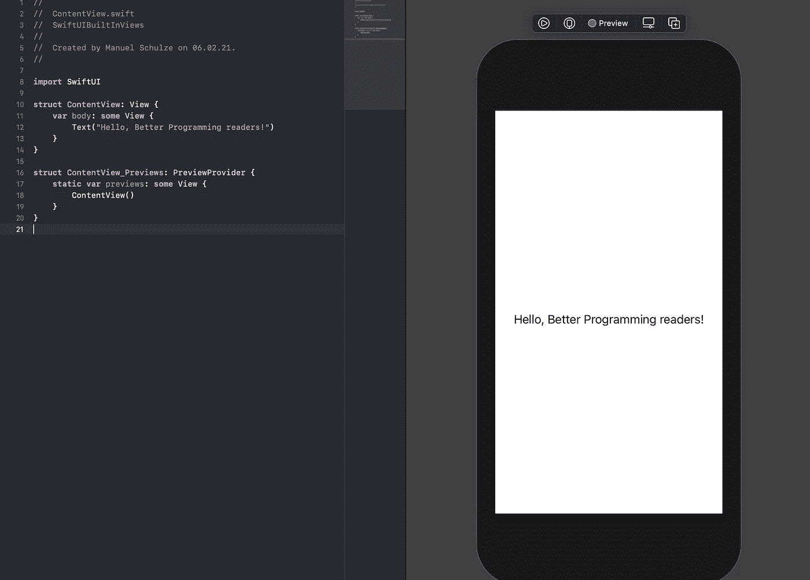

作者创作的截图

像`Color`视图一样，`Text`视图带有许多有用的初始化器。你有日期的初始化器，甚至还有本地化字符串的初始化器！

后者不仅在制作上真的很棒，在预览画布上也可以直接测试。因为这需要一个多步骤的过程，所以超出了本文的范围。但是，我强烈推荐阅读以下文章，其中 SwiftUI 预览版中使用了本地化字符串:

[](https://medium.com/better-programming/a-deep-dive-into-swiftui-previews-66d53469ee43) [## 深入了解 SwiftUI 预览

### 利用强大的预览功能，更快地开发您的 SwiftUI 视图

medium.com](https://medium.com/better-programming/a-deep-dive-into-swiftui-previews-66d53469ee43) 

*何时使用:与 UIKit 中的* `*Labels*` *非常相似，* `*Text*` *视图将是最常用的视图之一，因为我们经常需要在应用程序中显示文本。当您想到对本地化字符串和日期等特性的支持时，它简单而强大。*

# 让用户通过 TextField、SecureField 和 TextEditor 输入文本

我们经常显示文本来为用户提供信息。然而，从信息的角度来看，应用程序并不是单向的。我们经常希望用户向我们提供数据。

我们通常有这样的表单，不管我们谈论的是简单的登录掩码还是相当复杂的票据创建表单。我们总是想从用户那里获得信息，并为他们提供最适合当前情况的控件。

最基本的输入类型之一是文本字段。用户可以在其中书写文本。要查看这一点，请用以下内容替换`body`属性的内容:

这里发生了一些事情。首先，我们需要一个`@State`绑定来让`TextEditor`工作。实际上，我们对所有类型的文本字段都有绑定，但是`TextEditor`是唯一一个不能与`.constant`绑定的。

然后我们有了另一种类型的视图`VStack`(堆栈已经超出了本教程的范围，因为它们非常强大，需要更深层次的解释)。`VStack`只是一个垂直对齐其内容的容器。

我们有三种类型的文本输入。`TextField`是单行文本输入。你可以把这个比作 HTML 的`<input type="text"/>`。第一个参数是占位符，而第二个参数是可用于在代码和可视化表示之间建立连接的绑定。

另一方面，`SecureTextField`非常适合存储机密信息(如密码)。当用户键入文本时，它用点替换字符。对应的 HTML 应该是`<input type="password"/>`。参数与普通文本字段的参数相同。

最后，`TextEditor`是一个多行文本输入，您可以将其与 HTML `<textarea/>`元素进行比较。它只有一个绑定参数。

我建议您在模拟器中启动应用程序进行测试。下面，你可以看到我的一些意见:

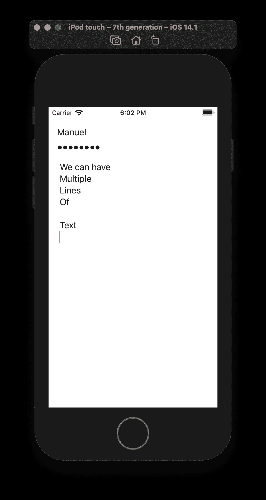

作者创作的截图

*何时使用:当用户需要插入某种不能进一步指定的值时，文本输入类型非常有用。用户名、密码、评论或任何形式的自由文本都是很好的例子。*

他们肯定会发挥很大作用，你应该习惯他们。确保为手头的任务选择正确的。密码不应该使用常规的 `*TextField*` *，多行文本也不应该。*

# 使用更多 SwiftUI 控件超越文本

在许多情况下，文本输入并不是用户提供特定信息的最佳控件。如果用户应该选择一种颜色或者给你一个是或否的答案，如果你想提供一个好的用户体验，你就不应该使用文本输入。

iOS 和 SwiftUI 为我们提供了一些很好的选择，我们现在来简单看一下。

用以下零件替换`ContentView`:

结果应该如下所示:

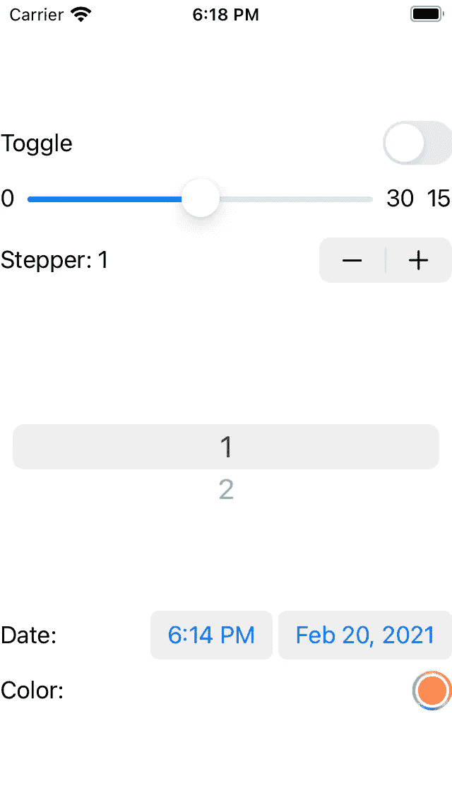

作者创作的截图

让我们逐一讨论。

## **切换**

该开关非常适合“是”或“否”设置。第一个参数用作标签，第二个参数是可用于连接代码的绑定。

## **滑块**

该滑块非常适合用户可以配置的封闭数字范围。对于词汇应用程序来说，这可能是用户每天想要学习的单词量。为了正常工作，它应该有一个最小值和最大值(一个封闭的范围)。

有不同的初始化器可以使用。您在上面看到的方法使用了一个绑定，这样您就可以访问代码中的值、一个允许的封闭值范围(0 到 30)、一个最小值和最大值标签的视图以及另一个标签。

*注意:为什么我们有两个* `*Text*` *视图显示滑块的值？第一个只会为某些 slider 子类显示。然而，根据苹果的文档，它是出于可访问性的原因而使用的。后者用于真正显示我们示例的值。*

> “描述实例目的的‘视图’。并非所有滑块样式都显示标签，但即使在那些情况下，SwiftUI 也使用标签来实现可访问性。例如，VoiceOver 使用标签来标识滑块的用途。”— [苹果的文档](https://developer.apple.com/documentation/swiftui/slider/init(value:in:step:oneditingchanged:minimumvaluelabel:maximumvaluelabel:label:)?changes=late__8_6_8_7)

## **步进器**

步进器类似于滑块，但是当用户增加或减少数字不太剧烈并且值是整数时更合适。

它也不一定是一个封闭的范围。但是，当用户必须将该值从-100 更改为 3，131 时，使用该控件没有意义，因为他们每一步都需要点击一次。

我们上面使用的初始化器接受一个符合标签和绑定的`StringProtocol`的值。对于标签，正如你在上面看到的，你甚至可以使用步进器的当前值。所有控件都是如此。

## **拾取器**

选择器非常有趣，因为它允许您从几个不同的值中进行选择。对于所有可以用一组可能的值来描述的信息，这显然是有意义的。

但是，当选项数量变大时，请确保对值进行排序，以便用户可以快速找到他们想要的值。

有不同的初始化器，但是我使用的那个将当前值作为绑定、标签和可能的值。在这种情况下，它与标签一起工作。当您更改该值时，新标签将用于更新绑定。

## **日期选择器**

当用户必须选择日期和时间时，日期选择器是一个很好的输入控件。您可以对它进行大量配置，但是在我们的例子中，我们只是使用了带有标签和绑定的初始化器。

## **颜色选择器**

这个控件非常适合用户需要的任何颜色输入。一旦你有了某种形式的图像或图形编辑，`ColorPicker`将被需要。

我们使用的初始化器有一个标签和一个绑定。

*何时使用它们:所有这些控件都是视情况而定的，但在 iOS 上很常见。我认为颜色选择器将很少使用，因为不是所有的应用程序都要求用户输入颜色值。*

在你掌握 SwiftUI 的过程中，你仍然应该学习如何使用它们。

# 使用 SwiftUI 的图像视图显示图像

SwiftUI 相当于 UIKit 的`UIImageView`，简称为`Image`。它会像你所期望的那样，向用户显示图标或图像。

苹果最近推出了 [SF 符号](https://developer.apple.com/design/human-interface-guidelines/sf-symbols/overview/)。它是一个图标集合，您可以在应用程序中使用，而无需将它们包含在资源中。您只需要确保您想要使用的图标在您当前的最小部署目标中是可用的。

让我们在应用程序中使用他们的一个图标。想象一下，我们想要构建一个需要购物车的电子商务应用程序。你可以打开 SF 符号的 [Mac 应用，搜索“Cart”或选择侧边栏中的“Commerce”部分。](https://developer.apple.com/sf-symbols/)

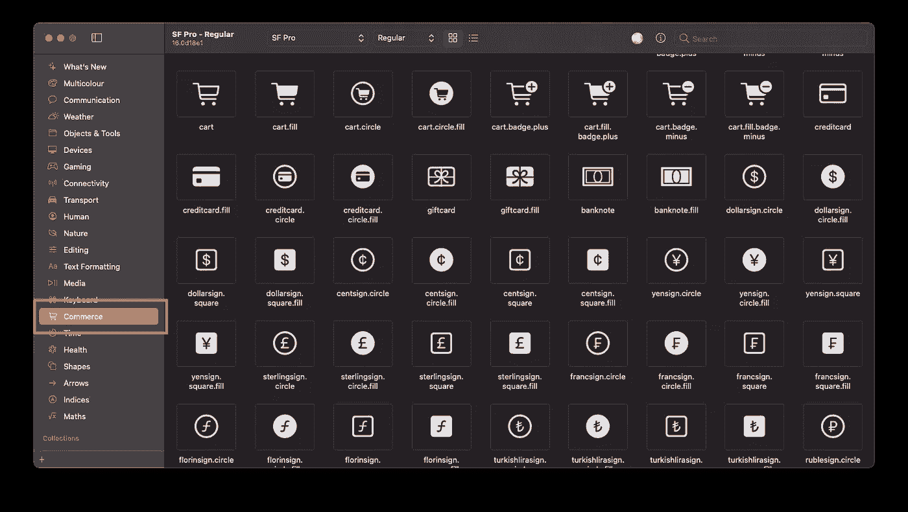

作者创作的截图

我们将使用常规的“购物车”图标。为此，将`ContentView`结构修改如下:

您的预览应该是这样的:

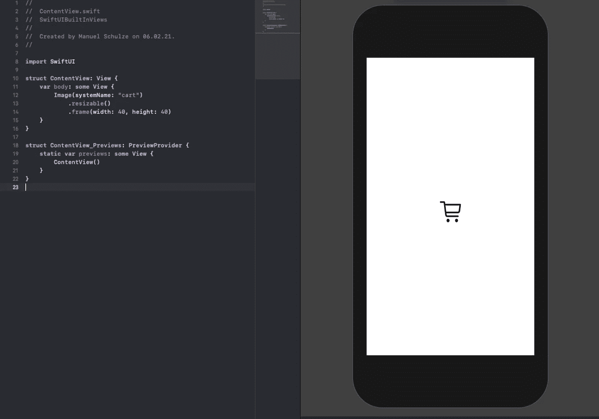

作者创作的截图

SF 符号有一个初始化器，它接受一个名为`systemImage`的参数。对于你自己的图标或图像，你可以使用初始化器`Image(name:)`。为了让图像占据整个框架的空间，你必须使用 resizable 修改器。

大小和排列可能对你来说不够，但这应该给你足够的信息来开始使用图像。

*何时使用:和* `*Text*` *一样，* `*Image*` *视图会被大量使用。您可以使用它来显示用户图像、图标或缩略图。*

# 让用户通过按钮、菜单、链接和导航链接触发操作

对于 99%的 iOS 应用程序来说，我们不能只有一个一直显示的单一屏幕。用户希望根据他们的选择导航到子视图或显示其他信息。

这就是`Menu`、`Link`和`NavigationLink`前来救援的地方。

`Menu`允许我们向用户显示选项菜单，用户可以从中选择。

`Link`允许你打开一个 URL，然后通常会打开 Safari，但也可能会深度链接到另一个应用程序。

`NavigationLink`用于在您的应用内导航。您可以将它与`List`视图结合起来，打开列表项的详细页面。

用以下内容替换当前的`ContentView`实现，并运行模拟器查看不同的视图:

下面，你可以看到一个视频，演示每次点击会发生什么。`Menu`更难想象，但你可以自己尝试。您应该会在控制台中看到`print`语句:

作者制作的视频

`Menu`获取作为第一个参数传递的控件的标题。它也以不同的观点为内容。从技术上来说，你可以使用一个简单的`Text`视图作为内容，但是这样你就不能根据用户的选择做任何事情。这就是我们在这里使用`Buttons`的原因。

`Link`用于打开更好编程的发布页面。在这种情况下，它只需在 Safari 中打开它。它将应该显示的标签文本和应该打开的 URL 作为参数。

最后，我们创建了一个包含三个`NavigationLinks`的`List`视图。第一个参数`destination`取应该打开的视图。在这种情况下，我们打开一个只包含文本的视图。您可以用您将要构建的任何子视图来替换它。

标签需要一个视图(在本例中，是一个用作`NavigationLink`标签的`Text`视图)。

*何时使用:无论何时你想打开其他视图或应用程序，你都可以使用这些基本控件。你也可以通过编程打开其他视图，但最简单的方法是通过* `*NavigationLink*` *和* `*Link*` *。* `*Menu*` *非常适合用户可以触发几个动作之一的上下文菜单。*

# 从这里去哪里

本指南旨在为您提供 SwiftUI 中可用视图的概述。还有许多其他很棒的视图，比如显示任务进度的`ProgressView`或允许并排显示图标和文本的`Label`(在列表中很常见)。

`List`虽然它在 iOS 开发中扮演着重要角色，但它本身只被略微提及，因为大多数应用程序都由许多列表组成。栈是 SwiftUI 的另一个重要部分，你应该看看。我打算写一些文章，详细介绍栈和列表。

最后，我们只是触及了我向您展示的视图的表面。

这就是为什么我建议你阅读关于内置视图的苹果文档。此外，确保研究这些视图，并尝试构建一个或两个包含上述元素的应用程序。

SwiftUI 视图非常容易使用，而且非常强大，有很多定制选项。你和他们玩得越多，就越有趣，你就能更好地为手头的任务选择正确的控制。

祝您阅读愉快并感谢您的阅读！