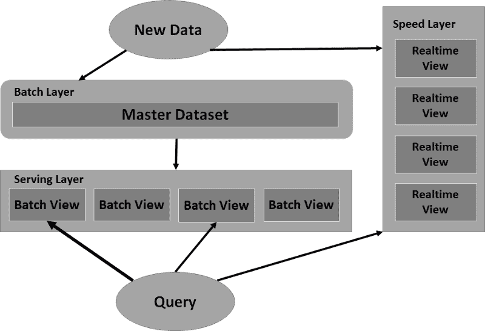

# Lambda 架构概述

> 原文：<https://betterprogramming.pub/an-overview-of-lambda-architecture-baf460cabc81>

## 知道它是如何工作的，为什么使用它，什么时候不使用它

阿图罗·卡斯塔涅拉在 [Unsplash](https://unsplash.com?utm_source=medium&utm_medium=referral) 上拍摄的照片。

这个世界产生的数据量爆炸式增长。无论是来自物联网(IoT)、社交媒体、应用指标还是设备分析，在任何给定时刻可以处理和分析的数据量都是惊人的。大数据正在兴起，数据系统肩负着处理大数据的重任。

但是这回避了下面的问题:这些系统准备好了吗？

# 大数据的挑战

当数据系统正确地回答了关于它们包含的所有数据的正确问题时，它们是最有用的。然而，对于大数据，每分钟都有新数据进入系统，而且数量非常多。数据系统面临两个基本挑战。

1.  延迟问题:我可以根据从我存在之初到现在的所有数据流，得到你的问题的超精确答案，但这需要一段时间。我希望你不介意等待。
2.  准确性问题:我终于为你找到了超精确的答案。遗憾的是，我花了很长时间才获得它们，它们不再是最新的和准确的。

# 介绍 Lambda 架构

Lambda 架构是一种大数据*范式* — 一种构建数据系统以克服延迟和准确性问题的方式。它是由内森·马兹和詹姆斯·沃伦在 2015 年首次推出的。Lambda 架构将系统分为三层:批处理层、速度层和服务层。我们稍后会详细讨论这些。

Lambda 架构是水平可扩展的。这意味着，如果您的数据集变得太大或者您需要的数据视图太多，您需要做的就是添加更多的机器。它还将系统中最复杂的部分限制在速度层，在速度层中，输出是临时的，如果需要改进或校正，可以(每隔几小时)丢弃。

# Lambda 架构是如何工作的？

如上所述，Lambda 架构由三层组成。第一层(批处理层)存储整个数据集并计算批处理视图。存储的数据集是不可变的，并且是只追加的。新数据不断流入并附加到数据集，但旧数据将始终保持不变。批处理层还计算批处理视图，这些视图是对*整个数据集*的查询或函数。随后可以查询这些视图，以获得对整个数据集的问题的低延迟答案。然而，缺点是计算这些批处理视图需要很多时间。

Lambda 架构中的第二层是服务层。服务层加载到批处理视图中，与传统数据库非常相似，允许对这些批处理视图进行只读查询，从而提供低延迟响应。一旦批处理层准备好一组新的批处理视图，服务层就用当前组替换现在已经过时的一组批处理视图。

第三层是速度层。流入批处理层*的数据也流入速度层*。不同之处在于，批处理层保留自其开始以来的所有数据，而速度层只关心自最后一组批处理视图完成以来到达的数据。速度层通过处理批处理视图尚未考虑的最新数据的查询来弥补计算批处理视图的高延迟。

作者照片。

# 三层——一个类比

考虑一个独自住在一座巨大大厦里的老人。他豪宅里的每个房间都有一只钟，但是除了厨房里的那只，所有的钟都是错的。有一天，这个人决定用厨房的钟作为正确的时间来设置所有的钟。但是他的记忆力很差，所以他在一张纸上记下了厨房时钟上的当前时间(上午 9:04)。他开始绕着大厦慢慢走，把所有的时钟都调到上午 9:04。发生了什么事？当他走到东翼客房的最后一个时钟时，是上午 9 点 51 分。他也把这个时钟设置为他纸上写的时间——上午 9 点 04 分，就像他对所有其他时钟所做的那样

难怪他所有的钟都不准！

如果一个数据系统只有一个批处理层，这就是我们会遇到的问题。我们所提问题的答案将不再是最新的，因为我们花了很长时间才得到这些答案。

幸运的是，这个人记得他有一个旧的跑步者秒表。第二天，他早上 9:04 又开始在厨房工作。他把时间写在一张纸上。他启动秒表 *(* 他的速度层)，开始绕着他的豪宅走。现在，当他走到东翼的最后一个时钟时，他看到写着“上午 9:04”的报纸，他看到他的秒表显示，“47 分 16 秒。”通过一点数学知识，他知道将最后一个时钟设置为上午 9:51

在这个不可否认并不完美的类比中，男人是服务层。他拿着批量视图(上面写着“上午 9:04”的纸)在他的豪宅里转了一圈，回答“几点了？”但他还做了额外的工作，协调批处理视图和速度层，以获得尽可能准确的答案。

# 为什么要用 Lambda 架构？

在 Marz 和 Warren 关于 Lambda 架构的开创性[书](https://livebook.manning.com/book/big-data)、*大数据*中，他们列出了大数据系统的八个理想属性，描述了 Lambda 架构如何满足每一个属性:

1.  鲁棒性和容错性。因为批处理层被设计为仅附加的，包含从时间开始的整个数据集，所以该系统是人类容错的。如果有任何数据损坏，那么从损坏点向前的所有数据都可以被删除并用正确的数据替换。批处理视图可以换成完全重新计算的视图。速度层可以被丢弃。在生成一组新的批处理视图的时间内，整个系统可以被重置并再次运行。
2.  可扩展性。Lambda 体系结构设计为分层分布式系统。通过简单地添加更多的机器，最终用户可以轻松地横向扩展这些系统。
3.  一般化。由于 Lambda 架构是一个通用的范例，采用者不会被限制在计算这个或那个批处理视图的特定方式中。可以设计批处理视图和速度层计算来满足数据系统的特定需求。
4.  扩展性。随着新类型的数据进入数据系统，新的视图将变得必要。数据系统不局限于特定种类或特定数量的批处理视图。新的视图可以被编码并添加到系统中，唯一的限制是资源，这很容易扩展。
5.  即席查询。如有必要，批处理层*可以*支持批处理视图中不可用的特殊查询。假设这些特殊查询的高延迟是允许的，那么批处理层的有用性不仅限于它生成的批处理视图。
6.  最少的维护。Lambda 架构的典型代表是将 Apache Hadoop 用于批处理层，将 ElephantDB 用于服务层。两者都很容易维护。
7.  可调试性批处理图层计算批处理视图的输入始终相同:整个数据集。与调试在数据流快照上计算的视图相比，Lambda 架构中每一层的输入和输出都不是移动的目标，这极大地简化了计算和查询的调试。
8.  低延迟读取和更新。在 Lambda 架构中，大数据系统的最后一个属性由速度层实现，它提供最新数据集的实时查询。

# Lambda 架构的缺点

虽然 Lambda 架构的优点看起来很多而且简单明了，但是也有一些缺点需要记住。首先，成本将成为一个考虑因素。虽然*如何*扩展并不复杂——只需添加更多的机器——但我们可以看到，批处理层必然需要随着时间的推移而扩展和增长。由于所有数据都是仅追加的，批处理层中的数据不会被丢弃，因此扩展的成本必然会随着时间的推移而增加。

其他人已经注意到维护两套独立的代码来计算批处理层和速度层的视图的挑战。这两层都处理相同的数据集，或者在速度层的情况下，是数据集的子集，并且这两层的问题是相似的。然而，由于这两层构建在完全不同的系统上(例如，Hadoop 或雪花用于批处理层，而 Storm 或 Spark 用于速度层)，两个独立系统的代码维护可能会很复杂。

# 机器学习中的 Lambda 架构

在机器学习领域，毫无疑问*越多*数据越好。然而，为了让机器学习应用算法或检测模式，它需要以有意义的方式接收数据。

机器学习不是在没有任何结构外观的情况下从不同方向接收数据，而是可以通过首先通过 Lambda 架构数据系统处理数据来受益。从那里，机器学习算法可以提出问题，并开始理解进入系统的数据。

# 物联网的 Lambda 架构

虽然机器学习可能在 Lambda 架构的*输出*端，但物联网很可能在数据系统的*输入*端。想象一个由数百万辆汽车组成的城市，每辆汽车都装有传感器来发送天气、空气质量、交通、位置信息、驾驶习惯等数据。*这个*是将被送入 Lambda 架构的批处理层和速度层的大规模数据流。

物联网设备是在大数据中提供数据的完美例子。

# 流处理和 Lambda 架构挑战

我们在上面提到过，速度层只关心自完成最后一组批处理视图以来到达的数据。虽然这是真的，但有必要澄清一下:那一小部分数据是*而不是*存储的。它在流入时立即被处理，然后被丢弃。速度层也称为“流处理层”请记住，速度层的目标是提供最新数据的低延迟实时视图，这些数据是批处理视图尚未考虑的。

在这一点上，Lambda 架构的最初作者提到了“最终准确性”，注意到批处理层努力实现精确计算，而速度层努力实现近似计算。速度层的近似计算最终将被下一组批处理视图所取代，使系统向“最终精度”迈进。

实时处理数据流以产生随着新数据流不断更新的视图(毫秒级)是一项极其复杂的任务。在这些情况下，通常建议将基于文档的数据库与索引和查询系统结合使用。

# Lambda 架构和 Kappa 架构的区别

我们在上面提到，Lambda 架构的一个相当大的缺点是维护两个独立的代码库来处理类似的处理，因为批处理层和速度层是不同的分布式系统。Kappa architecture 试图通过完全移除批处理层来解决这一问题。

相反，*从最近数据计算出的实时视图*和*从所有数据计算出的批处理视图都在单个流处理层中执行。整个数据集——不可变数据的仅附加日志——快速流过系统，以产生具有精确计算的视图。同时，来自 Lambda 架构的原始“速度层”任务保留在 Kappa 架构中，仍然为低延迟视图提供近似计算。*

*Kappa 架构的这种差异允许维护一个用于生成视图的*单个*系统，这大大简化了系统的代码库。*

# *通过 Heroku 上的容器实现 Lambda 架构*

*使用 Docker 可以轻松地协调和部署支持 Lambda 架构所需的各种工具——尤其是在您刚刚开始尝试的时候。*

*Heroku 很好地充当了基于容器的云平台即服务(PaaS)，允许您轻松部署和扩展您的应用程序。对于批处理层，您可能会为 [Apache Hadoop](https://github.com/big-data-europe/docker-hadoop) 部署一个 Docker 容器。作为速度层，你可以考虑部署[阿帕奇风暴](https://hub.docker.com/_/storm/)或者[阿帕奇火花](https://hub.docker.com/r/bitnami/spark/)。最后，对于服务层，您可以为 [Apache Cassandra](https://hub.docker.com/_/cassandra) 或 [MongoDB](https://hub.docker.com/_/mongo) 部署 Docker 容器，并通过 [Elasticsearch](https://www.elastic.co/guide/en/elasticsearch/reference/current/docker.html) 进行索引和查询。*

# *结论*

*承担大数据的任务不适合胆小的人。伸缩性和系统健壮性是巨大的挑战，所以 Lambda 架构这样的范例带来了出色的指导。随着大量数据流进入数据系统，批处理层提供高延迟准确性，而速度层提供低延迟近似值。同时，速度层通过协调这两个视图来响应查询，以提供最佳的可能响应。*

*实现 Lambda 架构数据系统并不简单。虽然这些工具可能很复杂，而且最初令人望而生畏，但是它们是可用的，并且可以随时部署。*