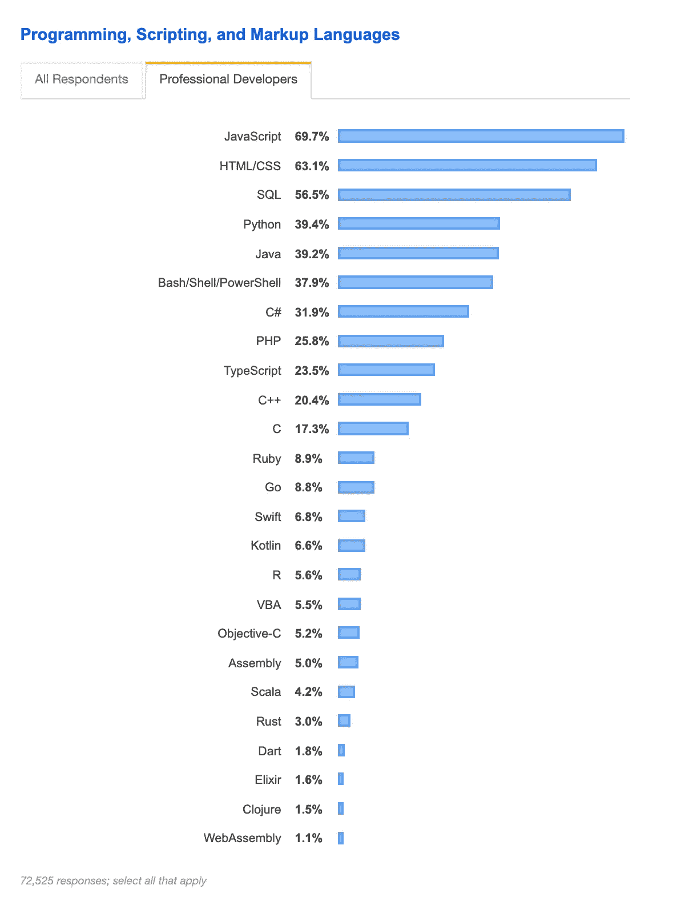

# React 应用的下一代 JavaScript 特性概述

> 原文：<https://betterprogramming.pub/an-overview-of-next-generation-javascript-features-for-react-apps-4b8957248fe7>

## 下一代 JavaScript 使用箭头函数、let、const、和等更新的语法


照片由[普里西拉·杜·普里兹](https://unsplash.com/@priscilladupreez?utm_source=unsplash&utm_medium=referral&utm_content=creditCopyText)在 [Unsplash](https://unsplash.com/search/photos/next-generation?utm_source=unsplash&utm_medium=referral&utm_content=creditCopyText) 上拍摄

下一代 JavaScript 可以被视为 ECMAScript 的最新版本，ECMAScript 是 JavaScript 的标准化规范。

每个版本都努力改进这种日益流行的编程语言，并为其添加新的功能。JavaScript 已经占领了软件开发的世界。

据 [Codeburst.io](https://codeburst.io/10-top-programming-languages-in-2019-for-developers-a2921798d652) 介绍，JavaScript 是开发者的顶级编程语言。它被公认为 2019 年 Stack Overflow 开发者调查中最受欢迎的编程语言，也是 GitHub 上最受欢迎的编程语言。

不用说，JavaScript 是软件开发人员需要了解的关键语言。

[2019 年栈溢出开发者调查结果:](https://insights.stackoverflow.com/survey/2019#most-popular-technologies)



来源:[https://insights . stack overflow . com/survey/2019 #最受欢迎的技术](https://insights.stackoverflow.com/survey/2019#most-popular-technologies)

下一代 JavaScript 使用箭头函数，let，const，和其他更新的语法。现代 React 应用程序通常使用 JavaScript 语言的这些更新功能。

# **let 和 const**

在 JavaScript 的 ES6 版本 ECMAScript 2015 中，JavaScript 中引入了两个新的关键字，`let`和`const`。

这些关键字取代了之前的`var`关键字，后者定义了一个全局变量。`var`变量的范围是整个封闭函数。

由`let`声明的变量在为其定义的块中以及任何包含的子块中都有它们的作用域。在下一代 JavaScript 中，`let`和`const`取代了`var`。

但是，如果您计划不重新分配这个“变量”，则使用`const`。

# **箭头功能**

箭头函数是 JavaScript 中创建函数的另一种方式。除了具有更短的语法之外，它们还在维护`this`关键字的范围方面提供了优势。

根据 Mozilla 的说法:

> “箭头功能没有自己的`this`。使用封闭词法范围的`this`值；箭头函数遵循正常的变量查找规则。因此，在搜索当前作用域中不存在的`this`时，一个箭头函数最终从它的封闭作用域中找到了`this`

在下面的代码中，传递给`setInterval`的函数中的`[this](https://developer.mozilla.org/en-US/docs/Web/JavaScript/Reference/Functions/Arrow_functions#No_binding_of_this)` [与词法封闭函数中的`this`具有相同的值:](https://developer.mozilla.org/en-US/docs/Web/JavaScript/Reference/Functions/Arrow_functions#No_binding_of_this)

```
function Person(){
  this.age = 0;

  setInterval(() => {
    this.age++; // |this| properly refers to the Person object
  }, 1000);
}

var p = new Person();function callMe(name) { console.log(name); }const callMe = function(name) { console.log(name); }becomes: const callMe = (name) => { console.log(name); }**Important:**When there are no arguments, use empty parentheses in the function declaration: const callMe = () => { console.log('Kevin!'); }When there is only one argument, you may omit the parentheses around the argument: const callMe = name => { console.log(name); }If there are two or more arguments, then you need to include the parentheses around the arguments:  const callMe = (name, age) => { console.log(name, age);}When just returning a value, you can use this shortcut, which removes the curly braces and the return keyword:  const returnMe = name => nameThe above is the same as: const returnMe = name => { return name; }
```

# **进出口**

在 React 和所有遵循最佳实践的现代 JavaScript 项目中，惯例是将代码拆分到多个称为模块的 JavaScript 文件中。这样做是为了遵守[单一责任原则](https://en.wikipedia.org/wiki/Single_responsibility_principle)，同时保持每个文件和模块的可管理性。

要访问另一个文件中的代码，必须使用`export`关键字将其导出，并使用`import`语句将其导入接收文件。

因为 React 只是一个 JavaScript 库，所以它的模式是相似的，其中组件是使用`import`和`export`语句来传输的。

组件让你将用户界面分割成独立的、可重用的部分，并孤立地考虑每一部分。有两种类型的导出，默认(未命名)和命名导出:

```
**default** => export default ...;**named** => export const someData = ...;Default exports can be imported this way: import chosenName from './path/to/file.js';chosenName is something that you simply choose. **Named** exports must be imported explicitly by their name:import { someData } from './path/to/file.js';
```

虽然一个文件只能包含一个默认导出，但命名导出的数量是无限的。单个默认导出也可以与同一文件中任意数量的命名导出组合。

```
**named** exports can be imported cumulatively with the following syntax:import * as nameYouPick from './path/to/file.js';nameYouPick is a name you come up with. It bundles all exported variables and functions into a simple JavaScript object. If you

export const someData = ... (/path/to/file.js )

That import can be accessed using nameYouPick, much like you would access any other value on a JavaScript object: nameYouPick.someData 
```

# **类**

类类似于构造函数。它们用于定义创建 JavaScript 对象的蓝图。React 使用类来创建组件。

```
 class Person { constructor () { this.name = 'Kevin'; } }//here we are instantiating the Person class const person = new Person(); console.log(person.name); // prints 'Kevin' to the console
```

在上面的例子中，`class`和那个类的属性`this.name`都被明确定义。这是较早的 ECMAScript 定义属性的方法。

在使用下一代特性的现代 JavaScript 项目中，定义类属性的更简单的方法如下，省略了引用`this.name`的显式属性定义:

```
 class Person { name = 'Kevin'; } const person = new Person(); console.log(person.name); // prints 'Kevin'
```

# **类别和定义方法**

```
**Option 1:** class Person { name = 'Kevin'; printMyName () { console.log(this.name); 
// '**this**' is required to refer to the class } } const person = new Person(); person.printMyName(); **Option 2:** class Person { name = 'Kevin'; printMyName = () => { console.log(this.name); } } const person = new Person(); person.printMyName();
```

注意:第二种方法，选项二，具有使用箭头函数和绑定带来的优势:`|this|`关键字不改变它的引用。

箭头函数*不*绑定自己的`this` *。*代替了*，*箭头功能*在词汇上*绑定了它们的上下文，所以`this`实际上指的是源上下文。

在上面的例子中，`this`指的是`Person`类，因为`Person`类是原始上下文。当你在一个箭头函数中使用`this`时，它会保持它的上下文，不会在运行时突然改变它。

当不使用箭头函数时，必须使用`bind()`方法将`|this|`显式绑定到该类。

`[bind()](https://developer.mozilla.org/en-US/docs/Web/JavaScript/Reference/Global_objects/Function/bind)` [方法](https://developer.mozilla.org/en-US/docs/Web/JavaScript/Reference/Global_objects/Function/bind)创建一个新函数，当调用该函数时，它的`this`关键字被设置为提供的值，当调用新函数时，在任何提供的参数之前有一个给定的参数序列:

```
var module = {
  x: 40,
  getX: function() {
    return this.x;
  }
}var unboundGetX = module.getX;
console.log(unboundGetX()); // The function gets invoked at the **global** scope
// expected output: undefinedvar boundGetX = unboundGetX.bind(module);
console.log(boundGetX());
// expected output: 40
```

# **类和继承**

JavaScript 中的继承类似于[原型](https://developer.mozilla.org/en-US/docs/Learn/JavaScript/Objects/Object_prototypes)，这是 JavaScript 对象相互继承特性的机制。

```
 class Human { species = 'human'; }//The extends keyword is used to inherit from the above Human class, which is known as the Parent class. class Person extends Human { name = 'Kevin'; printMyName = () => { console.log(this.name); } } const person = new Person();person.printMyName();
console.log(person.species); // prints 'human'
```

# **展开和停止操作者**

spread 和 rest 运算符都使用相同的三倍周期语法:`…`

应用程序决定您是将它用作 spread 还是 rest 操作符。rest 操作符用于将一组函数参数合并到一个数组中。

相反，spread 运算符允许您从数组中提取元素，或者从对象中提取属性。下面是演示扩展运算符的两个示例:

```
const oldArray = [1, 2, 3];const newArray = [...oldArray, 4, 5]; // The newArray is now [1, 2,3, 4, 5];The spread operator used on an object: const oldObject = { name: 'Kevin' }; const newObject = { ...oldObject, gender: 'Male' };newObject would then be {
    name: 'Kevin', gender: 'Male'
 }
```

spread 运算符对于克隆数组和对象都很有用。两者都是引用类型而不是原语。这意味着，如果它们被重新分配，指针而不是值被复制。

如果您想要真正地制作一个副本，那么创建一个新对象时应该只复制属性，而不是复制整个对象。安全地复制引用类型，同时消除副作用或对复制的原始内容的更改，可能会有问题。

spread 操作符通过提供一种简洁而简单的方法来创建对象或数组的浅层克隆，从而避免了这些潜在的副作用。

使用 rest 运算符的示例:

```
const filter = (...args) => args.filter(el => el === 1);console.log(filter(1, 2, 3)); // [1]
```

在上面的例子中，用作 rest 操作符的`…`将参数合并到一个数组中。`filter()`方法将对传入数组中的每个元素执行一个函数。

如果元素等于 1，`filter()`方法将返回一个`true`或`false`布尔值。在 JavaScript 中`===`(三个等号)检查类型和值是否相等，因此`el`也必须是一个数字。

# **解构**

析构允许轻松访问数组或对象的值，以便将它们赋给变量。

Spread 取出所有元素或所有属性，并将它们分布在一个新的数组或对象中。析构允许你提取单个元素或属性，并把它们存储在数组和对象的变量中。

```
Array Destructuring: const array = [1, 2, 3]; const [a, b] = array; console.log(a); // prints 1 console.log(b); // prints 2 console.log(array); // prints [1, 2, 3] Object Destructuring: const myObj = { name: 'Kevin', gender: 'Male' } const {name} = myObj; console.log(name); // prints 'Kevin' console.log(gender); // prints undefinedconsole.log(myObj); // prints {name: 'Kevin', gender: 'Male'}Destructuring is very useful when working with functionarguments. Consider this example: const printName = (personObj) => { console.log(personObj.name); }printName({name: 'Kevin', gender: 'Male'}); // prints 'Kevin'Here, we only want to print the name in the function but we pass a complete person object to the function. This is not a problem, but it forces us to call personObj.name inside of our function. We can condense this code with destructuring: const printName = ({name}) => { console.log(name); }printName({name: 'Kevin', gender: 'Male'}); // prints 'Kevin')
```

在应用对象析构之后，我们得到了与上面例子相同的结果，同时减少了输入的代码量。

通过析构，我们简单地取出 name 属性并将其存储在一个名为`name`的变量/参数中，然后可以在函数体中使用它。

希望这些下一代 JavaScript 特性在创建普通 JavaScript 和单页面 React 应用程序时都有用。

# 来源

[](https://www.udemy.com/share/1000uMAkEedV1TQ3Q=/?xref=E0AZdFpRRHoJSUQvCz0GJVUWTx4dChQ%2BVFE=) [## React 16:完整课程(包括 React 路由器 4 和 Redux)

### 本课程是 React 的最新版本，包括 React 挂钩！当然会保留…

www.udemy.com](https://www.udemy.com/share/1000uMAkEedV1TQ3Q=/?xref=E0AZdFpRRHoJSUQvCz0GJVUWTx4dChQ%2BVFE=) [](https://developer.mozilla.org/en-US/docs/Web/JavaScript/Reference/Classes) [## 班级

### ECMAScript 2015 中引入的 JavaScript 类主要是 JavaScript 现有的语法糖…

developer.mozilla.org](https://developer.mozilla.org/en-US/docs/Web/JavaScript/Reference/Classes) [](https://developer.mozilla.org/en-US/docs/Web/JavaScript/Reference/Functions/Arrow_functions#No_binding_of_this) [## 箭头功能

### 箭头函数表达式在语法上是正则函数表达式的紧凑替代，尽管没有…

developer.mozilla.org](https://developer.mozilla.org/en-US/docs/Web/JavaScript/Reference/Functions/Arrow_functions#No_binding_of_this) [](https://developer.mozilla.org/en-US/docs/Web/JavaScript/Reference/Functions) [## 功能

### 一般来说，函数是一个“子程序”,可以被外部代码调用(或者在…

developer.mozilla.org](https://developer.mozilla.org/en-US/docs/Web/JavaScript/Reference/Functions) [](https://developer.mozilla.org/en-US/docs/Learn/JavaScript/Objects/Object_prototypes) [## 对象原型

### 原型是 JavaScript 对象相互继承特性的机制。在本文中，我们解释…

developer.mozilla.org](https://developer.mozilla.org/en-US/docs/Learn/JavaScript/Objects/Object_prototypes) [](https://developer.mozilla.org/en-US/docs/Web/JavaScript/Reference/Global_objects/Function/bind) [## 函数.原型.绑定()

### bind()方法创建了一个新函数，当调用该函数时，它的 this 关键字被设置为提供的值，并带有一个…

developer.mozilla.org](https://developer.mozilla.org/en-US/docs/Web/JavaScript/Reference/Global_objects/Function/bind)