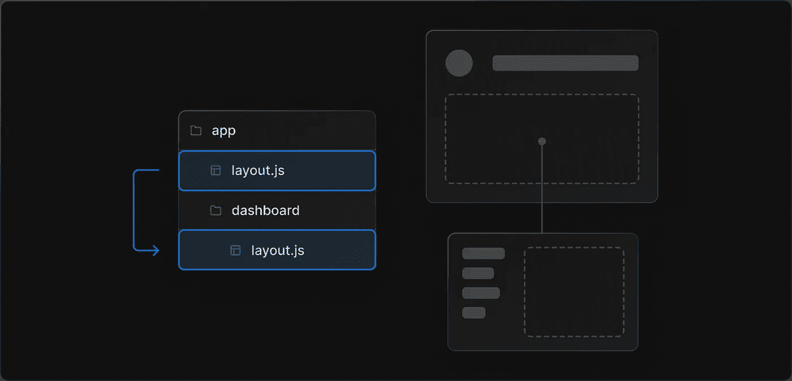
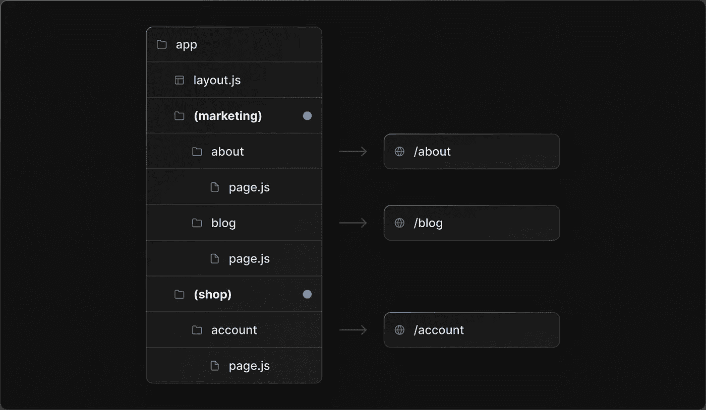
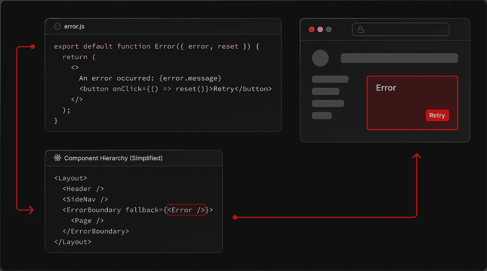

# Next.js 13 路由系统概述

> 原文：<https://betterprogramming.pub/an-overview-of-next-js-13-routing-system-1dcf73e2429f>

## Next.js 13 测试版功能的快速概述


Next.js 13 以一种有些令人困惑的方式登陆。增加了许多显著的东西；不过，好的部分还是 Beta。尽管如此，Beta 特性给了我们关于 Next.js 的未来将如何形成的重要信号，所以有很好的理由密切关注它们，即使你打算等待采用它们。

本文是关于 Beta 特性的系列体验的一部分。今天我们来探索一下新的路由系统。

Next.js 13 引入了一个全新的`app`文件夹，拥有完全翻新的路由系统。它包括许多改进，其中，最好的礼物是新的布局机制。

只要它们的路线不冲突，`app`文件夹可以与旧的`pages`文件夹共存，这允许你逐步采用。这个故事将涵盖最引人注目的新东西与`app`文件夹。

# 新文件夹结构

`app`文件夹通过要求每条路线都是一个文件夹，使得定义路线更加明确。路由文件夹通常包含以下路由文件(带`.js|.ts|.jsx|.tsx`后缀):

*   **页面—** 提供特定于该路线的用户界面。
*   **布局—** 为此路线和所有后代路线提供布局 UI。
*   **加载—** 在加载路由的服务器组件时提供一个加载 UI—下一节将详细介绍。
*   **错误—** 提供处理该路由内和路由下的错误的 UI(除非由后代层中的另一个`error`路由处理)。

有关服务器组件的更多信息，请查看下面的故事[。](/fun-with-next-js-13-server-components-fd5f886c31f3)

# 布局和嵌套

更新的文件夹结构为引入更多基于约定的路线文件奠定了良好的基础。因此，现在在 Next.js 中创建、共享和嵌套布局比以往更加容易。

让我们看看有什么变化。

## 在以前的版本中

在 Next.js 13 之前，官方推荐的创建嵌套布局的方法是每个`Page`都“声明”它的布局，组成嵌套，然后在`pages/_app`的顶层应用它们。

```
// pages/index.js

export default function Page() {
  return (
    /** Your content */
  )
}

Page.getLayout = function getLayout(page) {
  return (
    <Layout>
      <NestedLayout>{page}</NestedLayout>
    </Layout>
  )
}
```

```
// pages/_app.js

export default function MyApp({ Component, pageProps }) {
  // Use the layout defined at the page level, if available
  const getLayout = Component.getLayout || ((page) => page)
  return getLayout(<Component {...pageProps} />)
}
```

虽然这种方法可以获得最佳的性能(因为在改变路由时不会重新安装布局)，但是它很麻烦而且不自然，尤其是与 react-router 提供的相比。

## 使用 Next.js 13

新的路由系统使“布局”成为一等公民。在`app`下的任何级别的文件夹中(即任何级别的路由)，您可以使用`layout.tsx`来显式定义容器组件。该容器组件将自动环绕该文件夹中的所有页面。如果在不同的层次上有多个`layout.tsx`组件，则会自动构建一个包装层次结构:



[https://beta.nextjs.org/docs/routing/pages-and-layouts](https://beta.nextjs.org/docs/routing/pages-and-layouts)

比老`getLayout`黑的直白多了吧？

“分组”功能也可用于创建页面的“逻辑”组，以共享相同的布局，而无需引入额外的路由层:



[https://beta . nextjs . org/docs/routing/defining-routes # route-groups](https://beta.nextjs.org/docs/routing/defining-routes#route-groups)

如你所见，虽然`/about`和`/blog`不共享相同的路由前缀，但是它们可以通过驻留在相同的路由组中来共享相同的布局。谁不喜欢多一点灵活性呢👻？

# 其他注释

## 将数据从布局传递到子级

你不能这么做。但是这个问题并没有看起来那么严重，因为 Next.js 13 中的新数据获取机制具有内置的重复数据删除和缓存，所以在 layout 及其子组件中重复获取数据并没有什么坏处。

我将在以后的文章中介绍新的数据获取系统。

## 打破布局层次结构

页面没有办法“逃离”路由层次结构中的布局祖先。你必须仔细设计你的路线或路线组。相比之下，SvelteKit 确实在这方面提供了更好的灵活性。

# 错误处理

错误处理是一个小而方便的特性。这个想法很简单:

1.  React 有一个[错误边界](https://reactjs.org/docs/error-boundaries.html)概念，用于以结构化的方式捕获错误。
2.  Next.js 的路由文件夹自然形成了一个组件层次结构。
3.  为什么我们不发明一种约定来处理任何级别的路由错误呢？

这就是`error.tsx`文件的作用。这不过是在一个`<ErrorBoundary />`中包装派生组件树的语法糖:



[https://beta.nextjs.org/docs/routing/error-handling](https://beta.nextjs.org/docs/routing/error-handling)

这样，错误被定位到由子路线呈现的 UI 部分，而不影响任何其他部分的显示和交互性。

感谢阅读。

```
Want to Connect?

I'm the creator of [ZenStack](https://zenstack.dev/?utm_campaign=medium&utm_medium=organic&utm_content=nextjs_new_routing), a toolkit that supercharges
Prisma ORM with a powerful access control layer and
unleashes its full potential for full-stack development.
Our goal is to let you save time writing boilerplate code
and focus on building what matters - the user experience.
```