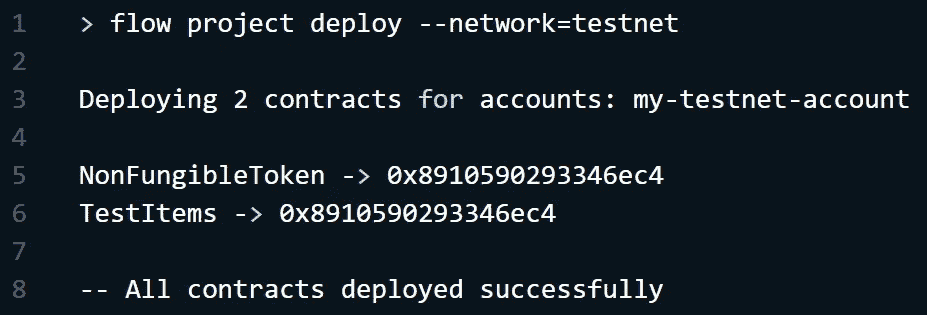
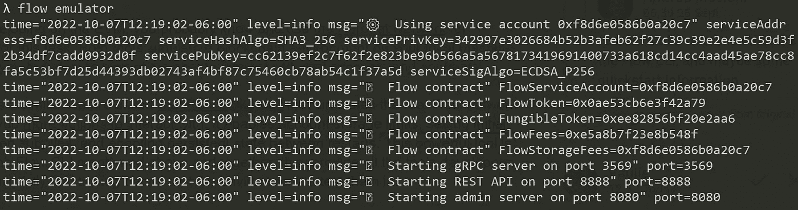
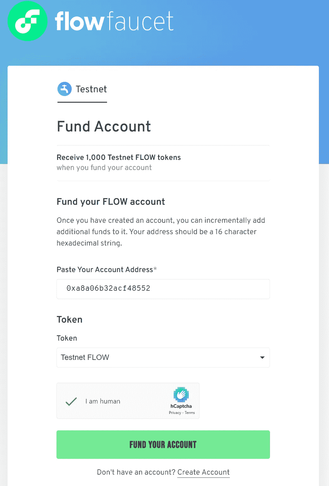
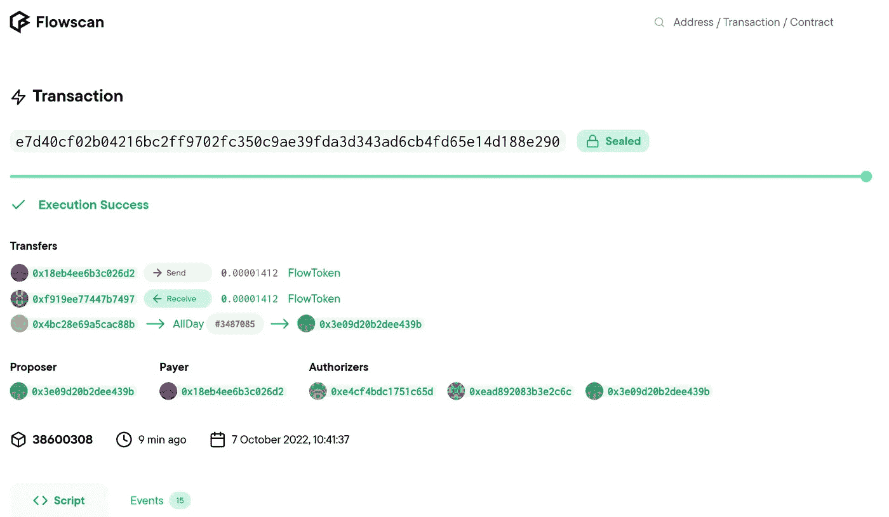
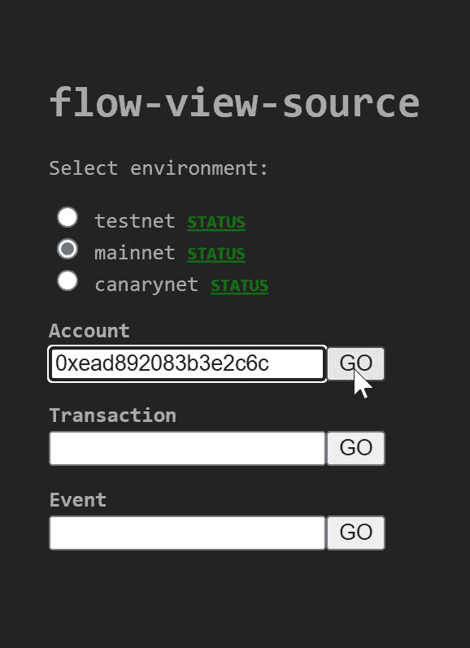
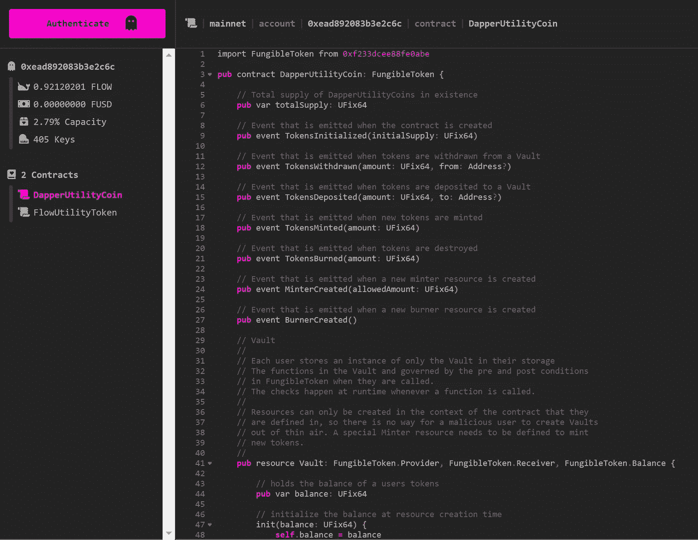
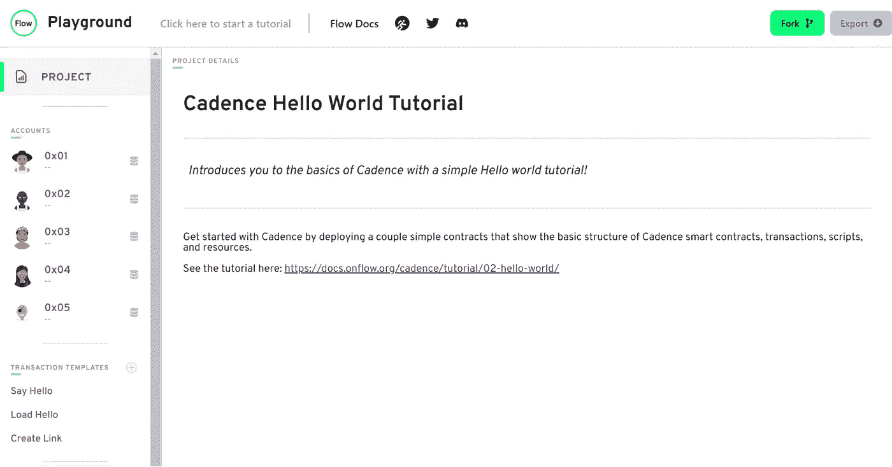

# 流程和节奏开发工具概述

> 原文：<https://betterprogramming.pub/an-overview-of-the-tools-for-developing-on-flow-cadence-24bfe3b34d83>

## 智能合约开发是一个复杂的过程，由不同的重要步骤组成。找出哪个工具提供了最好的价值

智能合约开发与其他类型的软件开发没有什么不同。编写代码是为了执行某项任务，一些工具有助于简化这一过程。以太坊生态系统包含了很多帮助构建 Web3 项目的成熟工具，但是一个更新的生态系统，比如 Flow 呢？

如果您已经关注了本系列，您将会了解到区块链流已针对数字资产创建和管理进行了优化。此外，Cadence 的智能合同语言通过其基于资源的方法和强大的静态类型系统，改善了其他语言的缺陷。

本文将研究智能合约开发人员可以用来简化流程构建的基本工具 CLIs、IDE 扩展、客户端库、本地网络等工具。我们还会将这些工具与你可能已经熟悉的以太坊工具进行对比，因此如果你正在切换到心流，你将确切地知道会发生什么。

# 命令行界面

命令行界面(CLI)是软件开发的基础。对于大多数开发人员来说，它们是直观的，并且很容易与其他软件集成。

这种简单的集成也适用于智能契约开发。例如，如果您需要快速部署一个契约来测试它或者用不同的帐户运行它，CLI 可以提供很大的帮助。稍后，当您想要将部署过程添加到 CI/CD 管道中时，您会很高兴拥有一个简单的 CLI 工具，您可以使用 shell 脚本来实现自动化。

在 EVM 兼容的网络上，如以太坊、松露和安全帽，都为这些任务提供了强大的工具。 [Hardhat Runner](https://hardhat.org/hardhat-runner) 用于 Hardhat 的几乎所有操作，而 [Truffle Console](https://trufflesuite.com/docs/truffle/getting-started/using-truffle-develop-and-the-console/) 使开发人员能够通过 JavaScript 与他们的智能合同快速交互，而不必编写脚本文件。

[Flow CLI](https://developers.flow.com/tools/flow-cli)是开发、测试和部署用 Cadence 编写的智能合同到 Flow 网络的主要工具。此外，它还是您与流区块链交互时使用的接口，例如创建和检查帐户、签署事务或使用脚本自动执行任务。

与以太坊不同，以太坊会生成一个地址来与区块链交互，Flow 要求您拥有一个帐户。此帐户持有您的智能合约、令牌和密钥，是与区块链交互所必需的。您可以使用 Flow CLI 轻松地[创建账户。](https://developers.flow.com/tools/flow-cli/create-accounts)

# IDE 扩展

接下来，您想要编写一些代码，Cadence 和 Solidity 等语言提供了静态类型检查，这为您提供了一些关于代码在编辑器中的行为的有用信息。

虽然 Solidity 附带了一个基本的类型系统，防止您混合不同的数字类型，但 Cadence 更进一步，引入了所有权的概念。您可能从 Rust 那里了解到了这一点，但基本思想是 Cadence 拥有只能由一个地址拥有的资源，如 NFTs。

Cadence IDE 扩展将在您编写代码时通知您有关 NFT 事务的问题，同时还提供语法突出显示、代码完成和类型检查。

# 棉短绒

您可能知道 JavaScript 等语言中的 linters，在这些语言中没有静态类型。在这种情况下，linter 有助于防止常见错误，并帮助开发人员遵循最佳实践。

对于 [Solhint](https://github.com/protofire/solhint) 来说也是如此，这是一个用于稳固的 linter 工具。再说一次，Solidity 的静态类型系统非常初级，在使用语言时不能防止很多错误。Solhint 在这里提供了帮助，并在类型系统之上提供了一些技巧来避免误用。

Cadence 语言有一个复杂得多的类型系统，提供的帮助多于可靠性。正确输入的 Cadence 智能合同比正确输入的 Solidity 合同更安全。

典型的 linter 功能通过其类型系统内置于 Cadence 语言本身，但是如果您想在 CI/CD 管道中对多个 Cadence 文件进行类型检查，那么 [Cadence lint](https://github.com/samatechtw/cadence-lint) 工具可以提供帮助。

# 本地网络

本地网络或网络仿真器是一种将在您的开发计算机上运行区块链网络的工具，因此您可以在一个干净的环境中进行测试，而不会冒险将未完成的智能合同推向一个真实的区块链。本地网络也具有较低的延迟，并允许您控制块创建，因此您可以逐步完成智能合约执行时发生的一切。

在 EVM 上开发时，你可能知道并使用[hard hat Network](https://hardhat.org/hardhat-network)或 Ganache 来完成这个任务。这两个工具在您的本地机器上模拟了一个区块链环境，并允许您派生一个版本的 mainnet 来与真实的帐户和合同进行交互。

Flow 提供了一个类似的功能，叫做[流模拟器](https://developers.flow.com/tools/emulator)，它模拟真实的流网络，但是给你[更多的选项](https://github.com/onflow/flow-emulator/blob/master/README.md#configuration)与之交互。它启用帐户存储限制，设置初始流令牌供应，并在重新启动之间启用持久状态。这个强大的工具是通过上面提到的 Flow CLI 使用的。总之，它们提供了开发人员构建全功能 dapps 和测试环境所需的所有特性。

安装了[Flow CLI](https://docs.onflow.org/flow-cli/install/)后，要启动模拟器，只需在终端中键入命令 flow emulator。

# 测试网水龙头

在开发智能合约时，您通常需要加密令牌来部署代码并与之交互。否则，您将如何测试事务？

心流，就像以太坊一样，有一个测试网和一个水龙头来给你提供免费的测试网流或 FUSD 用于开发。

此外，Blocto Swap 是一个多用途工具，使用户在 Flow 上创建帐户变得简单。你所要做的就是输入一个电子邮件地址。Blocto Swap 允许用户轻松地将他们的令牌交换为不同的类型，以便在测试中使用。如果该集合尚未在帐户中初始化，此工具对于获取 FUSD 也很方便。

**记住**:testnet 上的令牌在测试之外没有任何价值。

# 自动化测试

Cadence 和 Solidity 都有测试自动化工具，允许您用 JavaScript 编写测试。

Hardhat 开发工具使用 Chai 测试运行程序，并为您提供用于 EVM 的[智能契约匹配器](https://hardhat.org/hardhat-chai-matchers/docs/overview)和[网络助手](https://hardhat.org/hardhat-network-helpers/docs/overview)。

Cadence 有自己的工具，使用 Jest 作为基础，但是它们是框架不可知的。因此，如果你不喜欢开玩笑，你可以使用不同的测试运行程序。

# 区块链探索者

所有区块链网络的另一个重要部分是 block explorer——一个允许你检查链上发生的一切的工具。

对于以太坊网络，你可能知道[以太扫描](https://etherscan.io/)。这是一个网络应用程序，让你浏览 mainnet 和 testnet 的交易和地址。

Flow 附带了一个更强大的工具， [Flowser](https://docs.flowser.dev/) ！

Flowser(流浏览器)是一个 web 应用程序，但是您可以在本地运行它。它允许您浏览流 mainnet 和任何您用流模拟器启动的本地网络。它甚至附带了一个 GUI 来配置和启动模拟器，并管理您的开发钱包。

然而，如果你需要做的只是在流量 mainnet 或 testnet 上检查交易或浏览，那么传统的 block explorer [Flowscan](https://flowscan.org/) 将满足你的需求。

此外, [flow-view-source](https://flow-view-source.com/) 工具允许用户检查账户及其各种属性，例如余额、密钥以及它们可能包含的任何合同。

# 与 JavaScript 接口

要为您的智能合约构建一个分散式应用程序(dapp ),您需要在区块链网络和 web 之间架起一座桥梁。Flow 和以太坊都与 Webpack 集成来解决这个问题。

[当您更改 Solidity 代码时，Solidity Loader](https://github.com/ConsenSys/truffle-solidity-loader) 将自动重新加载您的应用程序，因此在开发过程中，您的前端始终运行当前版本的智能合约。

Cadence 通过其 [Webpack 插件](https://github.com/agencyenterprise/cadence-webpack-plugin)和[Cadence 实用程序](https://github.com/onflow/flow-cadut)提供类似的功能。

此外，[流客户端库](https://github.com/onflow/fcl-js) (FCL) JS 是开发人员快速开始构建流区块链的最佳方式之一。该软件包使与钱包和智能合约的交互变得简单而安全，同时提供了创建全功能 dapps 所需的所有工具。

# 操场

在环境中测试您的代码，而不需要投入时间来创建整个项目，这使得开发人员能够快速找出什么可行，什么不可行。为此，心流有了[心流游乐场](https://flow.com/play)。它不仅是快速迭代想法的优秀资源，而且也是学习的好环境，包括教程来教授重要的概念和如何构建常见的项目。

虽然以太坊没有任何和心流游乐场完全一样的项目，但是有几个你可以利用来创造类似的体验。在线 Solidity 代码编辑器 [Remix](https://remix.ethereum.org/) 提供了一个快速构建和测试智能合约的环境。此外，你可以跟随[开发者道学院](https://academy.developerdao.com/)来帮助你提高可靠性和混音速度。

# 摘要

软件开发，尤其是智能合同开发，是一个复杂的过程，由不同的重要步骤组成。规划、编码、测试、部署和维护都是这个过程的一部分，拥有合适的工具会使事情变得更容易。

虽然 Flow 的生态系统比以太坊更年轻，但可用的工具和库已经足够成熟，可以帮助加快开发过程。从命令行界面和 IDE 扩展到本地网络和块浏览器，Flow 拥有以太坊开发人员可能期望的所有工具，甚至更多。

此外，Cadence 智能合同语言的类型系统和内置功能提供了 Solidity 在没有额外工具(如 linters)的情况下无法提供的控制。即使这样，那些 Solidity 工具提供的价值也不如 Cadence 本身提供的特性。

总的来说，Flow 生态系统为开发生命周期的每一步提供了[你需要的所有工具](https://developers.flow.com/tools)。要开始构建 Flow，请查看他们的[开发者门户](https://developers.flow.com/)。开发者也被鼓励与生态系统共享他们自己的工具，贡献给已经存在的工具，或者[申请资助](https://flow.com/ecosystemsupport)来构建你的项目。

关于流量生态系统中其他优秀工具的列表，[查看 GitHub repo](https://github.com/ph0ph0/Get-The-Flow-Down#tools) 。

祝你今天过得愉快！