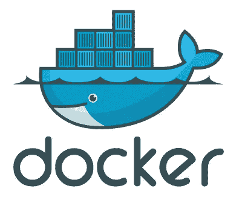
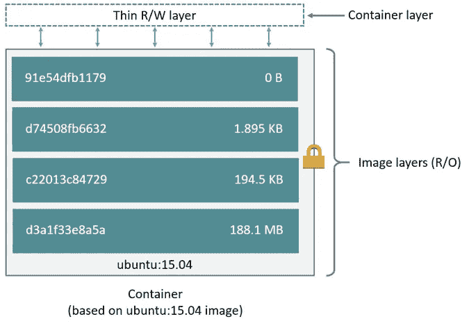
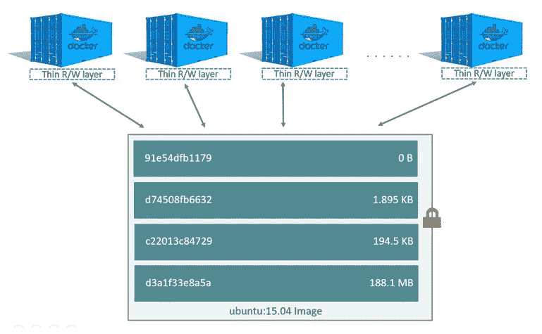
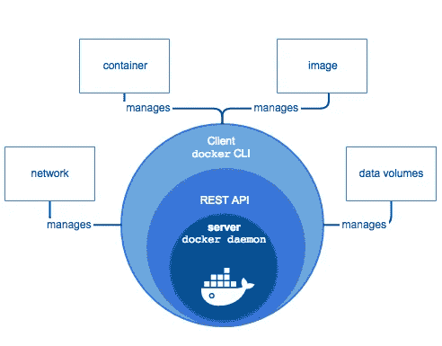
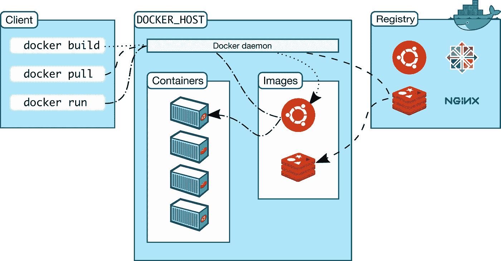
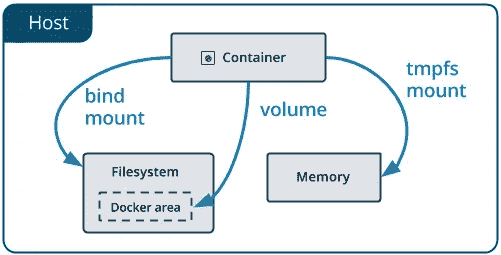
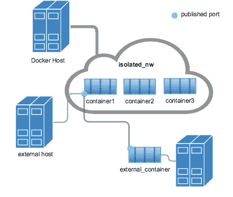

# Docker 体系结构概述

> 原文：<https://betterprogramming.pub/an-overview-to-docker-architecture-15407c482c52>

## 了解最常用的开发技术之一背后的底层组件和系统的基础知识

图片来源: [Docker 标识和照片](https://www.docker.com/company/newsroom/media-resources)

如果你最近刚进入容器的奇妙世界，或者你已经在这里呆了一段时间，那么理解底层系统和元素一起工作来提供 [Docker](https://www.docker.com/) 的巨大好处可能是个不错的主意。

# 了解基础知识

## 图像还是容器？

重要的事情先来。对基本术语有一个清晰的认识从来没有伤害过任何人。看起来一个*图像*和一个*容器*是等价的术语——难道它们不是同一个东西吗？我的意思是，我用这两个工具把我的应用程序放到某个服务器、PaaS 或其他什么东西上。

## 嗯，是的，但实际上不是

就软件开发而言，容器可以被描述为映像的实例。这种说法有一些含义:

*   从同一个图像中可以产生无限多的容器。
*   图像中的资源将出现在它的所有派生容器中。哪种类型的资源？任何:文件、服务、二进制文件、cron 作业等。
*   删除容器后，其所有内容都会丢失。稍后，我们将学习如何处理数据持久性。

## 实际的图像容器差异

我们已经知道容器是某种图像实例。了解基本区别就够了。但是为了提高我们的 Docker 技能，我们需要更深入地了解图像概念。

图像是一堆层。那么什么是层呢？**层是相对于前一层的一组差异**。`Dockerfile`是定义如何构建图像的文件。该文件中的每个指令代表图像的一个层。**层被缓存**以更快地构建图像，所以一个好的`Dockerfile`实现真的可以在**构建时间**和**图像大小**上产生差异。

由[docs.docker.com](https://docs.docker.com/v17.09/engine/userguide/storagedriver/imagesandcontainers/#images-and-layers)解释的图像层

这是真正的交易。当生成一个容器时，我们获取图像的层堆栈并在顶部生成一个可写层，即**容器层**。容器生命周期中生成的任何更改都会写入该层。因此当删除容器时， **容器层数据会丢失**。

来自同一个图像的多个容器，[docs.docker.com](https://docs.docker.com/v17.09/engine/userguide/storagedriver/imagesandcontainers/#images-and-layers)

# Docker 架构 101

## 码头引擎

你试过安装 Docker 吗？你可能已经注意到，你不仅需要安装 Docker，还需要安装一个叫做`dockerd`的东西。

这是因为 Docker 是一个客户端-服务器应用程序。您必须拥有在您的计算机上运行 Docker 应用程序的两个部分。这种客户机-服务器串联被称为 **docker 引擎**。

**docker 客户端**只是一个针对 **REST API** 发出请求的 CLI 工具，REST API 负责与 **docker 守护进程**或`dockerd`进行交互。`dockerd`将处理操作系统，以确保集装箱的正确行为。

由[docs.Docker.com](https://docs.docker.com/engine/docker-overview/#docker-engine)解释的 docker 引擎

等等，你是不是提到了客户机-服务器？这是否意味着我可以将请求扔给一个远程 Docker 守护进程？嗯，你现在可能意识到像 Kubernetes、OpenShift 和 Docker Swarm 这样的**编排服务**是如何工作的。

## 整体情况

现在我们已经清楚地了解了 Docker 的主要元素，它们是如何协同工作的呢？

每当在 Docker 客户机中创建一个请求时，它都会被发送到 Docker 守护进程，并执行所需的操作。

让我们以运行 redis 容器为例。我们通过运行指令`docker run redis`来实现。

Docker 建筑，[docs.docker.com](https://docs.docker.com/engine/docker-overview/#docker-architecture)

首先，我们的计算机将向已配置的 docker 主机 API 发出请求，该 API 将与 Docker 守护进程进行交互。

此时，守护程序知道它必须做什么。它将在主机注册表上查找 redis 映像。如果它不存在，将进行新的查找，这次是针对配置的映像注册表(Docker Hub、ECR、ACR、GCR 等)并提取(下载)。然后，它将基于下载的图像生成一个容器。

# 其他关键码头零件

## 持久性问题

如果由于某种原因，我们的`postgres`容器崩溃并且不能再次启动，我们可能需要移除容器并运行另一个。然而，容器层的数据将会丢失，就像我们之前讨论的那样，我们不想丢失所有的数据，不是吗？

为持久性问题提供的两个解决方案是**卷**和**绑定挂载**。有了这两者，我们可以将正在运行的容器的文件系统持久化到我们的主机中。

一方面，卷在主机中存储数据，只有`dockerd`可以修改这个文件系统。这是通常首选的数据存储方式。

另一方面，使用绑定挂载，我们不仅可以将目录挂载到容器中，还可以挂载具体的文件。此外，绑定挂载允许挂载任何**主机目录或文件**。这意味着我们可以将数据从我们的主机插入到容器中。这对配置文件来说是巨大的。

Docker 提供不同的数据存储，[docs.docker.com](https://docs.docker.com/storage/#choose-the-right-type-of-mount)

还有第三种数据挂载模式， **tmps** ，这种模式在 Linux 主机中用于持久存储我们不希望**写入容器层或主机文件系统**的数据，比如机密。该数据保存在**主机存储器中。**

## 为什么我的容器不能 ping Google？

也许你想在你的电脑里运行你的神奇的网络应用程序，与世隔绝。然而，这不是 Docker 的主要用例，因此在编排 Docker 容器时，网络扮演着重要的角色。

Docker 提供了将不同类型的**网络驱动**附加到运行的容器的可能性，从而实现容器和另一个容器、Docker 主机和/或互联网之间的连接。

由[docs.docker.com](https://docs.docker.com/v17.09/engine/userguide/networking/#user-defined-networks)提供的桥接网络示例

由于容器本身并不真正需要深入的网络知识，我们将把这个主题留给另一篇文章。

# 去玩吧！

现在您应该对不同的 Docker 资源如何协同工作有了更清晰的认识。现在，您至少应该能够理解“容器世界”中讨论的大多数概念的表面

我邀请你做你自己的研究，更深入地研究这些主题，并构建和部署你的容器化应用。以下是一些想法:

*   尝试不同的卷/网络模式。
*   测试层缓存与无缓存的构建时间。
*   尝试多步构建。
*   尽情享受美妙的`docker-compose`。