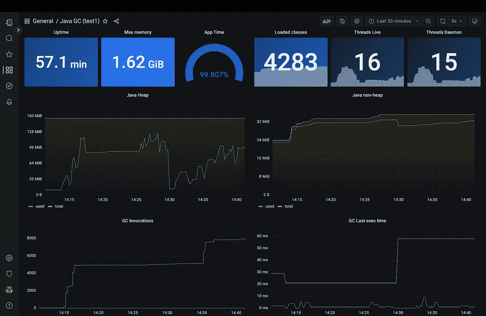
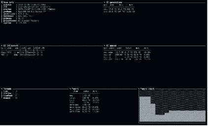
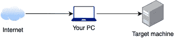
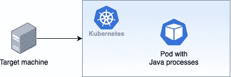
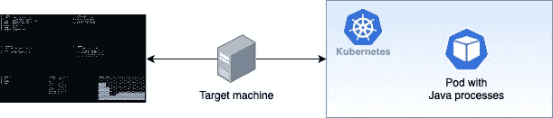
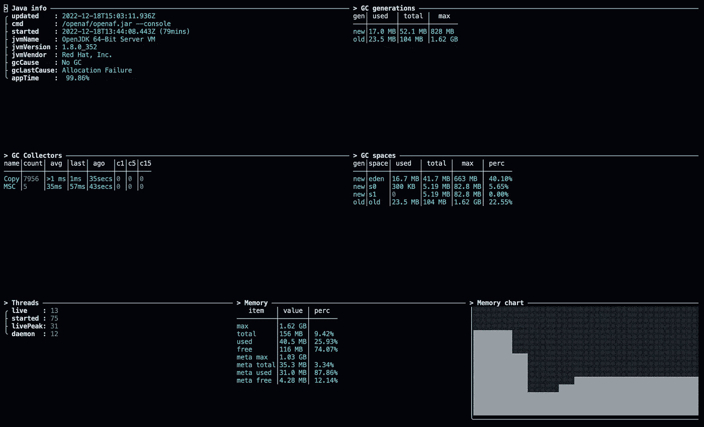
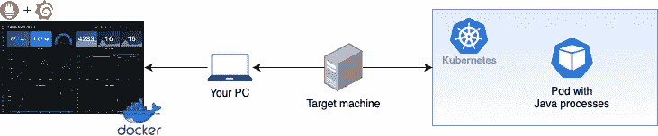
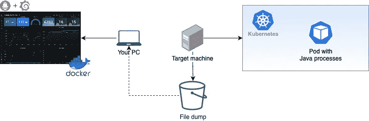

# 在 Kubernetes 中分析 Java GC，无需停止或更改任何东西

> 原文：<https://betterprogramming.pub/analyse-java-gc-in-kubernetes-without-stopping-or-changing-anything-759054009fc>

## 只需 kubectl exec 或 docker exec 访问，无需重启即可获得当前的 Java 内存和 GC



作者图片

您是否在 Kubernetes 或 Docker 中运行 Java，并且需要在不停止进程/容器的情况下快速分析 Java 内存和 GC 行为？

容器是否运行在一个受保护的集群中，在这个集群上只能运行 kubectl，不能添加 JMX 或其他端口？

您是否正在运行一个基于 Java 的容器，但不想包含`jstat`或其他工具？

这里有一个解决方案。

> 注意:这将适用于任何基于 Java HotSpot 的 JVM。

该解决方案假设了一个“空隙”环境(没有互联网接入),并允许您逐步实现以下目标:

*   快速浏览一个正在运行的容器的当前 Java 内存和 GC 指标
    *(步骤 1 到 3)*



基于终端的

*   将收集到的 Java 内存和 GC 指标通过管道传输到本地 Prometheus/Grafana 设置，以近乎实时的方式对它们进行分析
    *(步骤 4)*


普罗米修斯+格拉法纳仪表板

*   将收集到的 Java 内存和 GC 指标转储到一个文件中，然后将它们导入到本地 Prometheus/Grafana 设置中
    *(步骤 5)*

# 步骤 1 —您将需要的文件



在您的 PC 上创建一个新文件夹，并下载一份 [OpenAF](https://docs.openaf.io) :

```
curl https://openaf.io/setup.sh | sh
```

*(对于 Windows 或 Mac，可以查看 https://docs.openaf.io/*[](https://docs.openaf.io/)**)**

*现在，通过执行以下命令下载剩余的文件:*

```
*cd oaf
./ojob ojob.io/get job=ojob.io/java/findProc airgap=true
./ojob ojob.io/get job=ojob.io/java/gc airgap=true
./ojob ojob.io/get job=ojob.io/grid/data/gc airgap=true
./ojob ojob.io/get job=ojob.io/formats/toOpenMetrics airgap=true*
```

*现在，用这个`oaf`文件夹的内容创建一个 zip 或 tar.gz 文件，并将其传输到您拥有`kubectl`或`docker`访问权限的目标机器上(如果您可以从您的机器上访问它，则不需要)。*

# *步骤 2 —找到目标 Java 流程*

**

*在目标机器上，您将需要相应的 Kubernetes 名称空间和 pod 名称(如果需要，还有容器名称)或相应的 docker 容器 id。在`kubectl`配置了正确的设置后，在您在步骤 1 中准备的`oaf`解压缩和扩展文件夹中执行:*

```
*./ojob ojob.io_java_findProc pod=test1 ns=default
# or ./ojob ojob.io_java_findProc pod=test1 podc=my-container ns=default
# or ./ojob ojob.io_java_findProc docker=abc123*
```

*因此，您将获得类似于以下内容的内容:*

```
*─ [0] 
 ╭ path: /tmp/hsperfdata_openaf/11 
 ├ cmd : /openaf/openaf.jar — console 
 ├ gc : ojob ojob.io/java/gc cmd=kubectl\\ exec\\ test\\ — \\ cat\\ /tmp/hsperfdata_openaf/11 
 ╰ grid: ojob ojob.io/grid/data/gc cmd=kubectl\\ exec\\ test\\ — \\ cat\\ /tmp/hsperfdata_openaf/11*
```

*您可能会得到不止一个结果，但是您应该查看每个结果的`cmd`条目，以找到您想要分析的正确的 Java 进程。*

# *步骤 3 —获取基于终端的网格*

**

*根据您在步骤 2 中获得的结果，对于您想要分析的 Java 流程的右边条目，使用在`grid`条目中描述的命令行，用`ojob.io_grid_data_gc` 替换`ojob.io/grid/data/gc`(例如，您需要它，因为它是一个`airgap`(没有互联网)安装)。您将执行类似于以下内容的内容:*

```
*./ojob ojob.io_grid_data_gc cmd=kubectl\\ exec\\ test\\ — \\ cat\\ /tmp/hsperfdata_openaf/11*
```

*并且你会得到类似这样的东西(每秒刷新一次):*

**

*在这个网格中，您可以看到当前正在运行的 Java 进程。即以下内容:*

*   *Java Info | `appTime`:这给出了自 Java 进程启动以来，在没有阻塞 GC 的情况下运行执行的时间。越接近 100%越好*
*   *GC 收集器| `count` / `avg` / `last` / `ago`:根据 GC 收集器名称的类型，执行 GC 所花费的时间(`avg`和`last`)以及执行的频率(`count` / `ago`)将让您了解 Java 进程是否执行了大量的 GC 收集。*
*   *内存/内存图表:让您快速了解已用内存是否一直接近极限(导致几次 GC 收集器操作)。*

*要退出，点击`q`或`Ctrl-C`。*

# *第 4 步——通过管道连接到当地的普罗米修斯公司/格拉夫纳公司*

**

*在第 3 步中，您已经直接从运行在 Kubernetes 或 Docker 中的 Java 进程中提取了 Java 内存和 GC 指标，但是您可能希望用几个图表上的即时历史来分析它。为此，您可以使用 Prometheus push gateway 将收集的指标直接“管道化”到本地 Prometheus/Grafana 设置。*

*如果您不能直接在您的 PC 中访问 execute `kubectl`，请继续第 5 步，将数据转储到一个文件中，以便稍后传输到您的 PC 并导入到 Prometheus 中。*

## ***步骤 4.1 —设置 Prometheus/Grafana/Push gateway***

*有许多方法可以设置 Prometheus/Grafana/Push gateway 设置。一个快捷的方法是使用 docker-compose。在本地机器上执行(在步骤 1 的`oaf`原始文件夹中):*

```
*./ojob ojob.io/docker/prometheus grafana=true pushgateway=true > docker-compose.yml
docker-compose up -d*
```

*这将在您的 PC 的端口`3000`上启动 Grafana，并在端口`9091`上启动 Prometheus 推送网关(您可以在生成的`docker-compose.yml`中编辑它们)*

1.  *在浏览器中打开 Grafana(如`[http://127.0.0.1:3000](http://127.0.0.1:3000))` [)](http://127.0.0.1:3000)) 。*
2.  *登录 Grafana
    (默认凭证为`user=admin`、`password=admin`)*
3.  *点击“添加您的第一个数据源”*
4.  *然后点击“普罗米修斯”*
5.  *然后输入 URL = `[http://prometheus:9090](http://prometheus:9090.)` [。](http://prometheus:9090.)*
6.  *向下滚动到网页的末尾，点击“保存和测试”如果一切顺利，您将看到一条“成功”消息。*

## ***步骤 4.2 —生成指标数据***

*现在您已经设置了 Prometheus/Grafana/Push Gateway，让我们来了解一下指标。*

*正如您在步骤 3 中所做的，有了`grid`条目，您现在可以使用`gc`条目来生成指标(用`ojob.io_java_gc`替换`ojob.io/java/gc`并添加一些额外的参数):*

```
*./ojob ojob.io_grid_data_gc cmd=kubectl\\ exec\\ test\\ — \\ cat\\ /tmp/hsperfdata_openaf/11 __format=json interval=1000*
```

*在所提供的示例中，时间间隔设置为 1000 毫秒，因此每秒将向`STDOUT`输出一个度量样本。您可以使用`Ctrl-C`停止它，继续下一步。*

## ***第 4.3 步—将指标推送给 Prometheus***

*现在，我们需要将 JSON 指标传输到 Prometheus 推送网关。在步骤 4.1 的设置中，Prometheus 推送网关在端口`9091`上运行。现在，让我们执行步骤 4.2，将它流水线化到 Prometheus 推送网关:*

```
*./ojob ojob.io_grid_data_gc cmd=kubectl\\ exec\\ test\\ — \\ cat\\ /tmp/hsperfdata_openaf/11 __format=json interval=1000 | ./ojob ojob.io_formats_toOpenMetrics prefix=test1 timefield=__ts joburl=http://127.0.0.1:9091/metrics/job/test1*
```

*在示例中，我们设置了`prefix=test1`和`joburl=http://127.0.0.1:9091/metrics/job/test1`。您可以在两种设置中用不同的名称替换`test1`。如果您想监控多个 Java 进程，这将特别有用。*

*参数`timefield`将从指标中删除`__ts`字段，因为 Prometheus 推送网关不支持时间戳。*

*如果您每秒钟都看到一条消息，表明有字节被发送到 Prometheus Push gateway，请让它继续运行。*

> *提示:如果您只能从您的 PC 通过 ssh 访问可以执行 kubectl 的目标机器，那么您仍然可以通过使用 SSH 执行第一个命令来修改上面的命令。*

***步骤 4.4 —添加相应的 Grafana 仪表板***

*在您的 PC 中，通过执行以下命令，为步骤 4.3 中使用的前缀生成 Grafana dashboard JSON:*

```
*./ojob ojob.io/java/grafana/gc prefix=test1 > test1-dashboard.json*
```

*现在，在您的浏览器中访问 Grafana(如您在步骤 4.1 中所做的那样)，然后执行以下操作:*

1.  *将鼠标悬停在左侧窗格菜单上的仪表板图标上。*
2.  *选择“+导入”*
3.  *点击“上传 JSON 文件”并上传`test1-dashboard.json`*
4.  *在 Prometheus 中显示的选项上，选择 Prometheus 默认数据源，然后单击“Import”*
5.  *根据需要调整时间范围，您将看到一个类似于以下内容的控制面板:*

****

*在该控制面板上，您将看到与步骤 3 中提供的信息相同的信息以及更多信息。*

> *技巧 1:有更多的度量标准正在被“输送”给普罗米修斯。您可以根据需要浏览和增强仪表板。*
> 
> *提示 2:您可以为不同的流程添加更多的仪表板，只需为不同的前缀重复步骤 4.3 和这个步骤。*

# *步骤 5 —将指标转储到一个文件中，以便以后导入到 Prometheus 中*

**

*有时，本地 Prometheus/Grafana/Prometheus Push Gateway 设置可能会直接连接到您可以执行 kubectl 的目标机器。或者让它长时间收集指标，以便以后仔细分析。*

*以下是实现它的步骤:*

***步骤 5.1 —设置 Prometheus/Grafana/Push gateway***

*参考步骤 4.1，执行相同的本地设置。*

***步骤 5.2 —转储指标数据***

*现在您已经设置了 Prometheus/Grafana/Push Gateway，让我们来了解一下指标。*

*正如您在步骤 3 中所做的，有了“grid”条目，您现在可以使用“gc”条目来转储指标(用`ojob.io_java_gc`替换`ojob.io/java/gc`，并添加一些额外的参数):*

```
*./ojob ojob.io_grid_data_gc cmd=kubectl\\ exec\\ test\\ — \\ cat\\ /tmp/hsperfdata_openaf/11 __format=json interval=1000 output=test1-metrics.ndjson.gz*
```

*在本例中，时间间隔设置为 1000 毫秒，因此每秒钟都会向`metrics.ndjson.gz`文件添加一个度量样本。当经过了足够的时间来收集该时间段的指标时，您需要使用`Ctrl-C`来停止它，以继续下一步。*

***步骤 5.3 —传输和导入指标数据***

*将步骤 5.2 中生成的`test1-metrics.ndjson.gz`从目标机器传输到您的 PC。*

*现在，基于 JSON 的指标需要转换成 OpenMetrics，以便稍后导入到 Prometheus 中:*

```
*zcat test1-metrics.ndjson.gz | ojob ojob.io/formats/toOpenMetrics prefix=test1 timestamp=true timefield=__ts > test1-metrics.openmetrics
echo "# EOF" >> test1-metrics.openmetrics*
```

*现在将新的`test1-metrics.openmetrics`文件复制到本地 Prometheus 容器，并使用以下命令导入它(这可能需要几分钟):*

```
*docker-compose cp test1-metrics.openmetrics prometheus:/tmp/.
docker-compose exec prometheus promtool tsdb create-blocks-from openmetrics /tmp/test1-metrics.openmetrics /prometheus*
```

***步骤 5.4 —添加相应的 Grafana 仪表板***

*参考步骤 4.4，并执行相同的本地设置。*

*之后，请记住，您需要选择在 Grafana 仪表板上收集指标的时间段。*

*感谢阅读！敬请关注更多内容。*