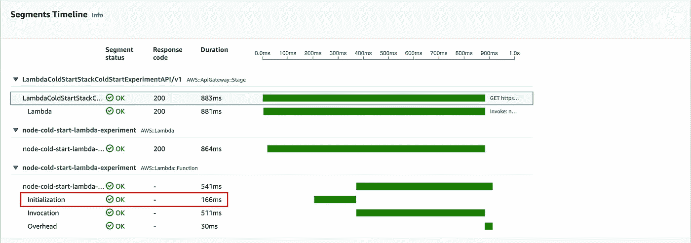
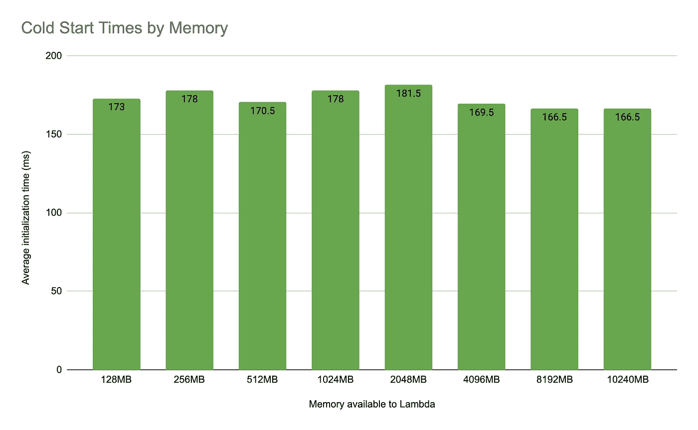
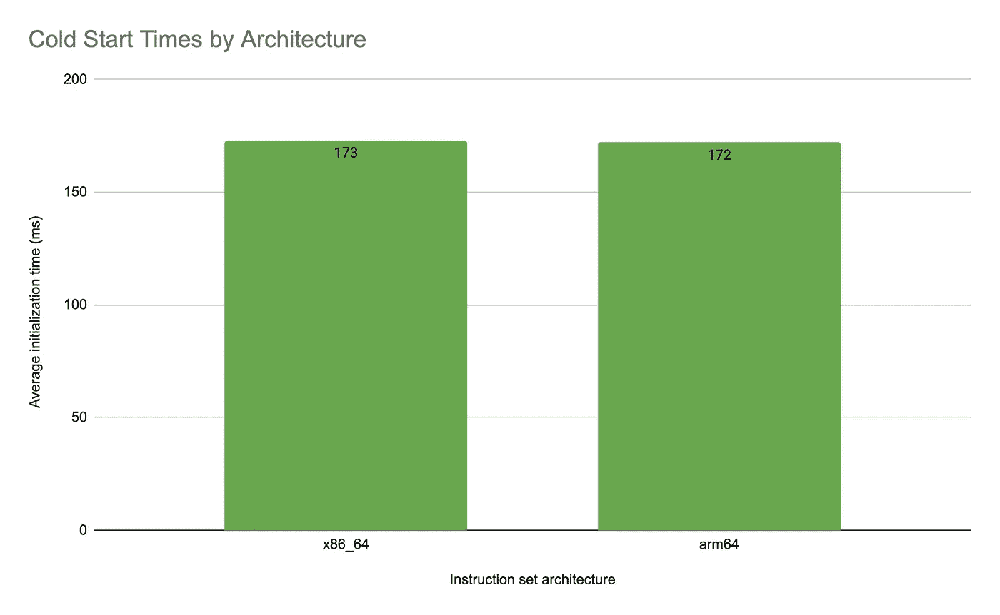
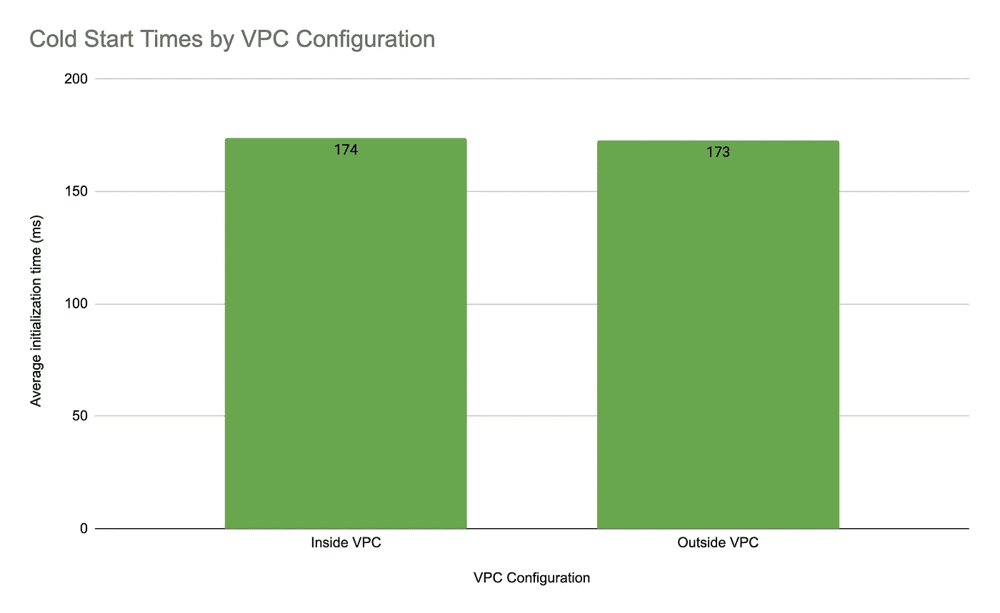
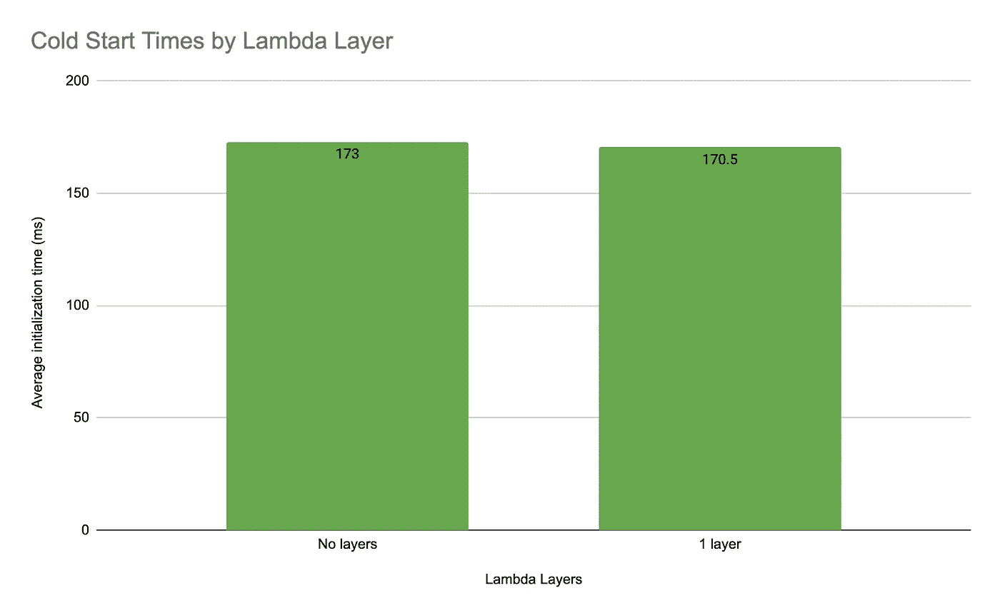

# 分析节点上的冷启动

> 原文：<https://betterprogramming.pub/analysing-cold-starts-on-a-nodejs-lambda-360dfb52a08f>

## 了解导致更长冷启动时间的配置类型

[𝓴𝓘𝓡𝓚 𝕝𝔸𝕀](https://unsplash.com/@kirklai?utm_source=medium&utm_medium=referral) 在 [Unsplash](https://unsplash.com?utm_source=medium&utm_medium=referral) 上拍照

我决定深入研究 Lambda 冷启动问题，看看正常的冷启动需要多长时间，以及什么配置会导致更长的冷启动时间。

**TL；Lambda 冷启动的最大贡献者是 Lambda 在 S3 的总尺寸。这意味着 lambda 中的代码越多，或者包中包含的库越多，冷启动的时间就越长。内存、VPC、区域、层和指令集架构对 Lambda 的冷启动时间没有太大影响。**

# λ冷启动的快速定义

当 Lambda 函数收到请求时，服务首先准备一个执行环境。准备执行环境包括以下任务:

*   从内部 AWS S3 桶下载代码。
*   使用内存、运行时和指定的配置创建环境。

# 实验

## λ配置

我使用下面的配置作为 Lambdas 的默认配置，然后为每个测试场景更改一个配置:

*   运行时:Node.js 14
*   架构:X86_64
*   区域:欧盟-西方-1
*   内存:128MB
*   不是在 VPC 里面

Lambda 使用内置的 [https](https://nodejs.org/api/https.html) 库进行简单的 HTTP 调用，并从下游端点返回数据。

## 我如何收集指标

我使用 AWS X-Ray 来观察和收集 Lambda 执行的指标。X-Ray 测量每个 Lambda 请求的初始化、调用和开销时间([了解更多信息，请点击](https://docs.aws.amazon.com/lambda/latest/dg/runtimes-context.html))，如下所示:

AWS X 射线度量

对于这个实验，我们感兴趣的是初始化，因为这指的是通常所说的冷启动时间。这是我在这篇文章中称为冷启动时间的指标。

## 结果呢

让我们看看一些数字。下面，我展示了在分析以下配置的冷启动时间时的测试结果:

*   记忆
*   指令集体系结构
*   地区
*   VPC
*   图书馆
*   λ层

## **内存**

增加 Lambda 的内存是否会减少冷启动时间？

我在从 128MB 到 10240MB 的不同内存量下部署了 lambda。

简短的回答是不，不是真的。通过增加 Lambda 可用的内存，潜在的延迟节省是 15 毫秒。

## **指令集架构**

arm64 和 x86_64 架构冷启动有区别吗？

按架构划分的冷启动时间

简单的回答还是**不，不完全是**。我发现 arm64 将冷启动时间缩短了 1 毫秒。

## **地区**

某些地区的冷启动时间是否比其他地区短？

我测试了 3 个 AWS 地区的冷启动时间: **eu-west-1** 、 **us-east-1** 和 **ca-central-1** 。

同样，简短的回答是**没有，地区之间没有真正显著的**差异。我测试的区域中没有一个显示出明显更慢或更快的冷启动时间。

## **VPC**

我以前听说过，与不开 VPC 的兰博达相比，开 VPC 的兰博达冷启动时间更长。我测试的时候看到这个了吗？

再次，**否**。λ是否在 VPC 中似乎不会影响冷启动时间。VPC 内部的 Lambda 多花了 1 ms 来初始化 Lambda 环境，这对于延迟来说也不是一个显著的差异。

## **图书馆**

Lambda 包中包含的库数量会增加冷启动时间吗？

我使用了以下 5 个包来测试这个场景，并在每个测试中增加了一个包:

*   axios
*   温斯顿
*   洛达什
*   瞬间
*   拉姆达

最后，我发现了一种增加冷启动时间的配置。Lambda 包中包含的库的数量确实会影响 Lambda 环境的初始化时间。

在没有任何库的情况下，冷启动时间是 173 ms，相当短的时间。但是当我们在 Lambda 中包含 5 个包时，这个时间会跳到 515 毫秒，多了将近半秒。这对于一个 API 来说是一个显著的区别，也是 API 的消费者会注意到的一个区别。

仔细想想，这是有道理的。冷启动是从 S3 下载 Lambda 包的时间。因此，如果我们有一个更大的包大小，它将需要更多的时间来下载该包，导致更长的冷启动时间。

## **λ层**

在 Lambda 上附加一个层会影响冷启动时间吗？

同样，在 Lambda 上添加一层时，冷启动时间没有太大差异。没有 Lambda 层时，冷启动时间仅快 2.5 毫秒。

# 结论

当使用 NodeJS 14 运行时，在默认配置下，您将经历大约 **170ms** 的冷启动时间。

对冷启动时间唯一真正重要的贡献者是 Lambda 中使用的包的数量。其他配置与冷启动时间的差异非常小，但如果结合使用，可能会导致更大的差异。
例如，如果你在一个有多个 lambda 层的 VPC 中使用一个 Lambda，你可能会看到不同。

## 收集的所有数据的摘要:

**内存—** 与内存为 8192MB 或 10240MB 的 Lambda 相比，内存为 2048MB 的 Lambda 的冷启动时间要慢 15 毫秒

**指令集架构—** x86_64 的冷启动时间为 173，相比之下，arm64 的冷启动时间少 1 毫秒，为 172 毫秒。

**地区—** us-east-1 的冷启动时间最高，为 179.5 毫秒。ca-central-1 的冷启动时间最快，为 168.5 毫秒。

**VPC—**VPC 内的 Lambda 比不在
VPC 内的 Lambda 慢 1 毫秒。

**库—** 没有库的 lambda 比有 5 个库的 Lambda 冷启动快 342.5 毫秒。

**Lambda 层—** 没有层的 Lambda 比有 1 层的 Lambda 快 2.5 毫秒。

**供应的并发性—** 我还要指出，我还对[供应的并发性](https://aws.amazon.com/blogs/aws/new-provisioned-concurrency-for-lambda-functions/)进行了试验，结果初始化时间为 0 毫秒。如果你担心冷启动时间，这可能是一个值得研究的问题。