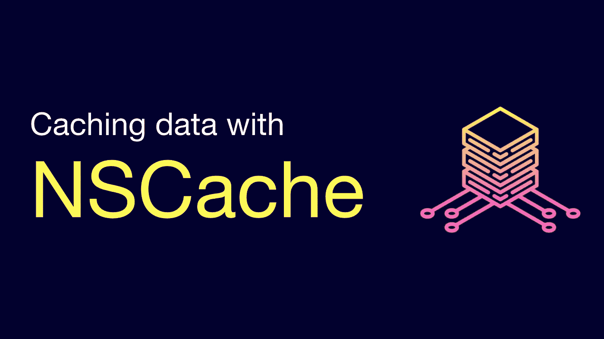
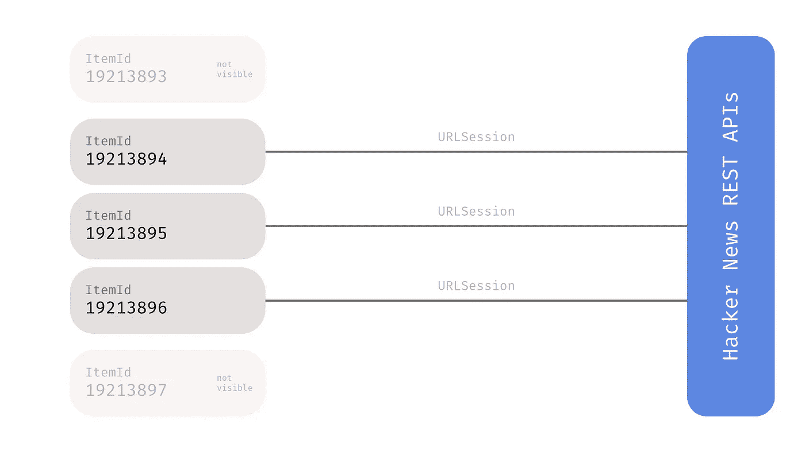
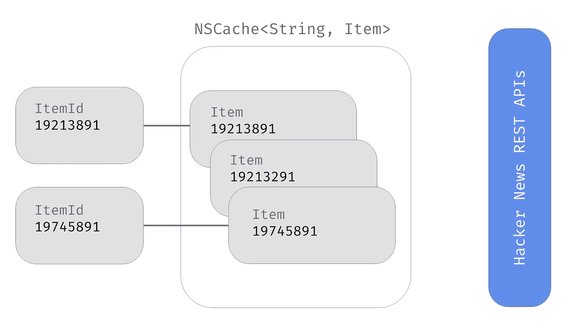
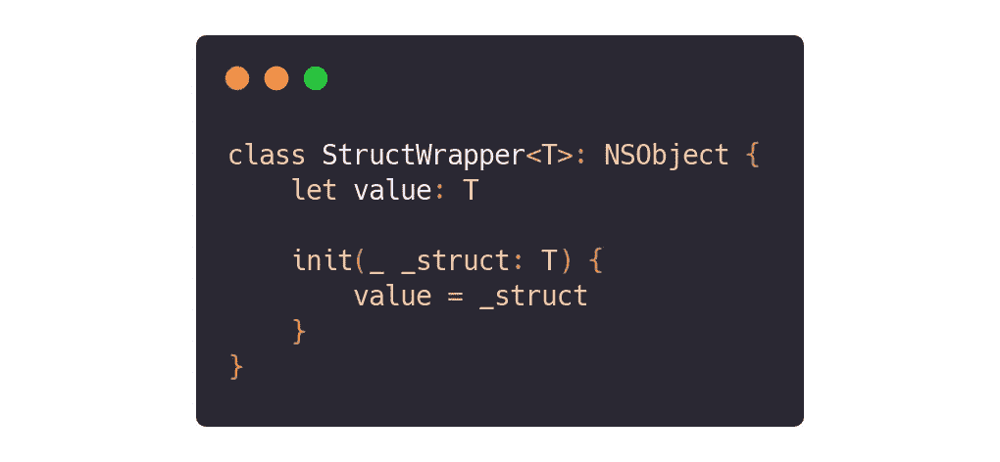
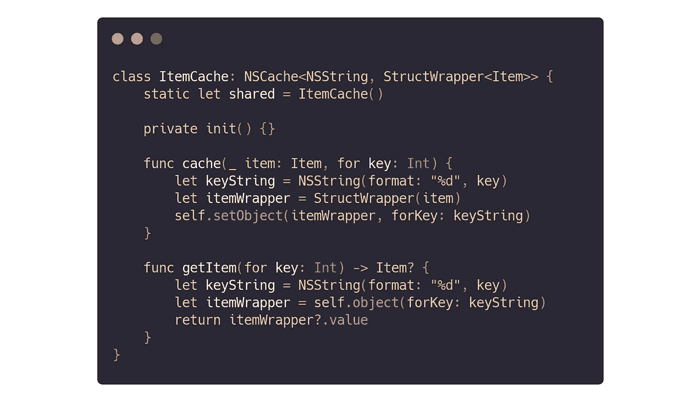
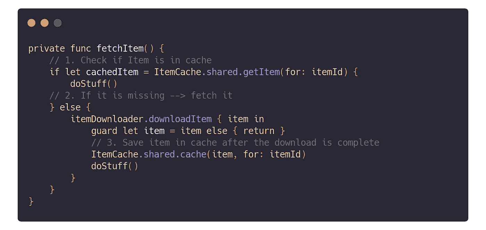

# 使用 NSCache 进行数据缓存

> 原文：<https://betterprogramming.pub/analysing-data-caching-with-nscache-e0fcbed17b2b>

## 优化 SwiftUI 应用中数据使用的真实案例

图片由作者提供。

我最近开源了我的用于 macOS 的 [HackerNews 阅读器](https://github.com/mattrighetti/HNReaderApp)，它完全是用用于 macOS 的 SwiftUI 编写的。分析我的场景有助于解释数据缓存和避免数据浪费。

如果您想更详细地了解代码，您可以在项目的 GitHub 资源库中继续学习。

# 方案

黑客新闻(Hacker News)是一家知名网站，在平台上存储用户举报的新闻。正如 HN API 的文档所规定的，每个单独的故事都将由一个`Item`结构来表示。我们希望获取可用的条目，以便用户以数据效率最高的方式进行阅读。

# 不使用缓存的初始实施

该应用程序有一个`ItemCell` 视图，它从父视图中获取一个`ItemId`，一旦它出现在屏幕上，它将自动获取该项目并为我显示。这种方法使得数据使用量非常低，并且消除了后端的很多压力，因为实际上只会获取显示的项目。

应用程序的侧边栏允许用户在五个不同类别的故事之间导航。您可以想象，一些新闻可能属于多个类别，因此当用户在类别之间来回切换时，他们基本上是在请求以前获取的相同项目。

这种没有一些后台逻辑的方法会大大增加您的数据使用量，降低应用程序的整体性能，还会给 HackerNews 后端带来很大压力，不必要地多次向我们提供相同的信息。

# 缓存数据

我们实际上可以做的是通过 id 缓存下载的项目来解决这个问题。通过这种方式，项目将只被提取一次，应用程序不会因为无用的重复请求而浪费数据。

API 不会缓存以前下载的项目。

## 履行

我们知道每一项都由一个`ItemId`唯一标识，T3 是一个整数变量。因此，我们可以使用该数据从缓存中存储和检索项目。

在编写时，`[NSCache](https://developer.apple.com/documentation/foundation/nscache)`实现只接受类类型，所以如果我们想将它存储在缓存对象中，我们需要为`Item`结构创建一个简单的类包装器。在这个场景中，我们不需要包装我们的键(`ItemId`)，因为有一个更短的方法:将它转换为`String`。

在 NSCache 中保存结构的 StructWrapper 实现([代码](https://github.com/mattrighetti/HNReaderApp/blob/95ea9fa0dfd8598d79f864e9b347dfdb5a363f92/HNReader/HNClient/ItemCache.swift#L7-L13))

现在存储和检索对象非常简单。我们需要一个具有两个功能的缓存对象:一个用于缓存对象，另一个用于在找到对象时取回对象。我还实现了通用的单例设计模式，以确保我总是使用相同的缓存对象。

ItemCache 实现([代码](https://github.com/mattrighetti/HNReaderApp/blob/95ea9fa0dfd8598d79f864e9b347dfdb5a363f92/HNReader/HNClient/ItemCache.swift#L16-L30))

现在，我们已经拥有了缓存元素和在获取元素之前检查内存中是否存在元素所需的一切。提取功能将在实际提取数据之前检查缓存命中/未命中。只有当我们对所请求的对象进行缓存未命中时，才会进行提取，并且当正确提取项目时，我们只需将它保存在缓存中。下次我们试图获取该项时，它将立即从缓存中取出，而无需任何额外的获取。

[代码](https://github.com/mattrighetti/HNReaderApp/blob/95ea9fa0dfd8598d79f864e9b347dfdb5a363f92/HNReader/View/ItemCell.swift#L129-L142)

# 结论

优化是你必须一直寻找的东西——对你的用户和你可能在应用中使用的其他第三方服务都是如此。

通过一个非常简单的对象，我们实际上已经做了一些相当大的改进。现在，获取的项将被缓存，并准备好在下次需要时以成本 *O(1)* 进行检索。