# 用 SQL 分析 Web3 中的数据

> 原文：<https://betterprogramming.pub/analysing-data-in-web3-with-sql-6c205fff6364>

## 在 Dune 上使用 SQL 进行 Web3 数据探索和分析

Unsplash: Shubham Dhage

我想相信，你不是误来到这里的。你想知道如何在 web3 中成为一名高效的数据分析师？你是想建立你的 Web3 分析仪表板还是仅仅对 web3 数据感兴趣？无论哪种方式，欢迎！

作为一个数据人，Web3 数据最具挑战性的部分是理解数据本身。根据我的经验，有一件事对我来说很容易，那就是把每一个看作一个巨大的数据仓库，把以太坊区块链之上的协议看作包含仓库中多个表和视图的各种模式。PS:这也适用于其他区块链。

在这篇文章中，我将尽量使事情简洁，并使用以下主题突出它们:

1.  Web3 数据流和前景:理解 Web3，分散数据存储，
2.  解码事务数据的工具:web3 数据堆栈工具概述，以及如何利用它们

让我们开始吧！

# Web3 数据流和前景

web3 的关键在于变得更加独立自主。

这是通过区块链和分布式对等网络而不是服务器-客户端关系来实现的。这导致了不同于我们在 Web2 中习惯的数据流和格式。

通过研究，我发现了像 [Dune Analytics](https://dune.xyz/browse/dashboards) 和 [Flipside Crypto](https://flipsidecrypto.xyz/) 这样的数据映射器，带有解码的区块链数据和内置的可视化工具，供对 Web3 感兴趣的数据科学家工作和开发。

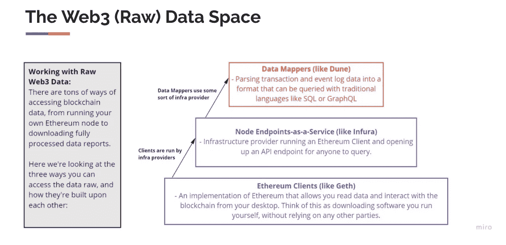

来源:[https://docs . Google . com/presentation/d/1 i6 vdos 52 umcmwg3kibukye 8 lk-8 _ ol 9 beksiuehnnli/edit # slide = id . gfac 7071356](https://docs.google.com/presentation/d/1I6vDOS52uMCmWg3KIbuKYe8lK-8_ol9bEksIUEHNNLI/edit#slide=id.gfac7071356_0_1)

上图显示了从不同的区块链模式中提取数据进行分析的不同方法，在本例中以以太坊为例。

如果你曾经在以太坊(或任何支持区块链的智能合约)上进行过交易，那么你可能会在 block explorer 上查找并看到这样的信息:

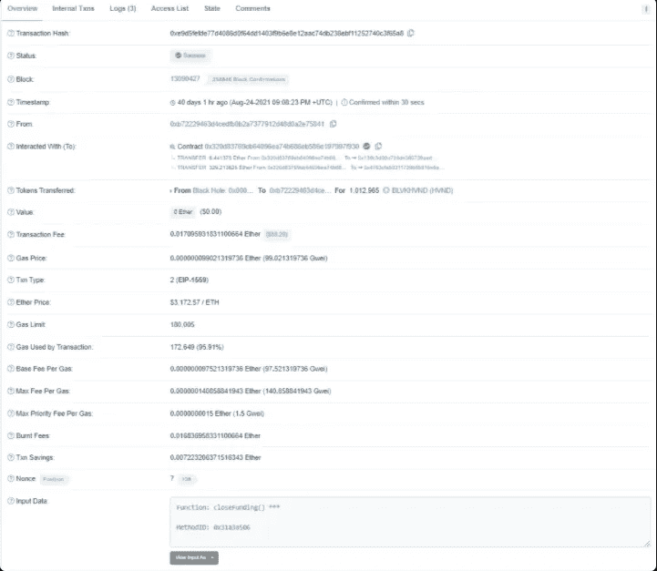

通过以太扫描块浏览器看到的以太坊块链上的交易示例

学习阅读交易的细节将是所有以太坊数据分析和知识的基础，但理解令牌和交易数据的流程也很重要。

# 解开 Web3 数据

我可能偏向于使用以太坊区块链来解释解码区块链数据，但从经验来看，当你了解数据如何在智能合约上存储和管理时，以太坊更容易理解。话虽如此，但值得注意的是，我将讨论的许多概念将广泛适用于所有 EVM 兼容的链和智能合约，如 Polygon、Fantom Opera、BSC、Arbitrum One 等。

智能合约事务类似于智能合约支持的 web3 应用程序中的后端 API 调用。智能合约上的活动及其导致的应用程序状态更改的详细信息记录在称为事务、调用和日志的数据元素中。事务数据元素表示由用户(或者更准确地说是 EOA)发起的函数调用，调用数据元素表示由智能合约在事务内发起的附加函数调用，日志数据元素表示在事务执行期间已经发生的事件。

为了理解以太坊区块链上的交易数据，我们可以尝试使用[以太扫描](https://etherscan.io/address/0xc4e0f3ec24972c75df7c716922096f4270b7bb4e)(作为交易示例的基础，我使用了镜像众筹合同)。这就像检查汽车仪表板上的指针来修复汽车的问题，但作为一名数据科学家，我们必须打开汽车的引擎盖，了解幕后发生的事情。通常有 3 种不同类型的交易:

1.  以基础货币形式将价值从一个用户(EOA)转移到另一个用户，例如，John 在以太网上发送 Jane 3 ETH
2.  由 EOA 创建智能合同，例如，杰克向区块链上的地址提交代码，创建智能合同，一旦一定量的资源被转移到卖方的账户(或钱包)，智能合同就转移 NFT 的所有权。
3.  通过 EOA 调用智能合约，例如，简调用杰克的智能合约将 999ETH 交换为 NFT。

当用户在区块链上发出请求时，下面会发生什么:

1.  与用户相关联的 EOA 发起指定目标智能合同地址、目标功能、该功能的自变量、交易支付(如果有的话)以及它愿意支付的燃气费(如果有的话)的交易。
2.  交易被广播到网络，并由执行目标智能合约中的指定功能的有意愿的矿工拾取。
3.  如果执行成功，智能协定将发出标志着某些里程碑完成的事件。产生的事件数据结构被称为“日志”。
4.  目标智能合约可以启动对其他智能合约的内部事务(附加调用)。这些内部事务创建被称为“跟踪”的数据结构，并且还可能在它们各自的执行期间发出额外的日志事件。

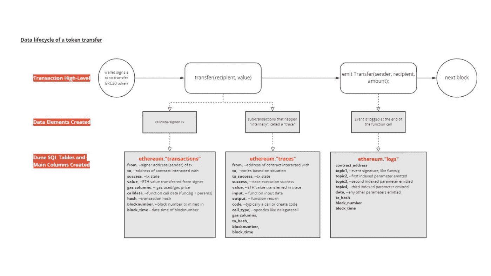

**令牌传输的数据生命周期**。来源:[https://docs . Google . com/presentation/d/1 i6 vdos 52 umcmwg3kibukye 8 lk-8 _ ol 9 beksiuehnnli/edit # slide = id . gfac 7071356 _ 0 _ 6](https://docs.google.com/presentation/d/1I6vDOS52uMCmWg3KIbuKYe8lK-8_ol9bEksIUEHNNLI/edit#slide=id.gfac7071356_0_6)

## 数据的结构

既然您已经理解了在场景后面发生的活动和相应的数据元素。是时候列举构成 web3 的各种元素了。事务和跟踪数据结构包含智能合约函数调用的详细信息，顺序如下:

*   在区块链上，每笔交易都有一个唯一的哈希“交易哈希”，包含各种交易细节。例如，我们可以在这里查找这个事务散列`0xbe3b109b857e8897cbe3c2a261d8072546ae693662422a1b93fe1a3a990dfded`
*   ` From '是交易的发送方，` To '是交易的接收方，也可以是合同地址。在这种情况下，这是从`0x83ebd57bf4f22cba9c4a624a69c910d7c8619ee2`到`CROWDFUND_EDITIONS`令牌的转移
*   `Value`是被传输的 ETH 值。有时 ETH 值可以是 0，在这种情况下，它就是 0。
*   `Transaction Fee = Gas Used by Transaction * Gas Price`你可以在这里找到更多关于以太气[的细节。](https://ethereum.org/en/developers/docs/gas/#post-london)
*   输入数据包含有关交易的附加信息。在这种情况下，它是一个传递函数，包含详细信息，包括交易的地址和值。

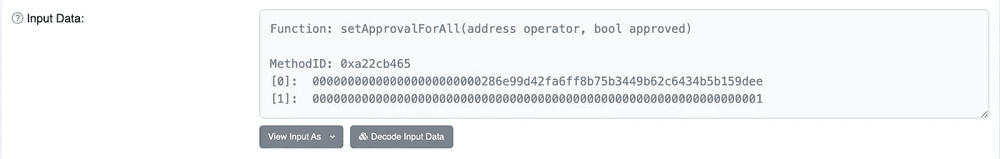

*   数据本身是字节码，在 Dune 上有数据类型`bytea`。
*   前 8 个字符`0xa22cb465`是函数签名的`MethodId`，它并不总是唯一的(但应该是唯一的)。
*   每个后续的 64 个字符是一个不同的输入变量。这里我们有两个，分别对应`to address`和`value`。

基于以上信息，我们可以使用以下查询来提取关于 [Dune](https://dune.xyz/queries/601249) 的数据

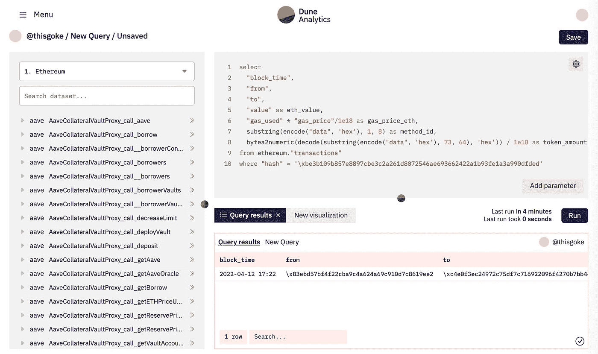

## 用于访问和使用 Web3 数据的工具

现在我们已经很好地理解了 Web3 数据的元素，它看起来像什么，并且已经在区块链上查询了我们的第一个事务数据，您可能想知道如何快速熟悉一个协议及其数据。有一系列很好的工具可以帮助你。

**块浏览器**

如前所述，使用块浏览器是深入了解区块链上的事务的好方法。Block explorers 是在线浏览器，可以显示区块链网络上发生的所有交易的详细信息。请看上面的截图作为例子，重要的是要知道所有主要的区块链都有探险者——突出的例子包括[以太扫描](https://etherscan.io/)、[多边形扫描](https://polygonscan.com/)、[BSC 扫描](https://bscscan.com/)、[索拉纳海滩](https://solanabeach.io/)等

尽管块浏览器非常适合查询区块链分类帐中的单个记录，但它们不适合回答需要聚合或转换数据的问题。例如，如果您想知道在过去 3 个月中有多少 NFT 通过 Opensea 交易所售出，或者如果您想知道从“Coinbase”到“Axie Infinity”的交易流的频率，那么仅使用 block explorers 很难回答这个问题。为此，需要直接访问数据。这在我之前的[帖子](https://thisgoke.medium.com/getting-into-web3-as-a-data-scientist-machine-learning-engineer-f77c450b4e83)中已经有所涉及。

## **分析数据**

Dune analytics 是访问和分析区块链数据的绝佳资源。在撰写本文时，它有以太坊、Solana、Xdai、Polygon、乐观主义和 BSC 的原始数据和解码数据。它提供了一个 PostgreSQL 接口来查询数据集，并提供了一个简单的点击接口来在查询结果上创建简单的仪表板。Dune 上的用户社区也非常活跃，并且已经生成了大量可供学习的示例查询和仪表盘库。这里有几个在 Dune 上创建的示例分析

*   [索拉纳 NFT 交易概述](https://dune.xyz/sealaunch/Solana-Transactions)
*   [OpenSea 市场分析](https://dune.xyz/hildobby/OpenSea-Market-Analytics)
*   [Eth2 液体打桩](https://dune.xyz/eliasimos/Eth2-Liquid-Staking)

如果你对 SQL 完全陌生，我会推荐这些有用的 Dune 分析技巧和指南

1.  **内联以太坊地址**:在 Dune 中工作时，以太坊地址以 PostgresSQL bytearrays 的形式存储，这些字节以`\x`前缀编码，而不是在 Etherscan 上查找时习惯的`0x`。
2.  **在事务**中识别合同地址:当试图区分合同地址和正常地址时，你可以通过检查`CREATE`操作码是否在`traces`中被调用来完成

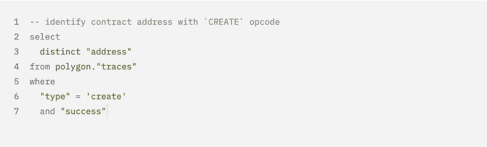

3.**利用 Dune 上的标签**:标签是一段关于地址的元数据，如果你愿意，也可以是标签或元数据。它以键值对的形式出现。键是标签类型，值是标签名称。本质上，您可以使用标签来查找地址并查看它们是什么(参见下面的标签表)。你可以在这里获得更多关于什么是标签以及如何使用标签的见解

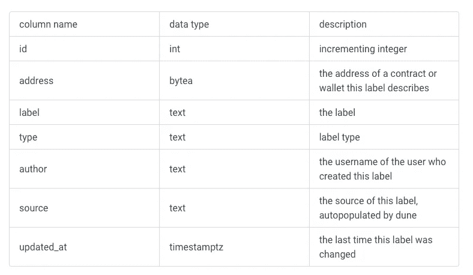

来源:[https://docs . dune . XYZ/data-tables/data-tables/labels # what-labels-looks-like](https://docs.dune.xyz/data-tables/data-tables/labels#what-labels-looks-like)

使用这个 UDF，如果你想得到你看到的地址的标签，你可以这样做；

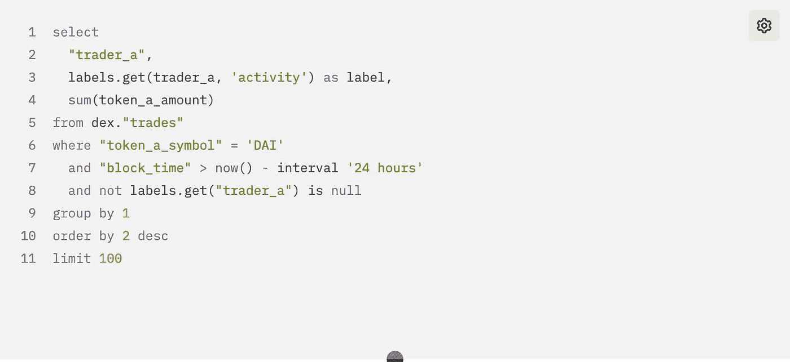

4.**表和列名的引号**:PostgreSQL 不识别没有引号的 camel case 列和表名。因此，在 Postgres 中，双引号是为表和列保留的，而单引号是为值保留的。因此，如果您查询表名中有大写字母的表，Dune 将会抛出一个错误。

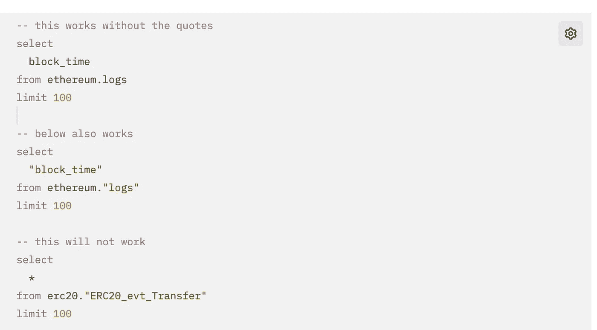

5.**删除小数**:在处理代币金额时，记得在任一`erc20.tokens`中检查小数

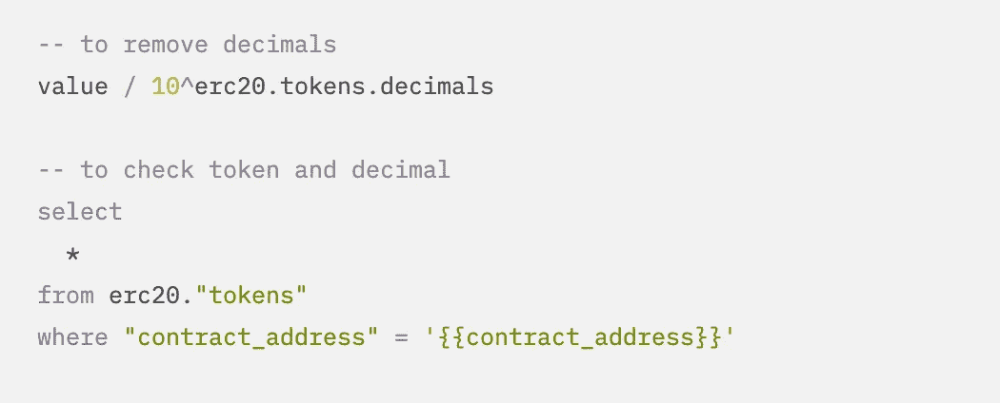

6.**生成时间序列**:当处理具有不连续时间序列的数据集时，使用以下

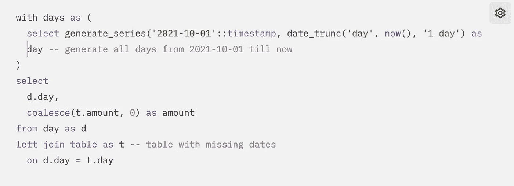

希望这是一次有用的讨论，并且您已经了解了在 Dune 上使用 SQL 进行基本的 Web3 数据探索和分析，它看起来像什么，以及如何使用它。在分析 web3 中的经济活动和用户行为时，重要的是培养对特定智能合同如何工作的理解的兴趣，这将有助于识别兴趣指标中涉及的关键功能和事件。

Web3 正在经历快速发展和高度变化，新的想法、产品、社区和实验每天都在涌现。它目前触及生活的各个方面，包括但不限于支付、金融、艺术、音乐、游戏、社区、治理和身份，这使得任何人都可以参与其中。

因此，请理解，实际使用 Web3 产品、在 Etherscan 等块浏览器上检查数据耗尽，以及阅读智能合约源代码的组合，是开发正确的数据分析策略的关键前提。

我还在学习，如果你需要帮助，请随时联系我。