# 使用 Python 分析 Garmin 智能手表的睡眠数据

> 原文：<https://betterprogramming.pub/analysing-sleep-data-from-garmin-smartwatch-using-python-ed0f05616960>

## 在这篇文章中，我将总结如何从自己的 Garmin 智能手表设备上下载睡眠数据，然后进行分析

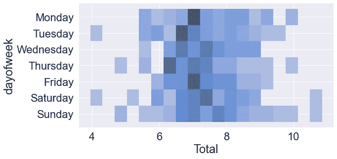

作者图片

我用的是老款 Garmin Forerunner 235。有更现代、更强大的手表可以跟踪更多的健康数据，例如 Vivo，因此，可以通过后台记录的其他指标进一步扩展分析。

# 数据下载和提取

您的 Garmin 数据可以从 Garmin Connect IQ 网站下载。前往 [Garmin 站点](https://www.garmin.com/en-US/account/datamanagement/)，然后点击导出数据。数据是压缩的 JSON 格式。对于睡眠数据，您需要先进入`DI_CONNECT,`，然后进入`DI_Connect_Wellness`，然后按日期排序的 JSON 文件就在那里，准备提取。

为了从 JSON 文件中以漂亮的表格格式提取原始睡眠数据，我使用了 GitHub 上的 [Adam Browne 的 repo](https://github.com/adam1brownell/garmin_data/blob/main/garmin_functions.py) ，特别是他的`build_sleep_data`函数，如下所示。他还有许多其他有用的功能来提取 Garmin 数据的其他成分，我强烈建议您查看他的 repo。

如果您有多个 JSON 文件，那么您可以使用下面的代码片段将多个 pandas 数据帧按顺序附加在一起。

结果是具有 1001 行和 27 列的数据帧。

我们可以使用 seaborn 通过下面的代码来实现这一点:

产生了这个漂亮的热图，浅棕色的值都是空的行和列。

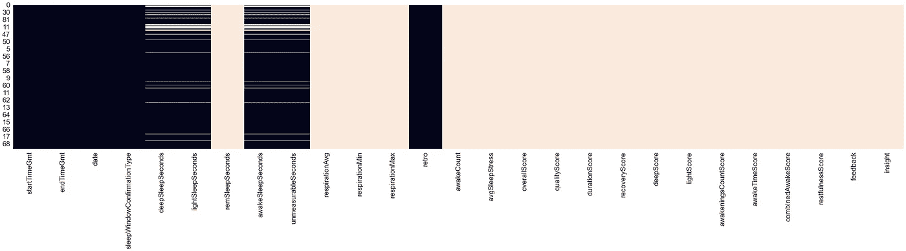

使用 seaborn 来可视化空的行和列(黑色代表数据，浅棕色代表 nan)。

# 数据清理

现在，我们需要清理数据，因为有许多空的行和列，就像刚才解释的那样。我们先来整理一下数据。

让我们用`df_all.columns`检查数据中的列，用`df_all.dtypes`检查数据类型。

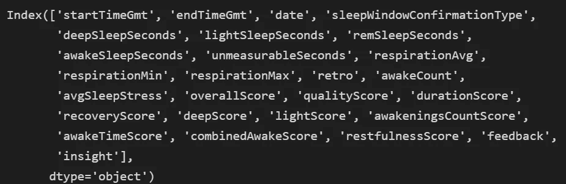

睡眠数据数据帧中的列名。

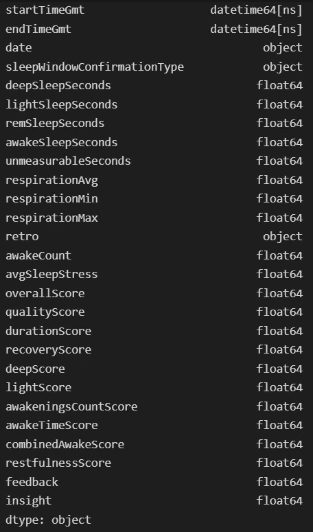

数据帧中每一列的数据类型。

然后删除所有包含 NAs 的列。

让我们进一步删除任何没有睡眠数据的行，我假设在 deepSleepSeconds 列中有 0 深度睡眠。从视觉上看，我们可以使用上面的 Seaborn 代码片段和下面的代码来检查这一点:

然后，我们可以使用下面的代码从数据帧中删除这些零:

最终的数据帧如下所示:

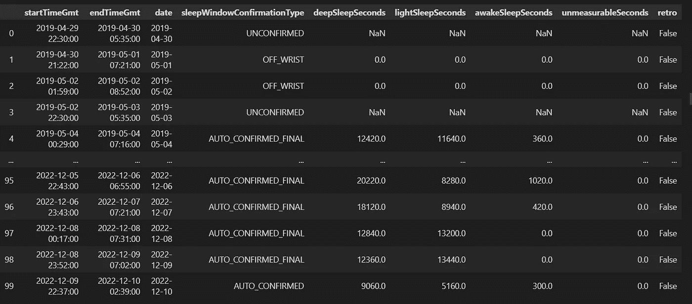

现在，让我们将睡眠时间从秒转换为小时，并将它们添加为列。

数据现在处于正确的状态，已经删除了空数据和任何睡眠时间为 0 的数据。我们现在可以进入下一步，对数据进行分析和可视化。

## 数据可视化

现在使用 Seaborn 包，我们可以以任何我们想要的方式可视化地分割数据。让我们先看看深度睡眠的时间。

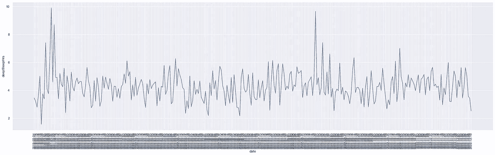

我们可以在数据中看到任何有意义的东西。使用 pandas，我们可以为不同种类的睡眠创建一个睡眠数据的堆积条形图。

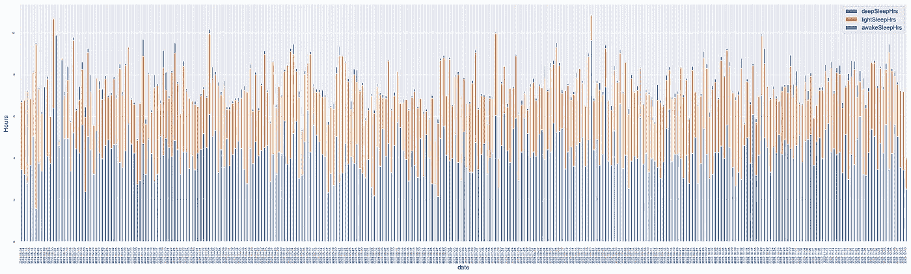

让我们再清理一下，将每日数据分组为每月数据。

然后，让我们做一个深度睡眠数据的箱线图。

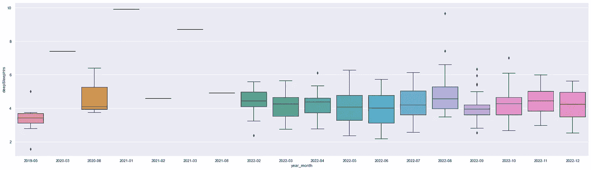

最后，我们可以将数据按月分组，并计算每个睡眠类别的月平均值。

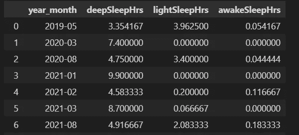

这一次，使用 pandas plotting 可以创建一个堆积条形图。

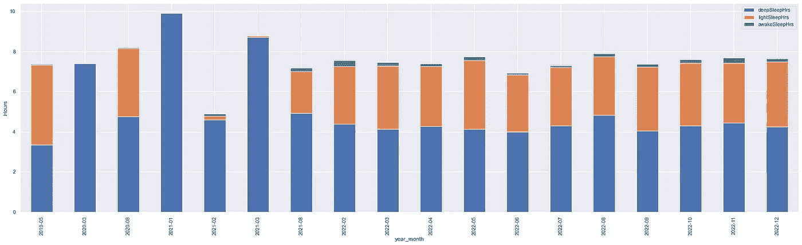

使用 Seaborn 的深度、轻度和清醒睡眠分类的堆积条形图。

现在，让我们通过绘制直方图和 CDF 图来检查总睡眠的分布。

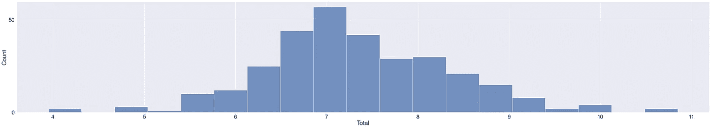

柱状图

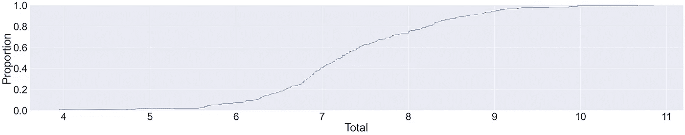

CDF 图

我们可以通过一周中的某一天来观察睡眠模式吗？我们可以绘制堆栈直方图。

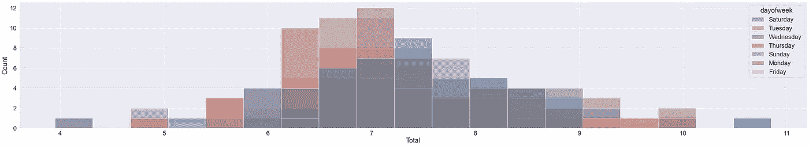

一周中各天睡眠数据的堆积直方图

然而，这看起来相当混乱，很难从中看出任何模式。在 Seaborn 中，可以使用平面 2D 网格方式显示多个直方图。

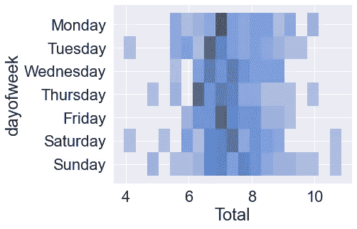

堆积直方图的 Seaborn 显示图

可以看出，事实上，从视觉上看，与周二和周四以及一般工作日相比，我在周六和周日确实睡得更久。以下是表格形式的日期:

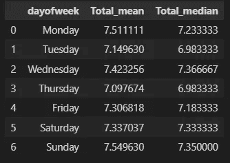

## 后续步骤

使用这款特殊的 Garmin 智能手表，您还可以进行心率监测，因此可以覆盖您的静息心率和最大摄氧量以及任何其他用户定义的输入，如水合作用、体重等。人们也可以通过使用智能手表继续建立更多的数据点。与此同时，一个人睡觉是为了获得统计上更有意义的数据，并比较是否存在季节性，比如你在冬天比夏天睡得更久？或者工作或个人环境中是否有变化模式可以显示压力。

# 结论

我已经演示了如何从 Garmin 下载数据，系统地提取多个 JSON 文件并将它们添加到 Pandas 数据帧中。通过对数据的简单清理，我使用 Seaborn 对数据进行了可视化，以获得对每月时段和一周中各天的一些有意义的见解。

以上分析的全部完整代码位于我的 GitHub [repo](https://github.com/ferhat00/garmin_sleep_analysis) 中。