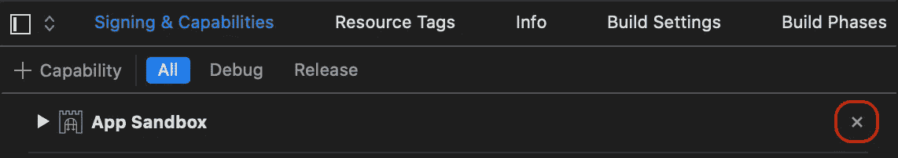
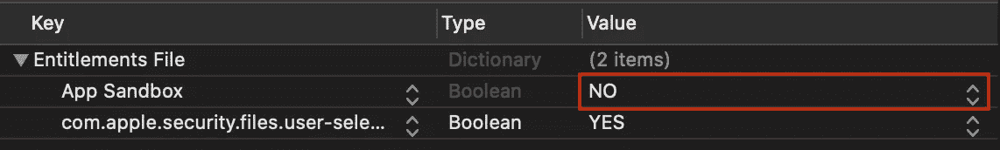

# 使用 SourceKitten 分析 Swift 文件的内容

> 原文：<https://betterprogramming.pub/analysing-swift-code-with-sourcekitten-99ff43d19428>

## 在 Swift 中检查 Swift 源文件的内容

照片由 [Sereja Ris](https://unsplash.com/@kimtheris?utm_source=unsplash&utm_medium=referral&utm_content=creditCopyText) 在 [Unsplash](https://unsplash.com/?utm_source=unsplash&utm_medium=referral&utm_content=creditCopyText) 上拍摄

[SourceKitten](https://github.com/jpsim/SourceKitten) 是一个开源项目，用于解析 Swift 文件的内容并获取有关该文件的详细信息。它用在许多你可能经常使用的工具中，比如 [SwiftLint](https://github.com/realm/SwiftLint) 和 [Jazzy](https://github.com/realm/Jazzy) 。

当查看它的自述文件时，它似乎只是一个命令行工具。然而，SourceKitten 还包括一个名为`SourceKittenFramework`的框架，我们可以用它来构建程序，自己分析和检查 Swift 代码。它只能在 Mac 应用程序中使用，不支持 iOS、tvOS 或 watchOS。

在本文中，我们首先将框架集成到我们的项目中。接下来，我们将了解如何分析 Swift 文件的内容，并仔细查看分析结果。一旦我们理解了哪些信息是可用的，我们将把它包装在一个结构中，在这个结构上我们可以执行我们自己的分析。

# 装置

第一步是让`SourceKittenFramework`在我们的应用程序中可用。我们可以使用 CocoaPods 或 Swift 包管理器来实现。

1.  CocoaPods:只需将`pod `SourceKittenFramework``添加到您的 podfile 并运行`pod install`。
2.  Swift 包管理器:将包添加到您的`Package.swift`文件中的`dependencies`列表中，如下所示:

将 SourceKittenFramework 添加到 Package.swift 文件中。

# 使用

让我们看一个标准的`UIViewController`模板，它是 Xcode 在添加新的 Cocoa Touch 类时生成的:

UIViewController 子类的入门模板。

它只不过是`UIViewController`的一个名为`ViewController`的空子类，它覆盖了方法`viewDidLoad`，并将方法调用传递给它的超类。

下面，您可以看到如何使用我们之前导入的`SourceKittenFramework`来分析 Swift 代码。

注意:当您收到错误“xcrun: error:不能在应用程序沙箱中使用”时，您需要在应用程序中禁用沙箱。您可以在后面的“问题”一节中看到如何做到这一点。

用 SourceKittenFramework 分析 Swift 源代码。

`// 1` —当然，我们从导入`SourceKittenFramework`开始，以便能够使用它的类、结构和方法。

`// 2` —接下来，我们需要创建一个`File`对象，它代表一个源文件。这可以通过将我们想要分析的 Swift 文件的路径传递给它的初始化器来完成，初始化器将读取文件的内容。

`// 3`—`File`类提供了另一个初始化器，它直接将源代码作为字符串。这对于测试特别有用，因为我们不需要将每个想要测试的代码片段定义为一个单独的文件。我们可以在测试用例中直接定义它们。

`// 4` —通过将`File`对象传递给`Structure`的初始化器，我们开始分析。我们通过检查`Structure`的属性`description`来访问分析结果，该属性保存了分析结果的文本 JSON 表示。

尽管我们执行分析的代码很短，但结果却不是这样。在 60 多行 JSON 代码中，我们获得了之前看到的关于`ViewController`类的所有可用信息:

使用 SourceKittenFramework 分析 UIViewController 模板的结果。

让我们看看一些关键参数:

*   `substructure`:子结构是一个对象列表，其中每个对象代表源代码中的一个元素。这些元素可以是类、结构、参数、方法、方法调用等等。由于一个方法通常包含在一个类或结构中，相应的`substructure`也是代表一个类或结构的`substructure`的一部分。因此，它们反映了被分析源代码的层次结构。因为在这个例子中我们只分析了一个类，所以主 JSON 对象在列表中只有一个元素表示我们的类`ViewController`。在第 19 行，我们可以找到另一个`substructure`，也就是方法`viewDidLoad`。这又在第 24 行中定义了另一个`substructure`，表示调用`super.viewDidLoad`。
*   `name`、`nameoffset`、`namelenght`:在这里我们可以找到一个`substructure`的名字(比如第 12 行的`ViewController`或者第 29 行的`super.viewDidLoad`)。`nameoffset`是所分析的源文件中名称首字母的索引。在本例中，名称`ViewController`从索引 20 开始。与`namelength`一起，它定义了文件名在文件中的位置。
*   `accessibility`:这个字段告诉我们一个元素的可访问性(例如私有、内部或公共)。
*   `kind`:`kind`的值告诉我们当前`substructure`是什么样的代码实体。如果一个类声明有种类`source.lang.swift.decl.class`，一个参数可以被`source.lang.swift.decl.var.parameter`识别。可能值的列表可以在 SourceKittenFrameworks 存储库的 [this file](https://github.com/jpsim/SourceKitten/blob/master/Source/SourceKittenFramework/SwiftDeclarationKind.swift) 中找到。但是看起来这个列表是不完整的，因为在结果中，我们看到`source.lang.swift.structure.elem.typeref`是最外面的`substructure`，它不在列表中。
*   `inheritedtypes`:这是一个包含当前`substructure`元素继承或符合的所有类和协议的列表。我们可以在第 51 行找到这个列表。正如所料，我们的`ViewController`是`UIViewController`的子类。

所以现在我们知道了关于类`ViewController`的大量信息，但它只是一个表示 JSON 结构的字符串。我们如何在应用程序中使用它来查看和执行更详细的分析呢？

为此，我们可以创建一个符合`Codable`的结构，并使用一个`JSONDecoder`将`Structure`的`description`属性自动转换为这个名为`SyntaxStructure`的结构，如下所示:

要从生成的 JSON 文件中解码的结构。

`// 1` —它包括我们在上述分析结果中发现的所有参数。请注意，像`substructure`这样的一些属性具有类型`[SyntaxStructure]?`。这就是我们如何创建层次结构。

`// 2` —由于 JSON 文件中的键与结构的参数名不匹配，我们需要添加一个符合`CodingKey`的 enum。这里，我们告诉解码器如何根据上面的 JSON 文件填充一个`SyntaxStructure`的值。

最后，我们将看到如何使用一个`JSONDecoder`来创建一个`SyntaxStructure`对象:

将生成的 JSON 文件解码为 struct SyntaxStructure。

`// 1` —我们将解码封装在一个名为`syntaxStructure(from:)`的函数中，该函数从`SourceKittenFramework`中获取一个`File`对象，并将其转换为`SyntaxStructure`的实例。因为 JSON 解码可能会失败，所以输出类型将是可选的。

`// 2` —首先，我们尝试从给定文件创建一个`Structure`对象。我们可以通过将`description`属性转换成数据来获取 JSON 数据。

`// 3` —最后，我们尝试用`JSONDecoder`将我们在上一步中创建的数据解码为`SyntaxStructure`的实例。

`// 4` —因为将文件转换成`Structure`文件，解码可能会失败，我们捕捉到一个可能的错误，将其打印出来，看看要修复什么，然后返回`nil`。

# 结论

就是这样！现在，您可以检查已分析的 Swift 文件的内容。例如，您可以计算继承，计算代码实体及其依赖关系的度量，或者编写您自己的 linter。

SourceKitten 是一个强大的工具，需要一点练习才能使用。根据您分析的代码和您的用例，您可能需要修改`StructureSyntax`及其参数。

# 问题

## 1.SourceKitten 不能在 macOS 应用程序沙箱内使用。

首次运行 SourceKitten 时，可能会遇到以下错误:“xcrun: error:不能在应用程序沙箱内使用。”

这是因为 SourceKitten 不能在应用程序沙箱中使用。因此，您需要为您的应用程序停用它。有两种方法可以做到这一点:

*   转到项目设置中的“签名和功能”选项卡。在那里，你会发现一个名为应用沙盒的签名部分。通过按下 x 按钮，您可以移除沙箱。

禁用应用程序沙盒-选项 1:通过项目文件。

*   转到项目的授权文件，将应用沙箱的值从 YES 改为 NO

禁用应用程序沙盒—选项 2:通过授权。

但是请记住，如果没有沙盒，您将无法在 mac App Store 中分发您的应用程序！

## 2.SourceKitten 的分析结果并不包含所有可能的信息。

例如，分析结果不会包括`as`表达式。

但你可能会说，“SwiftLint 用 SourceKitten，看看他们的自述吧。第一张截图显示，他们可以将`as!`检测为强制转换违例。”你是对的！

然而，他们没有用 SourceKitten 检测到`as!`。正如您在[中看到的，这个文件](https://github.com/realm/SwiftLint/blob/master/Source/SwiftLintFramework/Rules/Idiomatic/ForceCastRule.swift)定义了强制转换规则，它们通过正则表达式搜索这个字符串。

# 资源

 [## jpsim/SourceKitten

### 一个可爱的小框架和命令行工具，用于与 SourceKit 交互。SourceKitten 链接和交流…

github.comm](https://github.com/jpsim/SourceKitten)