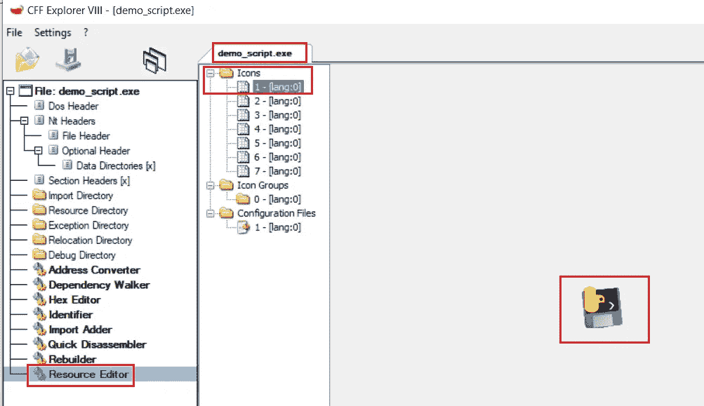
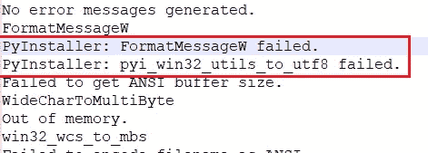
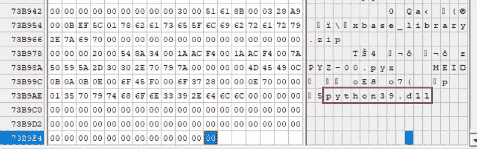
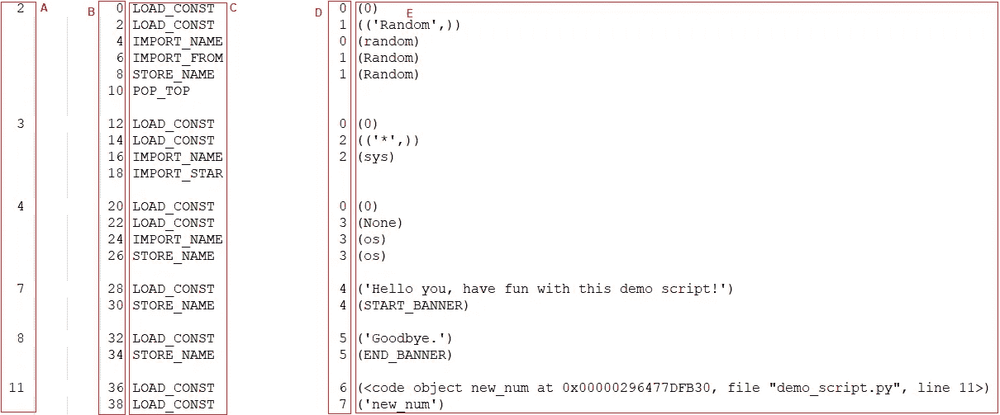
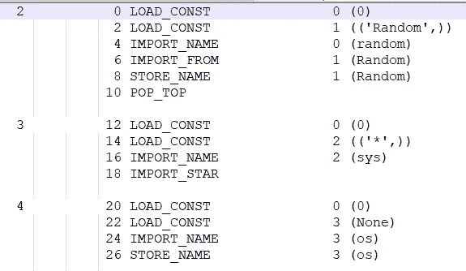
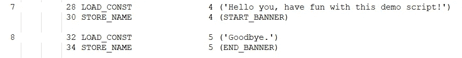
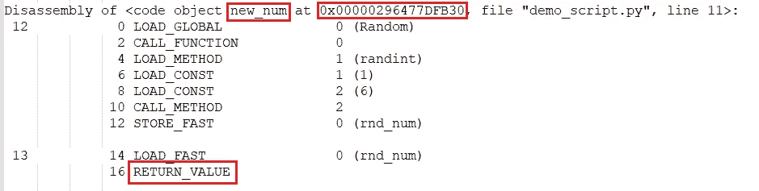
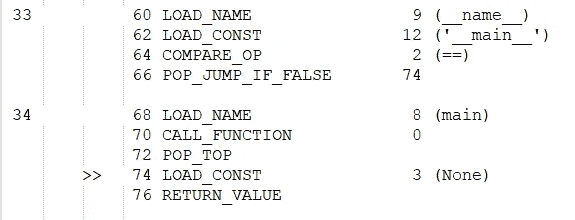
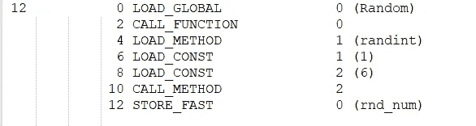
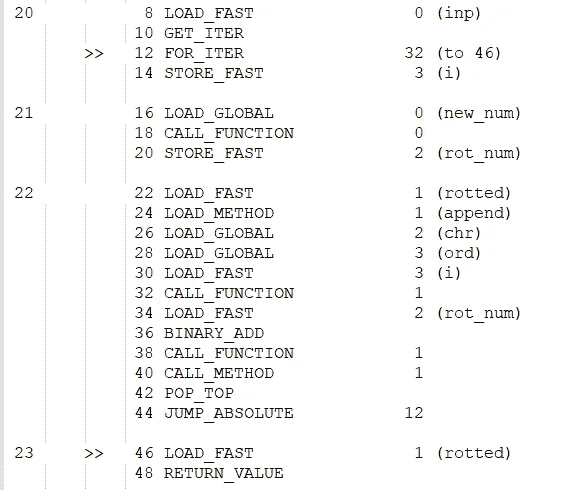

# 分析已编译的 Python 文件

> 原文：<https://betterprogramming.pub/analysis-of-compiled-python-files-629d8adbe787>

## 让我们看看 Python 脚本是如何工作的


迈克尔·泽兹奇在 [Unsplash](https://unsplash.com?utm_source=medium&utm_medium=referral) 上拍摄的照片

编译 Python 脚本时(。py)，最后你会得到一个编译好的 Python(。pyc，。pyo)。这个文件不如它的前一个文件可读，因为它是一个字节码序列。不要担心，如果您知道方法，您可以将其还原为可读的 Python 脚本。

# 我们的案例研究

在这篇文章中，我们将分析一个名为`demo_script.py`的简短脚本:

```
# Imports
from random import Random
from sys import *
import os# Constants
START_BANNER = "Hello you, have fun with this demo script!"
END_BANNER = "Goodbye."# Get a random number between 1-6
def new_num():
    rnd_num = Random().randint(1,6)
    return rnd_num# Rotate the input string by a random number (1-6)
def rot(inp): rotted = []
        rot_num = 0
        for i in inp:
            rot_num = new_num()
            rotted.append(chr(ord(i) + rot_num))
    return rotted

def main():
    print(START_BANNER)
    inp = argv[1]
    final = rot(inp)
    final = "".join(final)
    print(final)
    print(END_BANNER)if __name__ == "__main__":
    main()
```

编译 Python 脚本的工具有几种，最常见的有`PyInstaller` 和`Py2Exe`。每种工具编译 Python 脚本的方式都不同，但总体来说是可以识别的。

# 如何识别编译的 Python？

文件分析的第一步是识别其类型。幸运的是，使用下面的方法很容易发现一个可执行文件是否是一个编译过的 Python:

*   使用资源部分(PE 文件格式的一部分)来定位编译后的 Python 标识符，比如广为人知的图标。



使用 CFF 浏览器查找图标

*   使用`strings`工具(来自`SysInternals Suite`)包含 Python 信息，如:

```
“Could not load python dll”
PY2EXE_VERBOSE
PyInstaller
“PYTHONSCRIPT”*strings.exe -a “.\dist\demo_script.exe” > strings.txt*
```



strings.txt 内容

*   检测文件是否被打包——例如，PyInstaller 被认为是打包程序，因为它将源代码打包在新的可执行文件中。

## 如何确定使用的是哪个 python 版本？

每个 Python 版本都略有不同。这一点非常重要，因为不同版本之间存在许多差异

*   在十六进制编辑器中打开可执行文件(如 010Editor，HxD …)。
*   向下滚动到文件的末尾。
*   定位标识 Python 版本的字符串:`PythonXX.dll`。



使用 XVI32 十六进制编辑器查找 python 版本

## 将 EXE 转换为 PYC

要从可执行文件恢复到 Python 脚本，需要按以下顺序进行转换:


反向编译的 Python 文件

一些工具将可执行文件反编译到。pyc 文件:

```
*python unpy2exe.py {file.exe}**python pyinstxtractor.py {file.exe}*
```

这些工具会输出几个文件，有些文件是工具自己用的，所以可以忽略。
我们正在寻找的文件是与原始文件同名的文件，带有. pyc 后缀。
比如`file.exe`的主文件是`file.pyc`。

## 自动反编译 PYC

现在，所有需要做的就是反编译`pyc`文件，这就产生了原始的 Python 脚本。为此，我们将使用以下工具:

*   非编译 6-与 Python 版本 2.6–3.8 相关。
*   反编译 3。
*   简单的 Python 反编译器。

在几种情况下，这些工具将无法正常工作。这可能是由于不兼容的 Python 版本或缺少依赖项。在这些和其他不可预见的情况下，我们需要自己去做！

## 手动反编译 PYC 文件

提取主要部分后。pyc 文件，我们将只使用默认模块把它转换成可读的 Python 脚本。

模块`**dis**` 通过将 CPython 字节码分解成一个代码对象，或者分解成一个可以从中获取代码对象的对象，比如函数或者模块，来支持对 CPython 字节码的分析。
这个模块也包含了很多关于字节码指令的信息。

模块`**marshal**`允许以二进制格式读写特定的 Python 值。还支持读取和编写的 Python 模块的“伪编译”代码。pyc 文件。

以下脚本将字节码提取到一个可读结构中，该结构允许重写原始 Python 脚本:

```
import sys
import dis, marshal
pyc_path = sys.argv[1]
with open(pyc_path, 'rb') as f:
    # First 16 bytes comprise the pyc header (python 3.6+), else 8 bytes.
    pyc_header = f.read(16)
    code_obj = marshal.load(f) # Suite to code object
dis.dis(code_obj)
```

为了方便起见，将输出通过管道传输到一个文本文件:

```
*manually_decompile.py demo_script.pyc > dis.txt*
```



dis.txt 输出

# 输出说明

*   部分编号—每个部分都用空格键分隔，并将相应地进行编号。每个部分都是原始 Python 脚本中的一行。
*   当前部分中的行号—该行号将为每个函数重置。
*   指令—将被执行的指令。
*   与条件相关—包含条件结束的行号。
*   参数——根据说明的相关参数。

## 指令信息

要理解反汇编输出，可以查看模块的文档。

字节码分析 API 允许将 Python 代码片段包装在一个字节码对象中，该对象提供了对已编译代码细节的简单访问。

 [## Python 字节码的反汇编程序——Python 3 . 10 . 0 文档

### 该模块通过反汇编来支持对 CPython 的分析。这个模块将 CPython 字节码作为…

docs.python.org](https://docs.python.org/3/library/dis.html) 

```
LOAD_FAST — load a local variable.
BINARY_ADD — add the last value to the previous one.
CALL_FUNCTION — call a function
And so on…
```

现在我们需要解析`dis.txt`的输出并重写合法的。py 脚本—这应该会产生一个与原始脚本相同的脚本。

## 从字节码中识别 Python 脚本结构

**导入** 导入的模块通常可以在代码的开头找到，因为它们在脚本的后面会用到。
主要指令:`IMPORT_STAR`、`IMPORT_FROM`、`IMPORT_NAME`。

*   `IMPORT_NAME` —导入模块。
*   `IMPORT_FROM` —结合前面的指令，从 X 导入 y 得到*。*
*   `IMPORT_STAR` —从模块导入*。

例如，对于代码的以下部分:



从 demo_script.pyc 反汇编导入

我们得到:

```
from random import Random
from sys import *
import os
```

**常量**
常量变量通常紧跟在模块之后。
主指令:`LOAD_CONST`结合`STORE_NAME`。

`LOAD_CONST` —加载一个全局变量。
`STORE_NAME` —存储输入值的变量。



demo_script.pyc 反汇编的常量

转换为:

```
START_BANNER = "Hello you, have fun with this demo script!"
END_BANNER = "Goodbye."
```

**定义函数**
在本节中，只有函数的名称，没有内容和算法。因为与函数的关系就像与代码中的常量对象的关系一样。它可以帮助我们理解代码的流程。

它可以通过字符串`(<code object *{FUNC_NAME}* at *{OFFSET}*, file “*{SCRIPT_NAME}*”, line *{LINE_NUMBER}*>)`来识别。
紧接着，指令`MAKE_FUNCTION`与包含其名称的常量变量一起出现。


demo_script.pyc 反汇编中函数的定义

被转换为:

```
def new_num():def rot():def main():
```

每个函数的内容可以通过跳转到正确的偏移量来填充(行号将被重置，我们可以比较函数的名称)。该区域中的每个部分和指令都属于特定的函数(在原始脚本中缩进)。
我们可以通过`RETURN_VALUE`指令来识别函数的结束。因此，像堆栈一样，将被加载到前一条指令的值(像`LOAD_CONST`)将是函数的返回值。

按照 Python 惯例，函数的内容需要适当缩进。

例如，`new_num`功能将如下所示:



demo_script.pyc 反汇编中的 new_num 函数

**条件**
我们可以用指令来识别 if-else 语句这样的条件:`POP_JUMP_IF_ELSE`、`POP_JUMP_IF_TRUE`等。注意指令的目的——真或假时跳转等等。另外，请注意指令旁边的数字，它指向执行条件时要跳转到的行。那条线标有符号'> >'。
此外，指令`COMPARE_OP`包含布尔条件的运算符，该段中的变量是要比较的变量。



demo_script.pyc 反汇编中的条件

明眼人会注意到这是已知的“主要”条件:

```
if __name__ == “__main__”:
    main()
```

**函数调用**
为了识别代码内部对函数的调用，我们会搜索相关的指令:`CALL_METHOD`、`CALL_FUNCTION`等。
例如，结合指令`LOAD_GLOBAL`，紧接着`LOAD_METHOD`，最终`CALL_METHOD`会指示到`global.method()`。

*   `LOAD_METHOD` — `variable.method`。
*   `CALL_METHOD` —调用方法:`()`。如果有更多的方法或参数，它们将被输入到基于堆栈的逻辑(LIFO)中。

例如，我们将从前面提到的`new_num`函数中恢复一行:



demo_script.pyc 反汇编中 new_num 函数的一行

结果将是:

```
rnd_num = Random().randint(1,6)
```

**循环**
知道如何处理代码中的循环是理解代码的关键。我们可以通过说明来识别它:

*   `FOR_ITER` —结束于参数字段行的循环(至*行*)。
*   `GET_ITER` —来自不可改变变量的迭代变量。

让我们检查一下这部分代码:



demo_script.pyc 反汇编中 rot 函数的 For 循环

我们可以看到它变成了:

```
for i in inp:
    rot_num = new_num()
    rotted.append(chr(ord(i) + rot_num))
return rotted
```

变量`i`是迭代器变量，而`*inp*`是循环所基于的可迭代变量。`>>`符号内的所有内容在循环内缩进。

最后可以看到变量腐烂的返回。

# 结论

在这篇文章中，我们了解了如何使用开源工具以及仅使用默认 Python 语言“手动”逆向分析已编译的 Python 文件。我希望你能从这篇文章中学到一些东西。

感谢阅读。