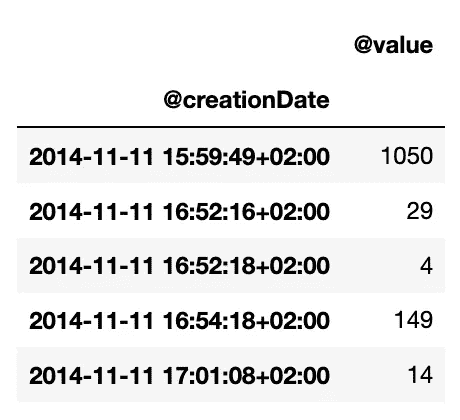
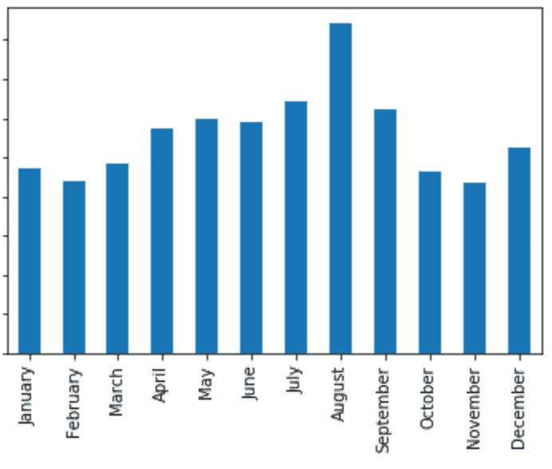
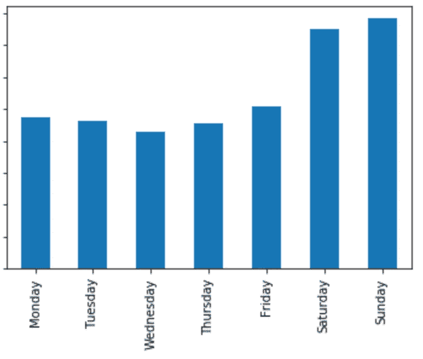

# 使用 Python 分析您的 iOS 健康数据

> 原文：<https://betterprogramming.pub/analyze-your-icloud-health-data-with-pandas-dd5e963e902f>

## 如何使用 Python 和 Pandas 分析来自 iPhone 健康应用程序的数据


照片由[像素](https://www.pexels.com/photo/computer-desk-laptop-stethoscope-48604/)上的[负空间](https://www.pexels.com/photo/computer-desk-laptop-stethoscope-48604/)拍摄

在这篇文章中，我将展示如何使用 Python 和 Pandas 分析从 iPhone 苹果健康应用程序导出的数据。

# 先决条件

我假设如下:

*   你拥有一台 iOS 设备(iPhone、iPad 等。)并且您有一些数据要导出。
*   你已经知道了用 Python 编写[熊猫](https://pandas.pydata.org/)的基础知识。
*   您已经安装了 Python 解释器，包括所有必需的库。如果不确定，在你的电脑上安装 Anaconda 。
*   我也建议用 [Jupyter](https://jupyter.org) 。

# 将健康数据导出为 XML

这里就不描述如何导出你的苹果健康数据的细节了。整个过程在[这篇文章](https://www.idownloadblog.com/2015/06/10/how-to-export-import-health-data/)中有描述。总结一下:

*   打开健康 app。
*   轻按您的个人资料图标，然后选择“导出健康数据”
*   选择如何“共享”您的数据；即发送到您的电子邮件地址。
*   将导出的数据(应该是一个 ZIP 文件)下载到您的 PC 并解压缩。然后，找到一个通常名为 ***export.xml*** 的 XML 文件(该名称可能会根据您的操作系统的语言而变化)。存档可能包括两个 XML 文件，但是包含您的数据的文件应该是*较大的那个。*

# 将数据读入熊猫

Pandas 默认不导入 XML 文件。在 Python 中有很多方法可以做到这一点，比如手动解析 XML。

我在这里选择使用[***xmltodict***](https://github.com/martinblech/xmltodict)导入 XML 文件。这个模块将把输入文件转换成 Python 字典。

首先，必须通过在终端键入以下命令，将 *xmltodict* 模块安装在您当前的 Python 环境中:

```
pip install xmltodict
```

假设您的输入文件名为 *export.xml* ，并且位于您运行 Python 的当前工作目录中，执行以下代码:

```
import pandas as pd
import xmltodictinput_path = './export.xml'
with open(input_path, 'r') as xml_file:
    input_data = xmltodict.parse(xml_file.read())
```

变量`input_data`是一个字典，包含来自原始 XML 文件的全部数据。实际的健康记录存储在`HealthData`字典的`Record`键中:

```
records_list = input_data['HealthData']['Record']
```

这是一个可以直接导入熊猫数据框的`list`字典:

```
df = pd.DataFrame(records_list)
```

# 数据结构检查

您可以通过运行以下命令来可视化导入的记录列表的所有字段:

```
df.columns
```

该命令将返回类似以下内容的输出:

```
Index(['[@type](http://twitter.com/type)',
       '[@sourceName](http://twitter.com/sourceName)',
       '[@sourceVersion](http://twitter.com/sourceVersion)',
       '[@unit](http://twitter.com/unit)',
       '[@creationDate](http://twitter.com/creationDate)',
       '[@startDate](http://twitter.com/startDate)',
       '[@endDate](http://twitter.com/endDate)',
       '[@value](http://twitter.com/value)',
       'MetadataEntry',
       '[@device](http://twitter.com/device)'], dtype='object')
```

**注意**:所有字段名都以`**@**` **符号**开头。为了简单起见，我将简单地用它们的名字来指代它们，而不用这个前缀字符。

若要显示字段的所有不同值，请执行以下代码:

```
df['[@type](http://twitter.com/type)'].unique()
```

这将显示*类型*字段的所有值。输出将类似于以下内容:

```
array(['HKQuantityTypeIdentifierHeight',
       'HKQuantityTypeIdentifierBodyMass',
       'HKQuantityTypeIdentifierStepCount',
       'HKQuantityTypeIdentifierDistanceWalkingRunning',
       'HKQuantityTypeIdentifierActiveEnergyBurned',
       'HKQuantityTypeIdentifierFlightsClimbed'], dtype=object)
```

在这篇文章中，我将考虑以下几个方面:

*   ***类型*** 字段代表记录的指标。例如，步数或体重。
*   ***sourceName*** 字段表示记录来自哪里。这可以是特定的应用程序名称或设备(例如，“iPhone XS”)。
*   ***单位*** 字段是记录的计量单位。这取决于类型。“步数”的单位是*计数*,“消耗的有功能量”的单位是*千卡*，以此类推。
*   ***creationDate*** ， ***startDate*** ， ***endDate*** 是记录的时间戳。对于给定的指标和*创建日期*，可能有多个*开始日期* / *结束日期*。我认为指标的生成和创建频率取决于设备和/或应用程序。出于本分析的目的，这是不相关的。
*   ***值*** 字段代表记录的测量单位的数量。例如，一个单位等于*千卡*的*值*为 42，意味着燃烧了 42 千卡热量。该字段的类型因设备而异。它可以是整数、浮点数等等。

# 步数分析

在本例中，我将重点关注“步数”指标。您可以非常容易地将相同的逻辑应用于其他指标。

首先，我们按类型筛选:

```
step_counts = df[df['[@type](http://twitter.com/type)'] == 'HKQuantityTypeIdentifierStepCount']
```

然后将时间戳字符串转换成实际的`datetime`对象是很有用的:

```
format = '%Y-%m-%d %H:%M:%S %z'df['[@creationDate](http://twitter.com/creationDate)'] = pd.to_datetime(df['[@creationDate](http://twitter.com/creationDate)'],
                                     format=format)df['[@startDate](http://twitter.com/startDate)'] = pd.to_datetime(df['[@startDate](http://twitter.com/startDate)'],
                                  format=format)df['[@endDate](http://twitter.com/endDate)'] = pd.to_datetime(df['[@endDate](http://twitter.com/endDate)'],
                                format=format)
```

我还想将该值转换为该指标的特定类型:

```
step_counts.loc[:, '[@value](http://twitter.com/value)'] = pd.to_numeric(
    step_counts.loc[:, '[@value](http://twitter.com/value)'])
```

在步数的情况下，值总是整数。让我们检查以下情况是否属实:

```
>>> step_counts.dtypes@type                                            object
@sourceName                                      object
@sourceVersion                                   object
@unit                                            object
@creationDate     datetime64[ns, pytz.FixedOffset(120)]
@startDate        datetime64[ns, pytz.FixedOffset(120)]
@endDate          datetime64[ns, pytz.FixedOffset(120)]
@value                                            **int64**
MetadataEntry                                    object
@device                                          object
dtype: object
```

注意*值*为 *int64* 。还要注意时间戳的类型。

**可选步骤**:下面，我没有考虑到你可能有多个设备(iPhone，iPod，iWatch 等。)都在向 iCloud 发送健康记录。在这种情况下，您可能希望按单个设备进行过滤。例如:

```
df = df[df['@sourceName'] == 'iPhone XS']
```

首先，我按天计算步数。有很多方法可以做到这一点。在这里，我选择通过 *creationDate* 和 sum 值进行聚合:

```
step_counts_by_creation = step_counts.groupby('[@creationDate](http://twitter.com/creationDate)').sum()
```

结果是一个 Pandas 系列，其中索引是时间戳，元素是合计值:



要按天获取**计数，**使用带`D`参数的`resample`方法:

```
by_day = step_counts_by_creation['[@value](http://twitter.com/value)'].resample('D').sum()
```

您现在可以显示**前十天:**

```
by_day.sort_values(ascending=False)[:10]
```

您也可以通过按`M`重新取样并计算平均值来检查**前十个月**:

```
means_by_distinct_month = by_day.resample('M').mean()
means_by_distinct_month.sort_values(ascending=False)[:10]
```

假设你的**最好的一个月**是 2017 年 6 月。您可以显示该月中所有日子的步数:

```
by_day[(by_day.index.year == 2017) & (by_day.index.month == 6)]
```

你也可以按月份计算一些关于你**表现的统计数据:**

```
import calendarmeans_by_month = means_by_distinct_month.groupby(
    means_by_distinct_month.index.month).mean()means_by_month.index = list(calendar.month_name)[1:]
```

例如，我通常在八月份平均走得更多:

```
means_by_month.plot(kind='bar')
```



按月计算步数

最后，你可以通过一周中的每一天来计算你的**表现:**

```
means_by_weekday = by_day.groupby(by_day.index.dayofweek).mean()means_by_weekday.index = ['Monday', 'Tuesday',
                          'Wednesday', 'Thursday',
                          'Friday', 'Saturday',
                          'Sunday']
```

这将表明我在周日走得更多:

```
means_by_weekday.plot(kind='bar')
```



按星期计算步数