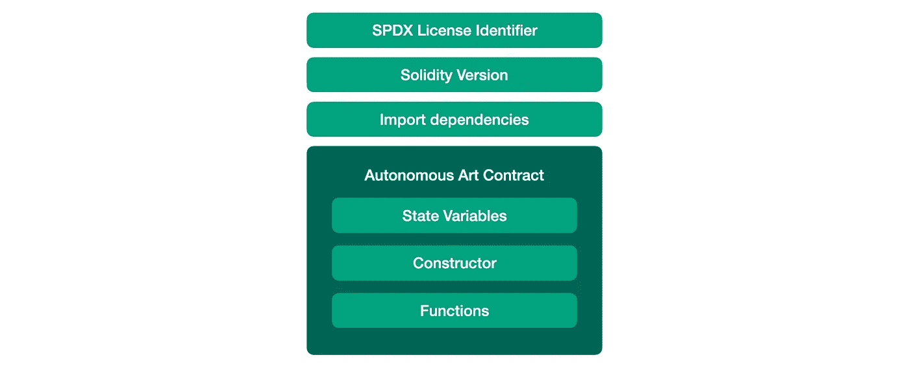
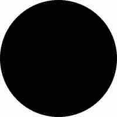
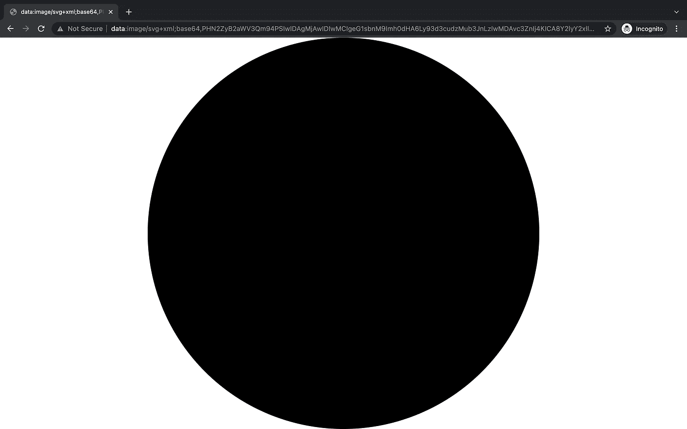

# 解析自主艺术 NFT 智能合约

> 原文：<https://betterprogramming.pub/analyzing-autonomous-art-nft-smart-contract-aa4547b31eb3>

## 解码智能合同 02


[自主艺术](https://autonomous.graphics/)是由[莫邪·马林斯派克](https://en.wikipedia.org/wiki/Moxie_Marlinspike)创建的 NFT 项目。它允许用户通过视觉贡献集体创造和铸造 NFT，并通过分享随后的铸造费来赚钱。这是一个非常成功的实验。按照[莫邪自己的话说](https://www.instagram.com/p/CaAhIv2vX-Y/):

> 我的自治图形 NFT 本来应该是一个笑话，但现在它已经投入了 150 万美元，而且它的字面广告牌漂浮在迈阿密海滩附近的水中。

在这篇文章中，我将解释自治艺术的智能契约。这篇文章是初学者友好的，所以可以随意跳过任何部分。如果你很了解这个项目，并且熟悉 NFT，你可能想导航到“按功能解释”部分。

# 目标受众是谁？

如果你刚到 NFT，想学习如何自己开发一个 NFT 智能合同，这篇文章很适合你。如果你对 NFT 背后的技术是如何工作的感到好奇，这篇文章也会有所帮助。

# 先决条件

如果你了解 ERC-721 并有编码经验，你可以跳过这一节。否则，不如了解以下内容。

*   NFT 概念:理解什么是 NFT 很重要，是什么让它不可替代。要了解更多，你可以阅读我以前的文章:[分析百事 NFT 智能合同](/nft-beginner-tutorial-pepsi-nft-smart-contract-explained-962721b7361a)(具体来说，合同部分的 **NFT)。**
*   **坚固性**:大部分 NFT 合约使用[坚固性](https://docs.soliditylang.org/en/latest/)。有一个基本的了解可以帮助你理解合同代码。[公文](https://docs.soliditylang.org/en/latest/)是一个很好的学习起点。
*   **ERC-721** :自治艺术 NFT 利用由 Open Zeppelin 实现的 ERC-721 智能合约。ERC-721 标准提供了 NFT 的基本功能，包括转账、检查账户余额、造币等。这是一个很好的概述: [ERC-721 不可替代令牌标准](https://ethereum.org/en/developers/docs/standards/tokens/erc-721/)。

# 什么是自主艺术？

在深入合同之前，我们先了解一下这个项目是如何运作的。有两个方面:(1)如何集体创作艺术？(2)经济如何运转？

## (1)如何集体创作艺术？

你可以在[自主艺术网站](https://autonomous.graphics/)上找到集体创作的作品。到目前为止，已经有 633 位用户在这幅数码画上留下了他们的印记。你可以在之前的图片上做一个视觉上的贡献(比如添加一个形状，指定一种颜色)，然后把它做成一个 NFT。下面的视频展示了这件艺术品的演变过程。

自主艺术史

## (2)经济如何运转？

要铸造一个 NFT，你必须支付一个随着时间推移而上涨的价格。这笔资金将平均分配给所有以前的捐助者。你会以同样的方式赚钱，由于所有后续薄荷。

可能很难理解这个项目。如果你想了解更多，请到[自主艺术网站](https://autonomous.graphics/)进行尝试或留下评论。

# 准备工作

首先，让我们找到最相关的合同代码。

## 在哪里可以找到合同代码？

智能合约地址为`0x3a56AB63c7ef4f07fe353bEb132e0Fd5AD270Ca0`，其代码在此[以太扫描页面](https://etherscan.io/address/0x3a56ab63c7ef4f07fe353beb132e0fd5ad270ca0#code)的‘合约’部分。

## 哪个合同？

以太扫描页面上有 13 个合同。但是，我们只需要看第一个，`CollectiveCanvas.sol`。其他合同是来自 Hardhat 和 OpenZeppelin 的开源模板，我们不会讨论。

你可以在我的 [Github](https://gist.github.com/sicongzhao/9c65f3f116599bcad36c34c14e161306) 上找到`CollectiveCanvas.sol`。

# 合同结构

接下来，我们来看看合同的结构。

这份合同乍看起来可能很复杂，但它组织得很好。图 1 显示了这个契约的结构。这种结构适用于几乎所有智能合同。如果您已经熟悉了，您可能想跳到下一部分，在那里我们将讨论这个智能合约的功能。



图 1 自治艺术 NFT 契约的结构

*   **SPDX 许可证标识符**(第 1 行)表示其他人如何使用该代码。SPDX 许可证的完整列表。
*   **Solidity 版本**(第 2 行)让编译器正确翻译代码，然后 EVM 就能理解了。在本合同中，`^0.8.0`表示 0.8.0 或更高版本，但不高于 0.9.0。
*   **Import dependencies** (第 4 - 9 行)然后契约使用 ERC-721 契约作为其蓝图，并且还添加了 base64 编码之类的功能。
*   自治艺术是由状态变量、构造器和函数组成的 NFT 契约。我将在下一节按功能来解释。

# 按功能解释


图 2 合同的功能

有 6 个主要功能。让我们调查一下！

## 1.链上元数据

该契约存储链上的元数据，这保证了 NFT 的信息被安全地存储，并且只要区块链本身不被破坏，这些信息就是不可变的。这种解决方案比依赖任何外部存储更可靠。

你可能会问链上解决方案是否更好，为什么项目要在 IPFS 上存储元数据？一个很棒的问题。答案是，存储信息可能是一项成本高昂的操作。根据这个消息来源的说法，存储 1kB 的数据大约要花费 0.02 ETH(54 美元)。很疯狂，对吧？

这个项目为链上存储使用了两个技巧:(1) SVG 格式图像(2) base64 编码。

**(1) SVG 格式图片:** SVG 代表可缩放矢量图形。它是一种描述矢量图形的语言。要画一个圆，只需要下面的字符串。尝试在这个 [SVG 查看器](https://www.svgviewer.dev/)中跳过它，看看它看起来怎么样。

```
<svg viewBox="0 0 200 200" ae ln" href="http://www.w3.org/2000/svg" rel="noopener ugc nofollow" target="_blank">http://www.w3.org/2000/svg">
  <circle cx="100" cy="100" r="100"/>
</svg>
```



图 3 . SVG 图像

以 JPG 或 PNG 格式存储相同的圆形图像将产生 3 或 4 kB 的文件大小，这将花费大约 200 美元的汽油费。

**(2) Base64 编码**本质上是将(结构化)数据编码成字符串的一种方式。例如，使用[一个在线 Base64 编码器](https://www.utilities-online.info/base64)，SVG 代码可以编码如下:

```
PHN2ZyB2aWV3Qm94PSIwIDAgMjAwIDIwMCIgeG1sbnM9Imh0dHA6Ly93d3cudzMub3JnLzIwMDAvc3ZnIj4KICA8Y2lyY2xlIGN4PSIxMDAiIGN5PSIxMDAiIHI9IjEwMCIvPgo8L3N2Zz4=
```

然后，如果我们在它前面加上一个字符串`data:image/svg+xml;base64,`，我们的浏览器将能够理解整个字符串并显示圆形图像。尝试将下面的字符串复制粘贴到浏览器的地址栏中，看看会发生什么！

```
data:image/svg+xml;base64,PHN2ZyB2aWV3Qm94PSIwIDAgMjAwIDIwMCIgeG1sbnM9Imh0dHA6Ly93d3cudzMub3JnLzIwMDAvc3ZnIj4KICA8Y2lyY2xlIGN4PSIxMDAiIGN5PSIxMDAiIHI9IjEwMCIvPgo8L3N2Zz4=
```

图 4 显示了我的结果。



图 4 浏览器中的 Base64 编码 SVG 字符串

现在我们可以将图像编码成字符串，这同样适用于 JSON 格式的元数据。为此，首先，使用 Base64 编码 JSON 数据。然后，在它前面加上`data:application/json;base64,`。

下面是提供链上元数据的合同函数，给定一个`tokenId`:

它首先检查令牌是否存在，然后从函数`_encodeSvgUriAtTokenId`中检索 Base64 编码的 SVG 图像字符串。第 6 行编码组合并将元数据 JSON 字符串编码成 Base64 格式。最后，在前面加上字符串`data:application/json;base64,`，链上元数据就生成了！

## 2.SVG 处理

下面的代码处理 SVG。

这是集体艺术，有很多贡献者。为了重建艺术品的每个历史状态，每个贡献都单独存储在 variable _layers 数组中。例如，如果我将上面的圆添加到艺术作品中，并将其铸造为 NFT，则此字符串`<circle cx=”100" cy=”100" r=”100"/>`将作为其最后一个元素添加到`_layers`中。另外，`_layers`里的圈串索引和我的 NFT tokenId 是一样的。

给定一个`tokenId`，函数`_encodeSvgAtTokenId`通过从头开始迭代`_layers`到 tokenId 值索引，并将每个元素添加到 SVG 字符串，来重构历史状态。

函数`_encodeSvgUriAtTokenId`将 SVG 字符串编码为 Base64 格式，然后为其添加字符串`data:image/svg+xml;base64,`以实现浏览器兼容性。

在我的学习中，我对使用 SVG 来存储和重建艺术品的历史状态感到惊讶。太有创意了！

我们没有涵盖所有内容。在将每个 SVG 元素添加到`_layers`之前，有一个函数`_validateLayer`检查每个 SVG 元素的有效性，特别是 SVG 语法。我没有研究这个函数，因为知道它的存在似乎就足以理解这个智能契约。

## 3.价格计算

恭喜你！你刚刚学到了这个聪明契约中最难的部分。后面的部分会更容易。

如上所述，NFT 的价格随着代币的数量而上升。下面的代码证明了设计的合理性。

只需补充两点:(1)层的长度等于前面讨论的铸造 NFT 代币的数量。(2)在构造函数中将 basePrice 设置为 0.024 ETH。

## 4.铸造

这里没有什么疯狂的，只是两个要求:(1)交易足以覆盖 NFT 价格，(SVG 代码是有效的。然后创建 NFT 并将元数据保存在映射状态变量`_tokenMetadata`中。

## 5.值分布

这个 NFT 项目走红的原因之一是价值分配机制。作为代币持有者，你可以通过分享后续的铸币费来赚很多钱。我们来深究一下吧！

函数`balanceOfToken`计算你的 NFT 拥有的余额。它迭代后续的铸币，计算你的份额，并将这些值相加，得出你拥有的总资金。然后用提取部分减去该值，得出可提取余额。

功能`withdraw`允许 NFT 所有者转移余额，并更新存储在`_tokenMetadata`中的提取金额。

## 6.其他人

还有其他的效用函数来设置底价或计算这个项目中累积的总资金。这些函数非常标准且易于理解。虽然我不会在本文中涉及它们，但如果您有任何问题，请随时发表评论！

# 结束了

你有它！我希望你觉得这个教程很有帮助，也很有趣。如果您有任何问题或建议，请随时发表评论。我也乐于接受建议。如果你知道一个有趣的项目，想让我看看，告诉我！

```
**Want to Connect?**Please feel free to reach out ([my LinkedIn](https://www.linkedin.com/in/zhaosicong/)) if you have any questions, feedback, or even just a random chat.
```

## **其他教程**

*   [分析百事 NFT 智能合同](/nft-beginner-tutorial-pepsi-nft-smart-contract-explained-962721b7361a)
*   [分析巴基斯坦的“合并”智能合同](https://medium.com/@luo9137/analyzing-paks-merge-smart-contract-7e437b66077c)