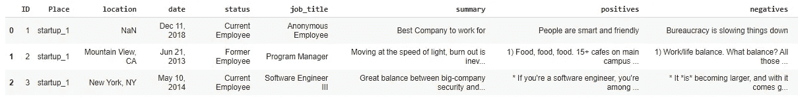
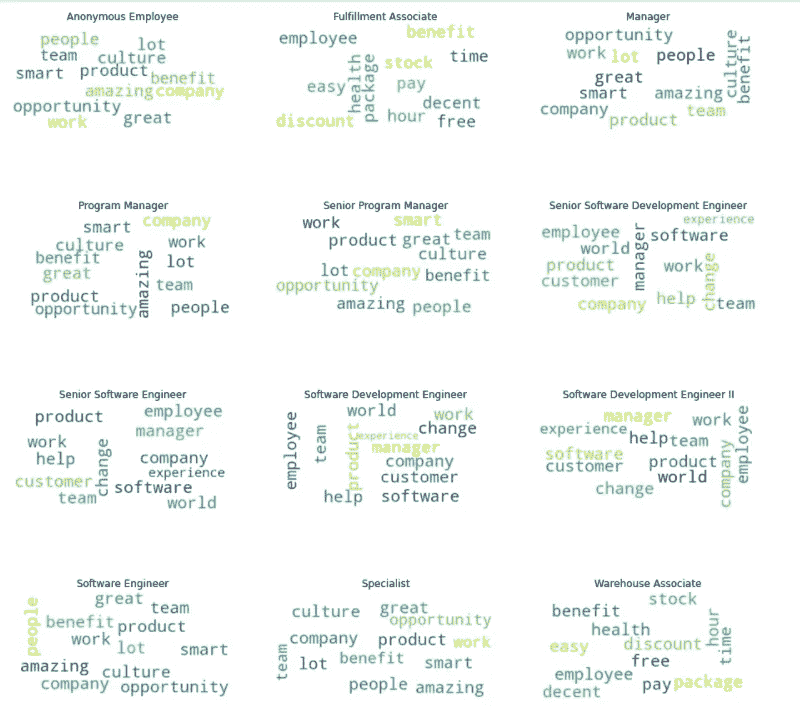
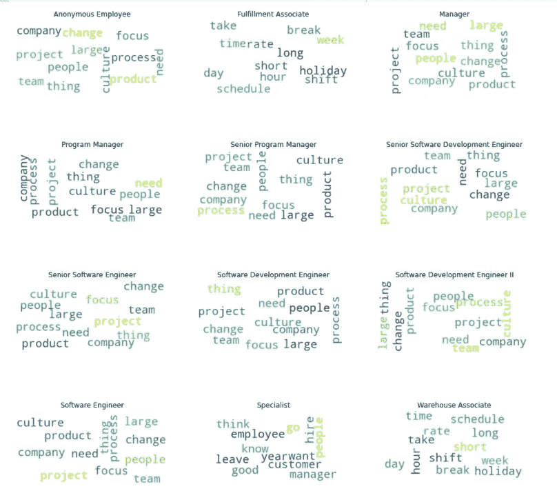

# 使用主题建模分析员工评论

> 原文：<https://betterprogramming.pub/analyzing-employee-reviews-using-topic-modeling-3ef6f18e88c7>

## 了解每个角色表达最多的词语

在 [Unsplash](https://unsplash.com?utm_source=medium&utm_medium=referral) 上由 [Clayton Cardinalli](https://unsplash.com/@clayton_cardinalli?utm_source=medium&utm_medium=referral) 拍照

我们有一个来自 Kaggle 的关于员工评价的数据集([链接](https://www.kaggle.com/fireball684/hackerearthericsson))。该数据集在黑客地球的黑客马拉松中使用过。该数据集包含正面和负面评论以及员工的职称。员工一般会以点评的形式表达对公司的体验。

因此，我们将分析属于几个角色的员工的正面和负面经历。使用这些信息，公司可以选择做出任何改变，如果它想要减轻其员工的负面体验并增加他们的正面体验，这些可以是特定于角色的改变。

让我们来看看数据:

为了分析特定于角色的评审，我们必须为员工评审建立一个主题模型。然后，我们可以应用任何一种集中趋势测量来了解每个角色更多地表达了哪个主题。

为了建立主题模型，我们需要关于语料库中主题数量的先验信息。有两种方法可以找到它:

1.  **分层狄利克雷过程** —这里我们有一个遵循狄利克雷分布的文档的基本分布(g0)。g0 可以具有无限数量的主题(主题的数量是无限的),并且每个主题具有与其相关联的概率，使得所有主题的概率之和为 1。因为 g0 本身是特定于文档的 Dirchilet 进程的基础发行版，所以每个文档发行版都有来自 g0 的主题。因此，主题集合在所有文档之间共享，并且每个文档将具有其自己的分配给主题的概率。
2.  **调整潜在的狄利克雷分配** —这里，该模型假设我们有关于组成语料库的主题数量的先验信息。以此为输入，模型给出了文档-主题分布和主题-词分布。由于我们没有关于主题数量的先验知识，我们可以使用一组主题计数来优化模型，以获得最高的一致性分数。

在这个项目中，我们将使用 LDA 模型，因为如果我们使用 HDP，我们将有许多主题-词分布(因为它是无界的),在主题中有许多重复的词。

我的假设:正面和负面的评论都会有两个主要的主题分布，一个会与公司的技术方面有关，另一个会与工作生活平衡，公司的文化方面有关。让我们在文章的最后验证这一点。

让我们为数据集创建一个锚列，它将帮助我们在项目管道的任何时候合并我们的结果。

# **文本预处理**

在每一个 NLP 项目中，理解对语料库应用什么句法和词汇过滤器是非常重要的，这将增加模型的性能。在这个项目中，我们只关心员工对公司的看法。因此，我们将只使用名词、动词、形容词，因为这些将捕获我们分析所需的大部分信息。我们将同时使用单词和双词，因为数据集中很少有双词，如工作-生活、软件工程师、工作文化等。

# 单词到矢量

现在，我们有了每个文档的精选单词列表。我们现在必须将这些单词转换成向量。我们可以通过词汇袋或`TfIdf`来做到这一点。

这两种方法都不会保留文档中单词的顺序，我们对单词的顺序也不感兴趣，我们主要关心的是这里的术语频率。由于我们有一个庞大的数据集，大部分单词将在语料库中重复出现。

如果我们考虑`TfIdf`，单词的稀有性将不会反映为由于重复的单词。因此，我们将使用单词袋。

# 超参数调整和模型构建

我们现在将针对以下一组超参数调整 LDA 模型:

1.  话题的数量。
2.  Alpha:表示文档主题密度。alpha 越高，文档包含的主题越多，alpha 越低，文档包含的主题越少。
3.  Beta:代表主题-单词密度，beta 越高，主题由越多的单词组成，反之亦然。

# 评估模型

优化后我们得到的最佳超参数是:

1.  主题数量:- 5
2.  阿尔法值:- 0.4
3.  贝塔系数:- 0.6

由于我们现在已经训练了模型，我们将为语料库中的每个文档预测最可能的主题。然后，我们将考虑 12 个最常见的角色，为每个角色选择重复次数最多的主题。现在，通过主题词分布，我们可以知道每个角色表达最多的词是什么。

以下是 12 个最常见角色的正面评价结果。我们可以看到，履行助理、仓库助理等非技术角色对公司提供的健康福利、折扣、工作时间、股票和其他福利持积极态度。技术角色对职业机会、优秀的团队、他们正在开发的产品、他们的经理、工作文化等持积极态度。分配给技术角色的主题略有不同，但是我们实验结果的关键和我们在本文开始时定义的假设是相同的。

我上传的图片

同样的管道也适用于负面评价，我们可以看到，属于非技术角色的员工更关心长时间的工作，没有适当的休息，以及轮班时间等。属于技术角色的员工关心糟糕的管理、公司文化、项目团队、流程等。

我上传的图片

# **改进**

你可以用一种更好的方式来调整模型，我在时间复杂度和结果之间做了一个权衡，因为我没有完美地调整模型。但我得到了下降和预期的结果。

您可以改变我们为每个角色分配词云的方式，您可以为每个文档选择 n 个(不同数量)最常见的主题，并为每个主题选择 m 个(不同数量)放入词云。

感谢阅读。