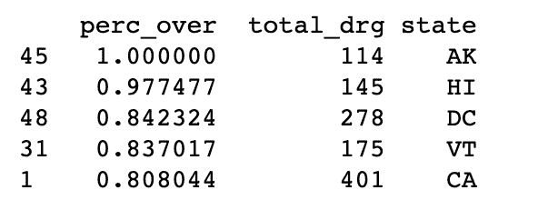
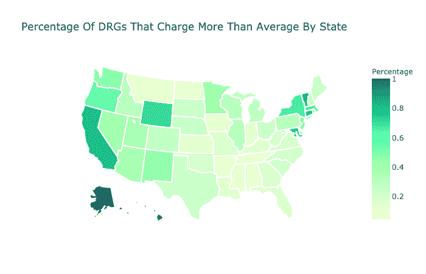

# 使用 BigQuery 分析医疗保健数据

> 原文：<https://betterprogramming.pub/analyzing-healthcare-data-with-saturncloud-io-and-bigquery-a9fdac3c0de4>

## 云让协作变得更加容易

路易斯·梅伦德斯在 [Unsplash](https://unsplash.com/search/photos/healthcare?utm_source=unsplash&utm_medium=referral&utm_content=creditCopyText) 上的照片

今天，我们想讨论如何使用云工具来分析医疗数据集，这些工具人人都可以使用。

特别是将为医疗保险提供者使用 Kaggle 数据集。它包含与诊断相关的群体的平均费用、医院位置以及关于提供者及其服务质量的有趣事实的信息。

这些数据集使您能够回答以下问题:哪些州具有最高的服务质量(基于它们提供的指标)、最高的平均成本以及患者群的人口统计数据。

由于医疗成本往往是最大的焦点之一，我们将看看哪些州的成本高于平均水平的百分比最大。为了查询数据，我们将使用 [SaturnCloud.io](https://www.saturncloud.io/?source=br-1) 作为 Jupyter 笔记本和 BigQuery 的平台。

# 我们将使用的工具

## 土星云

SaturnCloud.io 允许您轻松启动已经安装了 Jupyter Notebook 的虚拟机。但事实远不止如此。

使用 SaturnCloud.io 可以很容易地与其他队友共享您的工作，而不必处理确保他们安装了所有正确的库的麻烦。此外，对于那些在本地运行 Jupyter 笔记本电脑并耗尽内存的人来说，它还允许您使用所需的内存和 ram 来启动虚拟机，并且只需为您使用的内容付费。

还有一些其他的附加功能，可以真正减轻通常从 DevOps 角度完成的工作的复杂性。这就是像这样的工具的伟大之处。在许多方面，直到你在一个连共享一个基本的 Excel 文档都变得繁琐的公司环境中工作，你几乎很难向年轻的数据科学家解释为什么这是如此之好。

## BigQuery

由于数据存储的位置，我们还需要与 BigQuery 进行交互。这是一个谷歌云服务，允许你查询数据。在这种情况下，医疗保险数据对所有人开放，但存储在谷歌云上。

与大多数云服务一样，只要谷歌公开这些数据，管理起来就很方便。提取数据和运行查询真的很容易，而不必下载 CSV 并将其加载到您自己的数据库中。

在我们开始之前，您也可以在这里查看一下 [Jupyter 笔记本。](https://www.saturncloud.io/yourpub/rogoben/20cc56b6f8df482997e1e73669aee278/notebooks/States%20With%20The%20Highest%20DRG%20Costs%20-%20Medicare%20CMS.ipynb?source=br-1)

## 连接到 BigQuery

第一步，我们将检索`cms_medicare`公共数据集。为了做到这一点，您将需要设置 Google API 凭证([参见这里的说明](https://www.dundas.com/support/learning/documentation/connect-to-data/how-to/connecting-to-google-bigquery))。您会注意到凭证不像。包含密钥的 JSON 文件，如下所示。

一旦设置了凭据，就可以创建对客户端的引用。这将是你的接入点。

为了更好地理解您正在处理的内容，您实际上可以打印出`cms_medicare`数据集中的表格列表。使用下面的代码，你可以遍历这些表，这样你就知道你在做什么了。

现在，一旦您提取了数据集，您实际上就可以访问几个表了。您可以运行上面的 print 语句来获得所有表的列表。

对于这个分析，我们将使用`inpatient_charges_2014`数据集。这有关于提供者和诊断相关组(DRG)代码的信息，它不像 ICD 代码那样 100%依赖于诊断，但它是数据集包含的内容。我们这样说是因为我们将跨州比较 DRG 代码。这不是一个真正公平的比较，因为在汇总中可能会丢失各种细节，从而导致更高或更低的成本。我们这样做是为了展示你如何做未来的工作。

# **通过问一个问题开始你的分析**

要开始这个分析，我们先问一个基本问题。如前所述，我们想知道哪些州根据 DRG 定义的收费一直高于其他州。

## **哪些州的房价一直高于平均水平？**

为了做到这一点，我们需要在国家的粒度上计算平均价格。这可以通过使用 pandas 和 SQL 来实现。(就个人而言，我认为 SQL 通常更适合这种工作，所以我们将使用它。)我们可以编写如下所示的查询。

使用这个查询作为子查询，我们可以将两者连接到`hospital_general_info`，然后返回到原始表。这将提供原始成本以及状态信息。这将使我们能够比较`drg_definitions`的成本以及各州的成本。

然后，我们可以使用一个 case 语句来计算 DRG 定义超过平均成本的百分比。这可以在下面的查询中的`query1`变量中看到。

使用此查询，您现在可以计算出哪些州的 DRG 定义收费高于平均值的百分比最高。下面你可以看到我们拉着最高的几个，你会注意到最高的州是阿拉斯加州，加利福尼亚州和佛蒙特州。

# **数据可视化——绘制医疗成本图**

这是一个很好的例子，您可以使用简单的数据可视化将信息提取到简洁的图形中。看数字和州代码很难。很难真正了解发生了什么。相反，让我们使用 Ploty 库来绘制它。

有了这张地图，你可以更好地看到哪些州是高成本的最大元凶。现在，你不再盯着数字看，而是清楚地知道哪些州的收费高于平均水平。

同样，这不是 ICD 码的粒度，因此会丢失很多信息。但这是一个很好的概括。

# 后续步骤

你可以在我的 YouTube 频道上查看第一部分和第二部分

从这里开始，我们将调查各种高成本州，并查看是否有特定的 DRG 代码在提供商级别上保持一致。但是现在，我们将在这篇文章变得太长之前结束它。

如果你愿意，你可以在这里查阅 [Jupyter 笔记本。你甚至可能想提出你自己的问题，关于不同医疗程序类别的费用，不同提供者的服务水平，以及你可以利用这个数据集得出的其他结论。](https://www.saturncloud.io/yourpub/rogoben/20cc56b6f8df482997e1e73669aee278/notebooks/States%20With%20The%20Highest%20DRG%20Costs%20-%20Medicare%20CMS.ipynb?source=br-1)