# 使用网络面板和 HAR 文件分析 JavaScript UI 性能

> 原文：<https://betterprogramming.pub/analyzing-javascript-ui-performance-using-network-panel-and-har-files-bff526df60b2>

## 调试 web 应用程序的有效方法

由[Towfiqu barb huya](https://unsplash.com/@towfiqu999999?utm_source=medium&utm_medium=referral)在 [Unsplash](https://unsplash.com?utm_source=medium&utm_medium=referral) 拍摄的照片

我的页面加载很慢！我的页面在加载时卡住了！

你以前听说过这种抱怨吗？

最明显的 UI 性能问题是加载时间长。如果网页加载时间超过 2 秒，则认为用户体验差。如果加载时间超过 5 秒，web 应用程序将被视为不可用。

作为 UI 开发人员，我们一直都面临着这种情况。在开发环境中，我们专注于编写性能代码。然而，有许多因素会导致加载问题，例如互联网连接缓慢、过时的浏览器、缓存的数据和 cookies、广告拦截器、浏览器扩展、许多打开的标签，或者只是一段时间没有重新启动的浏览器的状态。

我们可能不知道每个用户的工作环境。在访问受限的情况下，可以通过分析网络活动来检查和解决问题。这项技术已经存在了一段时间，它仍然是测量 JavaScript 性能和调试任何瓶颈的最有效的方法之一。

# DevTools 的网络面板

每个浏览器都提供 DevTools。在本文中，我们以 Chrome 为例。其他浏览器的 DevTools 以类似的方式工作。

默认情况下，如果 DevTools 处于打开状态，网络面板会记录所有网络请求。

下面是一个例子，请求表显示了来自`[http://www.qwerly.com/](http://www.qwerly.com/)`的 21 个请求:

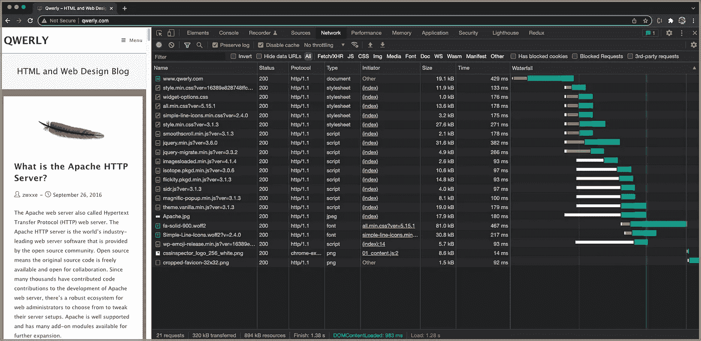

作者图片

requests 表显示了自 DevTools 打开以来发出的所有请求。对请求进行检查，以揭示 web 应用程序是如何工作的。这张桌子有两个部分:

*   设置控制以记录目标请求。
*   分析保存的请求。

## 设置控制以记录目标请求

对于如何记录目标请求，需要配置许多控制。

*   录音按钮:默认情况下，录音按钮是打开的，但可以关闭。当 DevTools 不再记录请求时，它变为灰色。

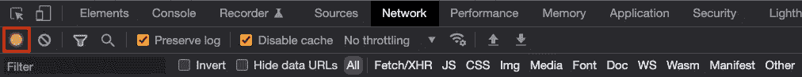

作者图片

*   clear 按钮:它从 requests 表中清除所有请求。

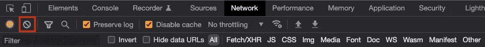

作者图片

*   过滤器按钮:在下一行显示/隐藏过滤器面板。

作者图片

当 filter 按钮打开时，我们可以通过文本和特定的按钮`All`、`Fetch/XHR` (XMLHttpRequest)、`JS` (JavaScript)、`CSS`来过滤 requests 表。`Img`(图片)`Media``Font``Doc`(文档)`WS`(web socket)`Wasm`(web assembly)`Manifest``Other`。

*   search 按钮:它打开一个搜索面板，可以在其中搜索响应内容。

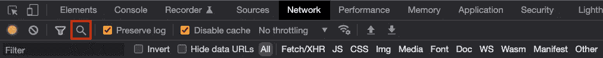

作者图片

以下是从请求表中搜索`div`的搜索面板。

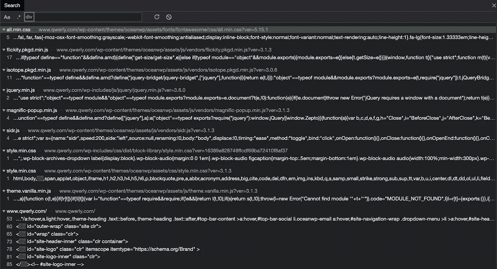

作者图片

*   `Preserve log`复选框:要跨页面加载保存请求，请选中`Preserve log`复选框。否则，对于每次页面加载，requests 表都会被清除。对于性能分析，跨页面加载保存请求通常很有帮助。

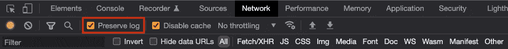

作者图片

*   `Disable cache`复选框:要模拟首次用户体验，请选中`Disable cache`复选框。否则，一些请求会在重复访问时由浏览器缓存提供服务。

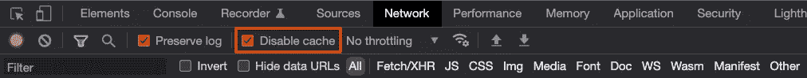

作者图片

*   网络节流菜单:除常规网速(`No throttling`)外，我们可以模拟`Fast 3G`、`Slow 3G`、`Offline`以及其他自定义连接速度(如`Slowest`)。

作者图片

## 分析保存的请求

我们已经配置了 requests 表来记录目标请求。我们如何阅读请求？

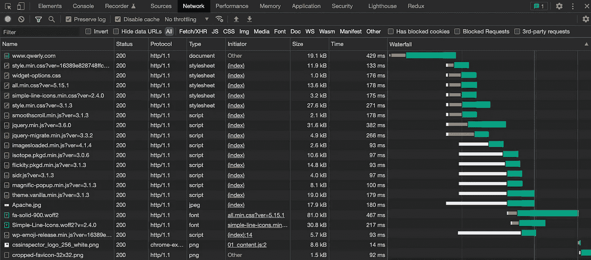

作者图片

上述请求表显示以下各列:

*   `Name`:资源的文件名或标识符。
*   `Status`:HTTP 状态码。`100`–`199`为信息响应，`200`–`299`为成功响应，`300`–`399`为客户端错误响应，`500`–`599`为服务器错误响应。状态`200`为`OK`，表示请求成功。
*   `Protocol`:应用协议，如`http/1.0`、`http/1.1`、`h2`、`h3`等。
*   `Type`:请求资源的 MIME(多用途互联网邮件扩展)类型，如`document`、`stylesheet`、`script`、`font`、`png`、`jpeg`等。
*   `Initiator`:发起请求的对象/进程。在上面的请求表中，大多数请求都是由索引文件发起的。
*   `Size`:响应头和响应体的组合大小，由服务器提供。
*   `Time`:总持续时间，从请求开始到收到响应中的最后一个字节。
*   `Waterfall`:每个请求活动的可视化分解。

可以选择的列比较多，每个列都可以排序。

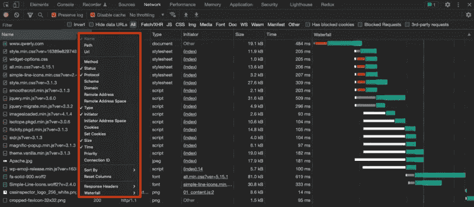

作者图片

分析保存的请求可以了解应用程序是如何工作的。它显示失败和出错的呼叫。错误可能是由于客户端错误地调用 API 调用，或者服务器遇到内部错误而导致的。可以通过逐行查看请求表来了解细节。

单击请求行将显示或重放请求。对`Apache.jpg`的请求显示了羽毛图像的预览。

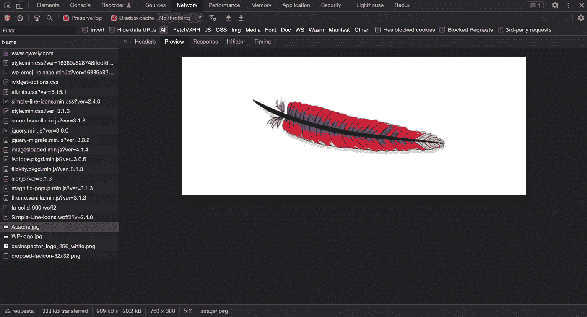

作者图片

瀑布活动显示了一个请求排队多长时间，等待多长时间，以及下载内容需要多长时间。

*   `Queueing`:当有更高优先级的请求时，浏览器将请求排队，或者已经有 6 个 TCP 连接为此源打开，这是`HTTP/1.0`和`HTTP/1.1`的 Chrome 限制，或者浏览器正在分配磁盘缓存中的空间。
*   `Waiting (TTFB)`:浏览器正在等待响应的第一个字节。TTFB 代表到达第一个字节的时间。这个计时包括一次往返的延迟和服务器准备响应所花费的时间。
*   `Content Download`:浏览器直接从网络或服务人员那里接收响应。该值是读取响应正文所花费的总时间。大于预期值可能表示网络速度较慢，或者浏览器正忙于执行其他工作，从而延迟了响应的读取。

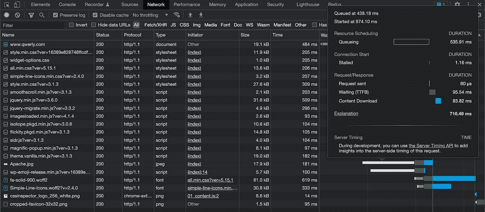

作者图片

我们将节流菜单改为`Slow 3G`。在第一个 5s 中，标题图像丢失。发生了什么事？

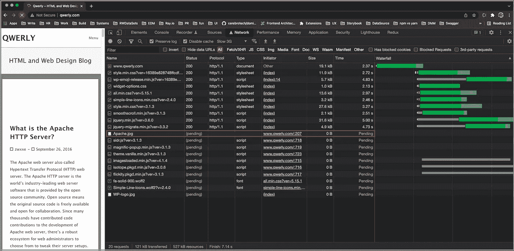

作者图片

查看请求表，我们发现有多个挂起的请求。对`Apache.jpg`的请求正在等待处理。这是图像缺失的根本原因。

网页加载完毕后，我们检查对`Apache.jpg`的请求。从`Slow 3G`加载图像花费了`8.61s`。

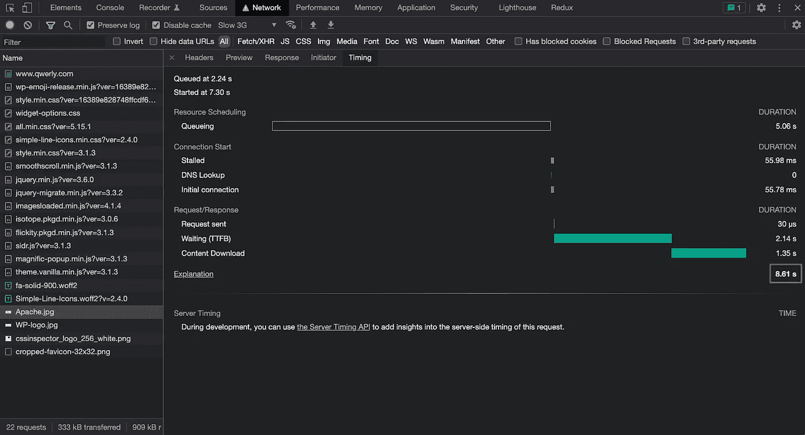

作者图片

# 将网络面板日志保存到 HAR 文件

从前面的例子中，我们看到 requests 表对于分析 UI 性能问题非常有效。

`[http://www.qwerly.com/](http://www.qwerly.com/)`是简单的页面。如果我们尝试用谷歌地图搜索旧金山，总共有 208 个请求，这在浏览器可视区域是看不到的。它需要更多的时间来分析这些请求。

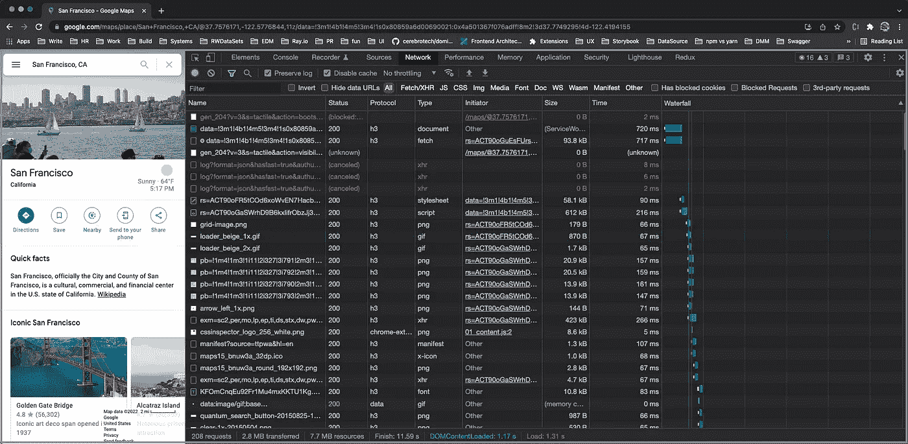

作者图片

如果我们不小心关闭了窗口/标签页怎么办？

我们会丢失所有的请求日志吗？

解决方案是将请求表保存到 HAR 文件中。

HAR 代表 HTTP 存档格式。它是一种 JSON 格式的归档文件格式，记录了 web 浏览器如何与站点交互。这类文件的常见扩展名是`.har`。

右键单击请求表会显示一个菜单。选择`Save all as HAR with content`，请求日志被保存。

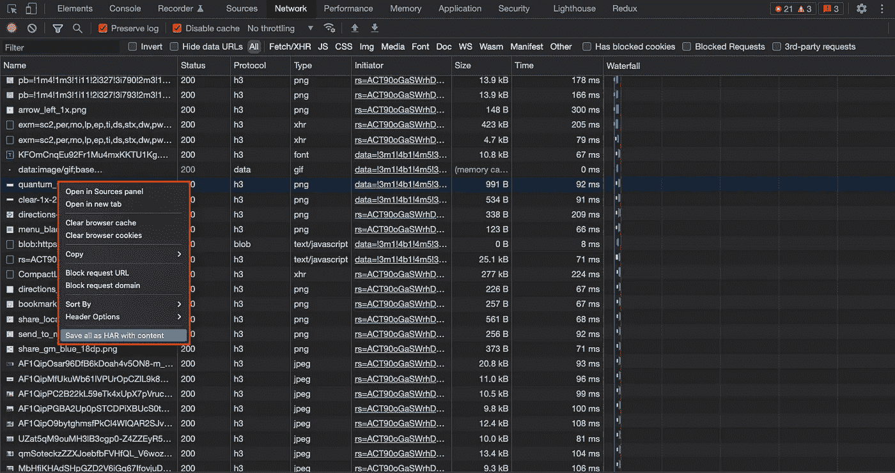

作者图片

同样，我们可以使用向下箭头来保存 HAR 文件。

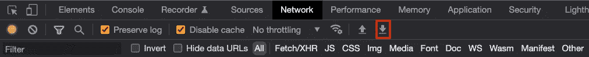

作者图片

# 查看 HAR 文件

我们已经收到了对慢速 UI 的请求，并将它们保存到 HAR 文件中。

这里有一个来自谷歌地图的 HAR 文件的例子:

该文件有 94，816 行，我们已经显示了前 58 行。以下是 JSON 树:

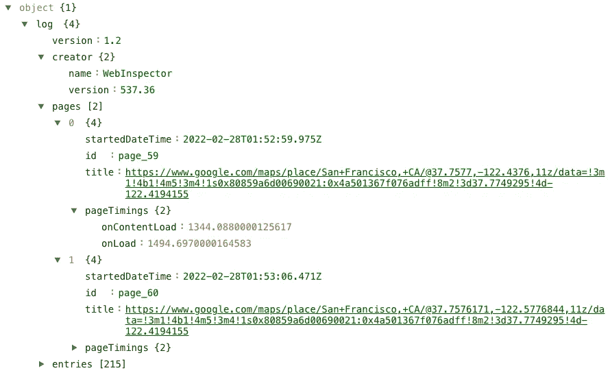

作者图片

我们如何分析这份 HAR 文件？

查看 HAR 文件有多种方式:

*   上传 HAR 文件到网络面板。
*   使用 Chrome 扩展。
*   使用在线 HAR 文件查看器。

## 将 HAR 文件上传到网络面板

HAR 文件从“网络”面板保存，并且可以上传回“网络”面板。

作者图片

这也可以通过在网络面板上拖放 HAR 文件来完成。

在这里，我们甚至可以将 Chrome 保存的 HAR 文件放到 Firefox 浏览器上。

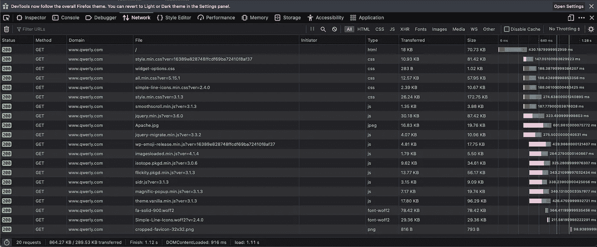

作者图片

## 使用 Chrome 扩展查看 HAR 文件

Chrome 有一个扩展`HTTP Archive Viewer`，是一个检查 HAR 文件的工具。

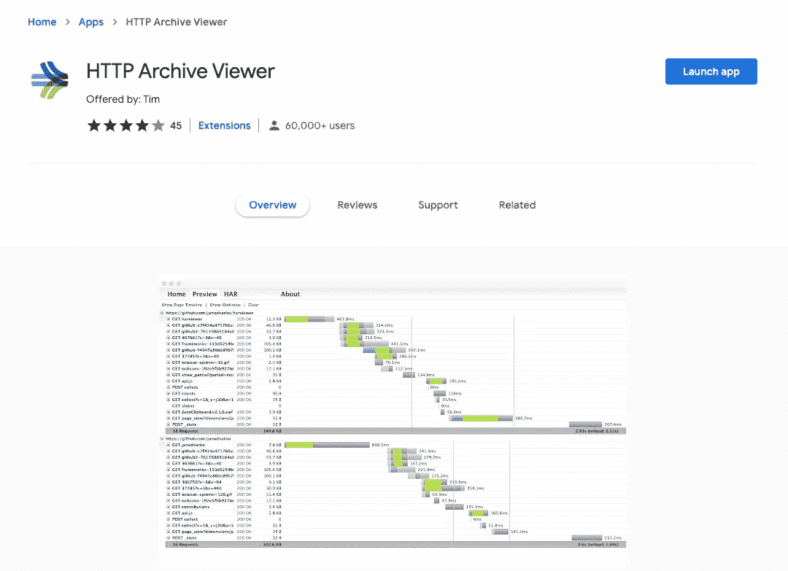

作者图片

点击`Lunch app`按钮，弹出一个窗口，有 3 个选项卡。第一个选项卡用于加载 HAR 文件。该文件可以放在页面上的任何地方，用文件选择器选择，或者粘贴到文本框中。

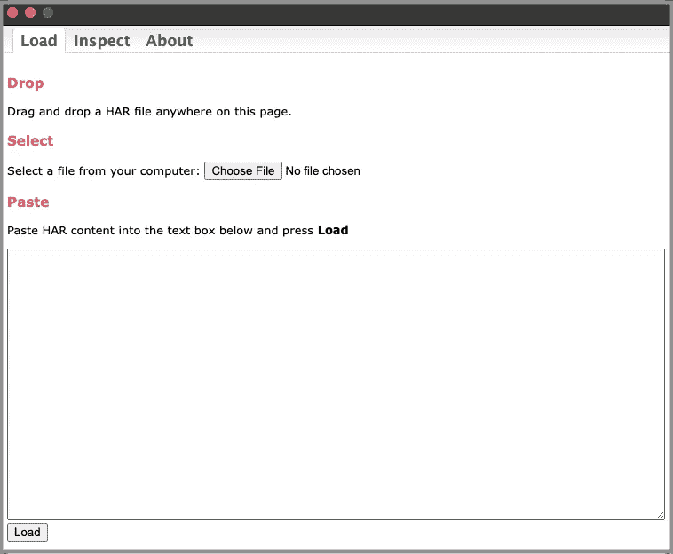

作者图片

文件加载后，窗口切换到`Inspect`选项卡。除了可用于附加分析的请求之外，查看器还可以显示/隐藏每个加载的 HAR 文件的`Page Timeline`。我们已经加载了两个 HAR 文件，一个用于`[http://www.qwerly.com/](http://www.qwerly.com/)`，一个用于谷歌地图。点击时间线栏可以选择/取消选择要包含/排除在`Show Statistics`面板中的相关请求。在下面的屏幕截图中，选择了两个 HAR 文件来显示有关传输数据的统计信息。

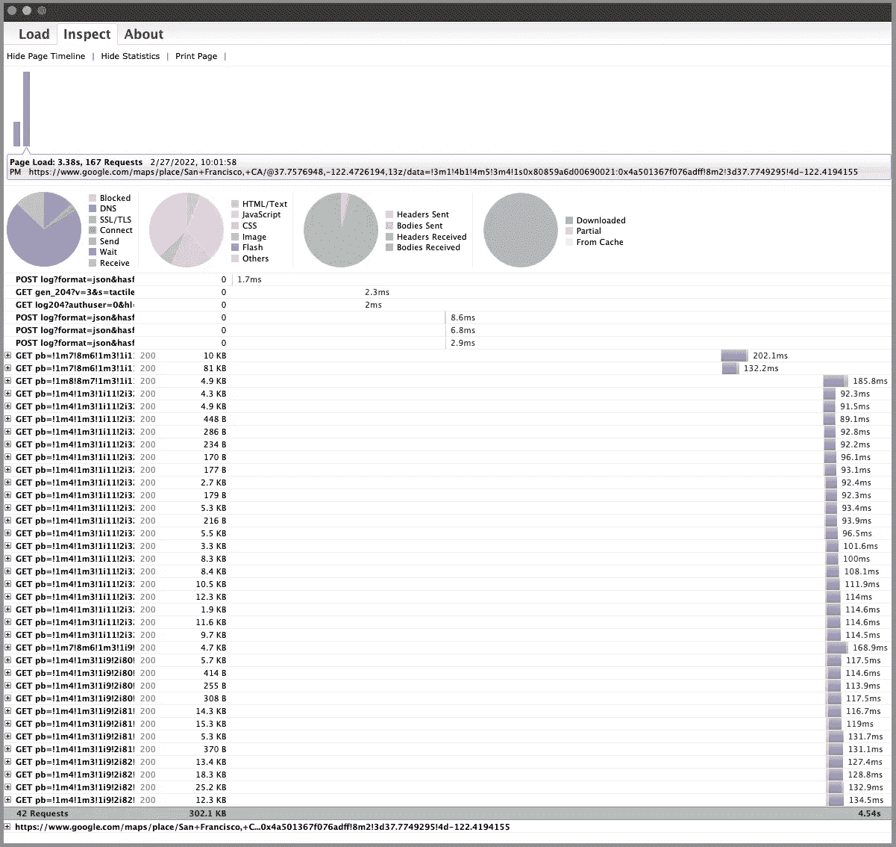

作者图片

第三个标签页是`About`，是关于查看器的描述。

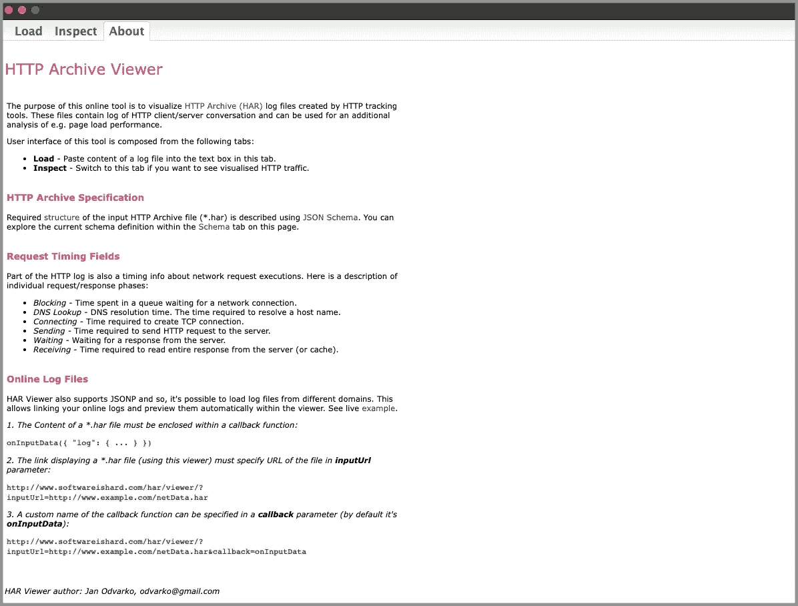

作者图片

## 使用在线 HAR 文件查看器

有一些在线的 HAR 文件查看器，[http://www.softwareishard.com/blog/har-viewer/](http://www.softwareishard.com/blog/har-viewer/)的工作方式类似于 Chrome 扩展，`HTTP Archive Viewer`。

前两个选项卡类似于`HTTP Archive Viewer`的前两个选项卡。第三个选项卡显示了上传的 HAR 文件的 JSON 树。

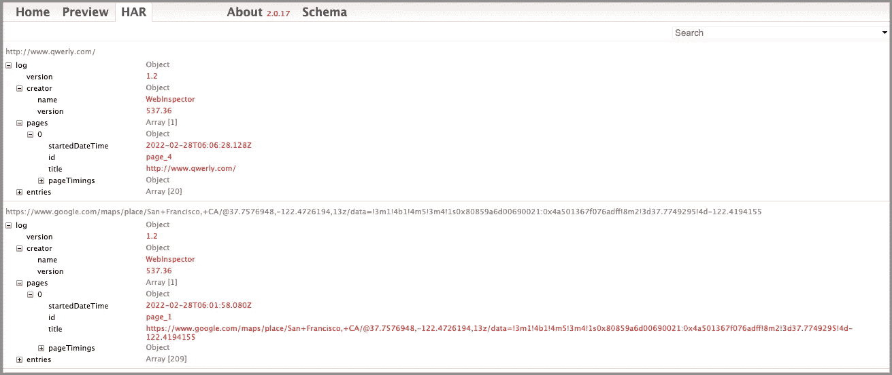

作者图片

# 结论

我们已经展示了如何使用 DevTools 的网络面板来分析 UI 性能。请求表可以保存为 HAR 文件。HAR 文件可以上传回网络面板进行检查，或者使用浏览器扩展或在线 HAR 文件查看器进行显示和分析。这种技术并不新鲜，但它仍然是测量 JavaScript 性能和调试任何瓶颈的最有效的方法之一。

感谢阅读。我希望这有所帮助。如果你有兴趣，可以看看[我的其他媒体文章](https://jenniferfubook.medium.com/jennifer-fus-web-development-publications-1a887e4454af)。