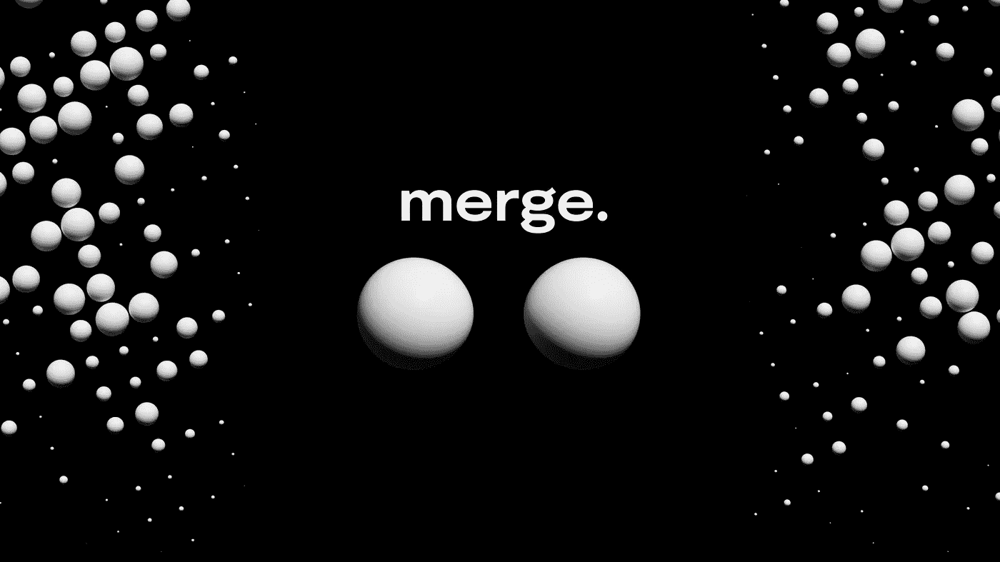

# 分析巴基斯坦的“合并”智能合同

> 原文：<https://betterprogramming.pub/analyzing-paks-merge-smart-contract-7e437b66077c>

## 解码智能合同— 03



封面图片。

[**The Merge**](https://niftygateway.com/collections/pakmerge) 是一个由匿名艺术家 [Pak](https://twitter.com/muratpak) 创作的成功的 NFT 项目。这个项目以 9100 万美元的价格售出，这是在世艺术家在公开拍卖中单幅作品的最高销售价格。

合并是一个动态的链上 NFT，具有一个称为“合并”的独特令牌机制。这个 NFT 系列的图像只是不同大小的圆圈，代表不同的质量。每个帐户在此集合中只能拥有一个 NFT。如果你拥有一个 NFT，又购买了另一个，两个 NFT 会合并成一个，它们的质量加在一起，这个圆的大小就会变大。

在本文中，我将解释合并机制的实现。如果你想了解更多，我创建了这个[概念页面](https://sicongzhao.notion.site/Analyze-Merge-Contract-7aeac92fac9d4b3e89392f64deb2d98e)，它解释了智能合约中的所有变量/函数。

# 去哪里找合同？

合约地址为`0xc3f8a0F5841aBFf777d3eefA5047e8D413a1C9AB`，您可以在[以太扫描](https://etherscan.io/address/0xc3f8a0f5841abff777d3eefa5047e8d413a1c9ab#code)中找到智能合约。在本文中，我们将研究第一个契约 [Merge.sol](https://gist.github.com/sicongzhao/b0cf206ce6d1f1632ace963c77dc9897) 。

# 合并机制

两个令牌如何合并成一个？神奇的事情发生在`_merge`函数中。当传输令牌时，契约检查接收方地址是否已经拥有令牌。如果是，就会触发`_merge`功能，如下图所示。

输入是两个令牌 id。该函数首先使用函数`decodeMass`检查两个标记的质量，然后通过用较小质量的增量更新映射`_values`，将较小的标记合并到较大的标记中。要了解更多关于`decodeMass`和`_value`的信息，请参考本[概念页](https://sicongzhao.notion.site/Analyze-Merge-Contract-7aeac92fac9d4b3e89392f64deb2d98e)。它包含所有变量/函数的定义和解释。

另一方面，较小的令牌将被烧毁。通过删除`_value`中较小的令牌，部分烧录发生在该函数中。在返回值`tokenIdSmall`的帮助下，大部分燃烧发生在这个`_merge`函数之外。不确定为什么这是构建代码的最佳方式，我认为在这个[概念页面](https://sicongzhao.notion.site/Analyze-Merge-Contract-7aeac92fac9d4b3e89392f64deb2d98e)中有改进和增加想法的空间。

这个契约使用映射`_mergeCount`跟踪每个令牌被合并的次数。并且该映射在合并后得到更新。

最后，所有令牌中质量最大的令牌称为 alpha 令牌，其 id 和质量存储在变量`_alphaId`和`_alphaMass`中。该函数检查合并令牌的质量是否大于`_alphaMass`，在这种情况下`_alphaId`和`_alphaMass`将被更新。

# SVG 生成的表面

SVG 生成代码在第二个契约 [MergeMetadata.sol](https://gist.github.com/sicongzhao/a8a7752c99bcef20ff645648d7bb5106) 中。在不使所有细节复杂化的情况下，SVG 中的一个圆用`<circle id=’c’ cx=’1000' cy=’1000' r=’_RADIUS_TAG’/>`来表示。`_RADIUS_TAG`基于每个令牌的质量动态生成。

# 结束了

你有它！我希望你觉得这个教程很有帮助，也很有趣。如果你想了解更多关于智能合约的信息，这个概念页面包含了对智能合约中所有变量/函数的全面解释。

如果您有任何问题或建议，请随时发表评论。我也乐于接受建议。如果你知道一个有趣的项目，想让我看看，告诉我！

```
**Want to Connect?**Please feel free to reach out ([my LinkedIn](https://www.linkedin.com/in/zhaosicong/)) if you have any questions, feedback, or even just a random chat.
```

## 其他教程

*   [分析百事 NFT 智能合同](/nft-beginner-tutorial-pepsi-nft-smart-contract-explained-962721b7361a)
*   [分析自主艺术 NFT 智能合约](/analyzing-autonomous-art-nft-smart-contract-aa4547b31eb3)