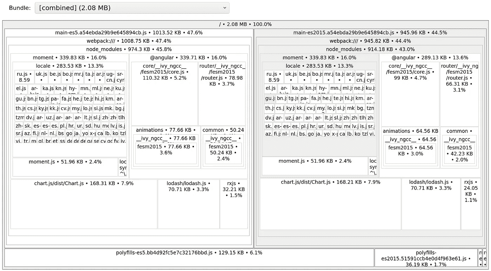
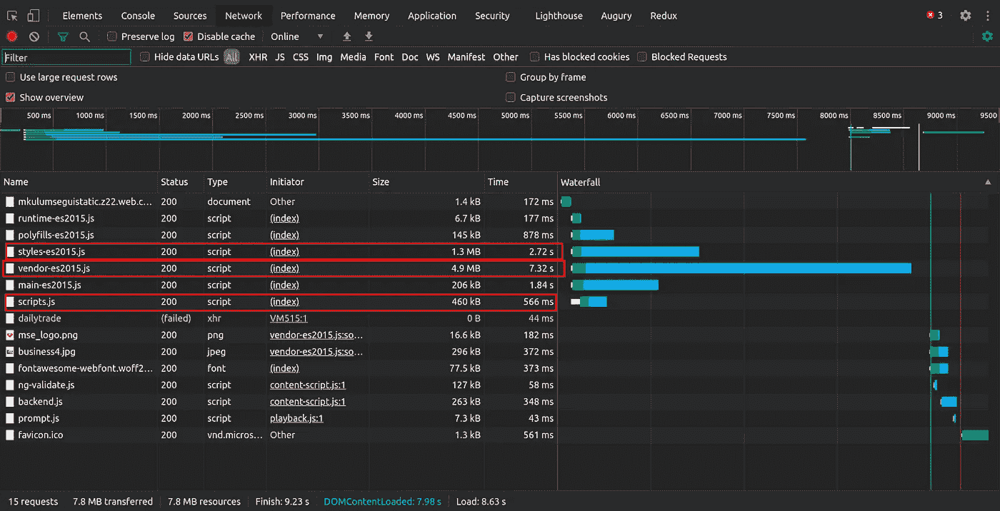
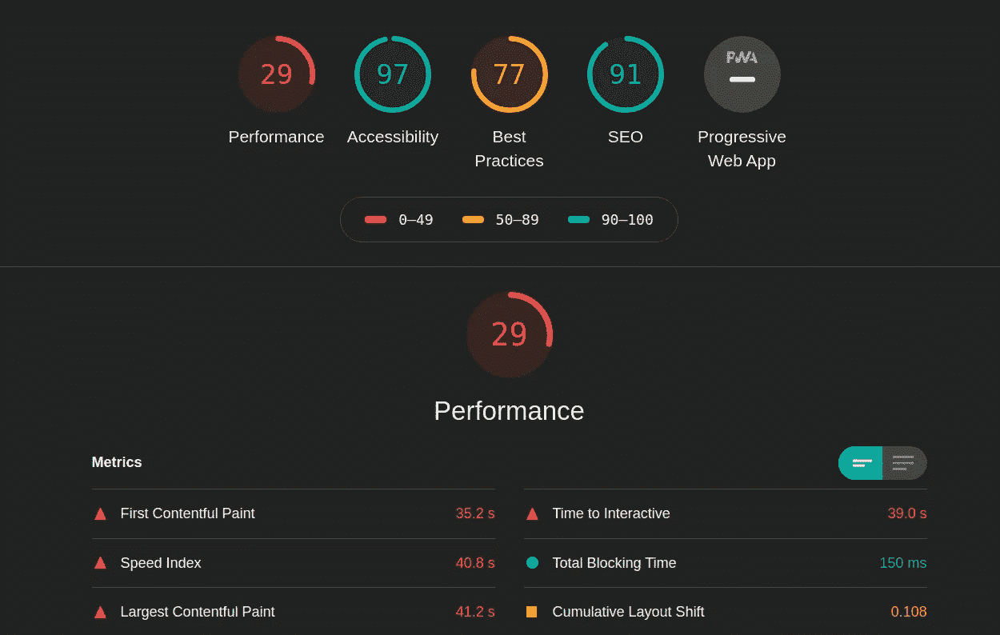
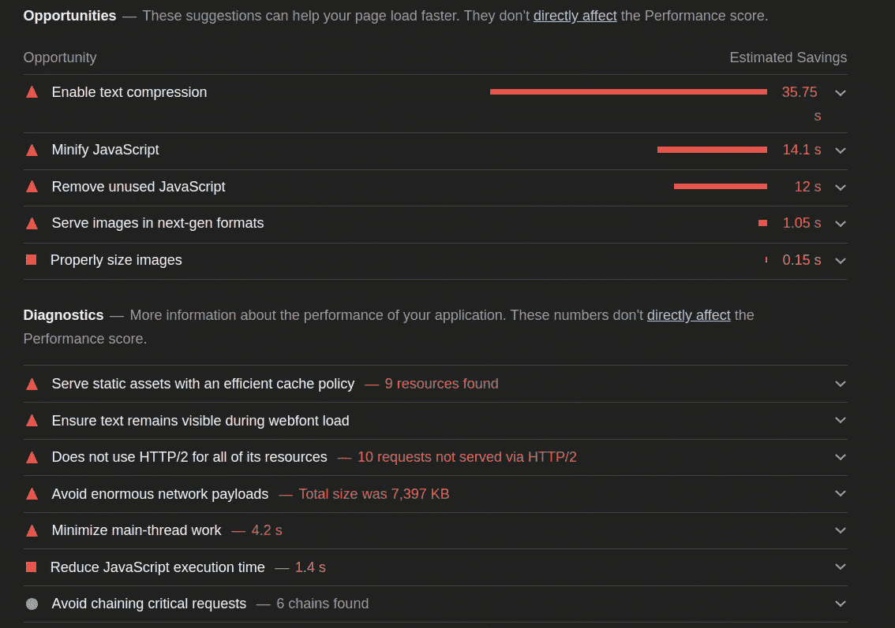

# 分析角度应用的性能

> 原文：<https://betterprogramming.pub/analyzing-the-performance-of-your-angular-application-9a4c23818504>

## 深入了解角度应用的性能


由[卢卡·坎皮奥尼](https://unsplash.com/@nexgenfx?utm_source=medium&utm_medium=referral)在 [Unsplash](https://unsplash.com?utm_source=medium&utm_medium=referral) 上拍摄的照片。

当您将 Angular 应用程序交付生产时，您希望它以最佳状态运行。高性能的应用程序带来高质量的用户体验。

在本文中，我将向您展示如何测量 Angular 应用程序的性能。了解降低应用程序速度的瓶颈将有助于您做出明智的决策，从而优化您的应用程序。

# 管束检查

npm 包`source-map-explorer`在检查由 Angular 产品构建输出生成的 JavaScript 包方面非常出色。

要安装`source-map-explorer`，只需从项目的工作区目录的根目录运行以下命令:

```
npm i source-map-explorer --save-dev
```

安装`source-map-explorer`之后，构建您的生产应用程序，并记住使用`--source-map`标志。这告诉 Angular 将源贴图作为构建的一部分:

```
ng build --prod --source-map
```

典型的 Angular 产品构建主要由以下文件组成:主包文件、供应商文件、polyfills、运行时包、脚本、样式表等。

您可以使用下面的命令通过`source-map-explorer`检查构建输出文件。`source-map-explorer`包将分析所有生成的源地图并显示所有依赖关系:

```
$ source-map-explorer ./dist/project-name/*.js
```



作者照片。

文件越大，你的网站在浏览器中加载的时间就越长。

如果您注意到任何不必要的大的依赖项或库，请考虑对它们进行优化，或者更改将它们导入到项目中的方式。如果您注意到一些不再使用的库，请将其删除。

通过在图形表示中单击各个库，您可以进一步深入和分析它们。

这将我们带到下一部分:查看应用程序的网络活动。

# 网路性能

在这一节中，我将向您展示如何使用 Chrome DevTools 中的网络面板来分析应用程序的加载方式。您还可以使用网络面板来分析是否所有资源都按预期下载或上传。

请确保在浏览器中以匿名或隐私模式加载您的应用程序，这样您就不会缓存网站资源来获得网络活动的真实反映。您可以使用快捷键`Ctrl + Shift + N`在匿名模式下启动浏览器标签。

运行我的 Angular 应用程序并查看网络面板后，我得到以下输出:



我用红色突出显示了一些大文件。供应商文件大约 5MB，如果你注意到，它们花了最多的时间来加载。

样式表文件也相对较大，需要一些时间来加载。这同样适用于脚本和聚合填充文件。

# 现场审计

要真正提高网站的负载性能，进行审计是很重要的。审计将对影响应用程序负载性能的因素提出建议，并建议一些补救措施。

要审计你的网站，打开 Chrome DevTools 下的 Lighthouse 面板。在 Lighthouse 面板中，点击“生成报告”按钮来获得您的应用程序的审计报告。在生成报告之前，您可以选择自定义审计选项。

*注:在旧版 Chrome 中，灯塔面板名为 Audit。*

在匿名或私有模式下运行一个示例 angle 应用程序并生成审计报告会产生下面的输出。

您可能已经注意到，该应用程序在可访问性、最佳实践和 SEO 方面得分很高。但是，它的表现相当惨。为什么？

再往下，审计报告还显示了应用程序获得这些指标的确切原因:



如您所见，审计报告还提供了一些关于如何提高 Angular 应用程序性能的建议。以下是一些潜在的改进:

*   缩小和丑化 JavaScript。
*   对图像使用新一代格式，如 JPEG 2000、JPEG XR 和 WebP，而不是 JPEG 或 PNG 等格式。
*   删除未使用的 JavaScript 和 CSS 代码或文件。



# 网页测试

最后但同样重要的是，您可以使用网站 [WebPageTest](https://www.webpagetest.org/) 在全球多个地方使用非模拟浏览器和设备测试您的应用程序的速度。

# 结论

在本文中，我们研究了几种分析 Angular 应用程序性能的方法。这并不详尽，但绝对是一个好的起点。

了解是什么降低了应用程序的性能，是做出明智的性能改进决策的关键。