# PostgreSQL 查询计划的剖析

> 原文：<https://betterprogramming.pub/anatomy-of-a-postgresql-query-plan-875469119fb>

## 在优化查询之前，首先要看的是查询规划器

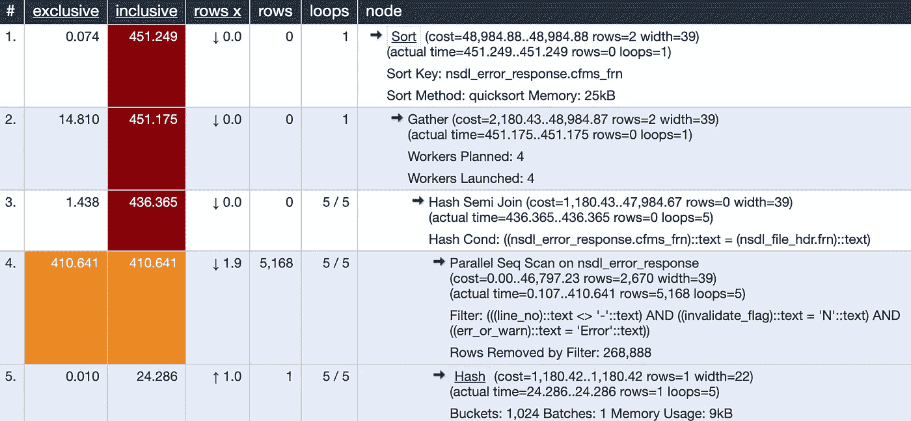

理解 PostgreSQL 查询计划对于开发人员和数据库管理员来说都是一项重要的技能。这可能是我们开始优化查询的第一件事，也是验证和确认我们优化的查询是否确实按照我们预期的方式进行了优化的第一件事。

## PostgreSQL 查询计划的剖析

在我们尝试阅读查询计划之前，问一些非常基本的问题很重要:

*   为什么我们甚至需要一个查询计划？
*   这个计划到底代表了什么？
*   PostgreSQL 是否不够智能，无法自动优化我的查询？我为什么要担心策划者？
*   策划书是我唯一需要看的东西吗？

每个查询都经历不同的阶段，理解每个阶段对数据库的意义非常重要。

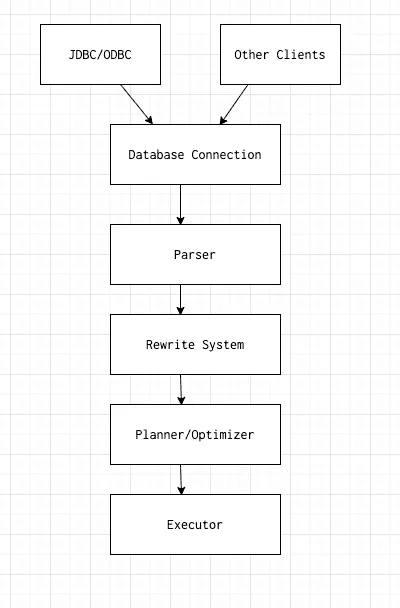

Postgres 查询生命周期图，由[https://app.diagrams.net/](https://app.diagrams.net/)制作

第一阶段是通过 [JDBC/ODBC](https://www.microfocus.com/documentation/xdbc/win20/BKXDXDINTRXD1.5.html) (分别由微软和甲骨文创建的用于与数据库交互的 API)或通过其他方式如[PSQL](https://www.postgresql.org/docs/13/app-psql.html)(Postgres 的终端前端)连接到数据库。

第二阶段是将查询翻译成一种称为解析树的中间格式。讨论[解析树](https://www.postgresql.org/docs/current/parser-stage.html)的内部结构超出了本文的范围，但是您可以想象它就像一个 SQL 查询的编译形式。

第三个阶段是我们所说的重写系统/规则系统。它采用第二阶段生成的解析树，并以一种规划器/优化器可以开始工作的方式重写它。

第四阶段是最重要的阶段，也是数据库的核心。如果没有规划器，执行者将会对如何执行查询、使用什么索引、是否扫描更小的表以删除更多不必要的行等一无所知。这个阶段是我们将在本文中讨论的。

第五个也是最后一个阶段是执行程序，它实际执行并返回结果。几乎所有的数据库系统都遵循或多或少类似于上述的过程。

## 数据设置

让我们用假数据建立一些虚拟表来运行我们的实验。

```
create table fake_data(id serial, name text, sentence text, company text);
```

然后用数据填充这个表。我使用下面的 Python 脚本来生成随机行。

```
from faker import Faker

fake = Faker()
# Change this range to whatever value you like
MAX_RANGE = 1000

with open('data.csv', 'w') as f:
    for i in range(0, MAX_RANGE):
        name = fake.name().replace(",", "")

        sentence = fake.sentence(
            nb_words=16, variable_nb_words=True
        ).replace(",", "")

        company = fake.company().replace(",", "")

        content = "'" + name + "'" + "," + \
                  "'" + sentence + "'" + "," \
                  + "'" + company + "'" + "\n"

        f.write(content)
```

该脚本使用 [Faker 库](https://faker.readthedocs.io/en/master/index.html)生成假数据。它将在根级别生成一个`csv`文件，并可以通过下面的命令作为常规的`csv`导入 PostgreSQL。

```
COPY fake_data(name, sentence, company) 
FROM '/path/to/csv' DELIMITER ','
```

由于`id`是串行的，它将由 PostgreSQL 自动填充。该表现在包含了`1119284`条记录。

```
SELECT COUNT(*) FROM fake_data;
```

下面的大多数例子都基于上表。有意保持简单，将重点放在流程而不是表/数据的复杂性上。

以下示例使用了 [Arctype](https://www.arctype.com) 编辑器。帖子的特色图片来自 [Depesz 在线讲解工具](https://explain.depesz.com/s/pIzU)。

## 进入规划阶段

PostgreSQL 和许多其他数据库系统让用户看到在计划阶段实际发生的事情。我们可以通过运行所谓的`EXPLAIN`命令来做到这一点。

## PostgreSQL 解释查询

```
EXPLAIN SELECT * FROM fake_data LIMIT 10;
```

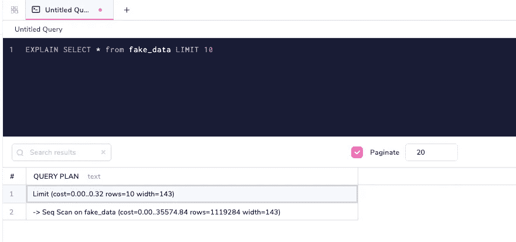

解释查询输出显示为普通行。

通过使用`EXPLAIN`，您可以在数据库实际执行查询计划之前查看它们。我们将在下一节中了解其中每一个的理解部分，但是让我们先来看看另一个叫做`EXPLAIN ANALYSE`的`EXPLAIN`的扩展版本。

## 一起解释分析

```
EXPLAIN ANALYSE SELECT * FROM fake_data LIMIT 10;
```

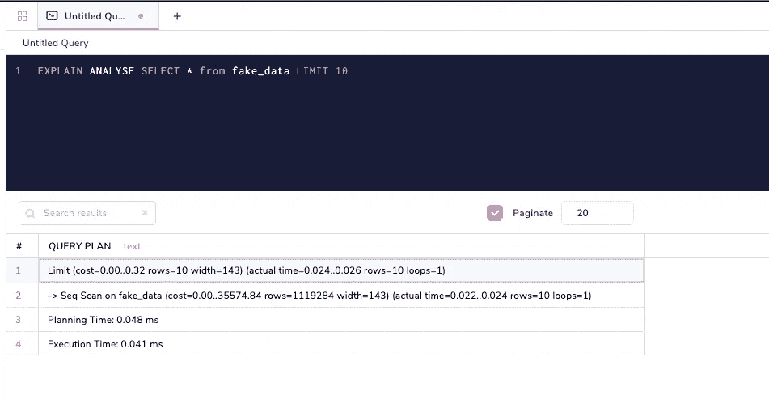

将 ANALYZE 参数添加到查询中会产生计时信息。

与`EXPLAIN`不同，`EXPLAIN ANALYSE`实际上在数据库中运行查询。该选项非常有助于理解计划者是否没有正确发挥其作用，即从`EXPLAIN`和`EXPLAIN ANALYSE`生成的计划是否存在巨大差异。

PostgreSQL 对`ANAYLYZE`和`ANALYSE`都很熟悉

## 什么是数据库中的缓冲区和缓存？

让我们来看一个更有趣的指标`BUFFERS`。这解释了有多少数据来自 PostgreSQL 缓存，有多少数据必须从磁盘获取。

```
EXPLAIN (ANALYSE,BUFFERS) SELECT * FROM fake_data LIMIT 10 OFFSET 200
```

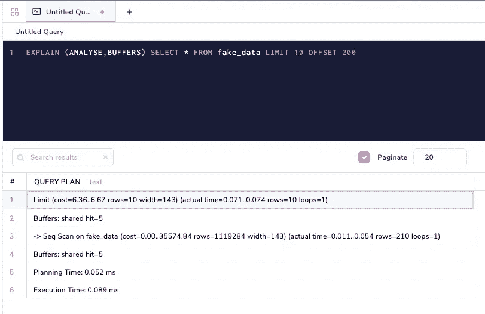

将 BUFFERS 作为参数显示了查询的页面命中率。

`Buffers : shared hit=5`意味着五个[页面](https://www.postgresql.org/docs/current/storage.html)是从 PostgreSQL 缓存本身获取的。让我们将查询调整为从不同行偏移。

```
EXPLAIN (ANALYSE,BUFFERS) SELECT * FROM fake_data LIMIT 10 OFFSET 500
```

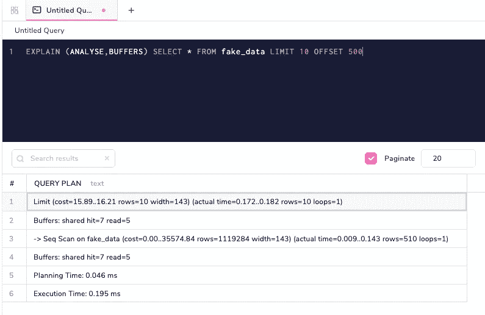

改变偏移量会导致不同的页面点击量。

`Buffers: shared hit=7 read=5`显示 5 页来自磁盘。`read`部分是显示有多少页面来自磁盘的变量，而`hit`如前所述来自缓存。如果我们再次执行相同的查询(记住`ANALYSE`运行该查询)，那么所有的数据现在都来自缓存。

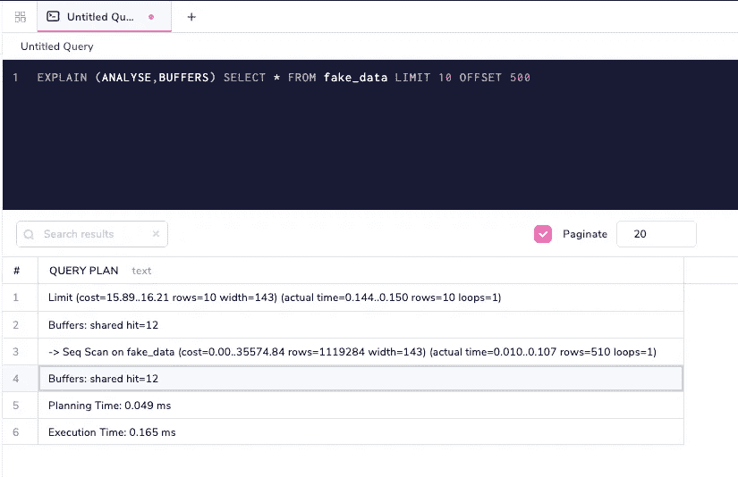

再次执行查询意味着缓存现在提供所有的结果。

PostgreSQL 使用一种称为最近最少使用(LRU)缓存的机制将常用数据存储在内存中。理解缓存如何工作及其重要性是另一篇文章的主题，但现在我们必须理解的是 PostgreSQL 有一个坚如磐石的缓存机制，我们可以使用`EXPLAIN (ANALYSE, BUFFERS)`命令来了解它是如何工作的。

## 详细命令参数

```
EXPLAIN (ANALYSE,BUFFERS,VERBOSE) SELECT * FROM fake_data LIMIT 10 OFFSET 500
```

`Verbose`是另一个提供额外信息的命令参数。

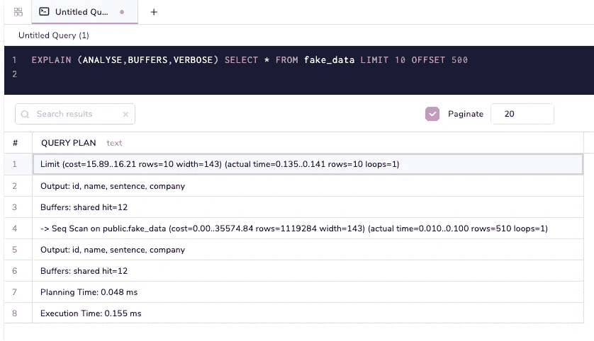

VERBOSE 命令参数将为复杂的查询提供更多的信息。

注意`Output: id, name, sentence, company`是附加的。在一个复杂的查询计划中，将会打印出大量的其他信息。默认情况下，`COSTS`和`TIMING`选项为`TRUE`设置，除非您想将其设置为`FALSE`，否则无需明确指定。

## Postgres 格式解释

PostgreSQL 能够以一种良好的格式给出查询计划，比如`JSON`，这样这些计划就可以用一种与语言无关的方式来解释。

```
EXPLAIN (ANALYSE,BUFFERS,VERBOSE,FORMAT JSON) SELECT * FROM fake_data LIMIT 10 OFFSET 500
```

将以`JSON`格式打印查询计划。您可以在 Arctype 中查看此格式，方法是复制其输出并将其插入另一个表中，如下图 GIF 所示。

还有各种其他格式，如下所示:

*   文本(默认)
*   JSON(上例)
*   可扩展标记语言
*   YAML

还有另外两个选项叫做`SETTINGS`和`WAL`，它们可以包含在查询计划中，但是这超出了本文的范围。

总结一下:

*   `EXPLAIN`是您通常开始使用的计划类型，通常用于生产系统。
*   `EXPLAIN ANALYSE`用于在获取查询计划的同时运行查询。这就是如何获得计划中的计划时间和执行时间细目，以及与执行查询的成本和实际时间的比较。
*   `EXPLAIN (ANALYSE, BUFFERS)`用于分析之上，以获取来自缓存和磁盘的行数/页数以及缓存的行为方式。
*   `EXPLAIN (ANALYSE, BUFFERS, VERBOSE)`获取关于查询的详细和附加信息。
*   `EXPLAIN(ANALYSE,BUFFERS,VERBOSE,FORMAT JSON)`是如何以特定格式导出。在这种情况下，格式是 JSON。

在下一节中，我们将使用这些工具来研究 PostgreSQL 查询计划是如何工作的。为了便于阅读，我们将只查看 PostgreSQL 查询计划的文本格式。

## 查询计划的元素

任何查询计划，不管有多复杂，都有一些基本的结构。在这一节中，我们将关注这些结构，这将帮助我们以抽象的方式理解查询计划。

## 查询的节点

查询计划由节点组成:

```
EXPLAIN SELECT * FROM fake_data LIMIT 10 OFFSET 500;
```

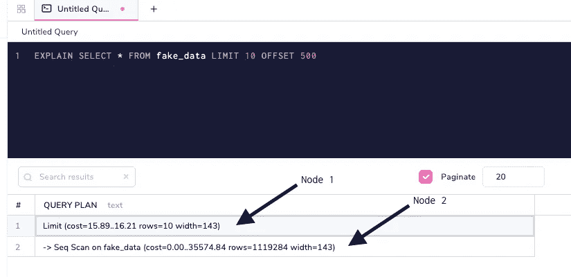

节点是执行查询的关键部分。

可以将节点视为数据库执行中的一个阶段。如上所示，节点大多是嵌套的。在它之前和之上完成了`Seq Scan`，然后应用了`Limit`子句。让我们添加一个`Where`子句来理解进一步的嵌套。

```
EXPLAIN SELECT * FROM fake_data where NAME = 'Sandra Smith' LIMIT 10
```

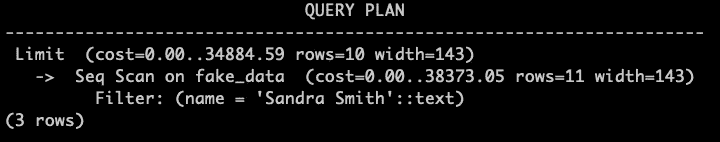

行刑是由内而外进行的。

*   筛选 name = Sandra Smith 的行
*   使用上述过滤器进行顺序扫描
*   在顶部应用限制条款

如您所见，数据库识别出只需要十行，并且一旦达到所需的十行就不再扫描。请注意，我已经关闭了`SET max_parallel_workers_per_gather =0;`，这样计划更简单。我们将在后面的文章中探讨并行化。

## 查询计划器中的成本

成本是数据库查询计划的重要组成部分，由于其表示方式不同，成本很容易被误解。让我们再来看看这个简单的有成本的计划。

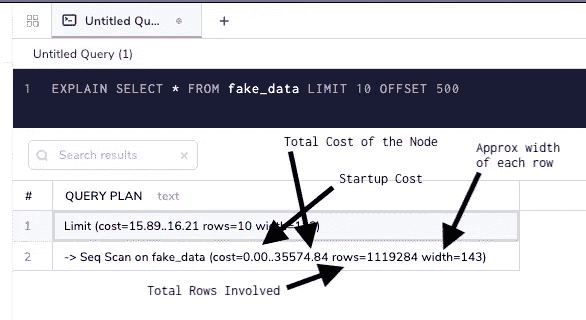

成本在解释输出中表示。

以下几点很重要:

*   `LIMIT`条款的启动成本不为零。这是因为启动成本加起来最高；你看到的是它下面的节点的开销。
*   总成本是一个任意的衡量标准，与使用者相比，它与规划者更相关。在任何实际用例中，您都不会同时获取整个表数据。
*   众所周知，顺序扫描在评估方面很糟糕，因为数据库不知道如何优化它们。索引可以极大地提高使用`WHERE`子句的查询速度。
*   `Width`很重要，因为行越宽，需要从磁盘中获取的数据就越多。这就是为什么遵循数据库表的规范化非常重要。

如果我们实际运行查询，那么成本会更有意义。

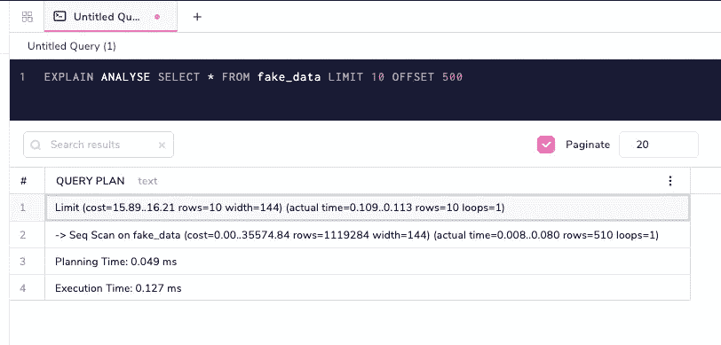

## 数据库规划和执行

计划和执行时间是只能通过`EXPLAIN ANALYSE`选项获得的指标。

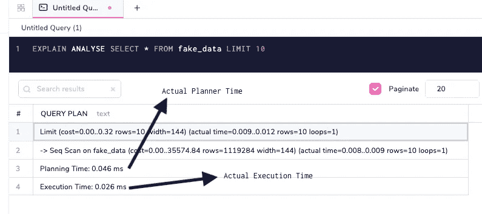

规划和执行是查询执行的两个不同阶段。

计划者(计划时间)根据各种参数决定查询应该如何运行，而执行者(执行时间)运行查询。上面指出的这些参数是抽象的，适用于任何类型的查询。运行时间以毫秒表示。在许多情况下，计划时间和执行时间可能不接近。在上面的例子中，计划者可能会花更多的时间来计划查询，而执行者可能会花更少的时间，但通常情况并非如此。它们不一定需要彼此匹配，但是如果它们偏离很多，那么是时候调查发生了什么。

在典型的 OLTP 系统(如 PostgreSQL)中，任何计划和执行加起来都应该少于 50 毫秒，除非是分析查询/大量写入/已知异常。记住，OLTP 代表在线事务处理。在一个典型的企业中，交易量通常从数千到数百万。应该始终非常仔细地观察这些执行时间，因为这些较小的、成本较高的查询可能会累积起来并增加巨大的开销。

## 从这里去哪里

我们已经讨论了从查询生命周期到规划器如何做出决策的主题。我特意省略了像节点类型(扫描、排序、连接)这样的主题，因为它们需要专门的文章。本文的目标是对查询规划器的工作原理、影响其决策的因素以及 PostgreSQL 提供的工具有一个大致的了解，以便更好地理解规划器。

让我们重温一下上面问的问题。

*问:为什么我们甚至需要一个查询计划？*

答:“有计划的傻瓜比没有计划的天才强！”—古老的 Arctype 谚语。一个计划对于决定走哪条路是绝对必要的，特别是当决定是基于统计数据做出的时候。

*问:这个计划具体代表了什么？*

答:计划由节点、成本、计划和执行时间组成。节点是查询的基本构造块。成本是节点的基本属性。计划和执行时间，以查看实际时间。

问:PostgreSQL 不够智能，无法自动优化我的查询吗？我为什么要担心策划者？

答:PostgreSQL 实际上非常聪明。随着每个版本的发布，规划器变得越来越好，但是没有完全自动化/完美的规划器。这是不实际的，因为优化可能对一个查询有利，但对另一个查询不利。计划者必须在某处划定界限，并给出一致的行为和表现。开发人员/DBA 有很大的责任来编写优化的查询并以更好的方式理解数据库行为。

问:策划者是我唯一需要看的东西吗？

答:肯定不是。还有很多其他的东西——应用程序的领域专业知识、表设计和数据库架构等。这是非常重要的。但是作为一名开发人员/DBA，理解和提高这些抽象技能对我们的职业生涯极其重要。

有了这些基础知识，我们现在可以自信地阅读任何计划，并对正在发生的事情形成高层次的想法。查询优化是一个非常广泛的话题，需要了解数据库内部发生的各种事情。在以后的文章中，我们将看到不同种类的查询及其节点是如何计划和执行的，哪些因素影响计划者的行为，以及我们如何优化它们。

# 资源

1.  [Arctype SQL 客户端](https://www.arctype.com)
2.  [depesz 解释查询网站](https://explain.depesz.com/s/pIzU)
3.  [Faker Python 库](https://faker.readthedocs.io/en/master/index.html)