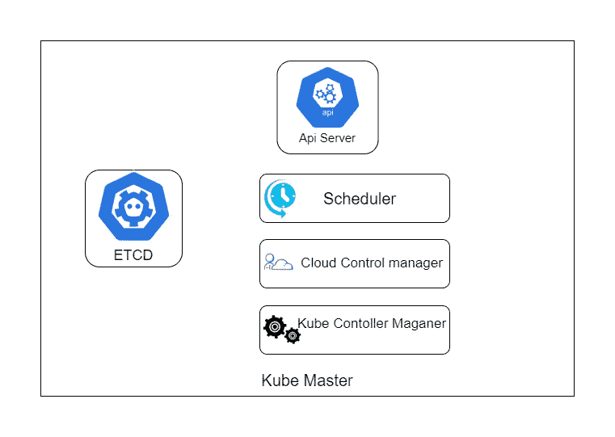
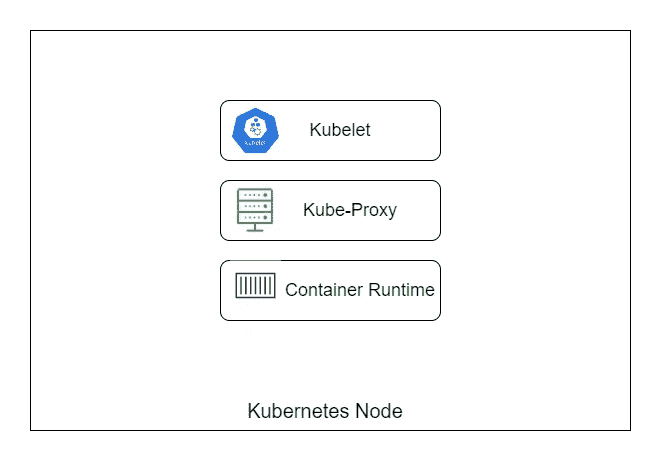
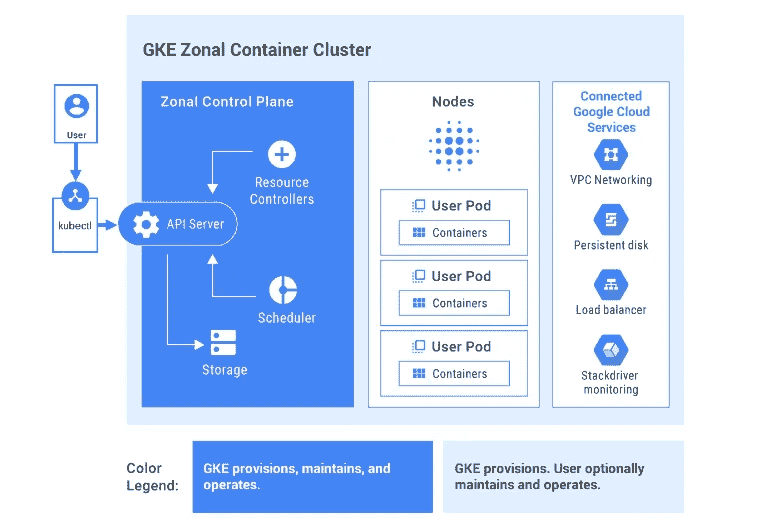

# Kubernetes 星团的剖析

> 原文：<https://betterprogramming.pub/anatomy-of-kubernetes-cluster-24d88f77cf27>

## 对星团内部的观察

典型的 Kubernetes 集群将包含:

1.  一个或多个主节点。
2.  一个或多个节点。

同样，这些只是普通的计算机。有时它们可能是大型物理服务器，有时它们甚至可能是[Raspberry pi](https://www.raspberrypi.org/)。但是在谷歌的 Kubernetes 引擎和[弹性 Kubernetes](https://www.elastic.co/elastic-cloud-kubernetes) 服务的情况下，它们是虚拟机。

# 主网点

Masters 运行几个组件，为我们提供了一个叫做*的控制平面*。他们做出关于集群的决策，例如在哪里安排特定的工作负载等。

主设备负责集群的状态。它持续关注一切，以确保一切正常运行。

节点运行提供运行时环境的组件(它们基本上是容器运行时的工作者)。这些节点为群集提供资源，如 CPU、RAM 等。

当您在 Kubernetes 上部署容器时，主节点将选择一个节点来运行它。

这是 Kubernetes 主节点的示意图。

## **API 服务器**

API 服务器是控制平面的前端；它公开了所有主函数的 API。
每次你和主控交流或者别的什么东西和主控(GCP 的云壳)互动，都会通过这个 API 服务器。

## **Etcd**

Etcd 是Kubernetes 自己的数据库。它存储所有 Kubernetes 的配置和状态。我称之为数据库，但 Etcd 只是一个键值存储。

## **调度器**

调度程序负责调度工作负载。这意味着当您想要部署一个容器时，调度程序将选择一个节点来运行该容器。
它选择的节点会受到很多因素的影响，例如每个可用节点上的当前负载、容器的要求以及其他一些可定制的约束。

## **云控制器管理器**

云控制器管理器允许 Kubernetes 使用云平台。请记住，Kubernetes 本身是一个开源项目，由大公司而不仅仅是谷歌做出贡献，所以它本身并不包含仅适用于 GCP 的功能。
这位经理负责管理网络和负载平衡等事务，因为它们转化为特定云平台的产品和服务。

## **Kube 控制管理器**

Kube 控制管理器的工作是管理集群中的一些控制器。控制器本身负责节点和其他一些对象。
现在，可能需要消化很多信息，但是当您启动集群时，您将主要使用 API 服务器。

# 工作节点

现在我们来看看 Kubernetes 的节点(Worker)。他们比大师直白多了。

这是工作节点的示意图。

## 库伯莱

Kubelet 是 Kubernetes 的代理商。它与控制平面通信，并在被告知时接受部署容器等指令。

## **Kube-proxy**

Kube 代理负责进出节点的网络连接。

## **容器运行时**

该节点将 Docker 作为容器运行时来运行，以允许它运行容器。

# 创建 Kubernetes 集群

创建 Kubernetes 集群有两种方法。

1.  艰难的方式。
2.  简单的方法。

## **敬酒不吃吃罚酒**

在硬方法中，您启动虚拟机并配置工作节点和主节点。

我们需要安装 Kubernetes 软件，提供网络覆盖，并设置证书，以便内部的组件可以相互通信。

## **简单的方法**

简单来说，我们可以使用几乎所有云提供商提供的预定义服务，例如谷歌云平台的 GKE。

GKE 自动调配和管理所有底层云资源。它会为您创建主节点和工作节点，您甚至不需要接触主控制平面。完全是为你管理的。

您可以将 GKE 的建筑与我们下面的建筑进行比较。

