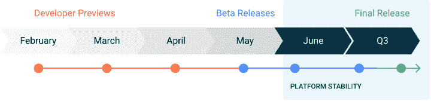
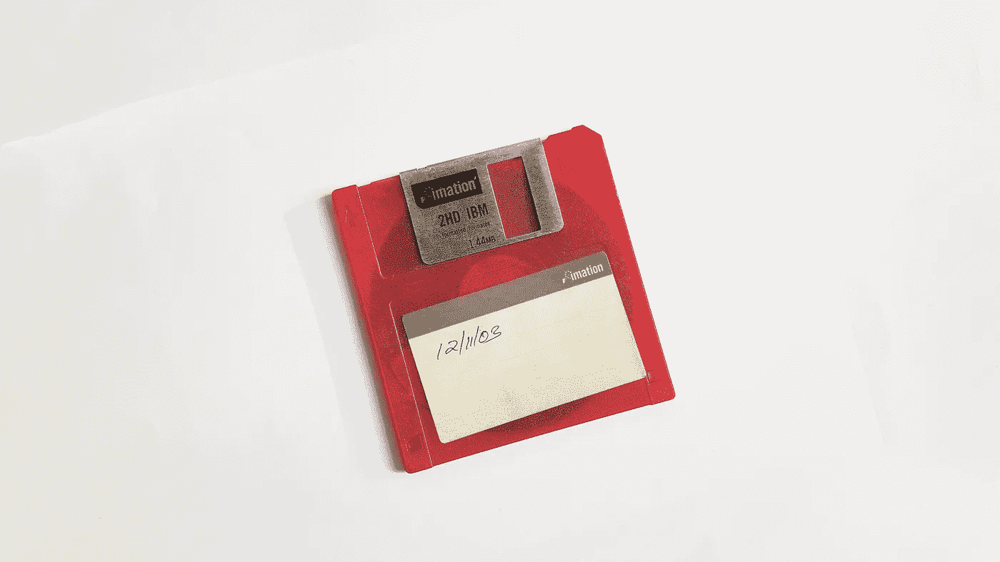
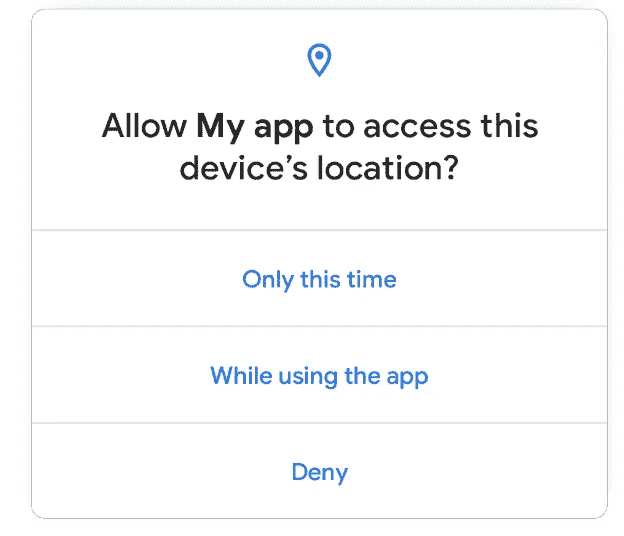

# Android 11 开发者预览版亮点

> 原文：<https://betterprogramming.pub/android-11-developer-preview-code-in-mobile-65dc5821e6c2>

## Android 11 中会有什么？

由[阿格巴洛斯](https://unsplash.com/@agebarros?utm_source=unsplash&utm_medium=referral&utm_content=creditCopyText)在 [Unsplash](https://unsplash.com/s/photos/watch?utm_source=unsplash&utm_medium=referral&utm_content=creditCopyText) 上拍摄的照片

今天，Android 公布了 Android 11 开发者预览版。现在是 02–20–2020，晚上 20:20 开始写这个。我是一个数字迷，所以我希望这对 Android 世界有好处。

移动技术的世界节奏很快，瞬息万变。就我个人而言，我努力跟上变化，即使我每天都在做这个。这一块的目的是让你的生活更轻松。在里面，我会回答两个问题:

*   Android 11 什么时候推出？
*   这个新版本有什么新的(和相关的)内容？

就这样，没有开销，没有大量的阅读时间。因为这是我们都需要的:一个快速的总结，直奔主题。

# Android 11 什么时候推出？

不幸的是，Android 在这一点上有点含糊不清。[他们对这个问题](https://developer.android.com/preview/overview)的回答如下:

> *“Android 11 开发者预览计划从 2020 年 2 月开始运行，直到计划于 2020 年第三季度向 AOSP 和原始设备制造商最终公开发布。”*

在上面的引用中，有几个词需要定义:

*   AOSP——Android 开源项目。关于 Android，如果你不知道它是如何工作的，开源的概念可能会有点混乱。基本上，从初始状态到公开发布，Android 都是由 Google 开发的。之后，任何人都可以添加或贡献给这个项目。
*   原始设备制造商——原始设备制造商，即制造安卓手机的任何品牌:三星、诺基亚、摩托罗拉，以及你能想到的许多其他品牌

澄清了这两个术语后，我们现在知道将在 2020 年第三季度向用户和公众发布。这意味着在七月和九月之间。如果我们看看移动平台、Android 和 iOS 发生了什么，大型发布通常发生在 9 月。下面你可以看到一张 Android 团队建立的时间线的图片。

[https://developer.android.com/preview/overview](https://developer.android.com/preview/overview)

# Android 11 有什么新功能？

Android [开发者预览版](https://developer.android.com/preview)网站将更新分为三类:

*   隐私更新
*   功能和 API
*   行为改变

这三点告诉我们一些东西，但不多。让我们按照同样的顺序，看看每一个背后到底是什么。

# 隐私更新

## 作用域存储

首先提到的是*作用域存储*。以前，开发者可以写入你手机的外部存储器，添加任何需要的文件，而无需你的许可，或者可能在不删除应用程序的情况下删除它们。

解决这个问题意味着用户可以控制手机内存，避免混乱和不必要的项目。对比 iPhone 和 Android，Android 最大的一个优势就是能够控制你的内存，不会用完。这个特性将使它变得更好。

照片由 [Fredy Jacob](https://unsplash.com/@thefredyjacob?utm_source=unsplash&utm_medium=referral&utm_content=creditCopyText) 在 [Unsplash](https://unsplash.com/s/photos/floppy-disk?utm_source=unsplash&utm_medium=referral&utm_content=creditCopyText) 上拍摄

## 一次性权限

现在，当你授权一个应用程序访问你的麦克风或摄像头等东西时，它会全天候启用，直到你转到“设置”并将其禁用。如果我们想深入研究阴谋论，你可以授权任何应用程序一直监视你(这不太可能，因为这会消耗你所有的数据和电池)。

通过一次性权限，你可以告诉你的手机，你授权该应用程序使用某些东西，但只能在你或系统停止该应用程序之前。

## 后台位置访问

与上面的观点类似，到目前为止，当你授权一个应用程序使用你的位置时，你就授予了前台和后台的访问权限。非常常见的后台访问的例子是谷歌地图给我们许多人的关于交通或你的目的地的建议，或者它询问你目前是否在餐馆。我们大多数人授权谷歌地图使用位置，因为否则，当使用 GPS 时，我们不会得到我们的方向，但这并不意味着我们希望它在后台监视我们，不是吗？在 Android 11 中，你将可以控制前台和后台的位置权限。

# 功能和 API

特性和 API 部分很长，所以我将只提到可以在普通应用程序中使用的最重要的特性。

## 数据访问审计

对于开发者来说，这是一个有趣的安全特性。开发 app 的时候，我们会用到很多外部库。我们很少知道他们在后台是如何操作的，大多数时候也不会检查所有的代码。我曾经有一个应用程序正在使用第三方库，直到苹果公司审查他们拒绝了它，我才知道它正在记录私人用户数据。有了这个新特性，开发人员可以审计 API 正在收集哪些数据，并确保我们用户的隐私。

[马太·亨利](https://unsplash.com/@matthewhenry?utm_source=unsplash&utm_medium=referral&utm_content=creditCopyText)在 [Unsplash](https://unsplash.com/s/photos/surveillance?utm_source=unsplash&utm_medium=referral&utm_content=creditCopyText) 上拍照

## 快速回复中的富媒体

如今，我们都很熟悉快速回复，它是我们通知中的小文本框。我们可以在不打开应用程序的情况下回复消息或电子邮件等内容。到目前为止，你只能在这些回复中添加文本，但在 Android 11 中，你还可以通过它们添加图片。我对这是否有用或易于使用持保留意见，但我们将拭目以待。

## 生物认证强度

生物认证已经慢慢占据了智能手机市场。我们目前有四种方式进行身份验证:指纹、虹膜、声音和面部识别。大多数人不知道传感器有一定的安全级别。一些想要集成生物传感器的低端品牌使用二手设备，这些设备的检测精度较低。换句话说，如果你看起来像你的兄弟或母亲，一个坏的面部识别传感器会识别他们，就像他们是你一样。使用 Android 11，开发人员可以选择安全级别高低的设备是否可以访问某些功能。

由[绝对视觉](https://unsplash.com/@freegraphictoday?utm_source=unsplash&utm_medium=referral&utm_content=creditCopyText)在 [Unsplash](https://unsplash.com/s/photos/newspapers?utm_source=unsplash&utm_medium=referral&utm_content=creditCopyText) 上拍摄

## 聊天气泡

你也许能认出这个由脸书信使推出的功能。现在它被鼓励在安卓系统中使用。在我看来，有聊天气泡有点讨厌，但是 Android 已经决定这么做了。我不认为还有什么可以说的，但你可能会看到他们更多。

Marc Sendra Martorell 在 [Unsplash](https://unsplash.com/?utm_source=medium&utm_medium=referral) 上拍摄的照片

# 行为改变

对于文档的最后一部分，Android 再次重复相同的内容:权限、应用位置和存储。我不会重复，因为我们已经谈过了。

# 包扎

综上所述，Android 11 开发者预览版大部分是关于安全性的，这是一件很棒的事情。作为一个社会，我们正在慢慢了解数据隐私有多重要。像 Android 这样拥有我们输入所有个人数据的操作系统的公司对此负责是很重要的。你怎么想呢?

下次见！