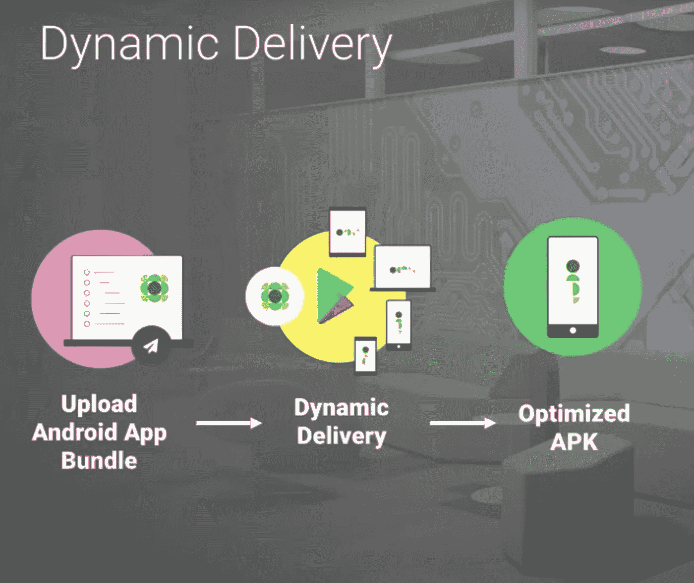
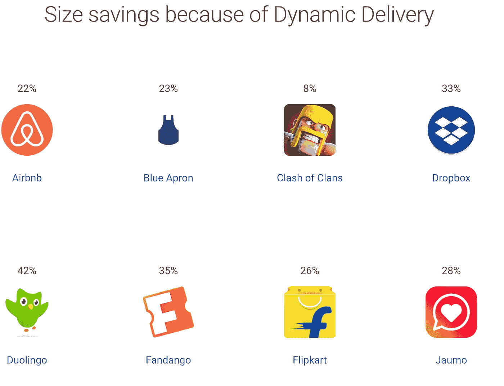
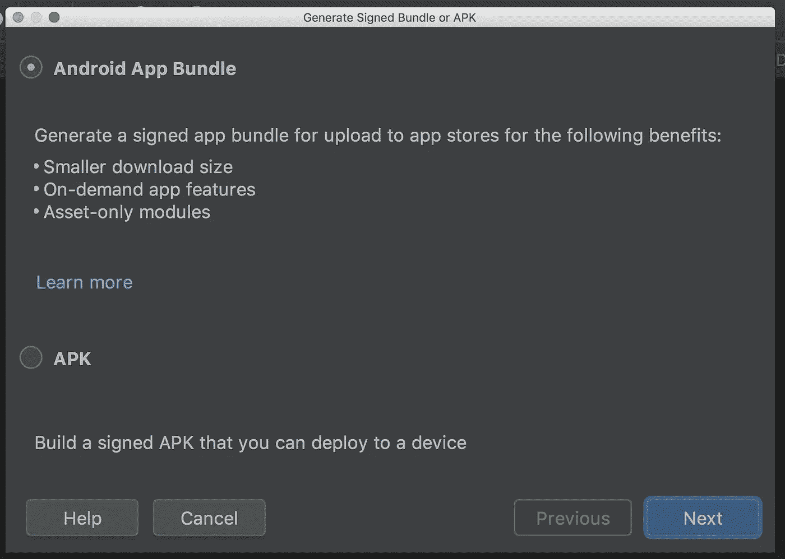
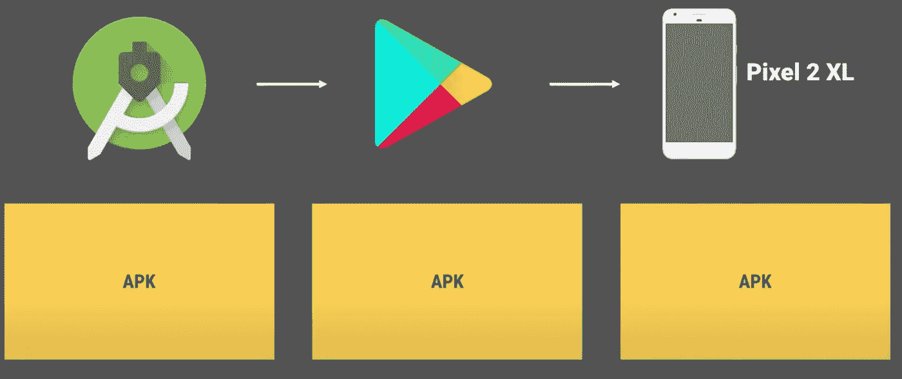
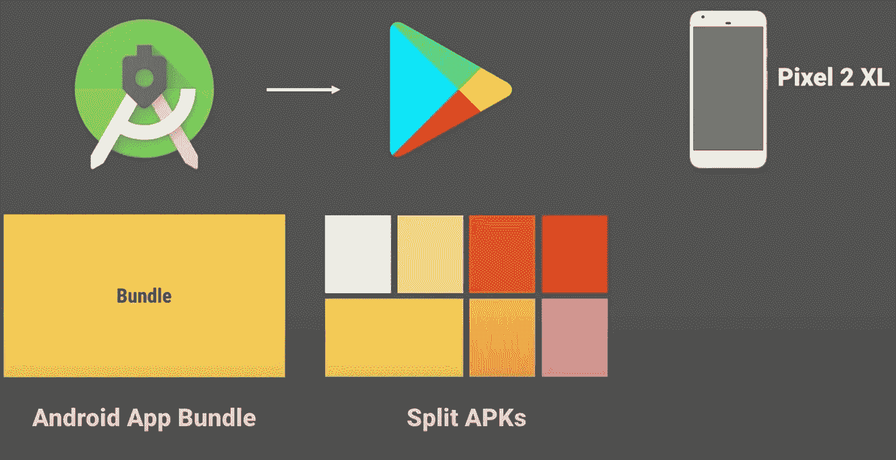
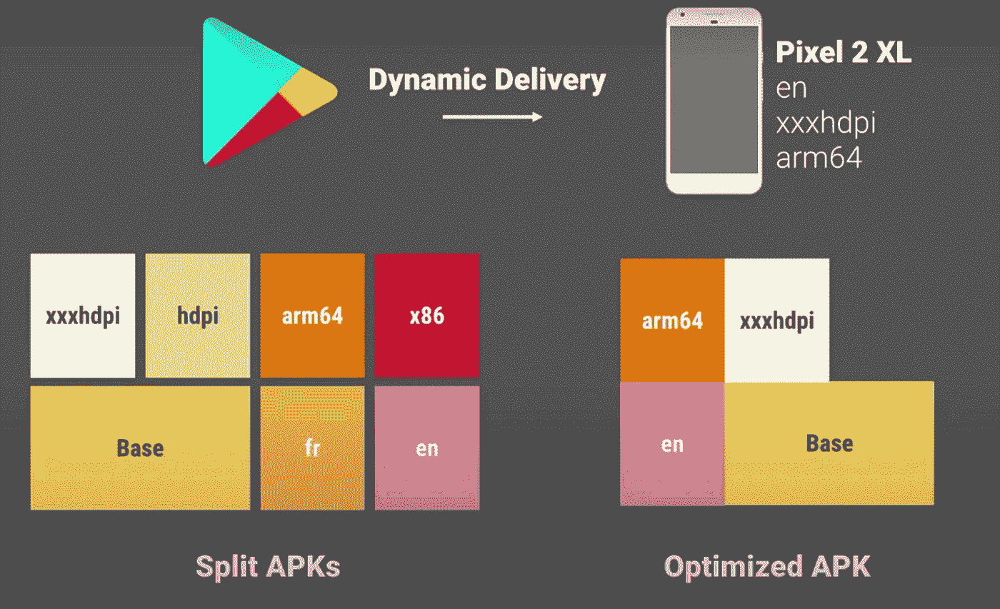

# 使用 Android 应用捆绑包的重要性和好处

> 原文：<https://betterprogramming.pub/android-app-bundles-f0ae021f0a5f>

## 互联网并不是到处都是又快又便宜的——帮助你的用户下载你的应用

# 什么是 Android 应用捆绑包？

发布 Android 应用的传统方法是使用一个叫做 Android 包的文件。apk)。Android 支持不同的屏幕密度、CPU 架构和语言，这可以解释应用程序的 APK 大小的更大尺寸。由于互联网在许多国家都很昂贵，大小已经成为安装和保留的障碍。因此，Android 应用捆绑包被引入来解决这些开销。Android 应用捆绑包是 Android 的官方发布格式，提供了一种更有效的方式来构建和发布您的应用。它让我们能够更轻松地在更小的应用程序中提供出色的体验，提高安装成功率并减少卸载。很容易切换。

# 应用捆绑包的优势

## 较小的应用程序

长期以来，应用程序大小一直是一个重要因素。无需编写额外的代码，也无需使用工具，应用捆绑包有助于减少应用的大小。许多流行的应用程序已经试用过，并且已经将它们的应用程序大小减少了 1%到将近 50%。在这里看看[个应用的结果](https://developer.android.com/platform/technology/app-bundle):

列表来自[https://developer . Android . com/platform/technology/app-bundle](https://developer.android.com/platform/technology/app-bundle)

到本文结束时，你会详细了解这一点。

# 动态交付

当 Google play 收到应用捆绑包时，它有一个新的交付 APK 的流程——动态交付。这意味着它会根据用户规格和使用情况来分发应用程序。简单地说，这就像给用户提供他们需要的东西，而不是提供一大堆东西。例如，假设您的应用程序支持多种屏幕密度和 CPU 架构，它将根据用户的系统规格，为用户提供特定的语言、适当的图像密度和适当的 ABI 资源，而不是向所有用户提供一切。

# 动态功能模块

这是一个很棒的功能。顾名思义，动态功能模块允许应用程序按需下载代码。让我们举一个应用程序的例子，它有两个功能，如视频流和聊天。但是如果用户对视频流不感兴趣，那么我们可以把它作为一个单独的模块，并在它的 Gradle 文件中提及，因为它是一个动态功能模块。因此，在生成动态分割 APK 时，Google Play 将为动态模块创建一个单独的分割 APK 文件，并仅在需要时交付，而不是针对所有用户。

这些就是应用捆绑包的好处。现在，我们该怎么对付他们？

# 我们如何生成应用捆绑包？

生成应用捆绑包的过程类似于生成 APK 的过程。在 Build 菜单下的 studio 顶部栏中，我们通常生成一个调试或签名的 APK，我们也可以选择生成一个包。当我们尝试生成一个签名的 APK 作为第一个选项时，studio 建议我们使用一个捆绑包，并指出其优点:

一旦这个过程完成，你会发现一个扩展名为`.aab` 的文件，而不是我们需要上传到`Play`控制台的`.apk`。为了获得更多好处，我们需要将生成 APK 的控制权交给 Play console，以便它为用户生成优化的应用程序。所以，别忘了报名参加 Google Play 的 app signing。

运行 Lollipop 和更高版本的设备可以从 dynamic deliver 中获得最优化的 apk。然而，旧设备从 Goole Play 生成的应用程序捆绑包中获得多风格的 APK。

# 动态交付是如何工作的？

对于那些使用 APK 格式发布的人来说，Google Play 采用 APK 文件，在优化方面不做任何事情，直接分发给用户。

在应用捆绑包的情况下，Google Play 根据各个方面将捆绑包分成许多较小的 APK，称为分割 APK。

应用程序中经常被下载的部分被打包在一个名为 *Base APK* 的分割 APK 中，由共享代码组成。使用应用程序捆绑包时，Play 会自动为资源、资产和本地库制作拆分 APK。这些特定于资源的 APK 被称为*配置* APK。

如果我们看一个简单的例子，我们可以更好地理解 Google Play 如何根据不同的系统和地区为不同的用户提供不同的 APK。

考虑一个具有以下特征的用户:一个像素 2XL 的手机，英语，密度对应于 xxxhdpi，以及一个 arm64 处理器。使用动态交付，如果该用户安装了应用程序，则动态交付将找到该用户需要的拆分 APK，如下所示:

这就是动态交付如何基于用户规范帮助交付优化的 apk。动态交付和应用捆绑包的引入有助于我们为更小的应用提供服务。

# 参考

*   [构建新的模块化 Android 应用捆绑包(Google I/O’18)](https://www.youtube.com/watch?time_continue=1306&v=bViNOUeFuiQ&feature=emb_logo)
*   [安卓应用捆绑](https://developer.android.com/platform/technology/app-bundle)

目前就这些。我希望你喜欢阅读这篇文章。请让我知道任何建议和意见。

感谢阅读。