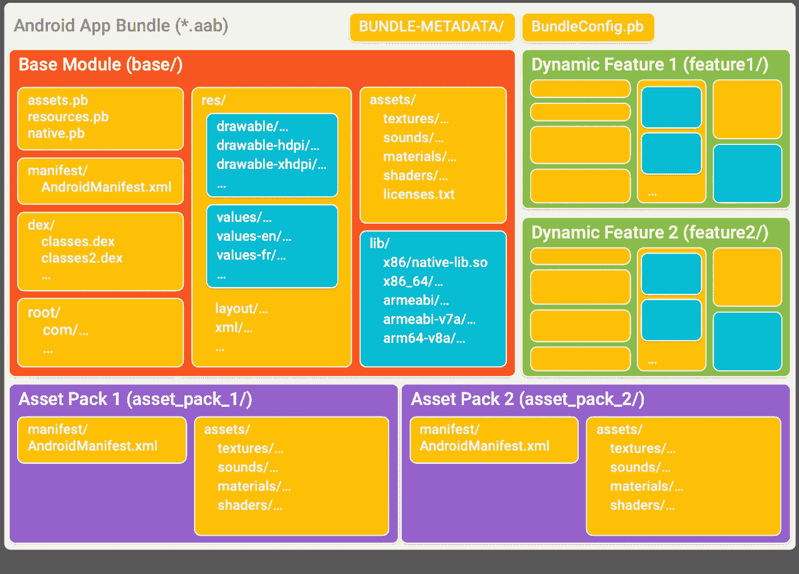

# Android 应用捆绑包与 apk

> 原文：<https://betterprogramming.pub/android-app-bundles-vs-apks-8b0306b38436>

## AABs 和 APKs:它们是什么，有什么区别？

照片由[杯先生/杨奇煜·巴拉](https://unsplash.com/@iammrcup?utm_source=unsplash&utm_medium=referral&utm_content=creditCopyText)在 [Unsplash](https://unsplash.com/s/photos/archive?utm_source=unsplash&utm_medium=referral&utm_content=creditCopyText) 拍摄

当构建 Android 应用程序时，你会面临无数不同的文件格式和术语。尤其是在导出应用程序的最终版本时，您会看到两种主要的输出格式。在本文中，我们将比较 Android 应用捆绑包和 APK，后者由 DEX 文件组成。但是所有这些缩写是什么意思呢？

## 缩写含义

在深入探讨这些主题之前，了解上述每种格式的定义非常重要:

*   AAB: 安卓应用捆绑包
*   **APK:** 安卓应用包
*   达尔维克可执行文件

# APK:安卓应用包

让我们从回顾这种格式开始，因为它是最广为人知的格式，也是存在时间最长的格式。如上所述，APK 代表*安卓应用包*。APK 基本上是一个可以安装在用户设备上的文件。

apk 里面有所有的应用程序文件和代码。你可以把它想象成一个`.zip`文件，但是有自己特定的扩展名。就像你可以在`.rar`或者`.zip`中找到带扩展名的压缩文件一样，你可以拥有`.apk`。它主要由 Android 平台理解，但是如果其他平台拥有与 Android 相同的底层架构，它们也可以支持它。

查尔斯·德鲁维奥在 [Unsplash](https://unsplash.com/s/photos/up?utm_source=unsplash&utm_medium=referral&utm_content=creditCopyText) 上拍摄的照片

APK 已经用该应用的证书进行了签名，该证书是一个标识 Play Store 中每个应用的文件。这个文件必须由开发人员在应用程序的整个生命周期中保存，因为不可能再次生成它。

# AAB:安卓应用捆绑包

AAB，代表安卓应用捆绑包 T21，是一种更新的安卓分发格式。 [Android 的官方文档](https://developer.android.com/guide/app-bundle)给出了如下定义:

> *“一个* Android 应用捆绑包*是一种发布格式，包括你的应用的所有编译代码和资源，并将 APK 的生成和签署委托给 Google Play。”*

这些应用捆绑包相当新——它们是在 Google I/O 2018 中引入的。他们快两岁了。但从那以后，它们成了发布 Android 应用的官方格式。

正如 APK 是扩展名一样，AAB 文件也有扩展名`.aab`。Android 文档提供了解释 aab 如何组成的图像。

[Android](https://developer.android.com/guide/app-bundle) 文档

如果你有一个 APK，你只会有应用程序的橙色部分，它将拥有所有的资产，这意味着你只能有一个包，没有动态功能。

# 资产包

资产包是针对一组设备的文件组。当使用传统的 APK 时，应用程序将接收所有的资产，并只选择和使用特定设备所需的资产。

另一方面，当使用 AAB 时，Play Store 会选择用户下载应用程序时需要的资源。

# 动态特征

这些功能是首次安装应用程序时可能不需要的模块。您可以在用户请求添加该功能时下载它们，或者下载应用程序，然后在后台开始下载它们，让用户在使用您的应用程序时有一个良好的开端。

为了安装动态特性，我们有 SplitInstallManager，它将由 [Play 核心库](https://developer.android.com/guide/playcore)管理，后者直接与 Play Store 通信。

# Android 应用捆绑包相对于 APK 的优势

Android 强调了使用 apk 的几个缺点:

*   较低的转化率
*   下载速度较慢
*   更高的卸载
*   更低的更新率

## 大小

第一个优点是尺寸减小。有了资产包和动态特性，应用程序平均缩小了 35%。但是一些应用程序的大小减少了 50%左右。

AABs 推出后，一个 app 的最大大小是 150 MB。通过使用 APK，您可以轻松超越这一要求。

罗布·汉普森在 [Unsplash](https://unsplash.com/s/photos/users?utm_source=unsplash&utm_medium=referral&utm_content=creditCopyText) 上拍摄的照片

## 未压缩的本地库

出于某种原因，当你有一个 APK 时，应用程序会以压缩格式获得所需的所有本地库的副本。下载后，设备通过创建一个副本来解压缩这些库，因为没有解压缩它就不能使用它们。最后，你会有两个库的副本。

当比较 Android 应用捆绑包和 APK 时，你会注意到 AAB 默认获得未压缩的原生库，这将帮助你避免最终有两个副本。

您可能想知道为什么 APK 既保留了压缩版本的副本，又保留了未压缩版本的副本。如上所述，这是因为库有时是特定于设备的。您可能需要为每个设备准备一个不同的，如果您提供 AAB，Play Store 可以在下载时将它发送到设备。

# 德克斯的文件呢？

apk 和 aab 内部都包含 DEX 文件。这些文件是执行代码的关键。这些文件是 *Dalvik 可执行文件*,因为在 Android 的核心内部，有一个叫做 Dalvik 虚拟机的东西。更简单地说，这个虚拟机执行 Android 中的应用程序代码，使它们对您可用。

## 专业提示:DEX 文件出错

Android Studio 在构建项目时有一个常见错误。这个错误很容易修复，但如果你不知道它在说什么，可能会令人沮丧。尝试运行应用程序时，您会收到如下消息:

> 无法将请求的类放入单个 dex 文件中

如果你也得到这个错误，转到`build.gradle(Module: app)`，在`defaultConfig`的括号内，添加下面一行:

`multiDexEnabled true`

Android Studio 会请求同步项目，就像每次你在 Gradle 文件中做更改时一样。做梯度同步，并运行应用程序。

# 结论

正如你所看到的，比较 Android 应用捆绑包和 APK 并不复杂。应用捆绑包已经存在将近两年了，它们对于给用户提供更好的体验非常有用——所以为什么不试一试呢？我希望你把这个加入到你的下一个项目中。

下次见！