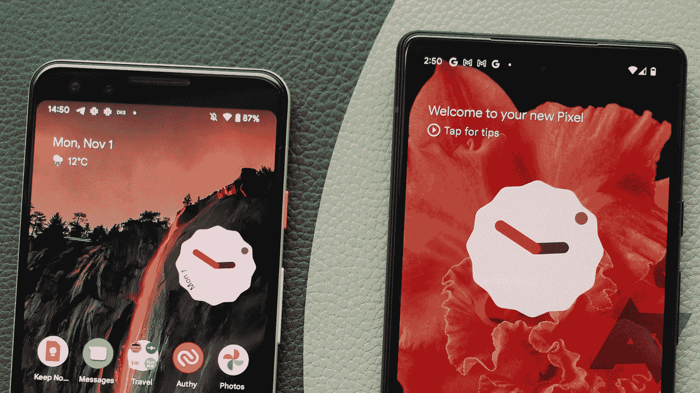
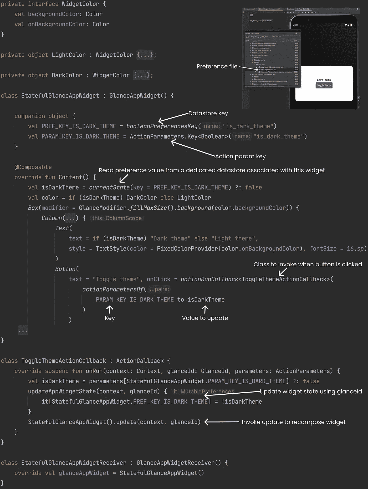
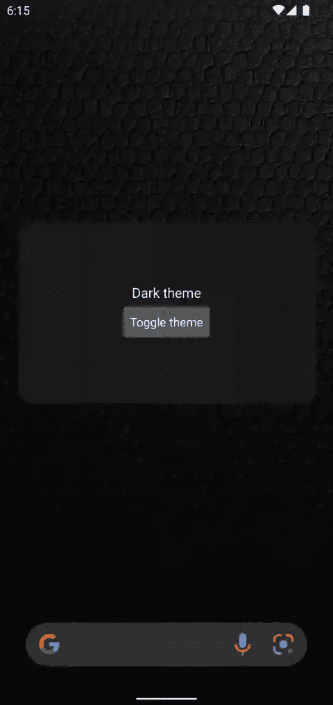
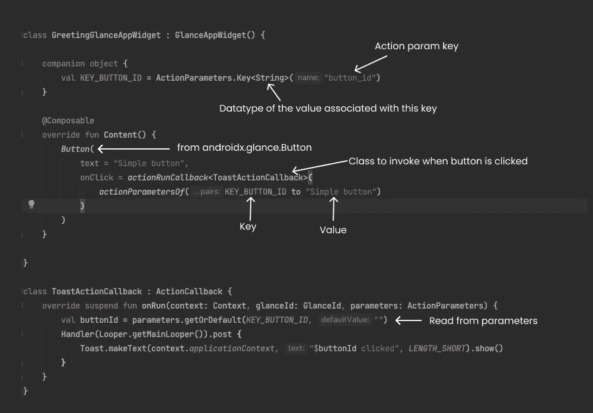
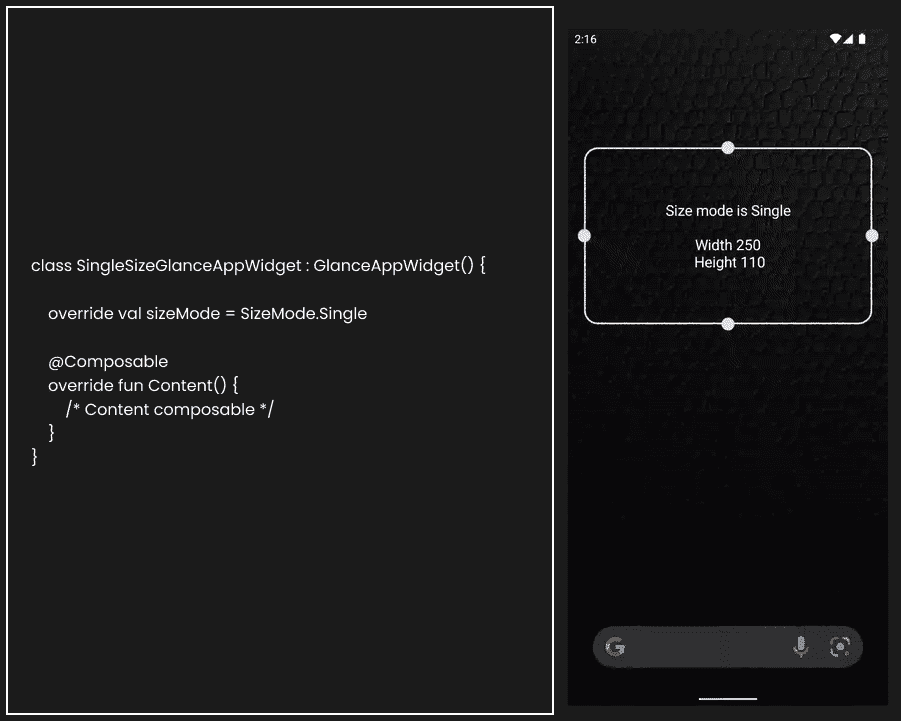
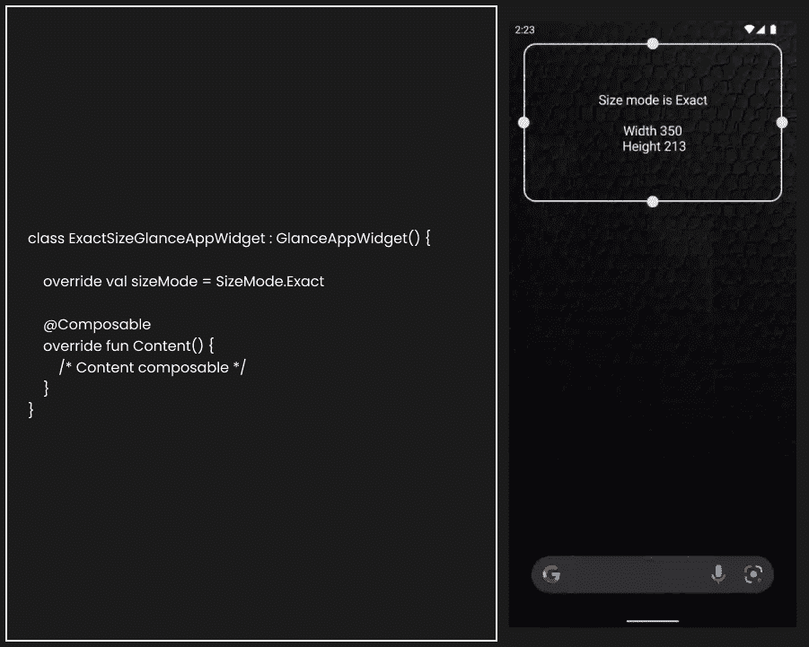
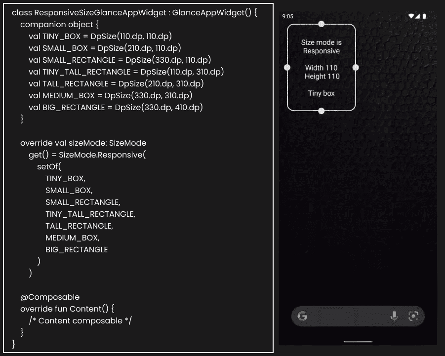
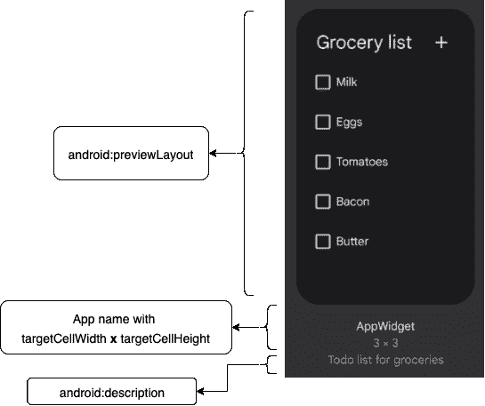

# 使用 Jetpack Glance 构建 Android 应用程序小部件

> 原文：<https://betterprogramming.pub/android-app-widgets-with-glance-9e881f40c636>

## 构建 android 应用程序小部件的现代方法。



在进入主题之前，让我们快速上一堂历史课，看看为什么这个[扫视](https://developer.android.com/jetpack/androidx/releases/glance)是一个重要且期待已久的功能。

*   Android 应用小部件是作为 Android 1.5 (Cupcake)的一部分发布的。
*   [2009 年代码开始](https://cs.android.com/android/_/android/platform/frameworks/base/+/c39a6e0c51e182338deb8b63d07933b585134929:core/java/android/appwidget/AppWidgetManager.java;l=64;bpv=1;bpt=0)。
*   在 2012 年，增加了在锁定屏幕上显示小工具的支持，并提供了第三方应用程序作为小工具主机(自定义启动器应用程序)等。
*   随着时间的推移，android 系统不断发展，在系统的其他部分收到了很多更新，但在 widget 框架上收到的更新很少。

Android 12 引入了 [Glance](https://developer.android.com/jetpack/androidx/releases/glance) 框架，使用 jetpack-compose(声明式风格)创建应用程序小部件，并对小部件框架本身进行了更多的更新。

# **Android 12 的新功能**

## [**Jetpack Glance**](https://developer.android.com/jetpack/androidx/releases/glance)**为 app widgets**

*   用于构建应用程序小部件 UI 的声明式 API。
*   有状态小部件。
*   新的干净的 api 来处理用户交互。
*   自定义错误用户界面(来自 XML)。

## **widget 框架的其他更新**

*   可扩展小部件预览
*   更好的主题支持
*   新的复合按钮
*   添加了新的 API 以允许远程视图的运行时修改

# **应用程序小部件的 Jetpack Glance**

## **什么是 Jetpack Glance**

*   Jetpack Glance 是建立在 Jetpack Compose 运行时之上的新框架。
*   Glance 提供了与 Jetpack Compose 类似的现代声明性 Kotlin APIs，有助于构建响应性应用程序小部件。
*   由于它构建在 Jetpack Compose 运行时之上，因此不能直接与其他现有的 Jetpack Compose UI 元素互操作，但可以与现有的 RemoteViews 互操作。
*   Glance 提供了一组基本的[组件](https://developer.android.com/jetpack/compose/tutorial)来帮助构建“简略”的体验。
*   使用 Jetpack Compose runtime Glance 可以将 [composables](https://developer.android.com/jetpack/compose/tutorial) 转换成实际的 RemoteViews，并在应用程序小部件中显示它们。
*   Glance 提供了更直观的 API 来处理用户交互。它抽象出了我们在使用`RemoteViews`和`PendingIntent`时会遇到的复杂性。它提供了以下用于处理用户交互的预定义操作。
    1)[actionRunCallback](https://developer.android.com/reference/kotlin/androidx/glance/appwidget/action/package-summary#actionruncallback)
    2)[actionStartActivity](https://developer.android.com/reference/kotlin/androidx/glance/appwidget/action/package-summary#actionstartactivity)
    3)[actionStartService](https://developer.android.com/reference/kotlin/androidx/glance/appwidget/action/package-summary#actionstartservice)
    4)[actionsendboard](https://developer.android.com/reference/kotlin/androidx/glance/appwidget/action/package-summary#actionsendbroadcast)
*   通过定义`[SizeMode.Single](https://developer.android.com/reference/kotlin/androidx/glance/appwidget/SizeMode.Single)``[SizeMode.Exact](https://developer.android.com/reference/kotlin/androidx/glance/appwidget/SizeMode.Exact)`或`[SizeMode.Responsive](https://developer.android.com/reference/kotlin/androidx/glance/appwidget/SizeMode.Responsive)`内置支持不同尺寸的 UI。
*   使用[状态定义](https://developer.android.com/reference/kotlin/androidx/glance/state/GlanceStateDefinition.html)进行状态管理。
*   `LocalContext`、`LocalState`、`LocalGlanceId`、`LocalSize`。使用`CompositionLocalProvider`将`LocalAppWidgetOptions`提供给`content()`方法。

尽管 Glance 框架看起来像是对应用程序小部件的根本性改变。应用程序小部件的创建非常相似，唯一的变化是我们如何表示 UI 和维护状态。

# **创建 GlanceAppWidget**

第 0 步:[添加依赖关系](https://developer.android.com/jetpack/androidx/releases/glance#declaring_dependencies)

第一步:创建`GlanceAppWidget`

第二步:用`[GlanceAppWidgetReceiver](https://developer.android.com/reference/androidx/glance/appwidget/GlanceAppWidgetReceiver)`连接

步骤 3:添加 widget [元数据](https://developer.android.com/reference/android/appwidget/AppWidgetProviderInfo)

最后一步:在`AndroidManifest.xml`注册组件

# **有状态小部件**

每个`GlanceAppWidget`维护自己的偏好，使用[数据存储](https://developer.android.com/topic/libraries/architecture/datastore)偏好将数据存储为键值对。

从本地合成中使用`currentState`方法读取小部件状态(即`LocalState.current`)。`currentState`有两个重载方法:

`currentState`不带参数返回一个`[Preferences](https://developer.android.com/reference/kotlin/androidx/datastore/preferences/core/Preferences)`。

`currentState`以键作为参数(即`currentState(key)`)返回一个与键相关的值。

要将数据更新到首选项中，我们可以使用`[updateAppWidgetState()](https://developer.android.com/reference/kotlin/androidx/glance/appwidget/state/package-summary#updateappwidgetstate)`

> 一旦使用`[*updateAppWidgetState()*](https://developer.android.com/reference/kotlin/androidx/glance/appwidget/state/package-summary#updateappwidgetstate)`更新了首选项，我们必须手动调用`*GlanceAppWidget.update()*`方法来用最新的数据重组 UI。

让我们看看下面的代码，看看我们是如何更新布尔参数值来切换小部件主题的。



有状态小部件代码

# **有状态小部件演示**



有状态小部件演示

# **用户交互**

正如我们之前讨论的，Glance 提供了更直观的 API 来处理用户交互，而`actionRunCallback`就是其中之一。

*   `actionRunCallback`方法返回一个动作，该动作可以附加到按钮的`onClick`方法或任何其他具有`onClick`属性的扫视组件。
*   `actionRunCallback`方法将`ActionCallback`类作为类型参数，可选的`ActionParameters`作为方法参数。

让我们看看下面的代码，每当点击按钮时，就会创建一个`ToastActionCallback`的实例，并使用`context`、`glanceId`和我们传递的参数(即`ActionParameters`)对其调用`onRun`方法。

PS: `glanceId`是分配给每个`GlanceAppWidget`的唯一 id。



处理程序用户与 actionRunCallback 的交互(带有操作参数)

就像`actionRunCallback`一样，我们也有其他 API 来启动服务(即`[actionStartService](https://developer.android.com/reference/kotlin/androidx/glance/appwidget/action/package-summary#actionstartservice)`)、启动活动(即`[actionStartActivity](https://developer.android.com/reference/kotlin/androidx/glance/appwidget/action/package-summary#actionstartactivity)`)或发送广播(即`[actionSendBroadcast](https://developer.android.com/reference/kotlin/androidx/glance/appwidget/action/package-summary#actionsendbroadcast)`)。

# 不同尺寸

## [**SizeMode。单身**](https://developer.android.com/reference/kotlin/androidx/glance/appwidget/SizeMode.Single)

当小部件尺寸模式为`SizeMode.Single`时，则`GlanceAppWidget`提供单一用户界面。应用微件的宽度和高度将是[应用微件信息](https://developer.android.com/reference/android/appwidget/AppWidgetProviderInfo)中给出的最小宽度和高度。



单一尺寸模式小部件演示

## [**SizeMode。**确切的](https://developer.android.com/reference/kotlin/androidx/glance/appwidget/SizeMode.Exact)

```
When the widget size mode is SizeMode.Exact then the GlanceAppWidget provides a UI for each size the App Widget can be. (i.e any one of the possible size from supported grid. [click here for more detail](https://developer.android.com/develop/ui/views/appwidgets/layouts#anatomy_determining_size)).
```



精确尺寸模式小部件演示

## [**SizeMode。响应式**](https://developer.android.com/reference/kotlin/androidx/glance/appwidget/SizeMode.Responsive)

```
When the widget size mode is SizeMode.Responsive then the GlanceAppWidget provides a UI for a fixed set of sizes.SizeMode.Responsive takes a set of fixed sizes from it's constructor.
```



响应大小模式小部件演示

# **widget 框架的其他更新**

除了 Glance 框架之外，现有的 widget 框架也得到了一些很好的更新。让我们看看其中的一些。

## **可扩展小工具预览**

*   在 Android 11 或更低版本中,`android:previewImage`用于显示小部件的外观
*   因为它是一个图像，每次我们更新小部件设计时，我们都必须改变图像，这需要一些设计工作。
*   从 Android 12 开始，小部件预览可以从 XML 布局中获得，这可以更准确地反映实际小部件的外观

```
<appwidget-provider
    ...
    android:description="[@string/app_widget_description](http://twitter.com/string/app_widget_description)"
    android:targetCellWidth="3"
    android:targetCellHeight="3"
    android:previewLayout="[@layout/my_widget_preview](http://twitter.com/layout/my_widget_preview)">
</appwidget-provider>
```



**Ref**[https://developer . Android . com/develop/ui/views/app widgets/enhance](https://developer.android.com/develop/ui/views/appwidgets/enhance)

## **widget 框架的其他更新**

看看[这里](https://developer.android.com/develop/ui/views/appwidgets/enhance)来增强你的`app-widgets`并探索更多从 Android 12 开始的 widget 框架更新。

包含所有代码示例的 Repo 可在此处获得:

[](https://github.com/sridhar-sp/android-playground/tree/main/Glance) [## 安卓游乐场/主 sridhar-sp 一览/安卓游乐场

### 这个报告包含我创建的示例应用程序，作为探索 android 新功能的一部分，并记录为博客…

github.com](https://github.com/sridhar-sp/android-playground/tree/main/Glance) 

这里需要注意的一件重要事情是，尽管这种变化看起来像是。一个突破性的改变没有修改任何现有的 android 窗口小部件框架，整个 Glance 框架在现有的 android 窗口小部件框架之上工作。

# 参考

*   [https://Android-developers . Google blog . com/2021/12/announcing-jetpack-glance-alpha-for-app . html](https://android-developers.googleblog.com/2021/12/announcing-jetpack-glance-alpha-for-app.html)