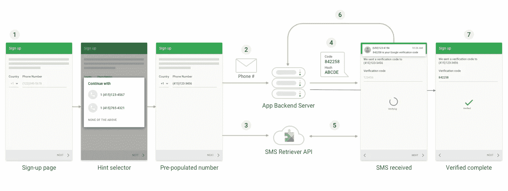

# Android 自动短信验证与谷歌的短信检索 API

> 原文：<https://betterprogramming.pub/android-automatic-sms-verification-with-googles-sms-retriever-api-c3dd580d543e>

## 轻松验证一次性密码，减少用户的开销



图片来源:[使用短信检索器 API 自动验证短信](https://developers.google.com/identity/sms-retriever/overview)

在 Android 应用程序中，使用手机号码作为用户身份来验证用户已经成为一种常见的程序。为此，从技术上讲，我们要求用户提供他们的手机号码，然后用服务器上的号码访问一个 API。SMS 被触发并在用户手机上被接收。用户在提供的框中输入该 SMS 代码，以访问应用程序的内容。这里有一点用户体验的开销。

如果我们自动读取 SMS 代码并在后台验证用户，而在前台用户正在上车，这将会更好。如果我们不能在后台进行验证，我们可以要求用户在进入仪表板或主屏幕之前手动输入。这将简化过程，并帮助用户容易地登上。这将是一个很好的功能，将你的应用程序与其他迫使用户手动输入的应用程序区分开来。

# SMS Retiever API 简介

谷歌推出了一个[短信检索器 API](https://developers.google.com/identity/sms-retriever/?utm_campaign=auth_update_smsretrieverapi_080117&utm_source=gdev&utm_medium=yt-desc) ，通过它我们可以在我们的 Android 应用程序中自动执行基于短信的用户验证，不需要用户手动输入验证码，也不需要任何额外的应用程序权限。使用这个 API 进行验证不会让用户担心他们是否输入了正确的代码。SMS 检索器 API 提供了完全自动化的用户体验，应该尽可能使用。

如果你无法控制消息的内容——例如，如果你的应用程序与一家金融机构合作，该机构可能希望在批准你应用程序内的支付交易之前验证用户的电话号码——那么你可以使用[短信用户同意 API](https://developers.google.com/identity/sms-retriever/user-consent/overview) 。

注意:SMS 检索器 API 仅在安装了 Play services 版本 10.2 及更高版本的 Android 设备上可用。

# SMS 检索器 API 的实现

要自动验证电话号码，您必须实现验证流程的客户端和服务器部分。在我们开始使用这个 API 之前，在服务器端需要遵循几个步骤。当服务器收到验证电话号码的请求时，首先它需要构造将被发送到用户设备的验证消息。该信息必须:

*   该消息应该以开头，这将表明这是一条给系统的 OTP 消息。

例: **< # >** SampleApp:你的验证码是 143567
**MnoPsq42oS**

*   不超过 140 个字节
*   包含一次性代码，客户端将其发送回您的服务器以完成验证流程(参见[生成一次性代码](https://developers.google.com/identity/sms-retriever/verify#generating_a_one-time_code)
*   包括一个 11 个字符的哈希字符串，用于标识您的应用

有关更多详细信息，请参考[服务器端指南](https://developers.google.com/identity/sms-retriever/verify)。要在 Android 应用程序上启动电话号码验证流程，请将电话号码发送到您的验证服务器，并调用短信检索器 API 来开始侦听包含应用程序一次性代码的短信。收到邮件后，您将一次性代码发送回服务器以完成验证过程。

让我们通过 app 端的一步一步的流程来更好的理解事情。

## 第一步。**在 app 的** `**build.gradle**` **文件**中包含播放服务认证组件依赖关系

```
implementation 'com.google.android.gms:play-services-auth:17.0.0'
implementation 'com.google.android.gms:play-services-auth-api-phone:17.4.0'
```

## 第二步。获取用户的电话号码

以任何适合你的应用的方式获取用户的电话号码。通常，最好的用户体验是使用提示选择器来提示用户从存储在设备上的电话号码中进行选择，从而避免必须手动键入电话号码。要使用提示选择器:

## 第三步。启动短信检索器

当您准备好验证用户的电话号码时，获取一个`SmsRetrieverClient`对象的实例，调用`startSmsRetriever the` 方法，并将成功和失败监听器附加到 SMS 检索任务:

这将启动`SmsRetriever`，等待一条匹配的 SMS 消息，直到五分钟超时。匹配的 SMS 消息将通过具有动作`SmsRetriever#SMS_RETRIEVED_ACTION`的广播意图来发送。

## 第四步。将电话号码发送到服务器

一旦您收到电话号码，您需要将该号码发送到服务器，以便他们可以将 OTP 发送到该号码。

## 第五步。继续收听广播

当在用户设备上收到验证消息时，Play Services 会通过广播操作`SmsRetriever.SMS_RETRIEVED_ACTION`将其明确广播到您的应用程序，其中包含消息的文本。使用一个`BroadcastReceiver`来接收这个验证消息，并在`BroadcastReceiver`的`onReceive`方法中，从 Intent 的 extras 中获取验证消息的文本，如下所示。

## 第六步。在清单文件中注册接收方

## 第七步。将验证邮件中的一次性代码发送到服务器

现在您已经有了验证消息的文本，可以使用正则表达式或其他逻辑从消息中获取一次性代码。一次性代码的格式取决于服务器端的实现。根据一些逻辑获取代码，并将其发送到您的服务器进行验证。收到成功回调后，您将授予用户访问应用程序内容的权限，并将验证状态存储在首选项中以备将来使用。

就这些了，我希望你喜欢阅读这篇文章。请让我知道你的建议和意见。感谢阅读！

# 参考

*   [短信验证 API](https://developers.google.com/identity/sms-retriever/?utm_campaign=auth_update_smsretrieverapi_080117&utm_source=gdev&utm_medium=yt-desc)