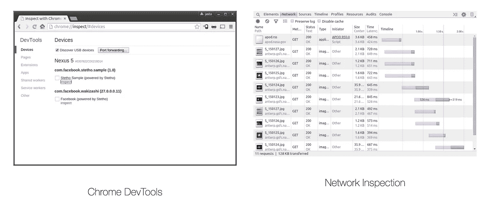
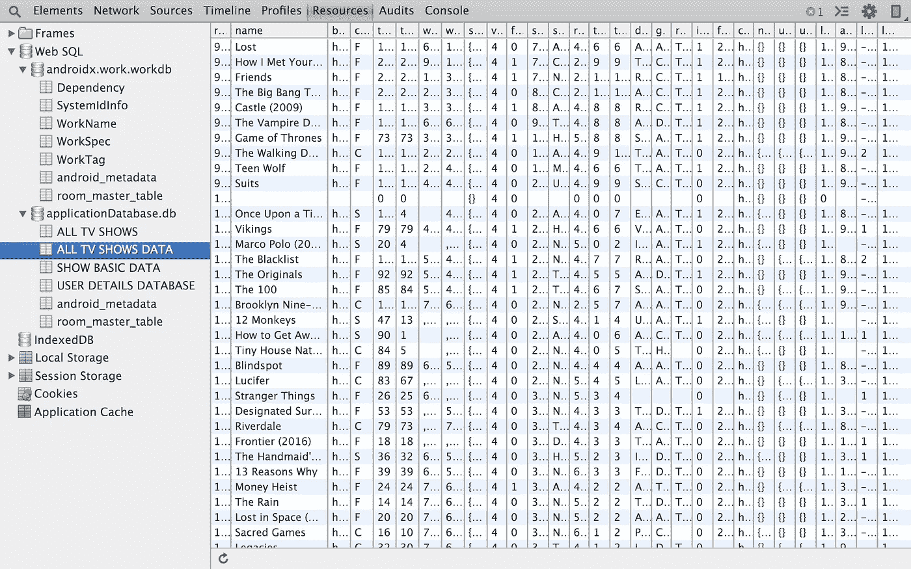
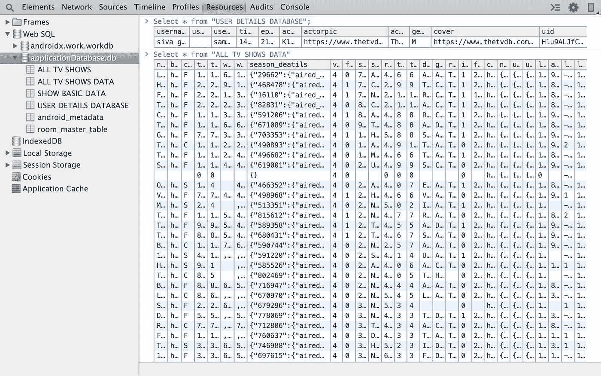
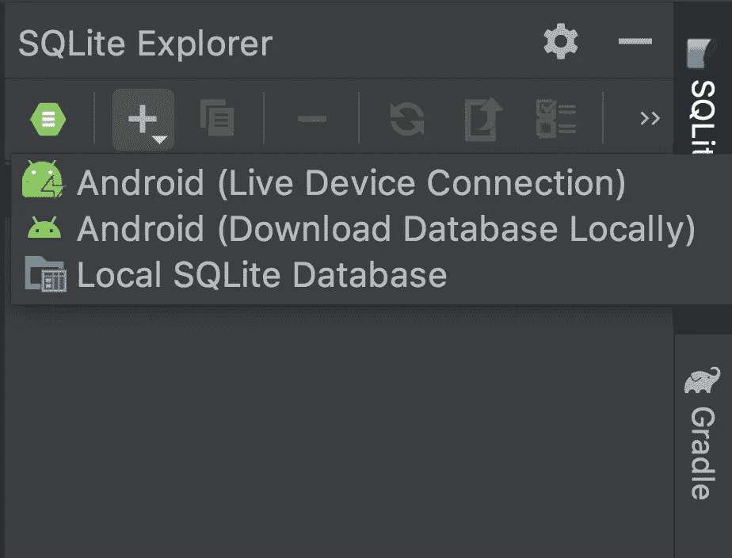
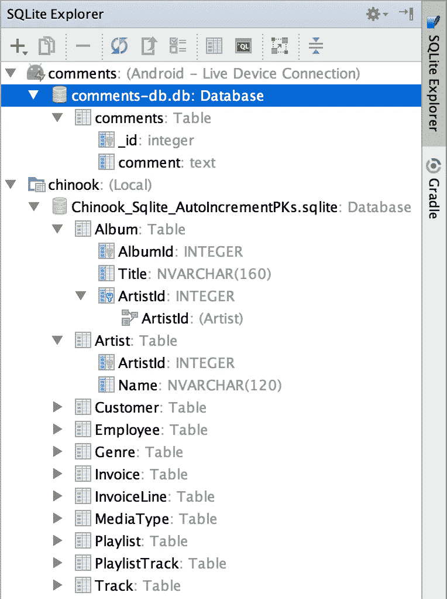
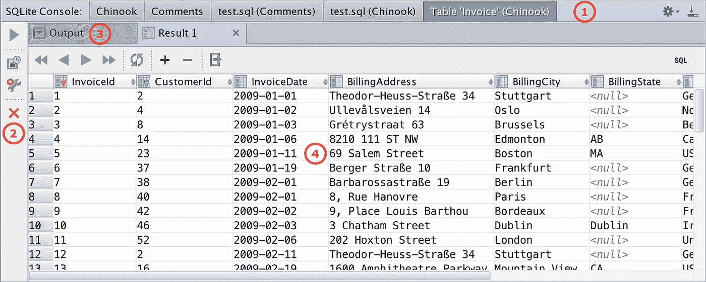
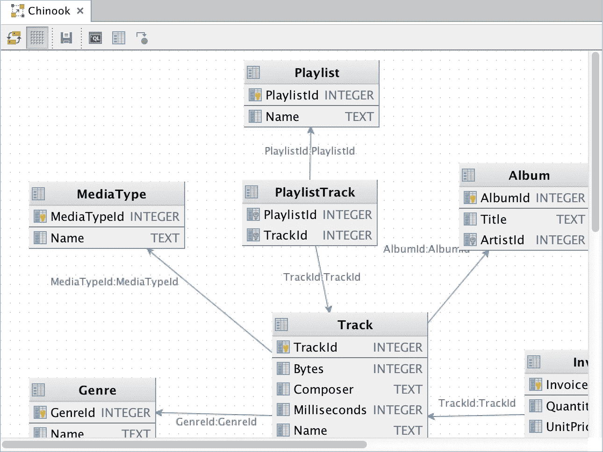

# Android 最好的 SQLite 调试工具

> 原文：<https://betterprogramming.pub/android-best-sqlite-debugging-tools-a9a8da07568f>

## 检查应用程序数据库、查询和结构的简单方法


[赞](https://unsplash.com/@zanilic?utm_source=medium&utm_medium=referral)在 [Unsplash](https://unsplash.com?utm_source=medium&utm_medium=referral) 上的照片

在使用 SQLite 数据库开发应用程序的初始阶段，很难检查它们并检查查询。一段时间后， [SQLite browser](https://sqlitebrowser.org/) 成为唯一一个我们可以检查与应用程序数据库相关的一切的工具，但这有点难。我们需要导出。db 文件，然后在 SQLite 浏览器的帮助下打开它，以检查表中的数据和查询执行情况。现在，我们有一些简单的工具可以非常容易地检查应用程序数据库。那么为什么要等呢？让我们探索几个使调试数据库变得容易的选项。

我们将详细讨论 SQL Scout & AppSpector 的 Stetho 和特性。

# **斯特索**

如果你没有看过我之前关于 Stetho 的文章，请查看一下，以便于理解。Stetho 是脸书的一个简单的库，用它我们可以很容易地调试本地存储和网络调用。主要问题是，“我们如何使用 Stetho 调试 SQLite 数据库？”

使用 Stetho 进行集成非常容易，只需遵循三个步骤，这有利于检查本地存储和网络层。

## 步骤 1:在 build.gradle 中添加依赖项

```
implementation 'com.facebook.**stetho:stetho**:1.5.1'// We can also use one of the network helpers to inspect network 
// requests
implementation 'com.facebook.stetho:stetho-**okhttp3**:1.5.1'                          **OR** implementation 'com.facebook.stetho:stetho-**urlconnection**:1.5.1'
```

## 步骤 2:用一行代码在应用程序类中初始化它

## 步骤 3:启用网络检查

```
**OkHttpClient**.Builder()
 .**addNetworkInterceptor**(**StethoInterceptor**())
 .build()
```

所以这里的工作完成了。只需运行应用程序，我们就可以轻松地在 Chrome 浏览器中检查输出。

打开你的 Chrome 浏览器，在地址栏输入`chrome://inspect`，按下回车键，然后你就能看到你的设备连接了，如下图所示。点击*检查*看魔术！



单击设备下方的“inspect”按钮后，将弹出一个新窗口，如果我们选择顶部的“network”选项卡，我们可以在其中看到网络火灾。

## 使用 Stetho 进行数据库检查

当您单击 inspect 并打开弹出窗口时，选择顶部的 Resources。现在，您将在左侧看到一些选项，您可以从中选择 Web SQL，这是一个下拉列表，您可以在其中看到所有应用程序数据库。当你点击任何一个表时，它会显示出包含所有数据的结构。就这么简单，对吧？不需要像我们用 SQLite 浏览器那样导出和导入东西。



我们甚至可以执行查询来检查结果。点击。db 文件，您会在右边看到一个编辑器。您可以根据需要编写查询来检查结果。下面是一些带有结果的示例查询。



不需要直接在 studio 里写复杂或者硬的查询，调试很久，最后发现是查询出错了而不是其他部分。最佳实践是在如上所示的提示符下验证查询，然后将它们复制到任何需要它们的地方，而不是盲目地编写查询并在调试时感到沮丧。如果你想探索更多，请查看 [Stetho](http://facebook.github.io/stetho/) 。现在让我们转到 SQL Scout。

# **SQL 侦察兵**

SQLScout 是 Android Studio 和 IntelliJ IDEA 的插件，为管理和调试 SQLite 和房间管理的数据库提供了强大的专用支持。

## **第一步**:安装插件

这是一个插件，我们可以通过以下步骤将其安装在 Android Studio 中:

1.  打开“设置”(在 Windows 和 Linux 上)或“首选项”(在 Mac 上)对话框。
2.  从左侧列表中选择“插件”。
3.  搜索 SQLScout，然后点击安装按钮。
4.  重启工作室。

## **第二步:**连接 Android 数据库

完成第一步后，您会在右侧看到一个 SQLite Explorer 选项。当你点击它时，会有一个弹出窗口，其中有一个探索数据库的选项。当您单击加号(+)图标时，它会显示以多种方式从设备或本地存储导入数据库的选项。了解如何使用[连接到 Android 数据库](http://www.idescout.com/wiki/index.php/Main/ConnectToAndroidDbs)的每个选项。



## 步骤 3:要在 SQLScout 中探索的特性

1.  **SQLite Explorer:** 连接 Android 应用程序或文件系统中的 SQLite 数据库，浏览模式的元素，查找表和列的用法，快速打开内存中的 SQL 编辑器，查看和编辑表数据。[了解更多](http://www.idescout.com/wiki/index.php/Main/SQLiteExplorer)。



**2。SQL 编辑器:**这个强大的编辑器提供了一整套 IDE 需要的特性:语法高亮、代码完成、导航到模式和别名定义等等。[了解更多](http://www.idescout.com/wiki/index.php/Main/SQLEditor)。


**3。数据控制台:**数据控制台可以显示查询结果，编辑表格数据，并将其内容导出为不同格式，如 Excel！[了解更多](http://www.idescout.com/wiki/index.php/Main/DataConsole)。



**4。数据库图表:**轻松地为数据库生成图表，以帮助表格、列和关系的可视化。[了解更多](http://www.idescout.com/wiki/index.php/Main/DatabaseDiagram)。



这些是 SQLScout 的主要亮点。它可能还有其他一些特性，所以请浏览完整的[文档](http://www.idescout.com/wiki/index.php/Main/HomePage)。

# 应用程序


AppSpector 是一个多功能的 iOS 和 Android 应用远程调试平台。对于从个人开发者到大公司的任何工程力量来说，这都是一个很好的解决方案。它有许多功能:我们可以检查网络请求，查看应用程序日志，CoreData 浏览器，SQLite 浏览器，跟踪和模拟设备位置，NSNotificationCenter 日志。

## 关键特征

*   **远程访问**
*   **可定制**
    您选择想要收集的数据。
*   **易于使用**
    您只需几行代码和我们网站上的一个账户就可以开始使用。
*   跨平台
    AppSpector 为 iOS 和 Android 用户提供了类似的体验。
*   **实时**
    一旦你的应用发生任何变化，你都会在我们的网络界面上看到。
*   除了您选择的人之外，我们绝不会与任何人分享您的数据。

## 它是如何工作的

与 Stetho 类似，AppSpector 由两个基本部分组成:

**1。app spector SDK**
iOS 和 Android 均可使用。它是一个可以添加到项目中的依赖项。添加后，它允许您实时收集有关应用状态的信息。在 [iOS SDK](https://docs.appspector.com/docs/ios-sdk) 和 [Android SDK](https://docs.appspector.com/docs/android-sdk) 部分有详细描述，可以自行探索。

**2。AppSpector web 界面**
只要您启动一个集成了 AppSpector SDK 的应用，这些信息就会在我们的[网站](https://app.appspector.com/)上提供。每个会话都是完全安全的，除了您和您的组织成员之外，任何人都不能访问其数据。

更多探索，请浏览[文档](https://docs.appspector.com/docs/appspector-in-a-nutshell)。它有 14 天的试用期，并为小开发者提供免费计划。

请让我知道你的建议和意见。

感谢阅读！