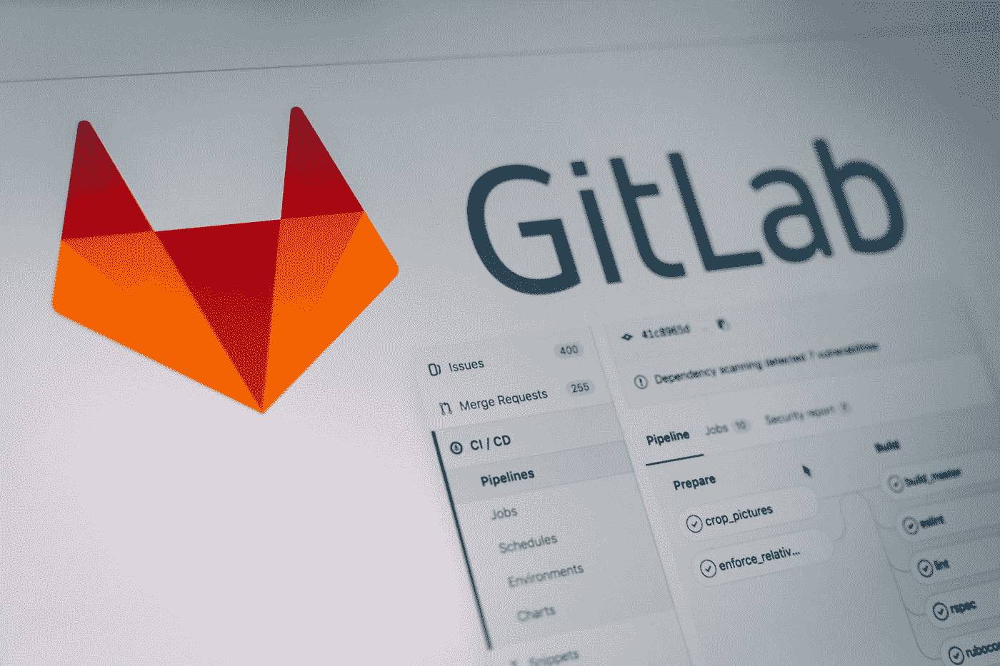
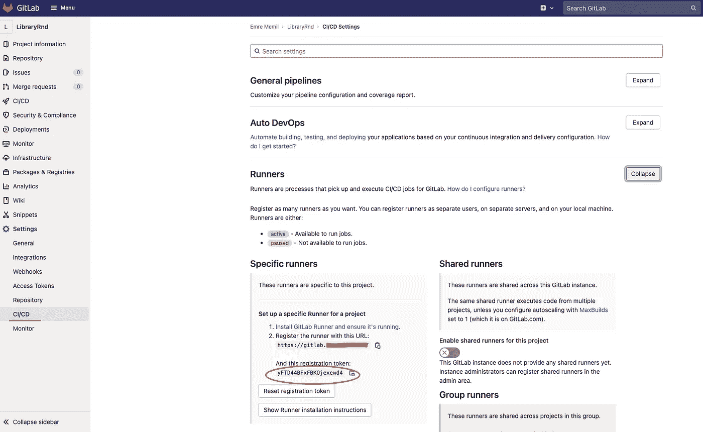
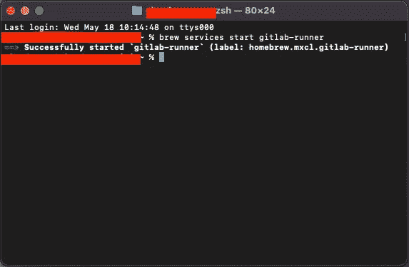
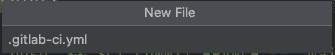
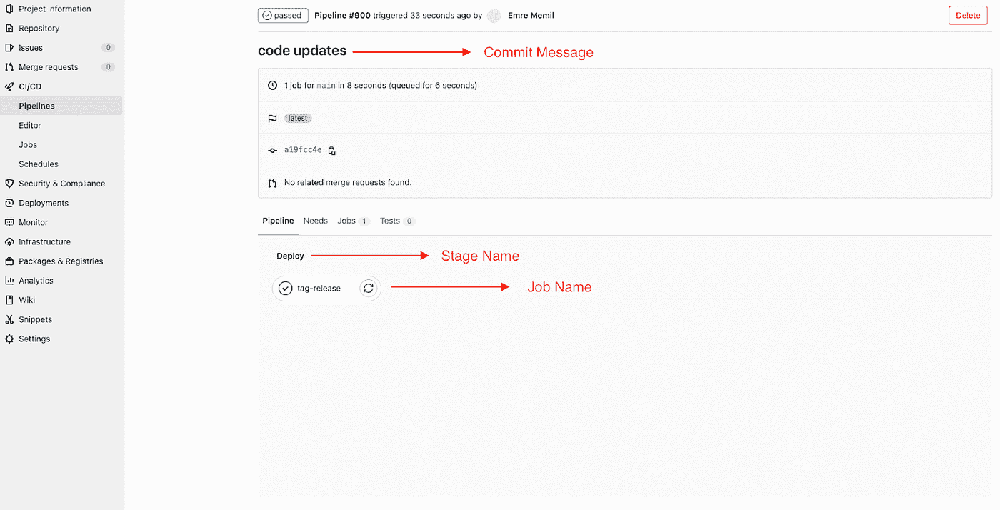
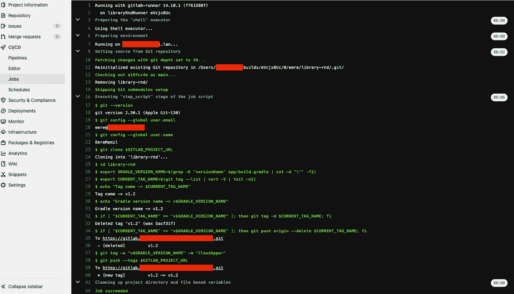
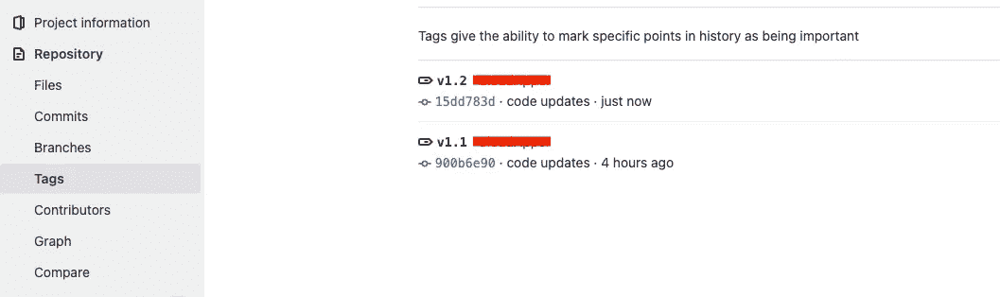

# Android CI/CD — Git 标签和使用 GitLab CI 的自动标签

> 原文：<https://betterprogramming.pub/android-ci-cd-git-tags-and-automatic-tagging-with-gitlab-ci-9ee1045822e1>

## 用这个简单的程序节省工作时间



[Pankaj Patel](https://unsplash.com/@pankajpatel?utm_source=medium&utm_medium=referral) 在 [Unsplash](https://unsplash.com?utm_source=medium&utm_medium=referral) 上拍摄的照片

我们的目标是当我们在`android`项目中发布新版本时，在`GitLab`中自动为它创建一个`tag`(这可能在另一个项目中，我将通过`android`项目来举例)。假设我们只想在代码被推送到特定分支时这样做。

现在，让我们稍微了解一下`git tags`，然后看看我们如何一步一步地做到这一点。

# 什么是 Git 标签？

> Git 标签是 Git 历史中特定的参考点。Git 标签用于捕获历史中的特定点，该点进一步用于指向已发布的版本。标签不会像树枝一样变化。它们在创建后没有进一步的提交历史。
> 
> 简而言之，git 标签用于给 Git 项目存储库中的某个特定项目起一个有意义的名字。假设两个用户决定标记他们的项目代码以便以后访问。

# **用于标记的简单 Git 命令**

让我们看看如何对 git 标签进行这三个简单的操作。它们是:创建、删除、列表

# 创建标签

```
$git tag -a "v1" -m "version 1"  // create a tag$git push --tags                 // push the created tag
```

`-a` →注释
`-m` →消息

# 删除标签

```
$git push origin -- delete < tagname>$git push origin -- delete v1
```

# 列表标签

```
$git tag   //lists the existing tags
```

## **示例输出**

v1
v2
v3

`$git show v1` →您可以看到标记数据以及使用该命令标记的提交。

我们学习了`git tags` **的基本命令。**现在，让我们来看看如何使用`Gitlab-CI`进行自动标记

# 创建 GitLab Runner

## **什么是 GitLab Runner？**

> GitLab Runner 是一个与 GitLab CI/CD 配合使用的应用程序，用于在管道中运行作业。

## 它是如何工作的？

假设我们推出我们的代码。由于我们将创建的`.gitlab-ci.yml`文件，GitLab 管道将被触发，管道将进入挂起状态。Pipeline 将接管挂起的作业，并通过 Runner API 执行事务。完成后，它通过 Runner API 将输出再次传输到 GitLab 服务器。

## **安装 GitLab 转轮**

您可以按照适用于您的操作系统的文档从[此链接](https://docs.gitlab.com/runner/install/osx.html)安装 GitLab runner。如果你用的是 macOS，跟着我。

`$brew install gitlab-runner`


## **注册 GitLab Runner**

为了注册 GitLab runner，你可以从[这个链接](https://docs.gitlab.com/runner/register/index.html)按照适合你的操作系统的文档进行安装。如果你用的是 macOS，跟着我。

`$gitlab-runner register`

1.  将提示您输入 GitLab 实例 URL。请输入这个。
    比如:【https://gitlab.com】T21
2.  输入您从 GitLab 获得的令牌。下图显示了一个令牌示例:



1.  输入您的跑步者描述。例如:`my-runner`
2.  输入跑步者的标签。比如:`ssh`、`ci`
3.  选择流道执行器；例如:`shell`

# **启动 GitLab Runner**

你可以从这里的[链接找到启动 Runner 的相关命令。如果你用的是 mac，并且跟随我，你可以用这个命令运行 GitLab Runner。](https://docs.gitlab.com/runner/commands/#gitlab-runner-start)

```
$brew services start gitlab-runner
```



如果以后想关闭流道，可以使用此命令。

```
$brew services stop gitlab-runner
```

# 创建一个 YML 文件

在 Android 上，在项目目录中创建一个名为`.gitlab-ci.yml`的文件。



让我提供一些关于的信息。yml 文件和关键字:

*   变量:变量是一种环境变量。
*   阶段:使用阶段定义作业在哪个阶段运行。例如，测试、构建、部署
*   脚本:使用`script`指定跑步者要执行的命令。
*   规则:使用规则来包括或排除管道中的作业。评估和确定作业的选定属性以及是否创建作业的条件列表。
*   `!reference`:使用`!reference`自定义 YAML 标签从其他作业部分选择关键字配置，并在当前部分重复使用。你可以把它想成一个你可以调用的函数。

现在，将下面的代码块复制到您自己的`.gitlab-ci.yml`文件中，并更改您的`GITLAB_PROJECT_URL`:

# 推动并触发管道

当我们在项目的主分支中进行推送时，管道将被自动触发。我们可以在下面的照片中看到这一点。

**注意:**我们已经在`.gitlab.ci-yml`文件中指定管道应该在主分支上触发。(检查第 11 行)

# GitLab 中的管道

如果我们在推送代码时检查 GitLab 中的管道选项卡，就可以看到管道。



GitLab 中的管道

# 我们在 GitLab 的工作成果

我们可以在我们的`gitlab.ci.yml`文件中看到命令的执行，以及它们的输出是什么。



GitLab 的工作

可以看到，与已经分享的 app 版本同名的标签(v1.2)已经从 GitLab 中删除。然后用相同的版本名创建了一个新标签，并发布在 GitLab 上。

# GitLab 中的标签

这里我们可以看到我们共享的标签。



发布的标签

# 结论

因此，我们做了以下工作:

*   当代码被推到指定的分支时，我们自动触发管道。
*   每当 app/gradle 中的 app 版本发生变化并推送到主分支时，标签都会自动发布。
*   如果一个标签之前没有发布过，我们可以从 gradle 获取 app 版本名称，发布一个新的标签。
*   如果以前发布过同名的标签，我们可以删除它，然后用相同的名称再次发布该标签。

# 来源

*   【https://linuxhint.com/use-git-tags/ 