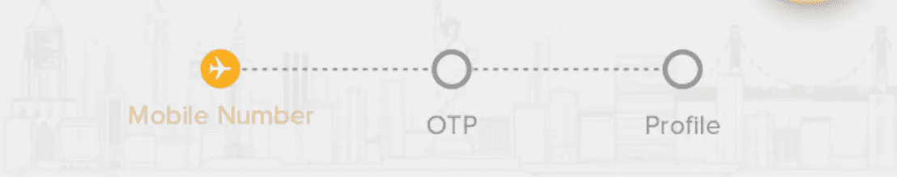
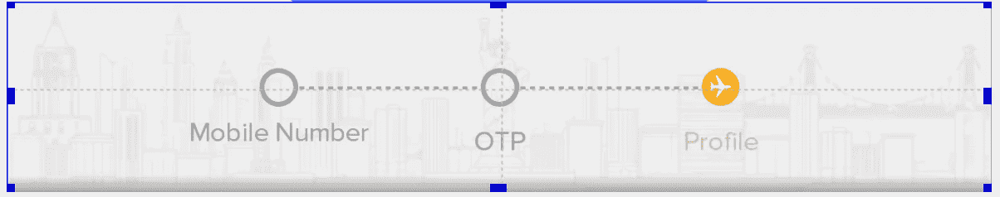
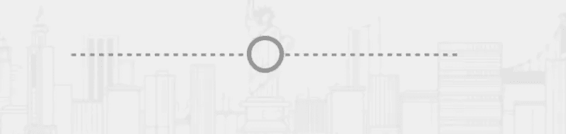

# 使用复杂的用户界面解释 Android ConstraintLayout

> 原文：<https://betterprogramming.pub/android-constraintlayout-explained-using-a-complex-ui-861c92479c90>

## 为你的应用程序构建一个复杂且响应迅速的用户界面


[ConstraintLayout](https://developer.android.com/reference/android/support/constraint/ConstraintLayout) 的引入是为了给你的应用构建非常复杂且响应迅速的用户界面。我之前一直使用 [RelativeLayout](https://developer.android.com/guide/topics/ui/layout/relative) 来构建复杂的 UI，直到我遇到了这个复杂的 UI。



上面的截图是应用页脚中的一个片段的页脚，描述了登录过程的步骤，以及用户处于哪个步骤。

完成登录有三个步骤。

*   输入手机号码
*   动态密码
*   轮廓

用户目前处于第一步，即“输入手机号码”。

花几分钟时间，尝试使用 RelativeLayout 或任何其他布局来构建上面的 UI，看看效果如何。如果你能使用 ConstraintLayout 之外的布局来构建这个 UI，请在评论中告诉我。

那些不熟悉 ConstraintLayout 的人，可以考虑先阅读一下 [Android ConstraintLayout 文档](https://developer.android.com/training/constraint-layout/)。

我们开始吧。

首先将 Gradle 依赖项添加到您的项目中。

```
dependencies {
    implementation 'com.android.support.constraint:constraint-layout:1.1.2'
}
```

进一步解释一下，这是 Android Studio 的设计视图中 UI 的样子。



通过使用指南，构建这个 UI 是可能的。

指导方针只不过是虚拟视图，它们本身是不可见的。可以在设计预览和蓝图中查看它们。在上图中，你可以看到我使用了两条指引线——两条可以在中间垂直和水平看到的虚线。

添加了指南之后，XML 看起来就是这样。

线条`app:layout_constraintGuide_percent=”0.5"` 定义了你想要的准线的确切位置。在我的例子中，我希望它在中间，所以值是 0.5。

如果你想水平地添加一个`TextView`，例如，在你的屏幕的 3/4 宽度之后，你需要添加一个垂直的指引线。这确实是一条*垂直*指南。我们水平分割屏幕，所以我们将使用垂直基准线。

该指南将如下所示:

希望这能给你一个指导方针的概述。我们现在回到最初的问题。

在添加了两条指导线——一条水平的，一条垂直的，正好在中间——之后，让我们添加第一个 UI 元素。

首先，我们将把`ImageView`加在指引的正中央。代码如下:

下面的代码是将您的`ImageView`准确地放置在水平准线的中心。

```
app:layout_constraintBottom_toTopOf="@+id/guideline1" 
app:layout_constraintTop_toTopOf="@+id/guideline1"
```

下一个代码是将`ImageView`精确地放置在垂直方向的中心。

```
app:layout_constraintEnd_toStartOf="@+id/guideline"
app:layout_constraintStart_toStartOf="@+id/guideline"
```

现在我们将根据 UI 的要求，在这个`ImageView`的左边和右边添加分隔线。

下面的几行将一个分隔线精确地放置在垂直中心，相对于`ImageView`T3。

```
app:layout_constraintBottom_toBottomOf and app:layout_constraintTop_toTopOf
```

这就是我们现在 UI 的样子。



在这些分隔线的末尾，我们将添加两个`ImageViews`,如下所示。

这就是我们现在 UI 的样子。


现在，我们只需要在每个圆圈`ImageView`的下方，准确地在水平中心添加三个`TextView`。下面是添加这个的代码。

在上面的代码中，`app:layout_constraintEnd_toEndOf` 和`app:layout_constraintStart_toStartOf` 会相对于`ImageView`水平对齐文本。

`app:layout_constraintTop_toBottomOf` 将文本对齐`ImageView`下方。

这是我们最终的用户界面和 XML 代码。


在构建了这个 UI 之后，我意识到了使用 ConstraintLayout 的重要性。现在，我尽可能使用 ConstraintLayout。