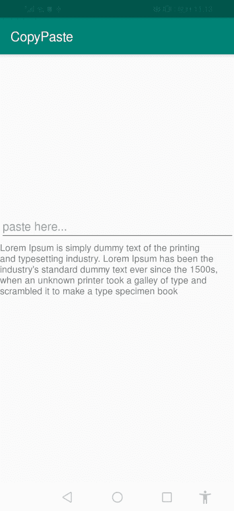

# 如何使用 TextView 在 Android 中实现复制/粘贴

> 原文：<https://betterprogramming.pub/android-copy-paste-7dd60ad47d0>

## 以编程方式在 Android 的文本视图中实现复制/粘贴

照片由[马塔姆·贾斯万思](https://unsplash.com/@mjaswanth?utm_source=unsplash&utm_medium=referral&utm_content=creditCopyText)在 [Unsplash](https://unsplash.com/search/photos/android?utm_source=unsplash&utm_medium=referral&utm_content=creditCopyText) 上拍摄

在这篇文章中，我将向你展示如何在你的 Android 应用程序中从文本视图中复制粘贴文本。EditText 有内置功能，你可以通过长按轻松复制文本，但在 TextView 中，情况可能并非如此。我们需要编写一些代码来使用我们的 TextView 实现相同的功能。

我们开始吧！

*你可以在这里* *查看安卓* [*中关于复制粘贴的官方文档。*](https://developer.android.com/guide/topics/text/copy-paste)

## 第一步:

我们正在制作一个简单的应用程序，所以我从一个文本视图的基本布局开始。

在你的`onCreate()` 中初始化你的 TextView 并调用`registerForContextMenu()` 方法并在其中传递你的 TextView。

根据文档`*registerForContextMenu*()`帮助注册给定视图显示的上下文菜单，因为我们需要一个菜单来选择一个长按会弹出的“复制”选项。

## 第二步:

现在重写一个方法`*onCreateContextMenu*()`，它将帮助我们实现我们的目标。

现在让我们运行应用程序:

复制粘贴 android 功能

觉得这篇文章有用？在媒介上跟随我[穆斯塔法安萨里](https://medium.com/u/8ee4abb8abb8?source=post_page-----1b8c9832af43----------------------)。看看下面我读得最多的文章。

*   [如何在不使用任何库的情况下制作可扩展的 recyclerView？](https://medium.com/better-programming/recyclerview-expanded-1c1be424282c)
*   想要制作具有更多选项的动画浮动操作按钮？
*   用漂亮的动画制作 RecyclerView！
*   [什么是 AndroidX？](https://medium.com/better-programming/what-is-androidx-1b8c9832af43)

## [喜欢我的脸书页面](https://www.facebook.com/codixlab/)